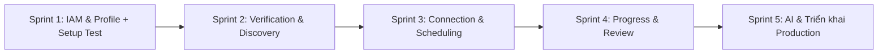

# TỔNG QUAN DỰ ÁN EDUFIT (PROJECT OVERVIEW)

> **Dự án môn học SWP391**  
> **Phiên bản tài liệu:** 1.0  
> **Ngày cập nhật:** 2026-09-29  
> **Nhóm thực hiện:** 4 thành viên  

---

## 1. Giới thiệu Dự án

### 1.1. Bối cảnh & Mục tiêu
**EduFit** là nền tảng SaaS kết nối **Gia sư (Tutor)** và **Người học / Phụ huynh (Student / Parent)**, đặt trọng tâm vào hai yếu tố cốt lõi:
1. **Lòng tin & Tính xác thực (Trust & Verification):** Quy trình kiểm duyệt bằng cấp, chứng chỉ gia sư chặt chẽ bởi Quản trị viên (Admin).
2. **Minh bạch tiến độ & Cam kết kết quả:** Xếp lịch học tự động chống trùng lịch (Double-booking protection), theo dõi tiến độ qua lộ trình học (Milestones/Learning Plan), cùng hệ thống đánh giá uy tín và hỗ trợ từ AI.

### 1.2. Các vai trò người dùng (Roles)
* **Học sinh (Student):** Tìm kiếm gia sư, gửi yêu cầu ghép cặp, đề xuất/xác nhận lịch học, ghi chép buổi học và theo dõi tiến độ học tập.
* **Phụ huynh (Parent):** Liên kết tài khoản với con, tìm kiếm gia sư thay con, theo dõi bảng tiến độ tổng quan đa học sinh (Multi-Student Dashboard), nhận thông báo buổi học.
* **Gia sư (Tutor):** Tạo hồ sơ chuyên môn, nộp chứng chỉ xác thực, quản lý lịch rảnh, thiết lập kế hoạch học tập (Learning Plan) và ghi chú đánh giá từng buổi học.
* **Quản trị viên (Admin):** Duyệt hàng đợi hồ sơ xác minh gia sư (Verification Queue), thu hồi/giám sát liên kết phụ huynh - học sinh.

---

## 2. Ngăn xếp Công nghệ (Technology Stack)

Chi tiết được quyết định theo tài liệu kiến trúc [ADR-001](file:///e:/iykyk/S5/SWP391/Projects/EduFit/docs/ADR-001-tech-stack.md):

| Thành phần | Công nghệ lựa chọn | Mục đích & Ràng buộc |
|---|---|---|
| **Backend** | **Java 21 + Spring Boot** | Quản lý transaction phức tạp (`@Transactional`), hỗ trợ máy trạng thái (State Machine) cho Buổi học và Lịch trình, Security AOP. |
| **Frontend** | **Next.js (App Router) + React 19** | Giao diện hiện đại, kết hợp Server Components để bảo mật logic và Client Components cho tương tác động. Tailwind CSS v4. |
| **Cơ sở dữ liệu** | **PostgreSQL 17** | Cơ sở dữ liệu quan hệ đảm bảo toàn vẹn dữ liệu, hỗ trợ khóa dòng (`SELECT ... FOR UPDATE`) và ràng buộc loại trừ chống trùng lịch (NFR-17). |
| **ORM / Migration** | **Spring Data JPA (Hibernate) + Flyway** | Giảm boilerplate CRUD, kiểm soát version migration tập trung và nhất quán. |
| **Bảo mật & Auth** | **Stateful Session (Cookie `httpOnly`)** *(Chính)*<br>+ **JWT & Refresh Token** *(Nhánh học tập song song)* | Đáp ứng NFR-04: Session hết hạn sau 60 phút bất hoạt, thu hồi ngay lập tức khi đăng xuất hoặc đổi mật khẩu. |
| **Lưu trữ tệp tin** | **Local Disk (Dev) → Supabase Storage (Deploy)** | Lưu trữ chứng chỉ gia sư bảo mật (NFR-08), đóng gói qua interface `CredentialStorageService`. |
| **Chất lượng mã nguồn** | **ArchUnit, Spotless, Checkstyle, ESLint** | Tự động hóa kiểm tra quy ước mã nguồn, ranh giới kiến trúc và định dạng qua CI/CD. |
| **Môi trường & Vận hành** | **Docker Compose (Local-First)** | Chạy toàn bộ stack cục bộ (Postgres + Backend), đồng nhất giữa các thành viên. |

---

## 3. Kiến trúc Hệ thống

Chi tiết được quyết định theo tài liệu kiến trúc [ADR-002](file:///e:/iykyk/S5/SWP391/Projects/EduFit/docs/ADR-002-multi-module-architecture.md):

### 3.1. Backend: Modular Monolith (Maven Multi-Module)
Chạy trên **một JVM duy nhất** (1 Database, 1 Schema `public`), không phải Microservices, giúp tránh chi phí vận hành mạng và phân tán transaction.

```
backend/
├── pom.xml                               # Parent POM: quản lý phiên bản dependency & plugin
├── app/                                  # Module duy nhất có main() & @SpringBootApplication
│   ├── src/main/java/vn/edufit/          # EduFitApplication, SecurityConfig, WebConfig, OpenAPI...
│   ├── src/main/resources/               # application.yml, db/migration/ (tập trung)
│   └── src/test/java/vn/edufit/          # ArchitectureTest (ArchUnit), Security tests
├── platform/                             # Các module kỹ thuật nền tảng (không có use case riêng)
│   ├── shared/                           # Shared Kernel: CurrentUser, Money, TimeInterval, BaseException...
│   ├── ai/                               # Cổng tích hợp LLM (Bio drafting, Match explanation)
│   ├── storage/                          # CredentialStorageService (Local / Supabase)
│   └── audit/                            # Audit Logging (FR-02, FR-15)
└── modules/                              # 9 Module nghiệp vụ ánh xạ theo SRS
    ├── iam/                              # UC1.1 - 1.4: Tài khoản, xác thực, phiên
    ├── profile/                          # UC1.5 - 1.9: Hồ sơ gia sư & học sinh
    ├── verification/                     # UC1.10 - 1.12: Nộp bằng cấp, duyệt xác minh
    ├── discovery/                        # UC2.1 - 2.5: Tìm kiếm, lọc và gợi ý gia sư
    ├── connection/                       # UC3.1 - 3.5: Liên kết Parent-Student, gửi đề nghị kết nối
    ├── scheduling/                       # UC4.1 - 4.6: Đặt lịch, đổi lịch, giải quyết trùng lịch
    ├── progress/                         # UC5.1 - 5.5: Kế hoạch học tập, Milestone, Buổi học
    ├── review/                           # UC6.1 - 6.2: Đánh giá gia sư (1 đánh giá duy nhất/cặp)
    └── notification/                     # UC6.3: Tiếp nhận sự kiện và gửi thông báo
```

#### Quy tắc ranh giới giao tiếp giữa các module Backend:
1. **Đọc dữ liệu:** Module A gọi sang module B thông qua package công khai `b.api.*` (Facade, Query DTO). Không truy cập trực tiếp Entity nội bộ của module khác.
2. **Thay đổi trạng thái:** Module phát sinh hành động sẽ publish **Domain Event** (`@EventListener` đồng bộ). Ví dụ: `scheduling` phát `SessionScheduled`, module `notification` lắng nghe để lưu thông báo.
3. **Domain Layer thuần Java (POJO):** Chỉ áp dụng bắt buộc cho **3 module có rủi ro nghiệp vụ cao**:
   - `scheduling`: Máy trạng thái buổi học và thuật toán giải quyết xung đột lịch (`ConflictPolicy`).
   - `progress`: Công thức tính toán trọng số tiến độ (`ProgressCalculator`).
   - `discovery`: Hàm xếp hạng và tính điểm gợi ý (`MatchScorer`).
   - *6 module còn lại:* Viết trực tiếp `@Service` + JPA để tối ưu tốc độ triển khai.

---

### 3.2. Frontend: Package-by-Feature & Route Groups (Next.js)

```
frontend/src/
├── app/                                  # Định tuyến (Routing) mỏng & layout ghép
│   ├── (public)/                         # Landing page, tìm kiếm gia sư công khai
│   ├── (auth)/                           # Đăng nhập, đăng ký, quên mật khẩu
│   ├── (learner)/                        # Dùng chung cho Student & Parent (lịch, tìm gia sư)
│   ├── student/                          # Trang riêng Student: Hồ sơ, liên kết phụ huynh
│   ├── parent/                           # Trang riêng Parent: Dashboard nhiều con
│   ├── tutor/                            # Trang riêng Tutor: Hồ sơ, xác minh, kế hoạch dạy
│   └── admin/                            # Trang riêng Admin: Hàng đợi duyệt bằng cấp, audit
├── features/                             # Chứa toàn bộ logic nghiệp vụ (tương ứng từng module)
│   ├── auth/                             # api, components, hooks, schemas
│   ├── profile/
│   ├── verification/
│   ├── discovery/
│   ├── connection/
│   ├── scheduling/
│   ├── progress/
│   ├── review/
│   └── notification/
└── shared/
    ├── ui/                               # Design system (Buttons, Modal, Inputs...)
    ├── lib/                              # Axios/Fetch client, Date helpers (Asia/Ho_Chi_Minh)
    └── api/generated/                    # Type sinh tự động từ OpenAPI (springdoc)
```

---

## 4. Báo cáo Hiện trạng Thực tế Dự án (Implementation Audit)

### 4.1. Đã triển khai (Completed)
- [x] **Kiến trúc Parent Multi-module Backend:** Cấu hình thành công `backend/pom.xml`, `app`, `platform/shared` và khung 9 module con.
- [x] **Platform Shared Kernel:** Đã có các Value Objects nền tảng (`Money`, `TimeInterval`), mã lỗi nghiệp vụ (`ErrorCode`, `BaseBusinessException`), phản hồi chuẩn (`ApiResponse`, `ApiError`).
- [x] **Cấu hình Nền tảng Monolith (`backend/app`):** `SecurityConfig` (Session cookie), `OpenApiConfig`, `SchedulingConfig`, `WebConfig`, `GlobalExceptionHandler`.
- [x] **Kiểm thử Kiến trúc & Nền tảng:** `ArchitectureTest` (ArchUnit enforce package boundaries), `SpringSecurityCurrentUserTest`, unit test cho `Money` và `TimeInterval`.
- [x] **Giao diện Landing Page Frontend:** Đã xây dựng trang chủ giao diện phong phú, hiện đại tại [frontend/src/app/page.tsx](file:///e:/iykyk/S5/SWP391/Projects/EduFit/frontend/src/app/page.tsx).
- [x] **Bộ tài liệu Kiến trúc:** Đầy đủ [ADR-001](file:///e:/iykyk/S5/SWP391/Projects/EduFit/docs/ADR-001-tech-stack.md), [ADR-002](file:///e:/iykyk/S5/SWP391/Projects/EduFit/docs/ADR-002-multi-module-architecture.md), quy tắc đóng góp [CONTRIBUTING.md](file:///e:/iykyk/S5/SWP391/Projects/EduFit/CONTRIBUTING.md).

### 4.2. Phần còn thiếu / Cần triển khai tiếp (Pending & Gaps)
1. **Frontend Testing & Feature Structure:**
   - Chưa có thư mục test (`__tests__`) và chưa cài đặt thư viện kiểm thử (Vitest / React Testing Library).
   - Thư mục [frontend/src](file:///e:/iykyk/S5/SWP391/Projects/EduFit/frontend/src) hiện tại mới chỉ có `app/page.tsx` và cấu hình CSS, chưa phân chia thư mục `features/` và `shared/` theo ADR-002.
2. **Backend Domain Modules:**
   - 9 module con trong [backend/modules](file:///e:/iykyk/S5/SWP391/Projects/EduFit/backend/modules) mới chỉ có file `pom.xml`, chưa có mã nguồn triển khai (`src/main/java`).
   - File Flyway migration `V1__init_schema.sql` đang rỗng (chưa khởi tạo schema các bảng).
   - Các module kỹ thuật `platform/ai`, `platform/storage`, `platform/audit` chưa viết mã nguồn.
3. **Database Scripts & Environment:**
   - File `compose.yaml` có mount `./database/init`, nhưng thư mục này chưa được tạo ở root.
   - Các script `init-db.ps1` / `init-db.sh` được mô tả trong README hiện chưa có mặt tại thư mục `scripts/`.

---

## 5. Kế hoạch & Lộ trình Tiếp theo (Actionable Roadmap)



* **Giai đoạn 1 (Nền tảng người dùng):**
  - Viết Flyway migration tạo bảng `account`, `student_profile`, `tutor_profile`.
  - Triển khai `modules/iam` (Đăng ký, Đăng nhập, Session) và `modules/profile`.
  - Thiết lập Vitest + React Testing Library cho Frontend, khởi tạo khung `frontend/src/features/auth`.
* **Giai đoạn 2 (Xác thực & Khám phá):**
  - Xây dựng `platform/storage` (lưu file local) và `modules/verification` (nộp bằng cấp, duyệt hồ sơ).
  - Triển khai `modules/discovery` (Search & Filter gia sư).
* **Giai đoạn 3 (Xếp lịch & Ngăn trùng lịch - Rủi ro cao):**
  - Triển khai `modules/connection` (Gửi đề nghị kết nối).
  - Triển khai `modules/scheduling` với máy trạng thái và kiểm tra xung đột thời gian (ConflictPolicy).
* **Giai đoạn 4 (Đo lường & Phản hồi):**
  - Triển khai `modules/progress` (Milestone, điểm tiến độ) và `modules/review`.
  - Kết nối `modules/notification` qua Spring Events.
* **Giai đoạn 5 (Tích hợp AI & Đóng gói):**
  - Kết nối OpenAI/Gemini qua `platform/ai`.
  - Chạy kiểm thử End-to-End toàn diện và chuẩn bị triển khai Docker/Cloud.
