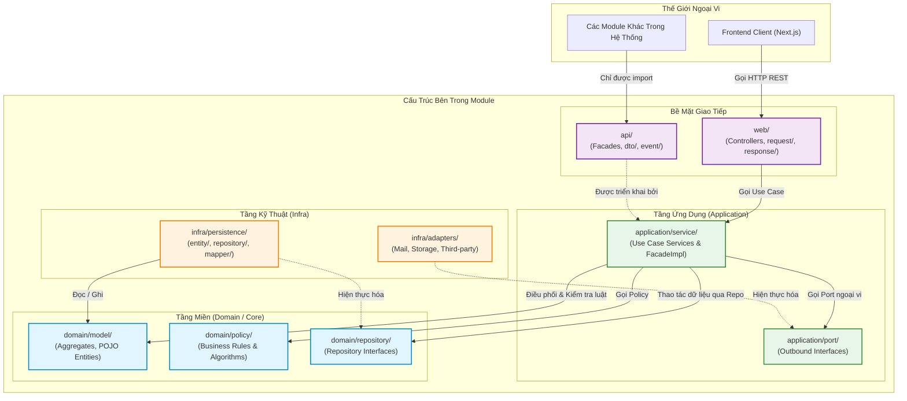

# QUY CHUẨN KIẾN TRÚC THƯ MỤC MODULE BACKEND (EDUFIT)

- **Trạng thái:** Chuẩn hóa kiến trúc (Framework chuẩn cho Sprint 2 trở đi)
- **Tài liệu liên quan:** [ADR-001](file:///c:/University/Semester%205/SWP391/Edufit/EduFit/docs/ADR-001-tech-stack.md), [ADR-002](file:///c:/University/Semester%205/SWP391/Edufit/EduFit/docs/ADR-002-multi-module-architecture.md), [authentication-contract.md](file:///c:/University/Semester%205/SWP391/Edufit/EduFit/docs/authentication-contract.md)
- **Ghi chú về phân hệ IAM:** Phân hệ `iam` đã hoàn thành ở Sprint 1 với vai trò nền tảng xác thực (baseline) và được giữ nguyên để bảo đảm tính ổn định. Tài liệu này là kim chỉ nam cấu trúc cho các module tiếp theo (`profile`, `scheduling`, `connection`, `progress`, `review`,...).

---

## 1. Bản Đồ Tổng Quan Cấu Trúc Thư Mục (Folder Architecture)

Hệ thống phân hóa thành 2 dạng kiến trúc thư mục tùy theo độ phức tạp của từng module:

### 1.1. Loại 1: Module Tiêu Chuẩn - Không có `domain/` (Standard / Pragmatic Module)
* **Áp dụng cho:** Các module thiên về quản lý thông tin, CRUD, cập nhật trạng thái đơn giản (`profile`, `verification`, `review`, `notification`...).
* **Đặc điểm:** Tầng `application/service/` thao tác trực tiếp với JPA Entity ở `infra/persistence/entity/`, không cần tầng trung gian Mapper giúp code gọn gàng, phát triển nhanh.

```
vn.edufit.<module_name>/
│
├── api/                           # BỀ MẶT CÔNG KHAI (Cho các module Java khác gọi)
│   ├── <Module>Facade.java        # Interface Facade công khai
│   ├── dto/                       # DTO an toàn chia sẻ nội bộ JVM (Java Record)
│   └── event/                     # Domain Events công khai (nếu có)
│
├── web/                           # TẦNG GIAO TIẾP NGOÀI (HTTP REST API cho Next.js)
│   ├── <Module>Controller.java    # Spring REST Controller
│   ├── request/                   # DTO nhận từ Client (kèm @Valid, @NotBlank...)
│   └── response/                  # DTO trả về Client (dữ liệu trong ApiResponse<T>)
│
├── application/                   # TẦNG ĐIỀU PHỐI (Use Case & Transaction Boundary)
│   ├── service/                   # Các Use Case Services & triển khai <Module>FacadeImpl
│   └── port/                      # [Tùy chọn] Cổng giao tiếp ngoại vi (Interface)
│
└── infra/                         # TẦNG HẠ TẦNG KỸ THUẬT & CƠ SỞ DỮ LIỆU
    ├── persistence/               # Tầng lưu trữ cơ sở dữ liệu
    │   ├── entity/                # JPA Entities (@Entity, @Table)
    │   └── repository/            # Spring Data JPA Repositories
    └── ...                        # Các adapter kỹ thuật (Mail, Storage, Third-party...)
```

---

### 1.2. Loại 2: Module Nghiệp Vụ Phức Tạp - Có `domain/` (Complex Domain / DDD Clean Architecture)
* **Áp dụng cho:** Các module có tính toán thời gian, thuật toán chồng lấn, máy trạng thái nhiều bước (`scheduling`, `progress`, `connection`...).
* **Đặc điểm:** Tách biệt hoàn toàn thư mục `domain/` bằng **Java thuần túy (POJO)** để có thể Unit Test logic nghiệp vụ cốt lõi siêu tốc mà không cần bật Spring hay Database.

```
vn.edufit.<module_name>/
│
├── api/                           # BỀ MẶT CÔNG KHAI (Cho các module Java khác gọi)
│   ├── <Module>Facade.java        # Interface Facade công khai
│   ├── dto/                       # DTO an toàn chia sẻ nội bộ JVM (Java Record)
│   └── event/                     # Domain Events công khai cho module khác nghe
│
├── web/                           # TẦNG GIAO TIẾP NGOÀI (HTTP REST API cho Next.js)
│   ├── <Module>Controller.java    # Spring REST Controller
│   ├── request/                   # DTO nhận từ Client (kèm @Valid, @NotBlank...)
│   └── response/                  # DTO trả về Client (dữ liệu trong ApiResponse<T>)
│
├── domain/                        # [TRÁI TIM NGHIỆP VỤ] - JAVA THUẦN TÚY (POJO)
│   │                              # (Tuyệt đối KHÔNG Spring, KHÔNG JPA/Hibernate)
│   ├── model/                     # Aggregate Root, Entities, Value Objects
│   ├── policy/                    # Thuật toán tính toán, quy tắc ràng buộc độc lập
│   └── repository/                # Interface kho lưu trữ do Domain định nghĩa
│
├── application/                   # TẦNG ĐIỀU PHỐI (Use Case & Transaction Boundary)
│   ├── service/                   # Use Case Services điều phối Domain & FacadeImpl
│   └── port/                      # Cổng giao tiếp ngoại vi (Interface)
│
└── infra/                         # TẦNG HẠ TẦNG KỸ THUẬT & CƠ SỞ DỮ LIỆU
    ├── persistence/               # Tầng lưu trữ cơ sở dữ liệu
    │   ├── entity/                # JPA Entities (@Entity, @Table)
    │   ├── repository/            # Spring Data JPA Repositories
    │   ├── mapper/                # Ánh xạ 2 chiều: Domain Model <---> JPA Entity
    │   └── adapter/               # Hiện thực hóa interface domain/repository/
    └── ...                        # Các adapter kỹ thuật khác (Mail, Job, Third-party...)
```

---

## 2. Chi Tiết Vai Trò & Trách Nhiệm Từng Thư Mục

### 2.1. Thư mục `api/` (Public Module Interface)
* **Ý nghĩa:** Đây là "Cửa chính" duy nhất để các module Java khác trong cùng Monolith tương tác với module này.
* **Quy tắc vàng:** Các module bên ngoài **CHỈ ĐƯỢC PHÉP** import các class nằm trong thư mục `api/`.
* **Thành phần bên trong:**
  * `<Module>Facade.java`: Interface cung cấp các phương thức truy vấn hoặc gọi nghiệp vụ nội bộ trong bộ nhớ RAM.
  * `dto/`: Chứa các Java Record mang thông tin an toàn (Read-models), tuyệt đối không để lộ mật khẩu, thông tin nhạy cảm hay JPA Entity ra ngoài.
  * `event/`: Các sự kiện miền (Domain Events) công khai để các module khác có thể lắng nghe (Spring `@EventListener`).

---

### 2.2. Thư mục `web/` (Driving HTTP Adapter)
* **Ý nghĩa:** Điểm đón nhận và trả dữ liệu qua giao thức HTTP REST cho Frontend (Next.js) hoặc ứng dụng ngoài.
* **Cấu trúc bên trong:**
  * `<Module>Controller.java`: Các Spring `@RestController` đón nhận request, ánh xạ URL, validate payload.
  * `request/`: Chứa các Request DTO nhận dữ liệu gửi lên từ client. Chứa các Bean Validation annotations (`@NotBlank`, `@NotNull`, `@Size`, `@Email`...).
  * `response/`: Chứa các Response DTO trả về cho client. Luôn được bọc trong cấu trúc chuẩn `ApiResponse<T>`.

---

### 2.3. Thư mục `application/` (Application Orchestrator)
* **Ý nghĩa:** Tầng nhạc trưởng điều phối luồng thực thi của Use Case và quản lý ranh giới giao dịch CSDL (`@Transactional`).
* **Cấu trúc bên trong:**
  * `service/`: Mỗi class đảm nhận một use case hoặc nhóm use case liên quan chặt chẽ. Trách nhiệm:
    * Quản lý Transaction (`@Transactional`).
    * Gọi Repository lấy dữ liệu.
    * Gọi các luật nghiệp vụ (Business Rules).
    * Triển khai class `<Module>FacadeImpl` (nằm trong `service/` để phục vụ `api/`).
  * `port/`: Các Java Interface định nghĩa nhu cầu giao tiếp ngoại vi (ví dụ: gửi mail, tải file lên S3, gọi AI...). Tầng Application không cần biết bên dưới gửi mail bằng Mailpit hay AWS SES.

---

### 2.4. Thư mục `domain/` (Core / Business Logic - Chỉ dành cho Module phức tạp)
* **Ý nghĩa:** Trái tim nghiệp vụ của hệ thống, chứa các mô hình miền và thuật toán tính toán.
* **Đặc tính bắt buộc:** **Java THUẦN TÚY (POJO)**. Không phụ thuộc Spring Boot, không có annotation Hibernate/JPA (`@Entity`, `@Table`), không phụ thuộc CSDL.
* **Cấu trúc bên trong:**
  * `model/`: Chứa Aggregate Roots, Entities, Value Objects đóng gói toàn bộ trạng thái và luật bất biến.
  * `policy/`: Chứa các lớp kiểm tra luật nghiệp vụ độc lập (thuật toán tính toán, quy tắc chồng lấn thời gian, chính sách điểm số...).
  * `repository/`: Các Interface kho lưu trữ do Domain làm chủ (không kế thừa `JpaRepository`).

---

### 2.5. Thư mục `infra/` (Driven Adapters / Infrastructure)
* **Ý nghĩa:** Hiện thực hóa tất cả các chi tiết kỹ thuật, cơ sở dữ liệu, mạng, thư viện bên thứ ba.
* **Cấu trúc bên trong:**
  * `persistence/entity/`: Các lớp Java JPA có annotation `@Entity`, `@Table`, đại diện cho bảng CSDL PostgreSQL.
  * `persistence/repository/`: Các Spring Data JPA Interface kế thừa `JpaRepository`.
  * `persistence/mapper/`: *(Nếu có tầng `domain`)* Chuyển đổi qua lại giữa Domain Model (POJO) và JPA Entity.
  * `persistence/adapter/`: *(Nếu có tầng `domain`)* Cầu nối hiện thực hóa interface `domain/repository` bằng cách gọi Spring Data JPA.
  * Các adapter khác: Hiện thực các `application/port/` (như lưu trữ file, gửi thông báo...).

---

## 3. Khi Nào Dùng Mẫu Nào? (Selection Matrix)

| Tiêu chí xem xét | Mẫu Tiêu Chuẩn (Standard Pragmatic) | Mẫu Miền Phức Tạp (Complex Domain) |
| :--- | :---: | :---: |
| **Sự hiện diện của folder `domain/`** | **Không** (Gộp domain logic vào JPA Entity) | **Có** (`domain/` tách riêng biệt bằng Java thuần) |
| **Tính chất nghiệp vụ** | Quản lý thông tin, CRUD, cập nhật trạng thái đơn giản | Máy trạng thái nhiều bước, thuật toán tính toán, xung đột thời gian |
| **Cần Mapper giữa Entity và Model** | Không cần (dùng trực tiếp JPA Entity) | Bắt buộc có `infra/persistence/mapper/` |
| **Mục tiêu Unit Test** | Test luồng Use Case | Test hàng chục trường hợp biên của thuật toán trong vài mili-giây |
| **Các module dự kiến áp dụng** | `profile`, `verification`, `review`, `notification` | `scheduling`, `progress`, `connection` |

---

## 4. Biểu Đồ Luồng Thực Thi Chi Tiết (Mermaid Diagrams)

### 4.1. Luồng 1: Xử lý HTTP Request từ Client bên ngoài

Biểu đồ mô tả luồng một yêu cầu HTTP từ giao diện người dùng đi xuyên suốt qua các tầng kiến trúc:

```mermaid
sequenceDiagram
    autonumber
    actor Client as Frontend (Next.js)
    participant Web as web/<Module>Controller
    participant Req as web/request/DTO
    participant App as application/service/UseCaseService
    participant Domain as domain/model/ & policy/
    participant Infra as infra/persistence/
    database DB as PostgreSQL

    Client->>Web: HTTP POST /api/v1/<endpoint> (JSON Payload)
    activate Web
    Web->>Req: Ánh xạ & Kiểm tra tính hợp lệ (@Valid)
    activate Req
    Req-->>Web: Dữ liệu hợp lệ
    deactivate Req

    Note over Web,App: Chuyển dữ liệu sang Tầng Ứng dụng
    Web->>App: executeUseCase(requestData)
    activate App

    Note over App: Khởi tạo ranh giới giao dịch (@Transactional)
    App->>Infra: Truy vấn dữ liệu cần thiết
    activate Infra
    Infra->>DB: SQL SELECT ...
    DB-->>Infra: Dữ liệu bản ghi
    Infra-->>App: Trả về đối tượng thực thể / mô hình
    deactivate Infra

    Note over App,Domain: Thực thi Quy tắc Nghiệp vụ (Business Rules)
    App->>Domain: Kích hoạt hành vi / Kiểm tra chính sách (Policy)
    activate Domain
    Domain-->>App: Kết quả xử lý nghiệp vụ thành công
    deactivate Domain

    Note over App,Infra: Lưu trạng thái mới vào CSDL
    App->>Infra: Lưu thực thể đã cập nhật
    activate Infra
    Infra->>DB: SQL INSERT / UPDATE ...
    DB-->>Infra: Ghi nhận thành công
    Infra-->>App: Hoàn tất lưu trữ
    deactivate Infra

    App-->>Web: Trả về kết quả xử lý
    deactivate App

    Note over Web: Đóng gói phản hồi chuẩn ApiResponse
    Web-->>Client: HTTP 200/201 (JSON ApiResponse<ResponseDTO>)
    deactivate Web
```

---

### 4.2. Luồng 2: Giao tiếp In-Memory Giữa 2 Module Liên Kết

Biểu đồ mô tả cách Module A (ví dụ: `scheduling`) tương tác với Module B (ví dụ: `iam` hoặc `profile`) mà **không vi phạm ranh giới kiến trúc**:

```mermaid
sequenceDiagram
    autonumber
    box rgba(33, 150, 243, 0.1) Module Gọi (Ví dụ: scheduling)
    participant S_Service as application/service/SchedulingService
    end

    box rgba(76, 175, 80, 0.15) Bề mặt Công khai Module Nhận
    participant B_API as api/<Module>Facade
    participant B_DTO as api/dto/ViewDTO
    end

    box rgba(255, 152, 0, 0.1) Tầng Nội bộ Module Nhận
    participant B_Impl as application/service/<Module>FacadeImpl
    participant B_Repo as infra/persistence/repository/
    database DB as Database
    end

    Note over S_Service: Module Gọi CẦN thông tin từ Module Nhận
    S_Service->>B_API: facade.findDataById(id)
    activate B_API
    
    Note over B_API,B_Impl: In-memory Java Call (Trong cùng JVM RAM)
    B_API->>B_Impl: Chuyển tiếp lời gọi nội bộ
    activate B_Impl

    B_Impl->>B_Repo: Query thông tin từ Repository nội bộ
    activate B_Repo
    B_Repo->>DB: SQL Query
    DB-->>B_Repo: Record dữ liệu
    B_Repo-->>B_Impl: Trả về Entity nội bộ
    deactivate B_Repo

    Note over B_Impl,B_DTO: Ánh xạ Entity -> DTO an toàn (Không lộ Entity ra ngoài)
    B_Impl->>B_DTO: new ViewDTO(id, safeData, ...)
    activate B_DTO
    B_DTO-->>B_Impl: Instance DTO an toàn
    deactivate B_DTO

    B_Impl-->>B_API: Trả về Optional<ViewDTO>
    deactivate B_Impl

    B_API-->>S_Service: Trả về Optional<ViewDTO> cho Module Gọi
    deactivate B_API
    Note over S_Service: Module Gọi sử dụng DTO để xử lý tiếp use case
```

---

### 4.3. Biểu Đồ Hướng Phụ Thuộc Bất Biến (Dependency Direction Graph)

Biểu đồ dưới đây xác định rõ chiều mũi tên phụ thuộc (Dependency Rule) giữa các thư mục:



---

## 5. Quy Tắc Cưỡng Chế Khi Viết Code (Architectural Guardrails)

1. **Ranh giới `web/`**: `Controller` chỉ được phép gọi vào `application/service/`. **Tuyệt đối không** tiêm (inject) `Repository` trực tiếp vào `Controller`.
2. **Quy tắc Request/Response**:
   - Mọi dữ liệu đi vào Controller phải nằm ở `web/request/` và có Bean Validation.
   - Mọi dữ liệu trả về client phải nằm ở `web/response/` và được bọc bởi `ApiResponse<T>`.
3. **Tính độc lập của `domain/`**:
   - Nếu module có thư mục `domain/`, code bên trong `domain/` phải là **Java thuần**. Không import `org.springframework.*`, không import `jakarta.persistence.*`.
4. **Bảo vệ tính đóng gói liên module**:
   - Không module nào được phép phụ thuộc xuyên tầng vào `web/`, `application/`, hay `infra/` của module khác. Mọi giao tiếp bắt buộc phải đi qua interface ở `api/`.

---

## 6. Quy Chuẩn Kiểm Thử Tham Số Hóa (Data-Driven & Parameterized Testing)

Để tránh việc viết mã kiểm thử bị **hard-code** (viết lặp đi lặp lại hàng chục hàm `@Test` đơn lẻ chỉ để thay đổi vài giá trị đầu vào), toàn bộ các module từ Sprint 2 bắt buộc áp dụng kỹ thuật **Kiểm thử tham số hóa (Parameterized Testing)** của JUnit 5.

### 6.1. Cấu trúc thư mục Test (`src/test/`)

Cấu trúc thư mục kiểm thử phải ánh xạ 1-1 với các tầng nghiệp vụ tương ứng và có thư mục chứa dữ liệu CSV:

```
backend/modules/<module_name>/src/test/
├── java/vn/edufit/<module_name>/
│   ├── domain/                            # Unit Test cho Domain Model & Policies (Java thuần, siêu tốc)
│   │   └── ConflictPolicyTest.java
│   ├── application/                       # Unit Test cho Use Case Services (Dùng Mockito + Clock giả lập)
│   │   └── ProposeSessionServiceTest.java
│   └── web/                               # WebMvcTest cho Controller (Kiểm tra HTTP Status, Response JSON)
│       └── SessionControllerTest.java
│
└── resources/                             # Tài nguyên phục vụ kiểm thử
    └── testdata/                          # Chứa các file CSV kịch bản kiểm thử hàng loạt
        ├── password_validation_cases.csv
        ├── conflict_policy_cases.csv
        └── state_transition_cases.csv
```

---

### 6.2. Hai Phương Pháp Kiểm Thử Với CSV

#### Phương pháp 1: Dùng `@CsvSource` (Kịch bản ngắn, nội tuyến)
Áp dụng cho các trường hợp kiểm thử quy tắc đơn giản (từ 3 đến 10 ca kiểm thử) như: kiểm tra độ mạnh mật khẩu, định dạng số điện thoại, định dạng email, phân quyền cơ bản.

```java
@ParameterizedTest(name = "[{index}] Mật khẩu ''{0}'' -> Hợp lệ: {1} ({2})")
@CsvSource(
    delimiter = '|',
    textBlock = """
        # Password        | ExpectedValid | Reason
        1234567           | false         | Dưới 8 ký tự
        abcdefgh          | false         | Thiếu chữ số
        12345678          | false         | Thiếu chữ cái
        Abcdef12          | true          | Hợp lệ đầy đủ chữ và số
        Pass@word1        | true          | Hợp lệ có ký tự đặc biệt
        ''                | false         | Chuỗi rỗng
    """
)
@DisplayName("Kiểm tra chính sách mật khẩu với dữ liệu tham số hóa")
void shouldValidatePasswordPolicy(String password, boolean expectedValid, String reason) {
  if (expectedValid) {
    assertDoesNotThrow(() -> passwordPolicy.validate(password), reason);
  } else {
    assertThrows(InvalidOperationException.class, () -> passwordPolicy.validate(password), reason);
  }
}
```

---

#### Phương pháp 2: Dùng `@CsvFileSource` (Kịch bản phức tạp, tách riêng file CSV)
Áp dụng cho các module có logic toán học, nhiều trường dữ liệu hoặc ma trận trạng thái phức tạp (ví dụ: `scheduling` kiểm tra chồng lấn thời gian BR-42, máy trạng thái phiên học).

**1. File dữ liệu:** `src/test/resources/testdata/conflict_policy_cases.csv`
```csv
testCaseId,existingStart,existingEnd,newStart,newEnd,expectedConflict,description
TC01,08:00,10:00,08:30,09:30,true,Khoảng mới nằm trọn bên trong khoảng cũ
TC02,08:00,10:00,07:30,08:30,true,Khoảng mới đè vào phần đầu (overlap start)
TC03,08:00,10:00,09:30,10:30,true,Khoảng mới đè vào phần đuôi (overlap end)
TC04,08:00,10:00,07:00,11:00,true,Khoảng mới bao trọn khoảng cũ
TC05,08:00,10:00,10:00,11:00,false,Khoảng mới tiếp giáp biên kết thúc (hợp lệ [start, end))
TC06,08:00,10:00,06:00,08:00,false,Khoảng mới tiếp giáp biên bắt đầu (hợp lệ)
TC07,08:00,10:00,11:00,12:00,false,Hai khoảng cách xa nhau hoàn toàn
```

**2. Mã nguồn kiểm thử Java:**
```java
@ParameterizedTest(name = "[{0}] {6}: ({1}->{2}) vs ({3}->{4}) => Xung đột: {5}")
@CsvFileSource(resources = "/testdata/conflict_policy_cases.csv", numLinesToSkip = 1)
@DisplayName("BR-42: Kiểm thử toàn diện 7 trường hợp biên chồng lấn lịch học")
void shouldEvaluateConflictPolicyCorrectly(
    String testCaseId,
    String existingStart,
    String existingEnd,
    String newStart,
    String newEnd,
    boolean expectedConflict,
    String description
) {
  LocalDate today = LocalDate.of(2026, 10, 10);
  TimeInterval existingSlot = TimeInterval.of(
      today.atTime(LocalTime.parse(existingStart)).toInstant(ZoneOffset.UTC),
      today.atTime(LocalTime.parse(existingEnd)).toInstant(ZoneOffset.UTC)
  );

  TimeInterval newSlot = TimeInterval.of(
      today.atTime(LocalTime.parse(newStart)).toInstant(ZoneOffset.UTC),
      today.atTime(LocalTime.parse(newEnd)).toInstant(ZoneOffset.UTC)
  );

  boolean hasConflict = conflictPolicy.isOverlapping(existingSlot, newSlot);
  assertEquals(expectedConflict, hasConflict, description);
}
```

---

### 6.3. Tiêu Chuẩn Vàng Khi Viết Unit Test Trong Dự Án

1. **Tuyệt đối không dùng `Thread.sleep()`:** Mọi logic liên quan đến thời gian (hết hạn token, khóa tài khoản, hạn đổi lịch) bắt buộc phải tiêm `java.time.Clock` và dùng `Clock.fixed(instant, zone)` trong Unit Test để giả lập thời gian trôi qua.
2. **Tốc độ thực thi tính bằng mili-giây:** Unit test cho tầng `domain` và `application` không được dùng `@SpringBootTest` (tránh nạp toàn bộ Spring Container). Chỉ khởi tạo Java thuần hoặc dùng `@ExtendWith(MockitoExtension.class)`.
3. **Độ bao phủ trường hợp biên (Edge Cases):** Khi kiểm thử một quy tắc nghiệp vụ, bắt buộc phải liệt kê tối thiểu các ca:
   - Dữ liệu chuẩn (Happy Path).
   - Giá trị biên (Boundary: 0, null, chuỗi rỗng, độ dài tối thiểu, độ dài tối đa).
   - Dữ liệu vi phạm từng điều kiện đơn lẻ.

