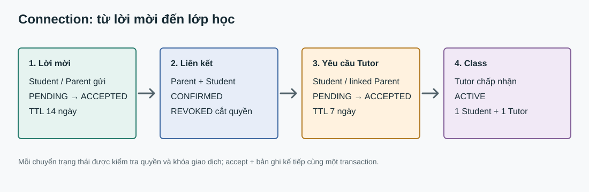

# Connection backend

Module `backend/modules/connection` triển khai UC3.1-3.5. Đọc cùng [SRS](SRS%20Edufit.docx) (BR-26-38), [SADS](software-architecture-design-specification.md) và [ADR-002](ADR-002-multi-module-architecture.md). `ConnectionService` giữ quy tắc nghiệp vụ; controller chỉ nhận/trả DTO; JPA giữ trạng thái trong bốn bảng `link_invitation`, `parent_student_link`, `connection_request`, `class`.

## Liên kết Parent - Student

1. `POST /api/v1/connections/parent-student/invite` nhận `targetEmail`. Parent và Student đều được mời vai trò đối diện. IAM tra email; tài khoản không tồn tại, sai vai trò, đã có link, cooldown hay lời mời PENDING đều trả cùng thông điệp thành công, tránh dò email. Mỗi người gửi tối đa 10 lần thử/giờ, kể cả email không tồn tại. Lời mời hết hạn sau 14 ngày.
2. `GET /parent-student/invitations` chỉ trả lịch sử của chính người dùng. Người gửi rút lời mời bằng `POST /parent-student/invitations/{id}/withdraw`. Chỉ người được mời gọi `POST /parent-student/respond` với `{ "invitationId": "...", "accept": true|false }`. Decline đặt cooldown 7 ngày cho cùng người gửi. Accept tạo `parent_student_link` CONFIRMED cùng transaction; trước đó Parent không có quyền đối với Student.
3. `GET /parent-student/links` chỉ trả link CONFIRMED thuộc người gọi. Student sở hữu link hoặc Admin gọi `DELETE /parent-student/links/{id}`. Admin phải gửi `{ "reason": "..." }`. Revoke ghi audit và notification trong cùng transaction; quyền Parent mất ngay. Hàng REVOKED được giữ để tra lịch sử; migration V1.09 cho phép tạo link mới sau lần revoke.

## Yêu cầu gia sư

1. `POST /requests` nhận `{ "goalId": "...", "tutorId": "...", "desiredSlots": ["..."], "message": "..." }`. Student chỉ gửi cho goal của mình; Parent chỉ gửi cho goal của Student có link CONFIRMED. Goal phải ACTIVE, Tutor VERIFIED và có môn/cấp học phù hợp. Message tối đa 500 ký tự, slots là mảng chuỗi không rỗng. Không gửi khi có class ACTIVE, request PENDING cùng cặp hoặc đủ 5 request PENDING cho Student.
2. `GET /requests`: Student xem request của mình; Parent truyền `studentId` và chỉ xem khi còn link; Tutor xem inbox của mình. Inbox Tutor trả goal type, môn, cấp học, slots, message, role người gửi và trạng thái, không trả email hay contact. Request PENDING hết hạn sau 7 ngày; quá hạn được chuyển EXPIRED khi đọc/ghi.
3. Student/Parent còn quyền gọi `POST /requests/{id}/cancel`. Tutor đích gọi `POST /requests/{id}/respond` với `{ "accept": true|false, "reason": "..." }`. Accept chuyển request sang ACCEPTED và tạo class ACTIVE trong cùng transaction. Reject giữ lý do và không tạo class.

`ConnectionFacade` là contract cho module khác: `hasConfirmedParentLink(parentUserId, studentId)` và `findActiveClass(studentId, tutorId)`. IAM/Profile chỉ được truy cập qua facade của chúng, không import repository/entity nội bộ. `AuditSink` và `NotificationSink` được hiện thực tại `platform/audit` và `modules/notification`.

## Đồng thời và dữ liệu

Migration [V1.04](../backend/app/src/main/resources/db/migration/connection/V1.04__create_connection_and_class_tables.sql) đã có partial unique index cho invitation/request PENDING và class ACTIVE. [V1.09](../backend/app/src/main/resources/db/migration/connection/V1.09__allow_relink_after_revocation.sql) thêm optimistic version, unique chỉ trên link CONFIRMED và bảng quota. Service dùng PostgreSQL transaction advisory lock theo cặp người dùng hoặc Student ID; thao tác ghi trạng thái khóa hàng bằng `PESSIMISTIC_WRITE`. Audit/notification cùng transaction nên rollback cùng nghiệp vụ.

Lưu ý: nhánh này bắt đầu từ `main`, chưa chứa thay đổi Discovery đang ở `feat/discovery`; khi hợp nhất hai nhánh phải dùng `ConnectionFacade` cho quyền Parent xem Discovery. Test PostgreSQL thật cho race/migration cần chạy khi Docker hoặc DB kiểm thử sẵn sàng. Hiện chưa có job dọn EXPIRED nền; trạng thái được chuẩn hóa khi có truy cập.
