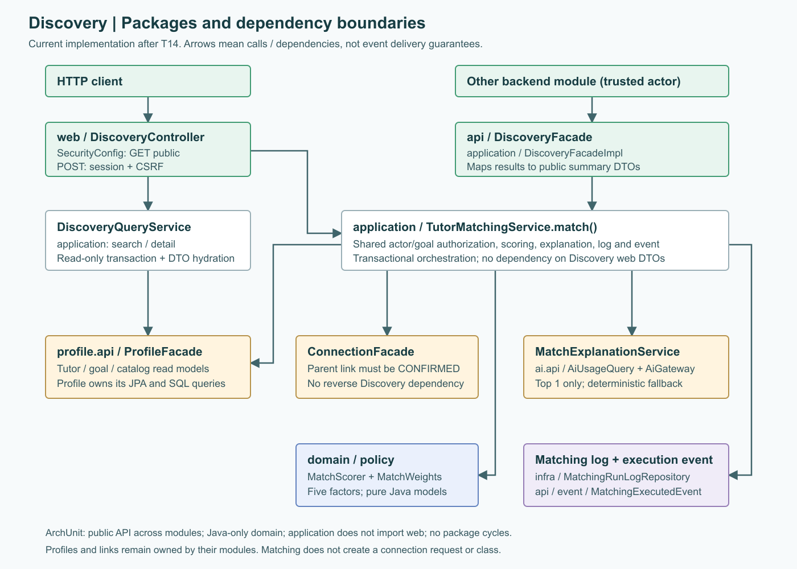
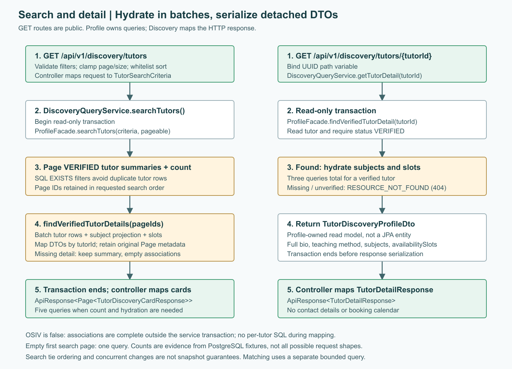
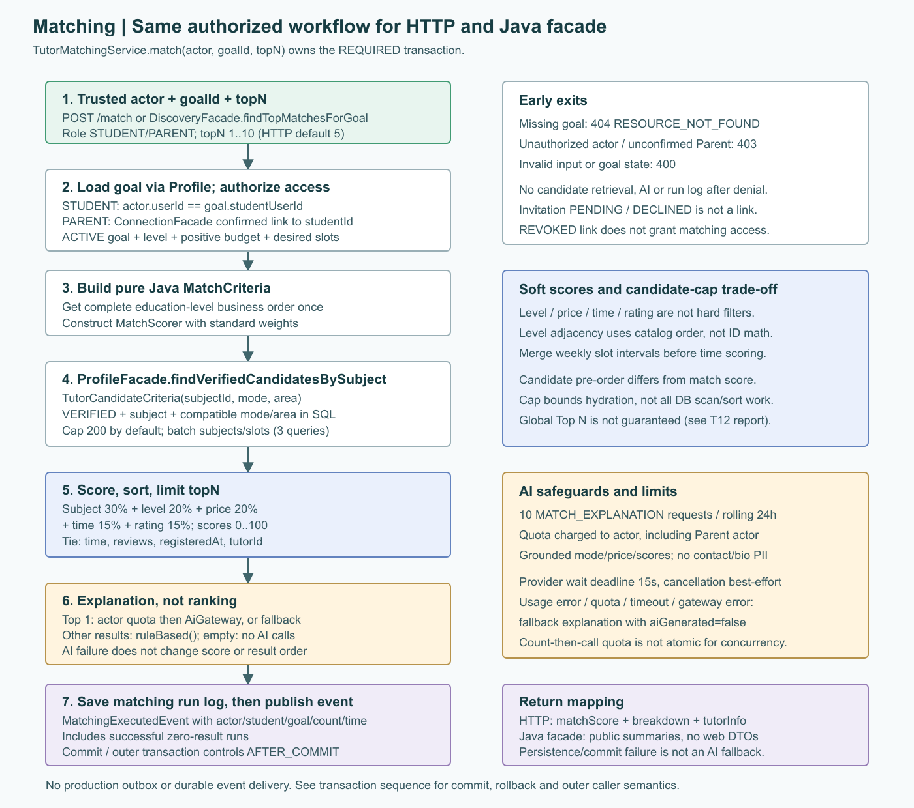
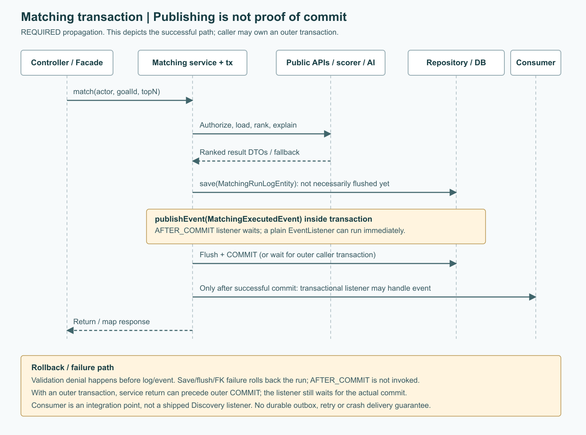

# Discovery backend: cấu trúc và luồng xử lý

> Bản bàn giao T15 ngày 2026-10-10, đối chiếu code sau Phase 5 trên `feat/discovery`. Diagram PNG bên dưới phản ánh implementation hiện tại, không phải thiết kế dự kiến.

## Bắt đầu đọc ở đâu?

- [Hợp đồng API Discovery](discovery-api-contract.md): HTTP, input/output, lỗi, facade và event cho người tích hợp.
- Tài liệu này: package/class, luồng đọc dữ liệu, matching, scoring và các quyết định thiết kế.
- [Báo cáo PostgreSQL và hiệu năng](discovery-performance-report.md): query count, môi trường đo, p95 và mất recall do candidate cap.
- [SADS](software-architecture-design-specification.md), [ADR-002](ADR-002-multi-module-architecture.md), [quy chuẩn module](backend-module-structure-guide.md): kiến trúc chung.
- [Plan đã thực hiện](../tasks/plan.md), [checklist](../tasks/todo.md): lịch sử T00-T15, không thay thế hợp đồng API hiện tại.

## Phạm vi module

Discovery phục vụ tìm kiếm gia sư đã xác minh, xem hồ sơ công khai và xếp hạng gia sư theo một learning goal. Hồ sơ gia sư và goal thuộc Profile; Discovery chỉ đọc chúng qua `profile.api.ProfileFacade`. Discovery sở hữu `matching_run_log` để ghi mỗi lượt match, không lưu nội dung tiêu chí. AI chỉ viết lời giải thích cho kết quả đầu tiên, không quyết định điểm hoặc thứ hạng.



| Vị trí | Trách nhiệm |
| --- | --- |
| `api/DiscoveryFacade`, `api/dto/TutorMatchSummaryDto`, `api/event/MatchingExecutedEvent` | Hợp đồng Java công khai cho module khác; không chứa HTTP DTO hoặc JPA entity. |
| `web/DiscoveryController` | Nhận HTTP request, tạo `Pageable`, lấy `CurrentUser`, trả `ApiResponse`. |
| `web/request`, `web/response` | Kiểm tra đầu vào và định nghĩa DTO public; không trả JPA entity. |
| `application/service/DiscoveryQueryService` | Tìm kiếm và xem chi tiết qua Profile facade. |
| `application/service/DiscoveryFacadeImpl` | Cửa vào nội bộ dùng chung matching service; trả public summary, không phụ thuộc web DTO. |
| `application/service/TutorMatchingService` | Kiểm tra quyền/goal, chuyển DTO thành candidate, xếp hạng, ghi log. |
| `application/service/MatchExplanationService` | Kiểm tra quota AI, gọi gateway hoặc dùng câu giải thích theo quy tắc. |
| `application/dto/TutorMatchResult` | Kết quả nội bộ gồm score, Profile read model, explanation và cờ AI; controller/facade map sang DTO riêng. |
| `domain/model`, `domain/policy/MatchScorer`, `domain/policy/MatchWeights` | Thuật toán 5 yếu tố Java thuần, không phụ thuộc Spring/JPA. |
| `infra/persistence/entity/MatchingRunLogEntity`, `infra/persistence/repository/MatchingRunLogRepository` | Entity và repository của lượt match. |

Điểm vào code: [controller](../backend/modules/discovery/src/main/java/vn/edufit/discovery/web/DiscoveryController.java), [query service](../backend/modules/discovery/src/main/java/vn/edufit/discovery/application/service/DiscoveryQueryService.java), [matching service](../backend/modules/discovery/src/main/java/vn/edufit/discovery/application/service/TutorMatchingService.java), [scorer](../backend/modules/discovery/src/main/java/vn/edufit/discovery/domain/policy/MatchScorer.java), [ProfileFacade](../backend/modules/profile/src/main/java/vn/edufit/profile/api/ProfileFacade.java).

### Model và ownership

| Model / dữ liệu | Ý nghĩa và nơi sở hữu |
| --- | --- |
| `MatchCriteria` | Môn/cấp/mode/area/ngân sách/lịch mong muốn của goal, không phải HTTP request. |
| `TutorCandidate`, `SubjectLevel`, `AvailabilitySlot` | Snapshot Java thuần để scorer tính điểm; không truy vấn DB hoặc lazy-load. |
| `EducationLevelOrder` | Thứ tự nghiệp vụ lấy từ Profile catalog một lần mỗi run; không suy luận từ numeric ID. |
| `MatchScore` | Năm điểm thành phần, tổng và metadata tie-break; cung cấp `rankingOrder()`. |
| Profile tables | Profile sở hữu tutor, môn/cấp/lịch, student, goal và catalog. Discovery đọc qua facade. |
| Connection link | Connection sở hữu trạng thái liên kết Parent/Student; Discovery chỉ hỏi confirmed link. |
| `matching_run_log` | Discovery sở hữu `run_id`, `user_id` (actor), `student_id`, `goal_id`, `result_count`, `created_at`; không chứa prompt/criteria/list tutor. |
| AI request log | AI Gateway sở hữu audit và usage; không phải bảng matching run. |

Dependency nghiệp vụ một chiều `discovery -> connection -> profile/iam` và `discovery -> profile`; không gọi repository/entity module khác. `domain` chỉ phụ thuộc Java và chính nó; `application` không import `web`. Hai bộ [ArchitectureTest](../backend/app/src/test/java/vn/edufit/ArchitectureTest.java) và [ArchitectureBoundaryTest](../backend/app/src/test/java/vn/edufit/ArchitectureBoundaryTest.java) cưỡng chế public API, layer boundaries, cycle-free và không cho rule pass trên package rỗng.

## API và quyền truy cập

| Endpoint | Quyền | Input chính | Kết quả |
| --- | --- | --- | --- |
| `GET /api/v1/discovery/tutors` | Public | `subjectId`, `levelId`, `area`, `mode`, `minPrice`, `maxPrice`, `minRating`; thêm `keyword`, bộ lọc giờ, phân trang/sắp xếp | `ApiResponse<Page<TutorDiscoveryCardResponse>>` |
| `GET /api/v1/discovery/tutors/{tutorId}` | Public | UUID gia sư | `ApiResponse<TutorDetailResponse>`; 404 nếu không VERIFIED/không tồn tại |
| `POST /api/v1/discovery/match` | Có session, role STUDENT/PARENT | `{ "goalId": "UUID", "topN": 5 }`; `topN` mặc định 5, tối đa 10 | `ApiResponse<List<TutorMatchResponse>>` |

`SecurityConfig` mở public hai route GET; POST cần session và CSRF token. Matching service cho phép STUDENT sở hữu goal hoặc PARENT có liên kết `CONFIRMED` qua `ConnectionFacade.hasConfirmedParentLink(actorId, goal.studentId)`. Invitation PENDING/DECLINED, link REVOKED và không có link đều không cấp quyền. Public `DiscoveryFacade.findTopMatchesForGoal(actor, goalId, topN)` dùng cùng service, cùng quyền/quota/log; actor phải lấy từ trusted server context, không lấy từ request body. Service kiểm tra `goalId` và `topN` 1..10; REST mặc định 5.

Search chuẩn hóa `page < 0` thành 0 và clamp `size` vào 1..100 (mặc định 10), không trả validation error chỉ vì vượt các biên này. `sortBy` nhận `rating`, `relevance`, `price`, `experience`; `relevance` hiện được ánh xạ sang `ratingAvg`, không phải điểm matching. Mặc định rating giảm dần, sau đó `reviewCount` giảm dần. Lọc giờ yêu cầu gửi đủ `dayOfWeek` (1..7), `availableFrom`, `availableTo`, với giờ kết thúc sau giờ bắt đầu. Chi tiết filter, DTO và lỗi thực tế nằm trong [API contract](discovery-api-contract.md).

## Luồng tìm kiếm và chi tiết



Bộ lọc chạy trong `profile.infra.persistence.repository.TutorProfileRepository.searchVerifiedTutors`. Sau khi Profile trả một trang, Discovery lấy chi tiết theo lô ID để bổ sung `subjects`, tránh truy vấn riêng cho từng card. Nếu profile biến mất giữa hai lần đọc, card vẫn được tạo từ summary và `subjects` rỗng. Chi tiết một gia sư đi qua `ProfileFacade.findVerifiedTutorDetail`, trả bio, phương pháp dạy, môn/cấp học và lịch rảnh. Hồ sơ chưa VERIFIED không xuất hiện trong search/detail.

Search là luồng hai pha: lấy trang summary trước, hydrate read model theo batch ID sau. Tại implementation hiện tại, trang đầy đủ có **5 query**, gồm page + count + tutor detail rows + subject projection + availability slots, không phải 3 query tổng. Detail có 3; candidate hydration có 3. Trang đầu rỗng chỉ cần 1 vì bỏ count/hydration. Có thể ít query hơn ở trang cuối khi Spring Data suy ra total; đây không phải lỗi N+1.

Query dùng `EXISTS` cho subject/level và availability nên nhiều dòng subject không nhân bản tutor trong page. Các associations được map thành DTO ngay trong transaction; `spring.jpa.open-in-view=false` không gây lazy loading khi controller serialize. Batch helper vẫn hydrate cả slots dù card chỉ trả subjects. Read transaction không phải snapshot bất biến xuyên mọi câu SQL ở isolation mặc định: thay đổi dữ liệu đồng thời có thể khiến summary và detail khác thời điểm. Search không thêm `tutorId` làm tie-break, vì vậy không cam kết phân trang ổn định khi mọi sort key bằng nhau hoặc dữ liệu đang đổi; candidate matching có pre-order/tie-break riêng ổn định.

## Luồng matching



Goal phải `ACTIVE`, có cấp học, `budgetMax > 0` và ít nhất một slot. Matching gọi Profile API `findVerifiedCandidatesBySubject(TutorCandidateCriteria(subjectId, mode, area))`: lọc VERIFIED/môn/mode/khu vực tại DB, cap mặc định 200 và batch hydration. Không hard-filter cấp học/giá/lịch/rating; Discovery chấm điểm, sort ổn định rồi lấy topN trong tập bounded. `DISCOVERY_MATCHING_CANDIDATE_LIMIT` cấu hình `edufit.discovery.matching.candidate-limit` và phải dương; cap không tự tăng theo `topN`.

Pre-order tại DB là rating giảm dần (null coi là 0), review count giảm dần, createdAt tăng dần rồi tutorId. Đây là heuristic chọn ứng viên, không phải công thức matching. Vì level/price/time chỉ chấm sau retrieval, cap **không đảm bảo global Top N**. [Fixture đối kháng T12](discovery-performance-report.md) chứng minh điểm cao nhất toàn tập 97.00 bị loại ngoài cap, còn bounded best 78.50 và recall Top 5 là 4/5; không được diễn giải đó là tỷ lệ miss production. API full-scan cũ đã xóa ở T14.

`MatchScorer` chỉ loại tutor không dạy đúng môn hoặc không hợp mode/khu vực; Profile chịu trách nhiệm trạng thái VERIFIED. ONLINE nhận ONLINE/BOTH ở mọi khu vực. OFFLINE nhận OFFLINE/BOTH cùng khu vực (trim, không phân biệt hoa/thường). BOTH nhận tutor có thể dạy online ở mọi khu vực hoặc offline cùng khu vực. Không loại tutor chỉ vì lệch cấp, vượt giá hay không trùng giờ. Hai slot giao nhau khi cùng ngày và `startA < endB && endA > startB`; chạm ranh giới không tính là giao.

Với tutor hợp lệ, mọi điểm thành phần ở thang 0..100:

| Field breakdown | Công thức |
| --- | --- |
| `subjectFit` (mới) | 100 khi dạy đúng môn; sai môn không xuất hiện trong kết quả. |
| `levelFit` (mới) | Đúng cấp 100; cấp liền kề 50; còn lại 0. Chỉ xét cấp tutor dạy cho môn được yêu cầu, lấy điểm tốt nhất. Liền kề theo vị trí trong catalog `education_level.sort_order`, không trừ numeric ID. Catalog gồm cả cấp đã ngừng hoạt động; sort_order thiếu/trùng bị từ chối tại Profile. |
| `budgetFit` (giữ tên cũ) | Giá <= budgetMax: 100; đoạn 100%..130% ngân sách giảm tuyến tính 100..50; đoạn 130%..150% giảm 50..0; cao hơn nhận 0. Budget phải dương, giá không âm. `budgetMin` không dùng để phạt tutor giá thấp. |
| `scheduleFit` (giữ tên cũ) | Thời lượng giao / tổng thời lượng mong muốn * 100. Hợp nhất các slot chồng/tiếp giáp theo ngày ở cả goal và tutor trước khi tính để không đếm trùng. Rỗng hoặc không giao nhận 0. |
| `ratingFit` (giữ tên cũ) | clamp(ratingAvg, 0, 5) / 5 * (0.5 + 0.5 * min(1, reviewCount / 5)) * 100; không chia nguyên. Chưa có review hoặc thiếu rating: 35. |

Điểm tổng = 0.30 * subjectFit + 0.20 * levelFit + 0.20 * budgetFit + 0.15 * scheduleFit + 0.15 * ratingFit. `MatchWeights` từ chối trọng số âm hoặc tổng khác 1. Tính tổng trước khi làm tròn điểm thành phần; phép chia nội bộ dùng 12 chữ số thập phân, output và tổng dùng 2 chữ số HALF_UP.

Khi bằng tổng điểm: ưu tiên `scheduleFit` cao hơn, nhiều review hơn, đăng ký sớm hơn (null cuối), rồi `tutorId`. Field cũ `overlappingSlots` vẫn đếm số slot yêu cầu ban đầu có giao với ít nhất một slot tutor; giữ để tương thích response, không còn dùng làm trọng số/tie-break. Ví dụ catalog [80, 3, 41, 12]: goal cấp 3 và tutor cấp 80 đạt levelFit 50 dù numeric ID cách xa; tutor cấp 4 đạt 0 dù ID sát nhau.

HTTP giữ routes và các field cũ, bổ sung `subjectFit`, `levelFit` trong `scoreBreakdown`. Prompt AI và fallback đều có đủ 5 điểm, không mặc định khẳng định tutor đúng cấp hoặc trong ngân sách khi điểm tương ứng thấp.

### Ví dụ tính điểm

Goal: subject 1, cấp 3 trong catalog `[80, 3, 2]`, budgetMax 300000, thứ Hai 18:00-20:00. Tutor dạy subject 1/cấp 80, mode hợp lệ, giá 390000, thứ Hai 19:00-21:00, rating 4.5 với 2 reviews:

| Thành phần | Điểm | Đóng góp |
| --- | ---: | ---: |
| Subject | 100.00 | 30.00 |
| Level liền kề | 50.00 | 10.00 |
| Price = 130% budget | 50.00 | 10.00 |
| Time giao 60/120 phút | 50.00 | 7.50 |
| Rating: 4.5/5 * 0.7 * 100 | 63.00 | 9.45 |
| Tổng | **66.95** | **66.95** |

`overlappingSlots=1`, không phải số phút giao. Tutor không bị loại chỉ vì level/price/time không tối ưu. Nếu thay giá bằng 450000 (=150%), budgetFit thành 0 và tổng là 56.95; nếu chưa có review, ratingFit là 35, không phải 0 hoặc 100.

### AI, quota và deadline

Chỉ kết quả đầu tiên gọi AI (`MATCH_EXPLANATION`); kiểm tra quota 10 yêu cầu trong 24 giờ gần nhất theo actor qua `AiUsageQuery` (Parent dùng quota của Parent). Các kết quả còn lại dùng giải thích theo điểm; không có candidate thì không gọi AI. Prompt chỉ gửi mode, học phí và 5 điểm thành phần/tổng, không gửi tên, email, điện thoại hay bio. AI lỗi, timeout, lỗi tra cứu usage hoặc hết quota đều trả fallback với `aiGenerated=false`, HTTP matching vẫn 200 nếu phần DB/matching còn lại thành công. Quota hiện là count-then-call, chưa phải cơ chế đặt chỗ quota nguyên tử cho request đồng thời.

AI Gateway giới hạn thời gian chờ provider bằng `edufit.ai.timeout` (cấu hình ứng dụng/mặc định 15s), ngoài connect/read socket timeout. Provider chạy trên executor virtual thread do Spring quản lý; quá hạn hủy future và ném `AiTimeoutException`, chỉ ghi TIMEOUT một lần ở thread gọi. Hủy là best-effort: provider phải hỗ trợ interrupt hoặc tự kết thúc theo socket timeout; deadline không giới hạn thời gian DB ghi AI audit. Test runtime dùng provider giả chậm với timeout 100ms, không gọi LLM thật.

### Transaction, log và event



Mỗi run thành công, kể cả rỗng, save một `matching_run_log` rồi publish một `MatchingExecutedEvent` cùng actor/student/goal/count/time trong `TutorMatchingService.match()` (`@Transactional`, propagation mặc định REQUIRED). Event dùng `executedAt=log.createdAt`; `resultCount` là số kết quả sau topN, không phải số candidate.

`save()` chưa đảm bảo DB đã flush/commit. Listener có side effect phải dùng `@TransactionalEventListener(phase = AFTER_COMMIT)`: rollback hoặc lỗi FK lúc flush ngăn listener loại này chạy. Listener `@EventListener` thông thường vẫn có thể thấy event trước commit; publish không phải bằng chứng giao dịch thành công. Nếu caller đã mở transaction, matching tham gia transaction đó và AFTER_COMMIT đợi caller commit. HTTP response thông thường được tạo sau khi transaction service commit; facade được gọi trong outer transaction chưa có đảm bảo đó tại thời điểm method trả về.

Event chỉ ở trong process, không phải durable outbox; không có retry/delivery guarantee khi process chết. Chưa có production consumer Discovery chuyên biệt trong phạm vi này; listener trong integration test chỉ chứng minh semantics. AI call diễn ra trước log trong cùng matching transaction; timeout provider không rollback một lời gọi mạng đã thực hiện và không giới hạn toàn bộ HTTP latency. Không tự đổi transaction/logging boundary trong T15.

## Đã có và giới hạn còn lại

- Search/detail/matching REST, public facade, confirmed-link authorization, năm yếu tố, AI fallback, matching log/event và bounded candidates đã triển khai, có regression.
- Dữ liệu review/scheduling cho UC2.5 vẫn cần consumer tương ứng; dependency trong `pom.xml` không đồng nghĩa đã triển khai.
- Query count, hydration không OSIV, pagination/filter/VERIFIED và cap ranking đã chạy PostgreSQL thật ở T12; [báo cáo đo](discovery-performance-report.md) không chứng nhận SLA production hoặc security-filter end-to-end.
- Quota concurrent chưa atomic; event chưa durable; cap có thể mất global winner; tie pagination search chưa có unique key. Đây là giới hạn đã biết, không phải chức năng được ngầm coi đã hoàn thành.

## Đọc code và chạy test

Bắt đầu từ `DiscoveryController` hoặc `DiscoveryFacadeImpl`; theo `DiscoveryQueryService` cho GET hoặc `TutorMatchingService` cho matching; sau đó đọc `ConnectionFacade`, `ProfileFacade` và `MatchScorer`.

| Bằng chứng | Test / vị trí |
| --- | --- |
| Scoring biên, overlap, level order, weights, tie-break | [domain tests](../backend/modules/discovery/src/test/java/vn/edufit/discovery/domain) |
| Actor/Parent, topN, bounded query, log/event và AI fallback | [service tests](../backend/modules/discovery/src/test/java/vn/edufit/discovery) |
| Field JSON, validation và mapping HTTP | [DiscoveryControllerTest](../backend/modules/discovery/src/test/java/vn/edufit/discovery/web/DiscoveryControllerTest.java) |
| PostgreSQL search/detail/hydration/query count/cap/p95 | [DiscoveryReadPostgresTest](../backend/app/src/test/java/vn/edufit/discovery/DiscoveryReadPostgresTest.java) |
| PostgreSQL commit/rollback/outer tx/confirmed link | [MatchingWorkflowPostgresTest](../backend/app/src/test/java/vn/edufit/discovery/MatchingWorkflowPostgresTest.java) |
| Candidate filter/pre-order/cap tại Profile | [MatchingCandidatesPostgresTest](../backend/modules/profile/src/test/java/vn/edufit/profile/MatchingCandidatesPostgresTest.java) |
| Deadline với fake provider chậm | [AiDeadlineTest](../backend/platform/ai/src/test/java/vn/edufit/ai/AiDeadlineTest.java) |
| Package/layer/module/cycle | [ArchitectureBoundaryTest](../backend/app/src/test/java/vn/edufit/ArchitectureBoundaryTest.java), [ArchitectureTest](../backend/app/src/test/java/vn/edufit/ArchitectureTest.java) |

Từ thư mục `backend`, dùng Maven wrapper với JDK 21. Docker phải hoạt động cho PostgreSQL tests; zero skips mới là bằng chứng integration.

```powershell
$env:JAVA_HOME = 'C:\Program Files\Java\jdk-21.0.10'
$env:MAVEN_OPTS = '-Djavax.net.ssl.trustStoreType=Windows-ROOT'
# Unit/service regression va dependencies
.\mvnw.cmd -pl modules/discovery -am test -B -ntp
# Hai bo PostgreSQL app + architecture (khong goi LLM that)
.\mvnw.cmd -pl app -am test '-Dtest=DiscoveryReadPostgresTest,MatchingWorkflowPostgresTest,ArchitectureTest,ArchitectureBoundaryTest' '-Dsurefire.failIfNoSpecifiedTests=false' -B -ntp
# Toan reactor, bao gom Flyway IT khong nam trong default Surefire naming
.\mvnw.cmd -pl app -am test '-Dtest=*Test,FlywayMigrationIT' '-Dsurefire.failIfNoSpecifiedTests=false' -B -ntp
```

T14 và lần regression bàn giao T15 đều chạy 300 tests PASS, zero failures/errors/skips, trong đó 38 PostgreSQL cases và 9 app architecture checks. Các test MockMvc standalone/controller invocation không khẳng định đã kiểm chứng security filter, CSRF qua browser hoặc tải đồng thời production.

## Q&A cho người đọc code

**Vì sao query nằm ở Profile nhưng REST nằm ở Discovery?** Profile sở hữu master data và query read model an toàn; Discovery điều phối khám phá/xếp hạng mà không chạm JPA module khác. Matching không tạo connection request hoặc lớp học.

**Vì sao có cả `api/` và `web/`?** `api/` là hợp đồng Java trong cùng JVM; `web/` là adapter HTTP. Module khác inject facade, không gọi controller hoặc import web DTO. Cả hai dùng chung matching service nên không nhân đôi quyền/quota/log.

**Đã giải quyết N+1 thì có đúng chỉ ba query không?** Candidate/detail là ba; search hiện là năm khi cần count và rehydrate tutor rows. Matching no-AI là tám trong fixture owner, không gồm confirmed-link lookup của Parent hay AI usage/audit thực. Batch count không tăng theo từng tutor, nhưng số rows/scan work và thời gian vẫn có thể tăng.

**Vì sao không hard-filter level, price và lịch?** Đây là điểm mềm theo policy năm yếu tố; lệch cấp/vượt giá/không giao giờ vẫn có thể là phương án dự phòng. Search có filter cứng do người dùng chọn và không đồng nhất với candidate retrieval.

**AI có thể đổi thứ hạng không?** Không. Score và topN chốt trước AI; gateway chỉ viết explanation cho Top 1. Quota/lỗi AI dùng `ruleBased()`, không phải class `RuleBasedExplanationGenerator` riêng.

**Parent có được match mọi goal không?** Không. Phải có link CONFIRMED với `goal.studentId`; chỉ có role hoặc invitation PENDING không đủ. Student cần sở hữu `goal.studentUserId`.

**Tăng cap có đảm bảo tìm global best không?** Chỉ khi tập được retrieve bao trùm mọi eligible tutor; cấu hình cap hữu hạn không bảo đảm điều đó. Cần đánh giá recall/cost trên dữ liệu thực trước khi đổi heuristic.

**Có thể gửi notification ngay khi nhận event không?** Chỉ sau commit với transactional listener cho side effect. Nếu cần giao event bền vững/retry, phải thiết kế outbox riêng; hiện chưa có guarantee đó.

## Bảo trì diagram

Docs nhúng PNG, không yêu cầu người đọc render Mermaid. SVG cùng tên là nguồn chỉnh sửa; [render script](../scripts/render-discovery-diagrams.cjs) chuyển nguồn SVG thành PNG và kiểm tra bounding box của chữ cùng ảnh không trắng. Dùng Node có package `sharp` và `playwright` (hoặc đặt `NODE_PATH` tới runtime dependencies) chạy `node scripts/render-discovery-diagrams.cjs`, rồi mở cả bốn ảnh kiểm tra luồng và chữ trước khi commit. Script dùng Edge headless có sẵn trên Windows, nếu không có thì dùng Chromium của Playwright; có thể đặt `DIAGRAM_BROWSER` tới browser executable. Không sửa riêng PNG rồi để SVG khác nội dung.
