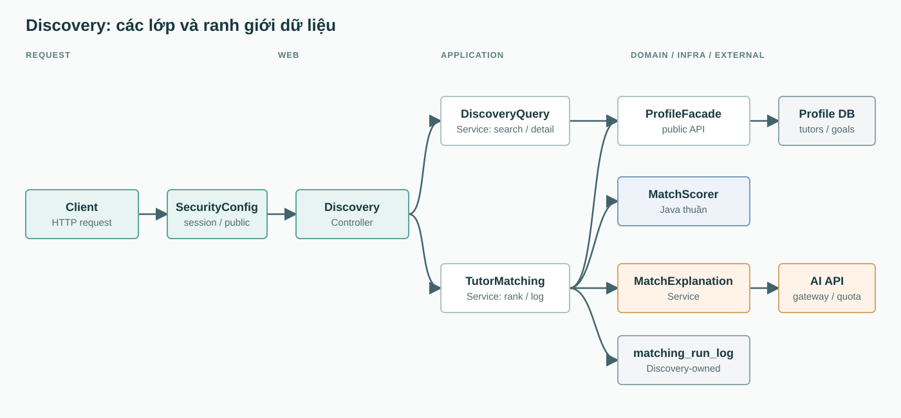
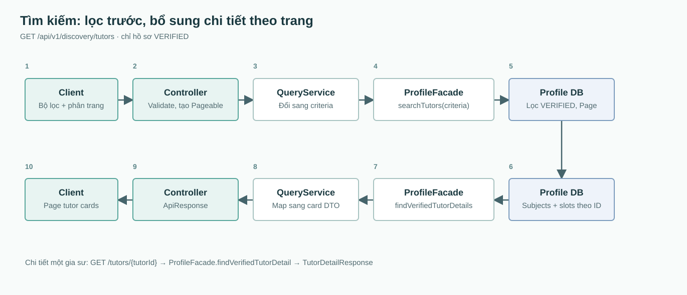
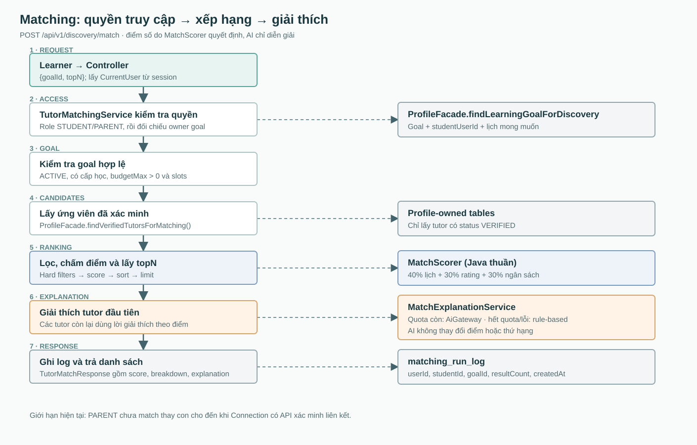

# Discovery backend: cấu trúc và luồng xử lý

> Mô tả code trên nhánh `feat/discovery`, cập nhật workflow ở Phase 4 ngày 2026-10-10. Đọc cùng [SADS](software-architecture-design-specification.md) và [hướng dẫn cấu trúc module](backend-module-structure-guide.md). Các ảnh bên dưới là snapshot trước refactor; bản flow/diagram đầy đủ sẽ cập nhật ở T15 theo [plan](../tasks/plan.md).

## Phạm vi module

Discovery phục vụ tìm kiếm gia sư đã xác minh, xem hồ sơ công khai và xếp hạng gia sư theo một learning goal. Hồ sơ gia sư và goal thuộc Profile; Discovery chỉ đọc chúng qua `profile.api.ProfileFacade`. Discovery sở hữu `matching_run_log` để ghi mỗi lượt match, không lưu nội dung tiêu chí. AI chỉ viết lời giải thích cho kết quả đầu tiên, không quyết định điểm hoặc thứ hạng.

| Vị trí | Trách nhiệm |
| --- | --- |
| `web/DiscoveryController` | Nhận HTTP request, tạo `Pageable`, lấy `CurrentUser`, trả `ApiResponse`. |
| `web/request`, `web/response` | Kiểm tra đầu vào và định nghĩa DTO public; không trả JPA entity. |
| `application/service/DiscoveryQueryService` | Tìm kiếm và xem chi tiết qua Profile facade. |
| `application/service/DiscoveryFacadeImpl` | Cửa vào nội bộ dùng chung matching service; trả public summary, không phụ thuộc web DTO. |
| `application/service/TutorMatchingService` | Kiểm tra quyền/goal, chuyển DTO thành candidate, xếp hạng, ghi log. |
| `application/service/MatchExplanationService` | Kiểm tra quota AI, gọi gateway hoặc dùng câu giải thích theo quy tắc. |
| `domain/model`, `domain/policy/MatchScorer`, `domain/policy/MatchWeights` | Thuật toán 5 yếu tố Java thuần, không phụ thuộc Spring/JPA. |
| `infra/persistence/entity/MatchingRunLogEntity`, `infra/persistence/repository/MatchingRunLogRepository` | Entity và repository của lượt match. |

Điểm vào code: [controller](../backend/modules/discovery/src/main/java/vn/edufit/discovery/web/DiscoveryController.java), [query service](../backend/modules/discovery/src/main/java/vn/edufit/discovery/application/service/DiscoveryQueryService.java), [matching service](../backend/modules/discovery/src/main/java/vn/edufit/discovery/application/service/TutorMatchingService.java), [scorer](../backend/modules/discovery/src/main/java/vn/edufit/discovery/domain/policy/MatchScorer.java), [ProfileFacade](../backend/modules/profile/src/main/java/vn/edufit/profile/api/ProfileFacade.java).

## API và quyền truy cập

| Endpoint | Quyền | Input chính | Kết quả |
| --- | --- | --- | --- |
| `GET /api/v1/discovery/tutors` | Public | `subjectId`, `levelId`, `area`, `mode`, `minPrice`, `maxPrice`, `minRating`; thêm `keyword`, bộ lọc giờ, phân trang/sắp xếp | `ApiResponse<Page<TutorDiscoveryCardResponse>>` |
| `GET /api/v1/discovery/tutors/{tutorId}` | Public | UUID gia sư | `ApiResponse<TutorDetailResponse>`; 404 nếu không VERIFIED/không tồn tại |
| `POST /api/v1/discovery/match` | Có session, role STUDENT/PARENT | `{ "goalId": "UUID", "topN": 5 }`; `topN` mặc định 5, tối đa 10 | `ApiResponse<List<TutorMatchResponse>>` |

`SecurityConfig` mở public hai route GET; POST cần session và CSRF token. Matching service cho phép STUDENT sở hữu goal hoặc PARENT có liên kết `CONFIRMED` qua `ConnectionFacade.hasConfirmedParentLink(actorId, goal.studentId)`. Invitation PENDING/DECLINED, link REVOKED và không có link đều không cấp quyền. Public `DiscoveryFacade.findTopMatchesForGoal(actor, goalId, topN)` dùng cùng service, cùng quyền/quota/log; actor phải lấy từ trusted server context, không lấy từ request body. Service kiểm tra `goalId` và `topN` 1..10; REST mặc định 5.

Search giới hạn `page >= 0`, `size` trong 1..100 (mặc định 10). `sortBy` nhận `rating`, `relevance`, `price`, `experience`; `relevance` hiện được ánh xạ sang `ratingAvg`, không phải điểm matching. Mặc định rating giảm dần, sau đó `reviewCount` giảm dần. Lọc giờ yêu cầu gửi đủ `dayOfWeek` (1..7), `availableFrom`, `availableTo`, với giờ kết thúc sau giờ bắt đầu.

## Luồng tìm kiếm và chi tiết

Bộ lọc chạy trong `profile.infra.persistence.repository.TutorProfileRepository.searchVerifiedTutors`. Sau khi Profile trả một trang, Discovery lấy chi tiết theo lô ID để bổ sung `subjects`, tránh truy vấn riêng cho từng card. Nếu profile biến mất giữa hai lần đọc, card vẫn được tạo từ summary và `subjects` rỗng. Chi tiết một gia sư đi qua `ProfileFacade.findVerifiedTutorDetail`, trả bio, phương pháp dạy, môn/cấp học và lịch rảnh. Hồ sơ chưa VERIFIED không xuất hiện trong search/detail.

## Luồng matching

Goal phải `ACTIVE`, có cấp học, `budgetMax > 0` và ít nhất một slot. Matching gọi Profile API `findVerifiedCandidatesBySubject(TutorCandidateCriteria(subjectId, mode, area))`: lọc VERIFIED/môn/mode/khu vực tại DB, cap mặc định 200 và batch hydration. Không hard-filter cấp học/giá/lịch/rating; Discovery chấm điểm, sort ổn định rồi lấy topN trong tập bounded. Cap không đảm bảo global Top N trên toàn bộ dữ liệu. Chưa khẳng định đạt NFR-14 (<500ms p95); đo hiệu năng và ảnh hưởng cap tại T12.

`MatchScorer` chỉ loại tutor không dạy đúng môn hoặc không hợp mode/khu vực; Profile chịu trách nhiệm trạng thái VERIFIED. ONLINE nhận ONLINE/BOTH ở mọi khu vực. OFFLINE nhận OFFLINE/BOTH cùng khu vực (trim, không phân biệt hoa/thường). BOTH nhận tutor có thể dạy online ở mọi khu vực hoặc offline cùng khu vực. Không loại tutor chỉ vì lệch cấp, vượt giá hay không trùng giờ. Hai slot giao nhau khi cùng ngày và `startA < endB && endA > startB`; chạm ranh giới không tính là giao.

Với tutor hợp lệ, mọi điểm thành phần ở thang 0..100:

| Field breakdown | Công thức |
| --- | --- |
| `subjectFit` (mới) | 100 khi dạy đúng môn; sai môn không xuất hiện trong kết quả. |
| `levelFit` (mới) | Đúng cấp 100; cấp liền kề 50; còn lại 0. Chỉ xét cấp tutor dạy cho môn được yêu cầu, lấy điểm tốt nhất. Liền kề theo vị trí trong catalog `education_level.sort_order`, không trừ numeric ID. Catalog gồm cả cấp đã ngừng hoạt động; sort_order thiếu/trùng bị từ chối tại Profile. |
| `budgetFit` (giữ tên cũ) | Giá <= budgetMax: 100; đoạn 100%..130% ngân sách giảm tuyến tính 100..50; đoạn 130%..150% giảm 50..0; cao hơn nhận 0. Budget phải dương, giá không âm. `budgetMin` không dùng để phạt tutor giá thấp. |
| `scheduleFit` (giữ tên cũ) | Thời lượng giao / tổng thời lượng mong muốn * 100. Hợp nhất các slot chồng/tiếp giáp theo ngày ở cả goal và tutor trước khi tính để không đếm trùng. Rỗng hoặc không giao nhận 0. |
| `ratingFit` (giữ tên cũ) | clamp(ratingAvg, 0, 5) / 5 * (0.5 + 0.5 * min(1, reviewCount / 5)) * 100; không chia nguyên. Chưa có review hoặc thiếu rating: 35. |

Điểm tổng = 0.30 * subjectFit + 0.20 * levelFit + 0.20 * budgetFit + 0.15 * scheduleFit + 0.15 * ratingFit. `MatchWeights` từ chối trọng số âm hoặc tổng khác 1. Tính tổng trước khi làm tròn điểm thành phần; phép chia nội bộ dùng 12 chữ số thập phân, output và tổng dùng 2 chữ số HALF_UP.

Khi bằng tổng điểm: ưu tiên `scheduleFit` cao hơn, nhiều review hơn, đăng ký sớm hơn (null cuối), rồi `tutorId`. Field cũ `overlappingSlots` vẫn đếm số slot yêu cầu ban đầu có giao với ít nhất một slot tutor; giữ để tương thích response, không còn dùng làm trọng số/tie-break. Ví dụ catalog [80, 3, 41, 12]: goal cấp 3 và tutor cấp 80 đạt levelFit 50 dù numeric ID cách xa; tutor cấp 4 đạt 0 dù ID sát nhau.

HTTP giữ routes và các field cũ, bổ sung `subjectFit`, `levelFit` trong `scoreBreakdown`. Prompt AI và fallback đều có đủ 5 điểm, không mặc định khẳng định tutor đúng cấp hoặc trong ngân sách khi điểm tương ứng thấp.

Chỉ kết quả đầu tiên gọi AI (`MATCH_EXPLANATION`); kiểm tra quota 10 yêu cầu trong 24 giờ gần nhất theo actor qua `AiUsageQuery` (Parent dùng quota của Parent). Các kết quả còn lại dùng giải thích theo điểm; không có candidate thì không gọi AI. Prompt chỉ gửi mode, học phí và 5 điểm thành phần/tổng, không gửi tên, email, điện thoại hay bio. AI lỗi, timeout, lỗi tra cứu usage hoặc hết quota đều trả fallback với `aiGenerated=false`, HTTP matching vẫn 200. Quota hiện là count-then-call, chưa phải cơ chế đặt chỗ quota nguyên tử cho request đồng thời.

AI Gateway giới hạn thời gian chờ provider bằng `edufit.ai.timeout` (cấu hình ứng dụng/mặc định 15s), ngoài connect/read socket timeout. Provider chạy trên executor virtual thread do Spring quản lý; quá hạn hủy future và ném `AiTimeoutException`, chỉ ghi TIMEOUT một lần ở thread gọi. Hủy là best-effort: provider phải hỗ trợ interrupt hoặc tự kết thúc theo socket timeout; deadline không giới hạn thời gian DB ghi AI audit. Test runtime dùng provider giả chậm với timeout 100ms, không gọi LLM thật.

Mỗi run thành công, kể cả rỗng, ghi một `matching_run_log` và publish một `MatchingExecutedEvent` cùng actor/student/goal/count/time trong transaction. Listener có side effect phải dùng `@TransactionalEventListener(AFTER_COMMIT)`: rollback hoặc lỗi FK lúc flush không giao event thành công. Event chỉ ở trong process, không phải durable outbox; không đảm bảo delivery khi process chết. Log không ghi prompt hay criteria.

## Việc còn phụ thuộc module khác

- Connection confirmed-link facade, Discovery facade implementation và event publisher đã nối tại Phase 4; transaction/link-state integration chạy trên PostgreSQL với Flyway thật.
- Dữ liệu review/scheduling cho UC2.5 vẫn cần consumer tương ứng; dependency trong `pom.xml` không đồng nghĩa đã triển khai.
- Candidate query đã có 6 integration cases PostgreSQL tại T05. Search nhiều bộ lọc, p95 và ảnh hưởng cap lên ranking sẽ kiểm chứng ở T12.

## Đọc code và chạy test

Bắt đầu từ `DiscoveryController` hoặc `DiscoveryFacadeImpl`; theo `DiscoveryQueryService` cho GET hoặc `TutorMatchingService` cho matching; sau đó đọc `ConnectionFacade`, `ProfileFacade` và `MatchScorer`. Test dưới `backend/modules/discovery/src/test/java/vn/edufit/discovery/`: services ở package gốc, scorer/weights ở `domain/policy`, ranking/catalog ở `domain/model`, HTTP JSON ở `web`. Transaction/link-state test nằm tại `backend/app/src/test/java/vn/edufit/discovery/MatchingWorkflowPostgresTest.java`. Từ thư mục `backend`, dùng JDK 21 chạy `mvn -pl modules/discovery -am test`; test PostgreSQL workflow: `mvn -pl app -am test -Dtest=MatchingWorkflowPostgresTest -Dsurefire.failIfNoSpecifiedTests=false` (cần Docker).
