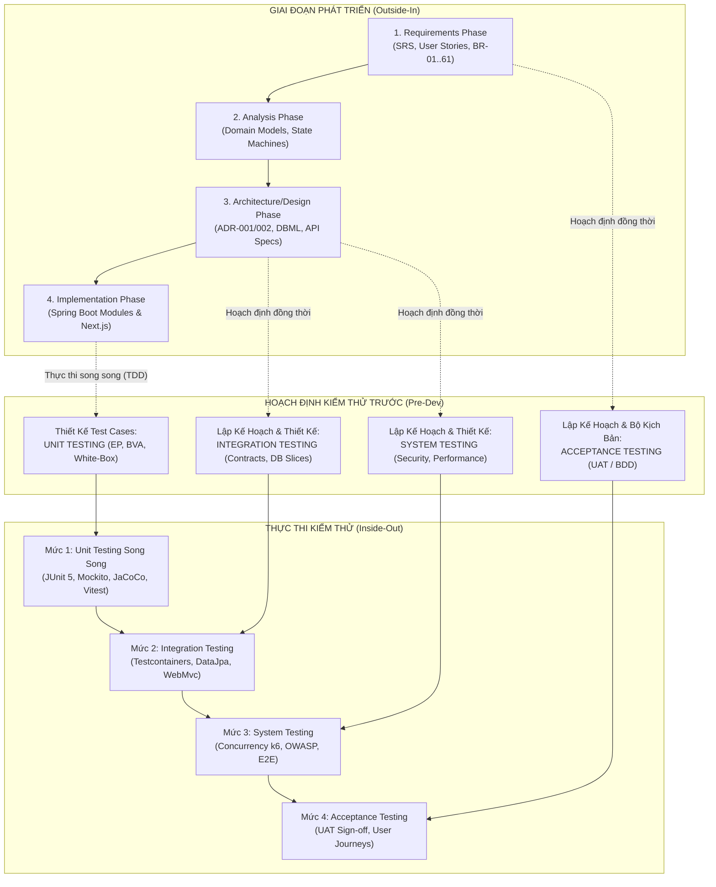
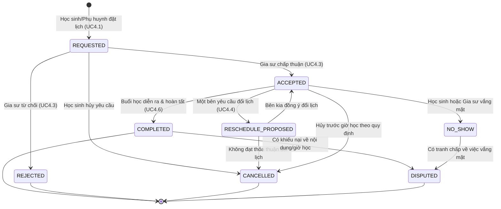
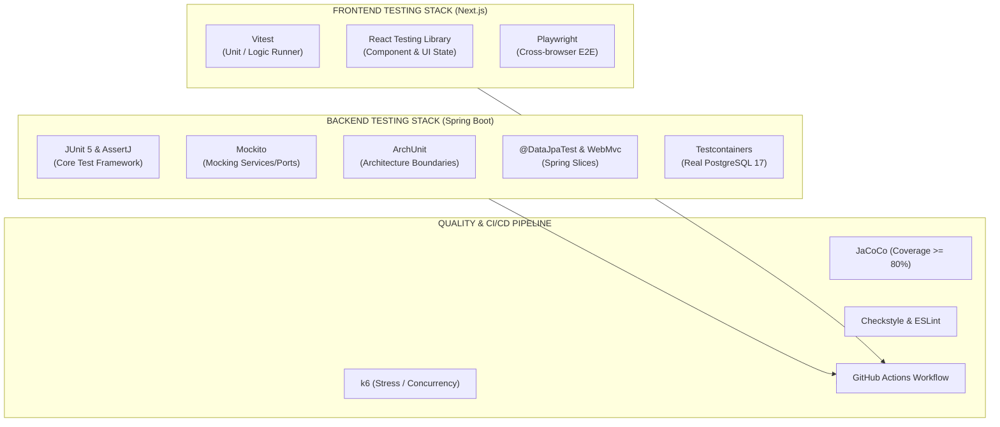
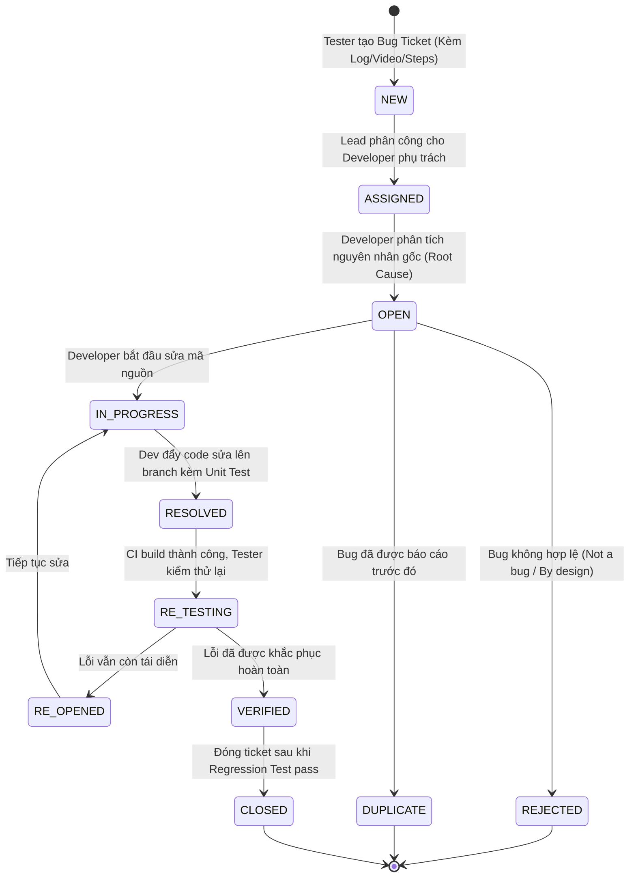

# KẾ HOẠCH KIỂM THỬ TỔNG THỂ DỰ ÁN EDUFIT (MASTER TEST PLAN)
## CHIẾN LƯỢC KIỂM THỬ ĐỐI ỨNG: PHÁT TRIỂN NGOÀI-VÀO (OUTSIDE-IN) & KIỂM THỬ TRONG-RA (INSIDE-OUT)

> **Mã tài liệu:** EDUFIT-MTP-2026-V1.0  
> **Dự án:** EduFit — Nền tảng kết nối Gia sư và Học sinh / Phụ huynh (SWP391)  
> **Tiêu chuẩn tham chiếu:** ISO/IEC/IEEE 29119 (Software Testing), IEEE 829, ISTQB Foundation/Advanced Syllabus, OWASP ASVS v4.0  
> **Tài liệu nguồn nội bộ:** [SRS Edufit.docx](file:///c:/University/Semester%205/SWP391/Edufit/EduFit/docs/SRS%20Edufit.docx), [ADR-001](file:///c:/University/Semester%205/SWP391/Edufit/EduFit/docs/ADR-001-tech-stack.md), [ADR-002](file:///c:/University/Semester%205/SWP391/Edufit/EduFit/docs/ADR-002-multi-module-architecture.md), [authentication-contract.md](file:///c:/University/Semester%205/SWP391/Edufit/EduFit/docs/authentication-contract.md), [backend-module-structure-guide.md](file:///c:/University/Semester%205/SWP391/Edufit/EduFit/docs/backend-module-structure-guide.md), [iam-test-cases-specification.md](file:///c:/University/Semester%205/SWP391/Edufit/EduFit/docs/iam-test-cases-specification.md)  
> **Ngày lập kế hoạch:** 05/10/2026  

---

## 1. Mục Tiêu & Nguyên Lý Cốt Lõi (Executive Summary & Principles)

### 1.1. Bối cảnh dự án EduFit
EduFit là nền tảng SaaS kết nối Gia sư (Tutor) với Học sinh/Phụ huynh (Student/Parent), được thiết kế theo kiến trúc **Modular Monolith** (Java 21 + Spring Boot 4 trên backend, Next.js 16 + React 19 trên frontend, PostgreSQL 17 và Flyway). Do đặc thù của hệ thống có các yêu cầu kỹ thuật và phi chức năng nghiêm ngặt:
* Chống trùng lịch kép (Double-booking protection - **NFR-17**) với tính toán khóa đồng thời.
* Xác thực Stateful Session an toàn cao, mật khẩu **Argon2id** (64MB RAM), zero plaintext token, chống Timing Attack (**NFR-01, NFR-03, NFR-04, NFR-06**).
* Kiểm duyệt bằng cấp tệp tin xác minh qua Magic Bytes detection bằng Apache Tika (**NFR-08**).
* Đảm bảo tính cô lập và ranh giới mô-đun qua facade `api/` (ràng buộc bởi **ArchUnit**).

Do đó, chất lượng hệ thống không thể chỉ dựa vào việc kiểm thử thủ công ở giai đoạn cuối, mà phải được tích hợp xuyên suốt vòng đời phát triển phần mềm (SDLC).

---

### 1.2. Nguyên lý Chiến lược: Phát triển Ngoài-Vào vs. Kiểm thử Trong-Ra

Hệ thống áp dụng mô hình liên kết đối xứng giữa **Quy trình Phát triển Hệ thống (Development Lifecycle)** và **Quy trình Kiểm thử Hệ thống (Testing Lifecycle)** theo nguyên lý:

```
CHIỀU PHÁT TRIỂN: NGOÀI VÀO TRONG (OUTSIDE-IN)
[Yêu cầu (SRS / User Stories)] 
       ↓ 
[Phân tích Nghiệp vụ (BR / Domain Models)] 
       ↓ 
[Thiết kế Hệ thống & Kiến trúc (ADR, DBML, API Contracts)] 
       ↓ 
[Lập trình Chi tiết (Java Modules, React Components)]
=============================================================================
CHIỀU KIỂM THỬ: TRONG RA NGOÀI (INSIDE-OUT)
[Unit Testing (POJO, Domain Logic, Value Objects)] 
       ↑ 
[Integration Testing (JPA Slices, Facades, Events, Flyway)] 
       ↑ 
[System Testing (E2E, Concurrency, Security, Performance)] 
       ↑ 
[Acceptance Testing (UAT, BDD Scenarios, Business Sign-off)]
```

#### Sơ đồ Mô hình Chữ V Mở Rộng (Dual-V / W-Model) của EduFit:



---

## 2. Chiến Lược Kiểm Thử Xuyên Suốt 3 Giai Đoạn (Trước, Trong và Sau Phát Triển)

| Giai đoạn | Thời điểm thực hiện | Hoạt động phát triển (Dev) | Hoạt động kiểm thử đối ứng (Test) | Sản phẩm bàn giao (Deliverables) |
|---|---|---|---|---|
| **TRƯỚC PHÁT TRIỂN (Pre-Dev)** | Giai đoạn Phân tích Yêu cầu & Thiết kế Hệ thống | - Thu thập & đặc tả SRS<br>- Thiết kế Kiến trúc (ADR)<br>- Thiết kế CSDL (DBML)<br>- Thiết kế OpenAPI Contracts | - Static Testing (Review SRS, Fagan Inspection)<br>- **Lập kế hoạch Acceptance Testing** (BDD/Gherkin, tiêu chí nghiệm thu AC)<br>- **Lập kế hoạch Integration & System Testing** (Threat modeling, Concurrency model, API Contracts) | - Master Test Plan (MTP)<br>- BDD Gherkin Feature Files<br>- Ma trận truy vết RTM<br>- Test Cases Specification (như `iam-test-cases-specification.md`) |
| **TRONG PHÁT TRIỂN (In-Dev)** | Giai đoạn Lập trình & Ghép module (Sprints 1–5) | - Lập trình Domain POJO<br>- Lập trình Service/Facade<br>- Lập trình Next.js UI<br>- Viết Flyway migrations | - **Thực thi Unit Test song song (TDD / Test-First)**<br>- Architecture Testing (ArchUnit)<br>- Integration Slices (`@DataJpaTest`, `@WebMvcTest`)<br>- Code Quality Gating (Checkstyle, Spotless, ESLint) | - Automated Unit Tests (>80% coverage)<br>- ArchUnit Rules suite<br>- Integration Test Reports (Surefire)<br>- CI/CD Pipeline status pass |
| **SAU PHÁT TRIỂN (Post-Dev)** | Giai đoạn Đóng gói, Triển khai & Vận hành | - Build Docker image<br>- Deploy Staging/Prod (Render, Railway, Vercel)<br>- Cấu hình DB Production | - System End-to-End Testing (Playwright)<br>- Concurrency & Stress Testing (k6)<br>- Security Penetration Testing (OWASP)<br>- **User Acceptance Testing (UAT Sign-off)**<br>- Smoke / Sanity Testing sau deploy | - UAT Sign-off Report<br>- Performance Benchmark Report (k6)<br>- Security Assessment Report<br>- Automated Regression Suite |

---

### 2.1. GIAI ĐOẠN 1: TRƯỚC PHÁT TRIỂN (Pre-Development Testing)

#### A. Khi Phân tích Yêu cầu (Requirements Phase) $\rightarrow$ Lập kế hoạch cho Kiểm thử Chấp nhận (Acceptance Testing)
Mục tiêu là dịch chuyển kiểm thử sang trái (**Shift-Left Testing**), phát hiện lỗi sai lệch logic và mâu thuẫn yêu cầu ngay từ trước khi viết dòng code đầu tiên.

1. **Static Requirement Testing (Kiểm thử tĩnh yêu cầu):**
   * Sử dụng kỹ thuật *Fagan Inspection* và *Ambiguity Review* để rà soát SRS.
   * *Ví dụ thực tế đã thực hiện tại EduFit:* Phát hiện mâu thuẫn giữa `Engagement` và `Class`, làm rõ bản chất `class` là quan hệ dạy-học 1-1, loại bỏ hoàn toàn tính năng `Payment` khỏi SRS (Quyết định D5 trong `edufit-schema-review-changes.md`) trước khi thiết kế DB.
2. **Thiết kế Kiểm thử BDD / Specification by Example (Gherkin format):**
   * Chuyển các User Stories thành các kịch bản kiểm thử chấp nhận dạng `Given - When - Then` có thể tự động hóa được.
   * *Ví dụ kịch bản cho UC4.1 & UC4.2 (Đặt lịch học chống trùng):*
     ```gherkin
     Feature: Đặt lịch học và ngăn chặn trùng lịch (Double-Booking Protection)
       As a Học sinh (Student)
       I want to Đặt lịch học với Gia sư trong khung giờ rảnh
       So that Buổi học được xác nhận mà không bị chồng lấn với bất kỳ lịch nào khác

       Scenario: Đặt lịch thành công trong khung giờ khả dụng
         Given Gia sư "Trần Văn A" có khung giờ rảnh vào Thứ 3 từ 14:00 đến 16:00
         And Học sinh "Lê Thị B" có quan hệ lớp học (class) hợp lệ với Gia sư A
         When Học sinh B gửi yêu cầu đặt lịch học vào Thứ 3 từ 14:00 đến 15:30
         Then Hệ thống chấp nhận yêu cầu và tạo buổi học ở trạng thái "REQUESTED"
         And Khung giờ 14:00 đến 15:30 của Gia sư A bị đánh dấu là đang chờ xác nhận

       Scenario: Từ chối đặt lịch do xung đột lịch đã tồn tại (BR-41, NFR-17)
         Given Gia sư "Trần Văn A" đã có buổi học được xác nhận vào Thứ 3 từ 14:00 đến 15:30
         When Học sinh C gửi yêu cầu đặt lịch vào Thứ 3 từ 15:00 đến 16:30
         Then Hệ thống từ chối yêu cầu với mã lỗi "SCHEDULE_CONFLICT"
         And Không có bản ghi buổi học mới nào được tạo trong cơ sở dữ liệu
     ```
3. **Thiết lập Ma trận Truy vết Yêu cầu (Requirements Traceability Matrix - RTM):**
   * Mọi Functional Requirement (FR) và Non-Functional Requirement (NFR) đều phải được ánh xạ trực tiếp đến một hoặc nhiều Test Case (Xem Mục 6).

---

#### B. Khi Thiết kế Kiến trúc & Hệ thống (Design Phase) $\rightarrow$ Lập kế hoạch Kiểm thử Tích hợp & Hệ thống (Integration & System Testing)
Tại giai đoạn này, các rủi ro kỹ thuật, giao tiếp giữa các thành phần và tải trọng hệ thống được mô hình hóa để thiết kế bài kiểm thử.

1. **Thiết kế Kiểm thử Tích hợp (Integration Testing Plan):**
   * **API Contract Testing:** Lập kế hoạch kiểm thử hợp đồng dữ liệu giữa Backend Spring Boot (OpenAPI schema) và Frontend Next.js TypeScript types (`frontend/src/shared/api/generated`).
   * **Module Facade & Isolation Verification:** Thiết kế các bài test cho ranh giới công khai `vn.edufit.modules.<module>.api.*`. Đảm bảo các module không truy cập trực tiếp DB Entity của nhau.
   * **Domain Event Integration:** Lập kế hoạch kiểm thử bus sự kiện đồng bộ (`@EventListener`) giữa các module (ví dụ: `scheduling` bắn `SessionScheduledEvent` $\rightarrow$ `notification` bắt sự kiện để tạo thông báo).
   * **Database Migration Integrity Plan:** Thiết kế quy trình kiểm thử nâng cấp và khôi phục schema Flyway (`FlywayMigrationIT`) trên PostgreSQL 17 thật qua Testcontainers.
2. **Thiết kế Kiểm thử Hệ thống (System Testing Plan):**
   * **Threat Modeling & Security Test Design:** Dựa trên OWASP ASVS v4.0, thiết kế các kịch bản thử nghiệm:
     - Tấn công thử vét cạn mật khẩu (Brute-force) kiểm tra cơ chế khóa tài khoản 15 phút sau 5 lần sai (**BR-06**).
     - Tấn công Timing Attack kiểm tra hàm băm giả lập dummy verify (**NFR-06**).
     - Tấn công Session Tampering kiểm tra cookie `HttpOnly`, `SameSite=Lax` (**NFR-04**).
     - Giả mạo phần mở rộng file (file extension spoofing) kiểm tra tầng phát hiện Magic Bytes của Apache Tika (**NFR-08**).
   * **Concurrency & Stress Test Design:** Thiết kế bài kiểm thử mô phỏng 100 giao dịch song song đồng thời tranh chấp 1 slot lịch học để kiểm tra độ tin cậy của Postgres `EXCLUDE` constraint hoặc `SELECT ... FOR UPDATE` (**NFR-15, NFR-17**).

---

### 2.2. GIAI ĐOẠN 2: TRONG PHÁT TRIỂN (In-Development / Implementation Testing)

#### Thực thi Unit Test song song (Parallel Unit Testing / TDD)
Khi lập trình viên bắt đầu hiện thực hóa mã nguồn, Unit Test không phải là hoạt động làm bổ sung sau cùng mà phải được viết song song hoặc viết trước (Test-First/TDD) theo chuẩn **Agile Testing Quadrant Q1 (Technology-facing tests that support the team)**.

```
QUY TRÌNH RED - GREEN - REFACTOR TRONG EDUFIT:
1. [RED]    Viết Test Case đại diện cho một Business Rule cụ thể (ví dụ: BR-02 Password Policy) -> Chạy test BÁO ĐỎ.
2. [GREEN]  Viết mã nguồn tối thiểu (Service/POJO) để thỏa mãn điều kiện kiểm thử -> Chạy test BÁO XANH.
3. [REFACTOR] Tối ưu hóa cấu trúc code, loại bỏ boilerplate, bảo đảm không vi phạm ranh giới kiến trúc.
```

1. **Phân tầng Unit Test theo cấu trúc 2 loại Module (theo `backend-module-structure-guide.md`):**
   * **Đối với 3 Module Phức tạp có `domain/` (`scheduling`, `progress`, `discovery`):**
     - Thực thi Unit Test trên các **POJO thuần túy (Pure Java)**, độc lập 100% với Spring Context và Hibernate.
     - Tốc độ chạy test: < 50ms cho hàng trăm test cases.
     - Kiểm thử: Thuật toán xung đột thời gian `ConflictPolicyTest`, công thức tính trọng số lộ trình `ProgressCalculatorTest`, thuật toán gợi ý `MatchScorerTest`.
   * **Đối với các Module Tiêu chuẩn (`iam`, `profile`, `verification`, `review`,...):**
     - Unit Test tầng Application Service sử dụng **Mockito** cô lập Dependencies (`@ExtendWith(MockitoExtension.class)`).
     - Kiểm thử các nhánh rẽ nghiệp vụ, điều kiện ngoại lệ (`BaseBusinessException`), các mã lỗi `ErrorCode`.
2. **Kiểm thử Kiến trúc Tự động bằng ArchUnit:**
   * Được chạy trực tiếp trong mỗi lần build `mvn test` để ngăn chặn Developer vi phạm quy ước kiến trúc:
     ```java
     // Trích đoạn ArchitectureTest.java hiện hữu trong dự án EduFit:
     @ArchTest
     static final ArchRule modules_should_only_interact_through_api = noClasses()
         .that().resideInAPackage("vn.edufit.modules.(*)..")
         .should().dependOnClassesThat()
         .resideInAnyPackage(
             "vn.edufit.modules.(*).application..",
             "vn.edufit.modules.(*).domain..",
             "vn.edufit.modules.(*).infra.."
         );
     ```
3. **Frontend Unit & Component Testing (Next.js 16 + React 19):**
   * Cài đặt **Vitest** + **React Testing Library** + **@testing-library/user-event**.
   * Kiểm thử form validation schemas (Zod/React Hook Form) cho đăng ký, đặt lịch, đăng nhập.
   * Kiểm thử render trạng thái UI (Loading skeleton, Error alerts, Disabled buttons khi chưa nhập đủ thông tin).
4. **Code Quality Gates (Cổng kiểm soát chất lượng mã tự động trong CI):**
   * **JaCoCo:** Ngưỡng tối thiểu (Minimum Line Coverage) >= 80% cho tầng `domain` và `application/service`.
   * **Checkstyle & Spotless:** Định dạng code Java chuẩn Google Java Style, không khoảng trắng thừa.
   * **ESLint:** Kiểm tra lỗi cú pháp và quy tắc React Hooks trên Frontend.

---

### 2.3. GIAI ĐOẠN 3: SAU PHÁT TRIỂN (Post-Development / Release Testing)

Sau khi toàn bộ tính năng và mã nguồn đã được tích hợp thành công, hệ thống bước vào giai đoạn kiểm thử toàn diện trên môi trường tương đồng Production (Staging/Docker Compose).

1. **System End-to-End (E2E) Testing:**
   * Sử dụng **Playwright** chạy trên trình duyệt thực (Chromium/Firefox/WebKit) tự động hóa các hành trình người dùng xuyên suốt (Cross-Role User Journeys):
     - *Hành trình 1:* Gia sư đăng ký $\rightarrow$ nộp bằng cấp PDF $\rightarrow$ Admin duyệt hồ sơ $\rightarrow$ Gia sư xuất hiện trên bảng tìm kiếm công khai.
     - *Hành trình 2:* Phụ huynh tạo liên kết với con $\rightarrow$ tìm kiếm gia sư Toán $\rightarrow$ gửi đề nghị kết nối $\rightarrow$ gia sư đồng ý $\rightarrow$ tạo lớp học (`class`) $\rightarrow$ đặt lịch học $\rightarrow$ học sinh vào học và ghi chép tiến độ.
2. **Kiểm thử Tải & Hiệu năng Đồng thời (Performance & Concurrency Testing):**
   * Sử dụng **k6** thực hiện Stress Test kịch bản cao điểm:
     - 100 Virtual Users (VU) gọi đồng thời API `POST /api/v1/scheduling/sessions` tranh chấp cùng 1 slot giờ rảnh.
     - *Tiêu chí thành công:* Đúng duy nhất 1 request trả về HTTP 201 Created; 99 requests còn lại trả về HTTP 409 Conflict (`SCHEDULE_CONFLICT`). Cơ sở dữ liệu tuyệt đối không bị bản ghi trùng lặp.
     - Độ trễ phản hồi (Response Latency): $p95 \le 300\text{ms}$ cho các API tìm kiếm gia sư và bảng điều khiển.
3. **Kiểm thử Bảo mật Độc lập (Security & Vulnerability Assessment):**
   * Quét lỗ hổng tĩnh (SAST) qua GitHub CodeQL/SonarQube.
   * Quét lỗ hổng động (DAST) bằng OWASP ZAP kiểm tra: XSS injection qua form ghi chú buổi học (SessionNote <= 5000 ký tự), CSRF protection, Insecure Direct Object References (IDOR - học sinh không được xem lịch học của học sinh khác nếu không có quan hệ lớp học).
4. **Kiểm thử Chấp nhận Người dùng (User Acceptance Testing - UAT):**
   * Mời các nhóm người dùng đại diện (Đóng vai 4 Actor: Student, Parent, Tutor, Admin) thực hiện kiểm thử trên môi trường Staging theo kịch bản định sẵn.
   * Đánh giá độ khả dụng (Usability) và khả năng tiếp cận (Accessibility theo chuẩn WCAG 2.1 AA).
   * Lấy chữ ký nghiệm thu bàn giao (Sign-off) của Product Owner (PO) và Giảng viên hướng dẫn SWP391.
5. **Kiểm thử Hồi quy (Automated Regression Suite) & Smoke Testing sau triển khai:**
   * Tự động kích hoạt bộ Smoke Test (kiểm tra `/actuator/health`, ping database, kiểm tra route `/login`, `/tutors`) ngay sau khi CD deploy bản build mới lên Render/Vercel.

---

## 3. Phân Loại & Thiết Kế Các Kỹ Thuật Kiểm Thử Áp Dụng Cho EduFit

Hệ thống EduFit áp dụng đầy đủ các kỹ thuật kiểm thử tiêu chuẩn công nghiệp được quy định trong giáo trình chuẩn **ISTQB (International Software Testing Qualifications Board)**:

```
TỔNG HỢP CÁC KỸ THUẬT KIỂM THỬ ĐƯỢC CHỌN CHO EDUFIT:
├── 1. KỸ THUẬT HỘP ĐEN (Black-Box Testing)
│   ├── Phân vùng tương đương (Equivalence Partitioning - EP)
│   ├── Phân tích giá trị biên (Boundary Value Analysis - BVA)
│   ├── Kiểm thử bảng quyết định (Decision Table Testing)
│   ├── Kiểm thử chuyển trạng thái (State Transition Testing)
│   └── Kiểm thử ca sử dụng (Use Case Testing)
├── 2. KỸ THUẬT HỘP TRẮNG (White-Box Testing)
│   ├── Độ bao phủ câu lệnh (Statement Coverage)
│   ├── Độ bao phủ nhánh / quyết định (Branch/Decision Coverage)
│   └── Độ bao phủ đường đi (Path Coverage cho Policy Algorithms)
├── 3. KỸ THUẬT PHI CHỨC NĂNG (Non-Functional Testing)
│   ├── Kiểm thử tương tranh & xung đột (Concurrency & Race Condition Testing)
│   ├── Kiểm thử an toàn thông tin & bảo mật (Security Penetration Testing)
│   ├── Kiểm thử khả năng chịu tải & suy hao (Load & Stress Testing)
│   └── Kiểm thử di chuyển dữ liệu (Database Migration Rollback Testing)
└── 4. KỸ THUẬT DỰA TRÊN KINH NGHIỆM (Experience-Based Testing)
    ├── Dự đoán lỗi (Error Guessing)
    └── Kiểm thử thăm dò (Exploratory Testing trên User Journeys)
```

---

### 3.1. Thiết Kế Chi Tiết Kỹ Thuật Kiểm Thử Hộp Đen (Black-Box Techniques)

#### A. Kỹ thuật 1: Phân vùng tương đương (Equivalence Partitioning - EP)
Chia miền dữ liệu đầu vào thành các phân vùng hợp lệ (Valid Partitions) và không hợp lệ (Invalid Partitions). Chỉ cần chọn một giá trị đại diện từ mỗi phân vùng để kiểm thử.

* **Áp dụng tại EduFit cho Quy tắc Mật khẩu (BR-02) & Upload bằng cấp (NFR-08):**

| Đối tượng kiểm thử | Phân vùng hợp lệ (Valid) | Phân vùng không hợp lệ (Invalid) | Ca kiểm thử đại diện | Kết quả kỳ vọng |
|---|---|---|---|---|
| **Độ dài Mật khẩu** | $8 \le \text{length} \le 64$ ký tự | - $0 \le \text{length} < 8$<br>- $\text{length} > 64$ | - Pass1234 (8 ký tự)<br>- Ab1 (3 ký tự)<br>- Chuỗi 65 ký tự | - Chấp nhận<br>- HTTP 400 `VALIDATION_FAILED`<br>- HTTP 400 `VALIDATION_FAILED` |
| **Ký tự Mật khẩu** | Chứa ít nhất 1 chữ (`[a-zA-Z]`) VÀ 1 số (`[0-9]`) | - Toàn chữ cái (không có số)<br>- Toàn chữ số (không có chữ)<br>- Toàn ký tự đặc biệt | - `MatKhau123`<br>- `MatKhauKhongSo`<br>- `123456789`<br>- `!@#$%^&*()` | - Chấp nhận<br>- HTTP 400 `VALIDATION_FAILED`<br>- HTTP 400 `VALIDATION_FAILED`<br>- HTTP 400 `VALIDATION_FAILED` |
| **Loại tệp bằng cấp (NFR-08)** | Tệp tài liệu hợp lệ: PDF, JPEG, PNG | - Tệp thực thi: EXE, SH, BAT<br>- Tệp nén / script: ZIP, JS, HTML | - `bang_dai_hoc.pdf`<br>- `trojan_virus.exe`<br>- `script.html` | - Chấp nhận lưu trữ<br>- HTTP 400 `INVALID_FILE_TYPE`<br>- HTTP 400 `INVALID_FILE_TYPE` |
| **Đánh giá sao (Review BR-57)** | Số nguyên từ 1 đến 5 | - Số < 1 (0, -1)<br>- Số > 5 (6, 10)<br>- Số thực (3.5, 4.2) | - Rating = 5<br>- Rating = 0<br>- Rating = 6<br>- Rating = 4.5 | - Chấp nhận<br>- HTTP 400 `INVALID_RATING`<br>- HTTP 400 `INVALID_RATING`<br>- HTTP 400 `INVALID_RATING` |

---

#### B. Kỹ thuật 2: Phân tích giá trị biên (Boundary Value Analysis - BVA)
Lỗi phần mềm thường tập trung tại các biên của phân vùng. BVA tập trung kiểm tra các giá trị: Biên dưới - 1, Biên dưới, Biên trên, Biên trên + 1.

* **Áp dụng tại EduFit cho Giới hạn Ghi chú Buổi học (BR-47) và Thời hạn Phiên (NFR-04):**

| Tham số kiểm thử | Ngưỡng quy định | Các giá trị biên kiểm thử (BVA Points) | Kết quả kỳ vọng |
|---|---|---|---|
| **Độ dài SessionNote (`note_text`)** | $0 \le \text{length} \le 5000$ ký tự | - `length = 0` (Rỗng)<br>- `length = 1`<br>- `length = 5000`<br>- `length = 5001` | - Hợp lệ (cho phép note rỗng)<br>- Hợp lệ<br>- Hợp lệ (đạt trần tối đa)<br>- **Bị từ chối: HTTP 400** `VALIDATION_FAILED` |
| **Số lần đăng nhập sai (BR-06)** | Ngưỡng khóa: 5 lần sai liên tiếp | - 3 lần sai: `failed_attempts = 3`<br>- 4 lần sai: `failed_attempts = 4`<br>- 5 lần sai: `failed_attempts = 5`<br>- 6 lần sai (đang bị khóa) | - Cho phép thử tiếp<br>- Cho phép thử tiếp<br>- **Khóa tài khoản 15 phút** (`ACCOUNT_LOCKED`)<br>- Từ chối ngay lập tức không kiểm tra password |
| **Thời gian trôi qua của Token reset (BR-05)** | TTL = 30 phút (1800 giây) | - 29 phút 59 giây<br>- 30 phút 00 giây<br>- 30 phút 01 giây | - Tiêu thụ thành công, đổi mật khẩu OK<br>- Tiêu thụ thành công<br>- **Bị từ chối: HTTP 400** `TOKEN_EXPIRED` |
| **Thời gian bất hoạt của Session (NFR-04)** | Hết hạn sau 60 phút không thao tác | - 59 phút không request $\rightarrow$ gửi request mới<br>- 60 phút 05 giây không request $\rightarrow$ gửi request | - Cookie hợp lệ, session được gia hạn trượt<br>- **Cookie hết hạn: HTTP 401** `UNAUTHORIZED` |

---

#### C. Kỹ thuật 3: Kiểm thử Bảng quyết định (Decision Table Testing)
Áp dụng cho các nghiệp vụ có nhiều điều kiện logic kết hợp để đưa ra các hành động xử lý khác nhau.

* **Áp dụng tại EduFit cho Ma trận phân quyền truy cập chức năng theo Vai trò & Trạng thái (RBAC Matrix):**

| Điều kiện (Conditions) | Rule 1 | Rule 2 | Rule 3 | Rule 4 | Rule 5 | Rule 6 |
|---|:---:|:---:|:---:|:---:|:---:|:---:|
| **Vai trò người dùng (Role)** | TUTOR | TUTOR | STUDENT | PARENT | ADMIN | ANY |
| **Trạng thái tài khoản** | ACTIVE | DEACTIVATED | ACTIVE | ACTIVE | ACTIVE | ACTIVE |
| **Trạng thái xác minh bằng cấp** | APPROVED | ANY | N/A | N/A | N/A | N/A |
| **Hành động (Actions)** | | | | | | |
| Đăng nhập vào hệ thống | **YES** | **NO (400)** | **YES** | **YES** | **YES** | **YES** |
| Hiển thị trên danh sách tìm kiếm | **YES** | **NO** | **NO** | **NO** | **NO** | **NO** |
| Nhận đề nghị kết nối từ học sinh | **YES** | **NO** | **NO** | **NO** | **NO** | **NO** |
| Duyệt hồ sơ xác minh gia sư | **NO (403)** | **NO** | **NO (403)** | **NO (403)** | **YES** | **NO** |
| Xem bảng tiến độ học sinh liên kết | **NO** | **NO** | **YES (của mình)** | **YES (con liên kết)** | **YES** | **NO** |

---

#### D. Kỹ thuật 4: Kiểm thử Chuyển trạng thái (State Transition Testing)
Áp dụng cho các thực thể có vòng đời thay đổi trạng thái theo chuỗi sự kiện nghiệp vụ nghiêm ngặt.

* **Áp dụng tại EduFit cho Máy trạng thái Buổi học (`tutoring_session` - BR-41..48):**



* **Ma trận Chuyển trạng thái & Ca kiểm thử tương ứng:**

| Trạng thái hiện tại | Sự kiện kích hoạt (Event) | Trạng thái tiếp theo hợp lệ | Trạng thái không hợp lệ (Phải ném Exception) |
|---|---|---|---|
| **`REQUESTED`** | Gia sư bấm `ACCEPT` | `ACCEPTED` | Cấm nhảy trực tiếp sang `COMPLETED` (Ném `ILLEGAL_STATE_TRANSITION`) |
| **`REQUESTED`** | Gia sư bấm `REJECT` | `REJECTED` | Cấm gửi đề xuất đổi lịch `RESCHEDULE_PROPOSED` khi chưa chấp nhận |
| **`ACCEPTED`** | Học sinh đề xuất đổi giờ | `RESCHEDULE_PROPOSED` | Cấm chuyển sang `REQUESTED` |
| **`COMPLETED`** | Học sinh bấm đổi lịch | N/A (Không đổi) | **Lỗi nghiêm trọng:** Cấm đổi lịch buổi học đã hoàn thành |
| **`CANCELLED`** | Gia sư bấm chấp thuận | N/A (Không đổi) | **Lỗi nghiêm trọng:** Cấm hồi sinh buổi học đã hủy |

---

#### E. Kỹ thuật 5: Kiểm thử Ca sử dụng (Use Case Testing)
Thiết kế các kịch bản kiểm thử bao phủ toàn bộ luồng chính (Main Flow), luồng phụ (Alternative Flow) và luồng ngoại lệ (Exception Flow) cho 28 Use Cases trong SRS EduFit.

* **Ví dụ kiểm thử Use Case UC1.10 (Nộp hồ sơ bằng cấp xác thực):**
  - *Main Flow (TC_UC1.10_01):* Gia sư tải lên 2 file PDF bằng tốt nghiệp và chứng chỉ IELTS $\rightarrow$ Hệ thống quét virus/magic bytes $\rightarrow$ Lưu file vào storage $\rightarrow$ Tạo bản ghi `verification_request` trạng thái `PENDING` $\rightarrow$ Gửi thông báo đến Admin.
  - *Alternative Flow (TC_UC1.10_02):* Gia sư đã có hồ sơ đang `PENDING` $\rightarrow$ Hệ thống cho phép nộp bổ sung chứng chỉ thứ 3 trước khi Admin bắt đầu duyệt.
  - *Exception Flow (TC_UC1.10_03):* Gia sư tải lên tệp tin giả mạo `bang_cap.pdf` nhưng nội dung thực chất là mã độc shell script $\rightarrow$ Apache Tika kiểm tra magic bytes không khớp với `application/pdf` $\rightarrow$ Ném lỗi `UNSUPPORTED_MEDIA_TYPE` (HTTP 415) $\rightarrow$ Không lưu tệp vào storage.

---

### 3.2. Thiết Kế Chi Tiết Kỹ Thuật Kiểm Thử Hộp Trắng (White-Box Techniques)

Áp dụng cho các nhà phát triển trong quá trình viết Unit Test để đo lường độ bao phủ cấu trúc nội bộ của mã nguồn.

```
TIÊU CHUẨN ĐỘ BAO PHỦ MÃ NGUỒN CỦA EDUFIT (JACOCO QUALITY GATE):
1. Statement Coverage (Độ bao phủ câu lệnh)     : >= 85% đối với Domain & Service
2. Branch/Decision Coverage (Độ bao phủ nhánh)  : >= 80% đối với các khối logic điều kiện
3. Path Coverage (Độ bao phủ đường đi)         : 100% đối với ConflictPolicy & MatchScorer
```

#### A. Statement Coverage (Bao phủ câu lệnh)
Đảm bảo tất cả các dòng lệnh trong phương thức đều được chạy qua ít nhất 1 lần.
* *Ví dụ trong `Account.java`:* Kiểm tra phương thức `recordFailedLogin()`:
  - Phải có ít nhất 1 test case kích hoạt dòng `failedAttempts++`.
  - Phải có ít nhất 1 test case kích hoạt dòng `lockedUntil = now.plusMinutes(15)`.

#### B. Branch / Decision Coverage (Bao phủ nhánh quyết định)
Đảm bảo mọi nhánh của câu lệnh rẽ nhánh (`if-else`, `switch-case`, `ternary operator`, `try-catch`) đều nhận cả 2 giá trị `TRUE` và `FALSE`.
* *Ví dụ phân tích nhánh trong thuật toán kiểm tra xung đột lịch (`ConflictPolicy.java`):*
  ```java
  public boolean hasConflict(TimeInterval newSession, List<TimeInterval> existingSessions) {
      if (newSession == null || existingSessions == null) { // Nhánh 1: null check
          throw new IllegalArgumentException("Intervals cannot be null");
      }
      for (TimeInterval existing : existingSessions) {
          if (newSession.overlaps(existing)) {             // Nhánh 2: Xung đột chồng lấn
              return true;                                 // Nhánh 2a: Có trùng
          }
      }
      return false;                                        // Nhánh 2b: Không trùng
  }
  ```
  - *Test Case 1 (Branch 1 TRUE):* Gọi `hasConflict(null, list)` $\rightarrow$ Bắt Exception.
  - *Test Case 2 (Branch 1 FALSE, Branch 2a TRUE):* Gọi với buổi học mới trùng khung giờ $\rightarrow$ Trả về `true`.
  - *Test Case 3 (Branch 1 FALSE, Branch 2b TRUE):* Gọi với buổi học mới cách xa các buổi cũ $\rightarrow$ Trả về `false`.
  - *Kết quả:* Đạt 100% Branch Coverage cho hàm này.

#### C. Path Coverage (Bao phủ đường đi)
Kiểm thử mọi tổ hợp đường đi khả dĩ từ điểm bắt đầu đến điểm kết thúc của thuật toán. Áp dụng bắt buộc cho:
* **`ProgressCalculator`:** Tính toán tiến độ dựa trên số buổi hoàn thành, số milestone đã đạt và điểm trọng số.
* **`MatchScorer`:** Tính toán điểm tương thích giữa yêu cầu của học sinh và hồ sơ gia sư (Điểm môn học, điểm cấp học, điểm khu vực địa lý, điểm đánh giá sao trung bình).

---

### 3.3. Thiết Kế Kỹ Thuật Kiểm Thử Phi Chức Năng (Non-Functional Testing)

| Kỹ thuật | Yêu cầu kiểm chuẩn | Công cụ thực hiện | Kịch bản kiểm thử chi tiết |
|---|---|---|---|
| **Concurrency Testing (Kiểm thử tương tranh)** | NFR-15, NFR-17 (Chống double-booking, chống tranh chấp dữ liệu) | Java `CountDownLatch`, `ExecutorService`, **k6** | Tạo 50 luồng ảo (Virtual Threads) đồng thời gọi hàm `scheduleSession()` cho cùng 1 gia sư tại cùng 1 thời điểm. Xác minh transaction lock thành công, chỉ 1 luồng ghi DB thành công. |
| **Security Penetration Testing** | NFR-01..06, OWASP Top 10 | OWASP ZAP, Postman Security, Burp Suite | 1. Thử gửi email hoa thường (`Admin@EduFit.vn`) để xem có tạo được 2 user không (BR-01).<br>2. Đo thời gian phản hồi khi đăng nhập bằng email có thật vs email không có thật để xác minh chống Timing Attack (NFR-06).<br>3. Kiểm tra flag cookie session (`HttpOnly`, `SameSite=Lax`). |
| **Storage & File Security Testing** | NFR-08 (Xác thực loại file bằng nội dung) | Apache Tika, Custom JUnit Tests | Đổi đuôi file `virus.sh` thành `virus.pdf` hoặc nhúng payload PHP vào ảnh PNG. Gọi `CredentialStorageService.store()` và kỳ vọng ném lỗi `INVALID_FILE_CONTENT`. |
| **Database Migration Integrity Testing** | Tính toàn vẹn cấu trúc DB trên môi trường sạch | Testcontainers (PostgreSQL 17), Flyway | Chạy toàn bộ các script `V1__init_schema.sql` từ trạng thái CSDL trống. Kiểm tra khóa ngoại, ràng buộc `UNIQUE(tutor_id, student_id)` của bảng `review`, và cấu trúc bảng `account`. |
| **Performance Benchmark Testing** | Thời gian phản hồi API dưới tải thông thường | k6, JMeter | Tải 50 người dùng duyệt danh mục gia sư (UC2.1). Đo $p95 \le 300\text{ms}$, tỉ lệ lỗi (Error Rate) $< 0.1\%$. |

---

## 4. Kiến Trúc & Công Cụ Kiểm Thử (Testing Architecture & Tooling Stack)



### 4.1. Bảng phân công Công cụ Kiểm thử theo từng tầng

| Tầng kiểm thử | Đối tượng kiểm thử | Công nghệ / Thư viện lựa chọn | Mục đích chính |
|---|---|---|---|
| **Frontend Unit/Component** | React Components, Custom Hooks, Form Schemas | **Vitest + React Testing Library** | Kiểm thử tương tác người dùng, render conditional UI, validate Zod schemas mà không cần mở trình duyệt. |
| **Frontend E2E** | Luồng giao diện hoàn chỉnh qua nhiều trang | **Playwright** | Chạy kiểm thử tự động trên Chrome, Firefox, Safari giả lập; chụp ảnh màn hình (screenshot) khi có lỗi. |
| **Backend Unit (POJO)** | Domain Models, Value Objects, Policies | **JUnit 5 + AssertJ** | Kiểm thử logic thuần Java siêu tốc độ (< 1s cho toàn bộ suite). |
| **Backend Service Unit** | Use Case Services, Facade Implementations | **Mockito** | Cô lập Database và External APIs để test chuyên sâu business rules và xử lý lỗi. |
| **Backend Architecture** | Ranh giới giữa các module Maven | **ArchUnit** | Cưỡng chế quy tắc: Không module nào được gọi vào `infra`/`domain` nội bộ của module khác. |
| **Backend Integration** | Persistence Layer, SQL Queries, Flyway | **@DataJpaTest + Testcontainers (Postgres 17)** | Chạy migration thật, kiểm tra ràng buộc toàn vẹn khóa ngoại và exclusion constraints. |
| **Backend Web Slice** | REST Controllers, Request Validation | **@WebMvcTest + MockMvc** | Kiểm tra ánh xạ HTTP status, validate `@Valid` request DTOs và cấu trúc `ApiResponse<T>`. |
| **Performance & Load** | APIs đặt lịch, tìm kiếm gia sư | **k6 (Grafana)** | Viết kịch bản load test bằng JavaScript, đo lường Virtual Users, p95 latency và concurrency conflicts. |

---

## 5. Thiết Kế Chi Tiết Kịch Bản Kiểm Thử Cho 4 Kịch Bản Trọng Yếu Của EduFit

Dưới đây là thiết kế chi tiết (kèm mã nguồn kiểm thử mẫu) cho 4 thành phần có độ rủi ro kỹ thuật cao nhất trong dự án:

---

### 5.1. Kịch bản 1: Chống Trùng Lịch Buổi Học & Xử lý Tranh chấp Đồng thời (NFR-17, BR-41)
* **Vấn đề rủi ro:** Hai học sinh cùng nhấn nút đặt cùng một khung giờ của gia sư tại cùng một tích tắc ($t$). Nếu không có cơ chế khóa, cả 2 buổi học sẽ được tạo $\rightarrow$ Gia sư bị trùng lịch.
* **Kỹ thuật áp dụng:** Concurrency Stress Test với `CountDownLatch` kết hợp PostgreSQL Locking.

```java
package vn.edufit.scheduling;

import org.junit.jupiter.api.DisplayName;
import org.junit.jupiter.api.Test;
import org.springframework.beans.factory.annotation.Autowired;
import org.springframework.boot.test.context.SpringBootTest;
import org.testcontainers.junit.jupiter.Testcontainers;
import vn.edufit.scheduling.application.service.SchedulingApplicationService;
import vn.edufit.scheduling.web.request.CreateSessionRequest;

import java.time.LocalDateTime;
import java.util.concurrent.CountDownLatch;
import java.util.concurrent.ExecutorService;
import java.util.concurrent.Executors;
import java.util.concurrent.atomic.AtomicInteger;

import static org.assertj.core.api.Assertions.assertThat;

@SpringBootTest
@Testcontainers
class ConcurrentSchedulingIntegrationTest {

    @Autowired
    private SchedulingApplicationService schedulingService;

    @Test
    @DisplayName("NFR-17: 2 request đồng thời đặt cùng 1 slot giờ rảnh -> Duy nhất 1 request thành công")
    void shouldPreventDoubleBookingUnderConcurrentRequests() throws InterruptedException {
        int numberOfThreads = 10;
        ExecutorService executor = Executors.newFixedThreadPool(numberOfThreads);
        CountDownLatch startGate = new CountDownLatch(1);
        CountDownLatch endGate = new CountDownLatch(numberOfThreads);

        AtomicInteger successCount = new AtomicInteger(0);
        AtomicInteger conflictCount = new AtomicInteger(0);

        Long tutorId = 100L;
        LocalDateTime startTime = LocalDateTime.of(2026, 10, 15, 14, 0);
        LocalDateTime endTime = LocalDateTime.of(2026, 10, 15, 16, 0);

        for (int i = 0; i < numberOfThreads; i++) {
            final Long studentId = 200L + i;
            executor.submit(() -> {
                try {
                    startGate.await(); // Đảm bảo toàn bộ 10 threads xuất phát tại cùng một miligiây
                    CreateSessionRequest request = new CreateSessionRequest(tutorId, studentId, startTime, endTime);
                    schedulingService.requestSession(request);
                    successCount.incrementAndGet();
                } catch (Exception e) {
                    if (e.getMessage().contains("SCHEDULE_CONFLICT")) {
                        conflictCount.incrementAndGet();
                    }
                } finally {
                    endGate.countDown();
                }
            });
        }

        startGate.countDown(); // Phát lệnh chạy đồng thời
        endGate.await();       // Chờ tất cả threads hoàn tất

        // BẢO ĐẢM TOÀN VẸN: Đúng 1 giao dịch tạo thành công, 9 giao dịch còn lại nhận lỗi xung đột
        assertThat(successCount.get()).isEqualTo(1);
        assertThat(conflictCount.get()).isEqualTo(9);
    }
}
```

---

### 5.2. Kịch bản 2: Vòng Đời Phiên Đăng Nhập & Chống Dò Quét Tài Khoản (NFR-04, NFR-06, BR-06)
* **Vấn đề rủi ro:** Kẻ tấn công dò quét email bằng cách đo thời gian phản hồi (Timing Attack), hoặc sử dụng brute-force để đoán mật khẩu.
* **Kỹ thuật áp dụng:** Boundary Value Analysis (5 lần sai $\rightarrow$ khóa 15p), Timing Resistance Mocking.

```java
package vn.edufit.iam;

import org.junit.jupiter.api.DisplayName;
import org.junit.jupiter.api.Test;
import org.junit.jupiter.api.extension.ExtendWith;
import org.mockito.InjectMocks;
import org.mockito.Mock;
import org.mockito.junit.jupiter.MockitoExtension;
import vn.edufit.iam.application.service.AuthenticateAccountService;
import vn.edufit.iam.infra.persistence.entity.Account;
import vn.edufit.iam.infra.persistence.repository.AccountRepository;
import vn.edufit.shared.exception.BaseBusinessException;
import vn.edufit.shared.exception.ErrorCode;

import java.util.Optional;

import static org.assertj.core.api.Assertions.assertThatThrownBy;
import static org.mockito.Mockito.*;

@ExtendWith(MockitoExtension.class)
class AuthenticateAccountServiceTest {

    @Mock
    private AccountRepository accountRepository;

    @Mock
    private Argon2PasswordService passwordService;

    @InjectMocks
    private AuthenticateAccountService authService;

    @Test
    @DisplayName("BR-06: Nhập sai mật khẩu liên tiếp 5 lần -> Tài khoản bị khóa tạm thời 15 phút")
    void shouldLockAccountAfterFiveConsecutiveFailedAttempts() {
        Account account = Account.builder()
            .email("student@edufit.vn")
            .passwordHash("$argon2id$mocked")
            .failedAttempts(4) // Đã sai 4 lần trước đó
            .build();

        when(accountRepository.findByNormalizedEmail("student@edufit.vn")).thenReturn(Optional.of(account));
        when(passwordService.verify(anyString(), anyString())).thenReturn(false); // Lần thứ 5 vẫn sai

        assertThatThrownBy(() -> authService.authenticate("student@edufit.vn", "WrongPass123"))
            .isInstanceOf(BaseBusinessException.class)
            .hasFieldOrPropertyWithValue("errorCode", ErrorCode.INVALID_CREDENTIALS);

        // Xác minh tài khoản bị đánh dấu khóa
        assertThat(account.getFailedAttempts()).isEqualTo(5);
        assertThat(account.getLockedUntil()).isNotNull();
        verify(accountRepository).save(account);
    }

    @Test
    @DisplayName("NFR-06: Email không tồn tại -> Vẫn thực hiện dummy hash để chống Timing Attack")
    void shouldExecuteDummyHashWhenEmailDoesNotExist() {
        when(accountRepository.findByNormalizedEmail("ghost@edufit.vn")).thenReturn(Optional.empty());

        assertThatThrownBy(() -> authService.authenticate("ghost@edufit.vn", "SomePassword123"))
            .isInstanceOf(BaseBusinessException.class)
            .hasFieldOrPropertyWithValue("errorCode", ErrorCode.INVALID_CREDENTIALS);

        // BẮT BUỘC: verify hàm băm giả lập vẫn được gọi để tiêu hao thời gian CPU tương đương
        verify(passwordService).dummyVerify();
    }
}
```

---

### 5.3. Kịch bản 3: Tải Lên & Quét Magic Bytes Tệp Bằng Cấp (NFR-08, UC1.11)
* **Vấn đề rủi ro:** Kẻ tấn công đổi tên tệp mã độc `webshell.php` thành `bang_dai_hoc.pdf` để vượt qua kiểm tra đuôi file thông thường của browser.
* **Kỹ thuật áp dụng:** Negative Equivalence Testing kết hợp Apache Tika Parser.

```java
package vn.edufit.storage;

import org.apache.tika.Tika;
import org.junit.jupiter.api.DisplayName;
import org.junit.jupiter.api.Test;
import org.springframework.mock.web.MockMultipartFile;
import vn.edufit.shared.exception.BaseBusinessException;
import vn.edufit.shared.exception.ErrorCode;

import static org.assertj.core.api.Assertions.assertThatThrownBy;

class CredentialFileValidationTest {

    private final Tika tika = new Tika();

    @Test
    @DisplayName("NFR-08: Tệp có đuôi .pdf nhưng nội dung thực tế là text/script -> Bị phát hiện và chặn đứng")
    void shouldRejectSpoofedFileExtensionBasedOnMagicBytes() {
        // Tạo file giả mạo: tên là .pdf nhưng header là bash script
        byte[] maliciousBytes = "#!/bin/bash\necho 'Hacked'".getBytes();
        MockMultipartFile spoofedFile = new MockMultipartFile(
            "file", 
            "my_degree.pdf", 
            "application/pdf", 
            maliciousBytes
        );

        // Hàm phát hiện loại mime thực tế dựa vào Magic Bytes nội dung
        String detectedMimeType = tika.detect(maliciousBytes);

        // Xác minh Apache Tika nhận diện đúng text/plain chứ không phải application/pdf
        org.assertj.core.api.Assertions.assertThat(detectedMimeType).isEqualTo("text/plain");

        LocalCredentialStorageService storageService = new LocalCredentialStorageService(tika);
        assertThatThrownBy(() -> storageService.validateAndStore(spoofedFile))
            .isInstanceOf(BaseBusinessException.class)
            .hasFieldOrPropertyWithValue("errorCode", ErrorCode.INVALID_FILE_CONTENT);
    }
}
```

---

### 5.4. Kịch bản 4: Cưỡng Chế Ranh Giới Kiến Trúc Độc Lập Giữa Các Module (ADR-002)
* **Vấn đề rủi ro:** Developer viết code gọi trực tiếp Repository hoặc Entity của module khác (ví dụ: `scheduling` gọi trực tiếp `AccountRepository` của `iam`) gây phá vỡ kiến trúc Modular Monolith.
* **Kỹ thuật áp dụng:** Static Architecture Testing bằng ArchUnit trên CI pipeline.

```java
package vn.edufit;

import com.tngtech.archunit.core.importer.ImportOption;
import com.tngtech.archunit.junit.AnalyzeClasses;
import com.tngtech.archunit.junit.ArchTest;
import com.tngtech.archunit.lang.ArchRule;

import static com.tngtech.archunit.lang.syntax.ArchRuleDefinition.noClasses;

@AnalyzeClasses(packages = "vn.edufit", importOptions = {ImportOption.DoNotIncludeTests.class})
public class ArchitectureBoundaryTest {

    @ArchTest
    static final ArchRule modules_must_communicate_only_via_api_packages = noClasses()
        .that().resideInAPackage("vn.edufit.modules.(*)..")
        .should().dependOnClassesThat()
        .resideInAnyPackage(
            "vn.edufit.modules.(*).application..",
            "vn.edufit.modules.(*).domain..",
            "vn.edufit.modules.(*).infra.."
        )
        .because("Quy tắc ADR-002: Các module chỉ được phép giao tiếp qua Facade công khai tại vn.edufit.modules.<module>.api.*");

    @ArchTest
    static final ArchRule domain_must_be_pure_java_and_not_depend_on_frameworks = noClasses()
        .that().resideInAPackage("..domain..")
        .should().dependOnClassesThat()
        .resideInAnyPackage("org.springframework..", "jakarta.persistence..", "org.hibernate..")
        .because("Domain layer của 3 module phức tạp phải thuần Java POJO để Unit Test tức thì và bảo toàn Clean Architecture");
}
```

---

## 6. Ma Trận Truy Vết Yêu Cầu & Ca Kiểm Thử (Requirement Traceability Matrix - RTM)

Dưới đây là bảng trích xuất ánh xạ chuẩn từ Yêu cầu hệ thống (SRS) $\rightarrow$ Quyết định Kiến trúc $\rightarrow$ Module triển khai $\rightarrow$ Các cấp độ kiểm thử tương ứng:

| Mã Yêu Cầu (SRS / NFR) | Mô tả tóm tắt yêu cầu | Căn cứ thiết kế / Quy tắc | Module thực hiện | Cấp độ kiểm thử (Level) | Kỹ thuật kiểm thử áp dụng | Mã Test Case đại diện |
|---|---|---|---|:---:|---|---|
| **FR-01, BR-01** | Đăng ký tài khoản, Email chuẩn hóa & duy nhất | ADR-002 / IAM | `modules/iam` | Unit + Integration | Equivalence Partitioning, BVA | `AccountTest.shouldNormalizeEmail`, `RegisterAccountServiceTest` |
| **FR-03, NFR-01** | Mật khẩu băm Argon2id (64MB RAM, 3 rounds) | ADR-001 | `modules/iam` | Unit | Boundary Value Analysis | `Argon2PasswordServiceTest.shouldVerifyValidPassword` |
| **FR-04, NFR-04** | Stateful Session Cookie (HttpOnly, 60m sliding) | ADR-001 | `app` + `iam` | Integration + System | State Transition, Security Testing | `SpringSecurityCurrentUserTest`, `SessionSlidingExpiryIT` |
| **BR-06, NFR-06** | Khóa tài khoản sau 5 lần sai; Dummy verify timing | `iam-spec` | `modules/iam` | Unit | BVA, Timing Resistance Testing | `AuthenticateAccountServiceTest.shouldLockAccountAfter5Fails` |
| **FR-15, NFR-08** | Xác minh bằng cấp gia sư, quét Magic Bytes | ADR-001 | `platform/storage` + `verification` | Unit + Integration | Negative Equivalence Partitioning (Tika) | `LocalCredentialStorageServiceTest`, `VerificationFlowIT` |
| **FR-20, BR-20** | Quản lý khung giờ rảnh hàng tuần của Gia sư | `edufit-schema` | `modules/profile` | Unit + Integration | Decision Table Testing | `TutorAvailabilitySlotTest`, `ProfileFacadeTest` |
| **FR-22, NFR-17** | Đặt lịch học & Chống trùng lịch kép (Double-booking) | ADR-001 | `modules/scheduling` | Unit + Concurrency System | Decision Table, State Transition, Stress k6 | `ConflictPolicyTest`, `ConcurrentSchedulingIntegrationTest` |
| **FR-25, BR-47** | Ghi chép buổi học (tối đa 5000 ký tự, bất biến) | `edufit-schema` | `modules/progress` | Unit | Boundary Value Analysis ($L=0, 5000, 5001$) | `SessionNoteValidationTest`, `SessionNoteImmutableTest` |
| **FR-28, BR-57** | Đánh giá gia sư (duy nhất 1 lần/cặp, sao từ 1-5) | `edufit-schema` | `modules/review` | Unit + Integration | Equivalence Partitioning, DB Constraint | `ReviewServiceTest`, `ReviewUniqueConstraintIT` |
| **ADR-002** | Ranh giới package độc lập giữa các module con | ADR-002 | Toàn bộ backend | Architecture Test | Static Bytecode Analysis (ArchUnit) | `ArchitectureTest.modules_should_only_interact_through_api` |

---

## 7. Tiêu Chuẩn Bắt Đầu, Tạm Dừng & Kết Thúc Kiểm Thử (Entry / Suspension / Exit Criteria)

### 7.1. Tiêu chuẩn Bắt đầu Kiểm thử (Entry Criteria)
* **Cho Unit Testing:** Mã nguồn biên dịch thành công (`mvn clean compile`, `npm run lint` không có lỗi cú pháp); các contract DTO và interface đã được định nghĩa.
* **Cho Integration Testing:** Các module con liên quan đã pass 100% Unit Tests; file Flyway migration chạy thành công trên Testcontainers PostgreSQL mà không phát sinh lỗi syntax.
* **Cho System & E2E Testing:** Toàn bộ stack ứng dụng khởi động thành công qua Docker Compose cục bộ (`compose.yaml`); dữ liệu seed thử nghiệm (Account admin, gia sư mẫu, môn học) đã sẵn sàng.
* **Cho UAT:** Môi trường Staging hoạt động ổn định; tài liệu hướng dẫn kiểm thử nghiệp vụ (UAT Scenarios) đã được duyệt bởi Product Owner.

### 7.2. Tiêu chuẩn Tạm dừng & Tiếp tục (Suspension & Resumption Criteria)
* **Tạm dừng (Suspension):** Nếu phát hiện lỗi mức độ **Blocker (Severity 1)** làm tê liệt môi trường kiểm thử (ví dụ: Crash ứng dụng khi khởi động, DB migration hỏng làm mất dữ liệu, tính năng đăng nhập/session hoàn toàn bị lỗi không vào được dashboard).
* **Tiếp tục (Resumption):** Sau khi lập trình viên đưa ra bản vá (Hotfix), chạy lại toàn bộ Unit Tests liên quan và vượt qua Smoke Test môi trường.

### 7.3. Tiêu chuẩn Kết thúc & Nghiệm thu (Exit / Completion Criteria)
* **100%** Test Cases mức Critical và High trong Kế hoạch kiểm thử được thực thi thành công.
* Tỉ lệ đỗ kiểm thử tự động (Pass Rate) trong CI pipeline đạt tối thiểu **98%**.
* Không còn bất kỳ lỗi nào ở mức độ **Severity 1 (Blocker)** và **Severity 2 (Critical)** chưa được xử lý.
* Độ bao phủ mã nguồn (Code Coverage bởi JaCoCo) đạt tối thiểu:
  - **$\ge 80\%$** đối với toàn bộ các class trong `domain/` và `application/service/`.
  - **$\ge 75\%$** đối với toàn bộ Backend Monolith.
* ArchUnit Architecture Tests pass 100% (không có cảnh báo vi phạm ranh giới module).
* Kịch bản Concurrency k6 cho đặt lịch học (NFR-17) chứng minh không phát sinh double-booking dưới tải 50 VU.
* Biên bản nghiệm thu UAT được ký duyệt bởi đầy đủ các thành viên nhóm SWP391 và Product Owner.

---

## 8. Quy Trình Quản Lý Vòng Đời Lỗi (Defect Management Lifecycle)

Mọi khiếm khuyết phần mềm (Defect/Bug) phát hiện được trong quá trình kiểm thử phải được ghi nhận và quản lý tập trung trên hệ thống quản lý công việc (Jira / GitHub Issues) theo quy trình chuẩn:



### Phân loại Mức độ Nghiêm trọng của Lỗi (Defect Severity):
1. **Severity 1 (Blocker):** Hệ thống sập, mất mát dữ liệu, lỗ hổng bảo mật rò rỉ session hoặc token, không thể đăng nhập, Flyway migration chết. Thời gian phản hồi: Khắc phục ngay lập tức (< 4 giờ).
2. **Severity 2 (Critical):** Tính năng nghiệp vụ cốt lõi bị tắc nghẽn (ví dụ: đặt lịch báo lỗi dù slot trống, gia sư đã nộp bằng nhưng Admin không xem được file, tính toán sai tiến độ học tập). Khắc phục trong vòng 24 giờ.
3. **Severity 3 (Major):** Tính năng gặp lỗi nhưng có cách giải quyết tạm thời (Workaround), giao diện hiển thị sai lệch một số trường thông tin phụ. Khắc phục trước khi kết thúc Sprint.
4. **Severity 4 (Minor / Trivial):** Lỗi chính tả tiếng Việt trên giao diện, lệch vị trí nút bấm vài pixel, thông báo chưa tối ưu về mặt UX. Xử lý khi có thời gian rảnh.

---

## 9. Phân Kỳ Triển Khai Kiểm Thử Theo Lộ Trình Sprints Dự Án

| Sprint | Trọng tâm Phát triển (Development) | Trọng tâm Hoạt động Kiểm thử (Testing Activities) | Output Kiểm thử cụ thể |
|---|---|---|---|
| **Sprint 1 (Hoàn thành)** | IAM Module + Foundation Architecture | - Viết Unit test cho Account, Token, PasswordPolicy, Argon2.<br>- Thiết lập ArchUnit và Flyway migration tests. | 7 files test IAM, `ArchitectureTest.java`, `FlywayMigrationIT.java`. |
| **Sprint 2 (Hiện tại)** | Profile Module + Verification + Catalog | - Unit test `StudentProfileService`, `TutorProfileService`.<br>- Integration test quét Magic Bytes Apache Tika (`LocalCredentialStorageServiceTest`).<br>- WebMvc slice tests cho ProfileController. | Suite kiểm thử Profile & Verification, Test cases upload file an toàn. |
| **Sprint 3** | Connection + Scheduling (Domain phức tạp) | - Unit test POJO `ConflictPolicy` đạt 100% path coverage.<br>- State Transition tests cho 8 trạng thái `tutoring_session`.<br>- Concurrency IT test chống double booking với Testcontainers. | Bộ test kịch bản chồng lấn lịch, Concurrency test script. |
| **Sprint 4** | Progress + Review + Notification | - Unit test POJO `ProgressCalculator` (công thức trọng số).<br>- Integration test tính bất biến của `SessionNote`.<br>- Event Listener integration tests (Domain Event $\rightarrow$ Notification). | Bộ test tính toán tiến độ, Review unique constraint tests. |
| **Sprint 5** | Platform AI + System Hardening + UAT | - Mocking AI integration test cho Gemini/OpenAI.<br>- Chạy Playwright E2E cho 2 User Journeys chính.<br>- Chạy k6 load test & OWASP ZAP DAST scan.<br>- Thực hiện UAT với người dùng thật. | Báo cáo UAT hoàn chỉnh, Kịch bản Playwright, Benchmark Report. |

---

## 10. Kết Luận & Hành Động Tiếp Theo (Action Items)

Bản kế hoạch kiểm thử tổng thể này đóng vai trò là kim chỉ nam chất lượng cho dự án EduFit. Việc tuân thủ chiến lược **Phát triển Ngoài-Vào** kết hợp **Kiểm thử Trong-Ra** bảo đảm rằng:
1. Nhóm không bao giờ xây dựng sai yêu cầu (nhờ kiểm thử chấp nhận được lập kế hoạch từ pha Requirement).
2. Hệ thống không gặp lỗi kiến trúc hay sụp đổ khi tích hợp (nhờ kiểm thử tích hợp được lập kế hoạch từ pha Design).
3. Từng dòng code được bảo vệ bằng mạng lưới an toàn tự động (nhờ thực thi Unit Test song song trong pha Coding).

**Các hành động kỹ thuật cần triển khai ngay cho nhóm:**
- [ ] Bổ sung thư viện kiểm thử Frontend (**Vitest + React Testing Library**) vào `frontend/package.json`.
- [ ] Cấu hình GitHub Actions chạy tự động toàn bộ Unit Tests và ArchUnit trên mỗi Pull Request.
- [ ] Duy trì quy ước: Mọi PR mới cho các module tiếp theo (`scheduling`, `progress`, `connection`) bắt buộc phải có Unit Tests đi kèm trước khi được merge vào nhánh `main`.
