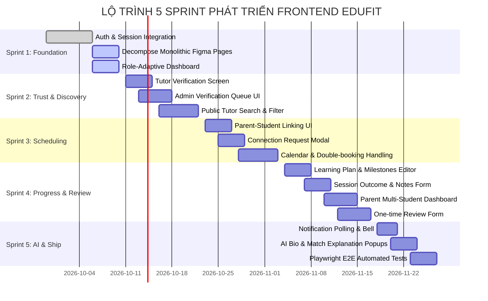

# MASTER PLAN: LỘ TRÌNH TỔNG THỂ & KIẾN TRÚC FRONTEND DỰ ÁN EDUFIT (FRONTEND MASTER ROADMAP & ARCHITECTURE SPECIFICATION)

> **Mã tài liệu:** EDUFIT-FMP-2026-V1.0  
> **Dự án:** EduFit — Nền tảng Gia sư THCS (SWP391)  
> **Tài liệu tham chiếu:** [ADR-001](ADR-001-tech-stack.md), [ADR-002](ADR-002-multi-module-architecture.md), [SADS](software-architecture-design-specification.md), [SRS Edufit.docx](SRS%20Edufit.docx)  
> **Kế hoạch hành động chi tiết:** [Kế hoạch Giai đoạn 1 (Phase 1 Action Plan)](frontend-phase1-demo-and-figma-refactor-plan.md)  
> **Mục tiêu:** Định hình kiến trúc tổng thể, quy chuẩn thiết kế, phân rã mã nguồn Figma, và lộ trình phát triển xuyên suốt 5 Sprint cho toàn bộ đội ngũ phát triển Frontend.

---

## 1. Tổng Quan & Bối Cảnh (Context & Objectives)

### 1.1. Bối cảnh Dự án
EduFit là nền tảng SaaS kết nối Gia sư và Học sinh/Phụ huynh cấp THCS, phục vụ 4 nhóm người dùng chính (**Student**, **Parent**, **Tutor**, **Admin**) với 9 phân hệ nghiệp vụ phức tạp.  
Hiện tại, đội ngũ phát triển đã chuyển giao giao diện ban đầu từ bản thiết kế Figma (Figma-to-Code) vào mã nguồn Next.js 16 (React 19, Tailwind CSS v4). Tuy nhiên:
1. **Các trang hiện tại là các file `.tsx` nguyên khối (Monolithic TSX Files):** Mỗi màn hình được gom thành một file duy nhất 300–600 dòng (`page.tsx`, `login/page.tsx`, `register/page.tsx`, `dashboard/page.tsx`), khiến việc bảo trì, tái sử dụng component và phân chia công việc cho các thành viên trong nhóm gặp nhiều trở ngại.
2. **Cần bản đồ kiến trúc toàn diện (Master Architecture):** Cần một chuẩn mực kỹ thuật định nghĩa cách tổ chức cây thư mục chuẩn (Package-by-Feature), cách quản lý trạng thái phiên làm việc (Session State), xử lý Cookie `httpOnly`, đồng bộ hợp đồng API (API Contract Sync), và phân bổ công việc theo 5 Sprint phát triển.

### 1.2. Mục tiêu của Master Plan
* **Thiết lập Khung kiến trúc chuẩn hóa (Clean Frontend Architecture):** Phân chia rõ ràng giữa tầng định tuyến mỏng (`app/`), logic nghiệp vụ tính năng (`features/`), và hệ thống giao diện dùng chung (`shared/ui`).
* **Quy chuẩn hóa Phân rã mã nguồn Figma (Component Decomposition Strategy):** Hướng dẫn quy trình chuyển đổi code thô xuất từ Figma thành các Atomic Components chuyên nghiệp mà không làm vỡ hoặc xô lệch giao diện.
* **Lộ trình 5 Sprint Toàn diện (Full 5-Sprint Roadmap):** Ánh xạ đầy đủ tất cả 9 module nghiệp vụ từ Sprint 1 đến Sprint 5, bảo đảm Frontend luôn sẵn sàng đồng bộ và kết nối với Backend theo đúng các thỏa thuận giao tiếp (API Contracts).

---

## 2. Kiến Trúc Tổng Thể Frontend (Architecture Blueprint)

```
                                  KIẾN TRÚC TỔNG THỂ FRONTEND EDUFIT
+---------------------------------------------------------------------------------------------------------+
|                                    NEXT.JS APP ROUTER (TẦNG ĐỊNH TUYẾN MỎNG)                            |
|    (public)        (auth)         (learner)          student/         parent/        tutor/     admin/  |
+---------------------------------------------------------------------------------------------------------+
                                                     ↓ import từ index.ts
+---------------------------------------------------------------------------------------------------------+
|                                     FEATURES/ (TẦNG NGHIỆP VỤ & GIAO DIỆN CHUYÊN BIỆT)                  |
|   auth/    profile/    verification/    discovery/    connection/    scheduling/    progress/   review/ |
|   ├── api/          (server.ts, client.ts - fetch backend)                                              |
|   ├── components/   (UI con của tính năng, bóc tách từ Figma)                                           |
|   ├── hooks/        (custom hooks, tanstack query)                                                      |
|   ├── schemas/      (zod validation schemas - đối xứng Bean Validation của Spring)                      |
|   └── index.ts      (Cửa ngõ công khai duy nhất của feature)                                            |
+---------------------------------------------------------------------------------------------------------+
                                                     ↓ sử dụng
+---------------------------------------------------------------------------------------------------------+
|                                     SHARED/ (TẦNG DÙNG CHUNG TOÀN HỆ THỐNG)                             |
|   ├── ui/           (Design System: Button, Input, Modal, Badge, Card, Sidebar, TopHeader)              |
|   ├── lib/          (api.ts fetch wrapper, session helpers, date-fns Asia/Ho_Chi_Minh)                  |
|   └── types/        (Data contracts, ApiResponse envelope, Error definitions)                           |
+---------------------------------------------------------------------------------------------------------+
```

---

## 3. Cấu Trúc Cây Thư Mục Mục Tiêu (Target Folder Structure)

```
frontend/src/
├── app/                                  # CHỈ định tuyến & ghép Layout, không chứa logic nặng
│   ├── layout.tsx                        # Root layout (Fonts Inter, theme provider)
│   ├── globals.css                       # Tailwind CSS v4 tokens
│   │
│   ├── (public)/                         # Route Group công khai (không bắt buộc đăng nhập)
│   │   ├── layout.tsx                    # Header/Footer công khai
│   │   ├── page.tsx                      # Landing Page
│   │   └── tutors/[id]/page.tsx          # Xem hồ sơ gia sư công khai (UC2.1, UC2.5)
│   │
│   ├── (auth)/                           # Route Group xác thực
│   │   ├── layout.tsx                    # Layout tập trung không Sidebar
│   │   ├── login/page.tsx                # Trang Đăng nhập (UC1.2)
│   │   ├── register/page.tsx             # Trang Đăng ký (UC1.1)
│   │   ├── forgot-password/page.tsx      # Quên mật khẩu
│   │   └── reset-password/page.tsx       # Đặt lại mật khẩu
│   │
│   ├── (learner)/                        # Tuyến dùng chung cho Student & Parent
│   │   ├── layout.tsx                    # Layout bảo vệ role STUDENT | PARENT
│   │   ├── find-tutors/page.tsx          # Tìm kiếm & Lọc gia sư (UC2.1, UC2.2)
│   │   ├── matching/page.tsx             # Gợi ý gia sư bằng AI (UC2.3, UC2.4)
│   │   └── calendar/page.tsx             # Lịch học chung (UC4.1, 4.3, 4.4, 4.5)
│   │
│   ├── student/                          # Dashboard & Không gian riêng của Học sinh
│   │   ├── layout.tsx                    # Guard role STUDENT (Sidebar học sinh)
│   │   ├── dashboard/page.tsx            # Bảng tổng quan học sinh
│   │   ├── profile/page.tsx              # Cập nhật hồ sơ & Mục tiêu học tập (UC1.8)
│   │   └── link-parent/page.tsx          # Quản lý liên kết phụ huynh (UC3.1)
│   │
│   ├── parent/                           # Không gian riêng của Phụ huynh
│   │   ├── layout.tsx                    # Guard role PARENT (Sidebar phụ huynh)
│   │   ├── dashboard/page.tsx            # Multi-Student Dashboard (UC5.4)
│   │   └── link-student/page.tsx         # Mời liên kết con qua email (UC3.1)
│   │
│   ├── tutor/                            # Không gian riêng của Gia sư
│   │   ├── layout.tsx                    # Guard role TUTOR (Sidebar gia sư)
│   │   ├── dashboard/page.tsx            # Bảng tổng quan gia sư
│   │   ├── profile/page.tsx              # Quản lý môn dạy & khung giờ rảnh (UC1.5, UC1.6)
│   │   ├── verification/page.tsx         # Nộp bằng cấp & xem trạng thái duyệt (UC1.10, UC1.11)
│   │   └── classes/[classId]/            # Quản lý lớp 1-1
│   │       ├── plan/page.tsx             # Soạn Kế hoạch học tập & Milestones (UC5.1)
│   │       └── sessions/[sessionId]/page.tsx # Ghi biên bản buổi học & notes (UC4.6, UC5.2)
│   │
│   └── admin/                            # Không gian riêng của Quản trị viên
│       ├── layout.tsx                    # Guard role ADMIN
│       ├── verification-queue/page.tsx   # Hàng đợi duyệt bằng cấp (UC1.12)
│       └── links/page.tsx                # Giám sát & Thu hồi liên kết (UC3.3)
│
├── features/                             # CHỨA LOGIC & GIAO DIỆN TỪNG MIỀN NGHIỆP VỤ
│   ├── auth/                             # Miền IAM (Đăng ký, Đăng nhập, Quên mật khẩu)
│   ├── profile/                          # Miền Profile & Catalog (Hồ sơ học sinh/gia sư, Môn học, Cấp lớp)
│   ├── verification/                     # Miền Xác minh bằng cấp (Nộp bằng cấp, Kiểm duyệt)
│   ├── discovery/                        # Miền Tìm kiếm & Matching gia sư
│   ├── connection/                       # Miền Liên kết Phụ huynh - Học sinh & Ghép cặp
│   ├── scheduling/                       # Miền Lịch học & Chống trùng lịch (Double-Booking Check)
│   ├── progress/                         # Miền Kế hoạch học tập, Milestones & Biên bản buổi học
│   ├── review/                           # Miền Đánh giá gia sư (One-time review)
│   └── notification/                     # Miền Thông báo hệ thống
│
└── shared/                               # CHỨA TÀI NGUYÊN DÙNG CHUNG TOÀN HỆ THỐNG
    ├── ui/                               # Design system: Button, Input, Modal, Sidebar, TopHeader, StatCard
    ├── lib/                              # Tiện ích: fetchApi, Session helpers, DateTime formatter
    └── types/                            # Type models dùng chung (ApiResponse, ApiError)
```

---

## 4. Quy Chuẩn Phân Rã Mã Nguồn Figma (Component Decomposition Rules)

Để chuyển đổi một file Figma nguyên khối (ví dụ: `app/page.tsx` 635 dòng hoặc `app/dashboard/page.tsx` 397 dòng) thành các component chuyên nghiệp, thành viên nhóm tuân thủ nghiêm ngặt 4 bước:

```
[Mã Figma Monolithic (1 file 400 - 600 dòng)]
                  ↓
1. Bóc tách UI Tokens nền tảng        → Đưa vào shared/ui/ (Button, Badge, Card, Modal, Input)
2. Bóc tách Layout Cấu trúc           → Đưa vào shared/ui/Sidebar.tsx, shared/ui/TopHeader.tsx
3. Bóc tách Khối Nghiệp vụ Riêng      → Đưa vào features/<domain>/components/
4. Ghép lại trang page.tsx mỏng       → Chỉ còn < 80 dòng, gọi các components con
```

### 3 Nguyên tắc Bắt Buộc khi Phân Rã:
1. **Bảo tồn 100% Tailwind Classes:** Tuyệt đối không xóa hoặc thay đổi tên class CSS của Figma (màu sắc, border radius, padding, flexbox) để tránh làm lệch visual đã thống nhất.
2. **Không để Mock Data cứng trong Component:** Tách các mảng dữ liệu giả lập (mock arrays) ra file `mockData.ts` riêng biệt trong `features/<domain>/` hoặc kết nối API trực tiếp qua `services/`.
3. **Mỗi Component con không quá 150 dòng:** Nếu một component vượt quá 150 dòng, bắt buộc phải phân tách tiếp thành sub-components nhỏ hơn.

---

## 5. Lộ Trình 5 Sprint Toàn Diện (Full 5-Sprint Roadmap)



### Chi Tiết Phân Bổ Công Việc Từng Sprint:

#### Sprint 1 — Nền tảng Xác thực & Hồ sơ (Foundation & Profiles)
* **Trọng tâm:** Chạy demo kết nối thật giữa Next.js và Spring Boot (lát cắt dọc hoàn chỉnh).
* **Deliverables:**
  * Lớp `shared/ui/` (Button, Input, Badge, Card, Modal, Sidebar, TopHeader, StatCard).
  * `features/auth`: Đăng ký, Đăng nhập, Nút Quick-Login Demo, Session Cookie `EDUFIT_SESSION`, Logout.
  * `features/profile`: Đọc/sửa hồ sơ học sinh, xem danh mục môn học thật từ DB (`/api/v1/catalogs`).
  * `dashboard/page.tsx`: Tự động phân nhánh giao diện theo 3 vai trò (Student, Tutor, Parent).

#### Sprint 2 — Niềm tin & Khám phá (Verification & Discovery)
* **Trọng tâm:** Màn hình xác minh bằng cấp cho Gia sư và tìm kiếm cho Học sinh.
* **Deliverables:**
  * `features/verification`: Form nộp chứng chỉ kèm kéo thả file (`multipart/form-data`), kiểm tra dung lượng; Màn hình Admin duyệt hàng đợi hồ sơ kèm modal từ chối/duyệt.
  * `features/discovery`: Trang tìm kiếm gia sư công khai (`(public)/tutors`), thanh lọc đa tiêu chí (môn học, cấp lớp, giá tiền, rating), xem chi tiết hồ sơ & lịch rảnh.

#### Sprint 3 — Kết nối & Lịch học (Connection & Scheduling — Trọng tâm rủi ro)
* **Trọng tâm:** Giải quyết bài toán đặt lịch học chống trùng lặp theo thời gian thực trên UI.
* **Deliverables:**
  * `features/connection`: Mời liên kết phụ huynh qua email, Học sinh bấm chấp nhận; Gửi yêu cầu ghép cặp gia sư thay mặt học sinh.
  * `features/scheduling`: Giao diện Lịch học tuần/tháng (Calendar View); Form đề xuất giờ học; Bắt lỗi và hiển thị cảnh báo đỏ khi bị trùng lịch (Double-Booking Conflict 409); Đổi lịch và Hủy lịch kèm lý do.

#### Sprint 4 — Tiến độ & Đánh giá (Progress & Review)
* **Trọng tâm:** Minh bạch hóa quá trình học tập cho phụ huynh.
* **Deliverables:**
  * `features/progress`: Bảng soạn thảo Kế hoạch học tập (Milestones Editor) với trọng số (Weight 1..5); Form ghi nhận hoàn thành buổi học & biên bản; Multi-Student Dashboard hiển thị biểu đồ tiến độ nhiều con của phụ huynh.
  * `features/review`: Form đánh giá gia sư sau số buổi quy định (1 đánh giá duy nhất/cặp, giới hạn 10–1000 ký tự).

#### Sprint 5 — Thông báo, AI & Đóng gói Triển khai (Notification & Launch)
* **Trọng tâm:** Trải nghiệm người dùng thông minh và kiểm thử tự động toàn diện.
* **Deliverables:**
  * `features/notification`: Chuông thông báo trên TopHeader với polling định kỳ 15s; Dropdown xem thông báo chưa đọc; Đánh dấu đã đọc.
  * `features/ai`: Nút "Gợi ý tiểu sử bằng AI" tại trang hồ sơ gia sư; Khung giải thích "Tại sao gia sư này phù hợp với bạn?" bằng AI.
  * Bộ kiểm thử E2E Playwright chạy tự động trong CI.

---

## 6. Tiêu Chuẩn Kỹ Thuật & Thỏa Thuận Giao Tiếp (Technical Standards)

### 6.1. Quản lý Phiên & Bảo mật (Session Security)
* Sử dụng Stateful Session Cookie (`EDUFIT_SESSION`, `HttpOnly`, `SameSite=Lax`).
* Tuyệt đối không lưu Access Token trong `localStorage` hoặc `sessionStorage` để phòng chống triệt để tấn công XSS (NFR-02).
* Tự động khôi phục phiên (Hydration) qua endpoint `GET /api/v1/auth/me` tại `AuthContext`.

### 6.2. Tiêu chuẩn Thư viện & Công nghệ
| Thành phần | Công nghệ lựa chọn | Mục đích |
| :--- | :--- | :--- |
| **Framework** | Next.js 16 (React 19) | App Router, Server Components & Client Components |
| **Styling** | Tailwind CSS v4 | Đồng bộ 100% token kiểu dáng từ bản vẽ Figma |
| **Icons** | Lucide React | Hệ thống icon đồng nhất, tối ưu dung lượng bundle |
| **Form & Validation** | Zod + React Hook Form | Validation đối xứng với Jakarta Bean Validation của Spring |
| **HTTP Client** | Fetch API wrapper (`shared/lib/api.ts`) | Hỗ trợ tự động đính kèm Cookie và phân giải ApiResponse Envelope |
| **State Management** | Context API (Client Session) + TanStack Query (Server State) | Tự động caching, refetch và tối ưu mạng |

---

## 7. Kế Hoạch Xác Minh (Verification & Quality Gates)

1. **Biên dịch Type & Build:**
   ```bash
   cd frontend
   npm run build
   ```
   *Yêu cầu:* 0 lỗi Type error, 0 lỗi cú pháp Next.js Turbopack.
2. **Kiểm tra Ranh giới Kiến trúc (Lint Boundaries):**
   ```bash
   cd frontend
   npm run lint
   ```
   *Yêu cầu:* Các feature không import chéo nội bộ của nhau mà phải qua `index.ts`.
