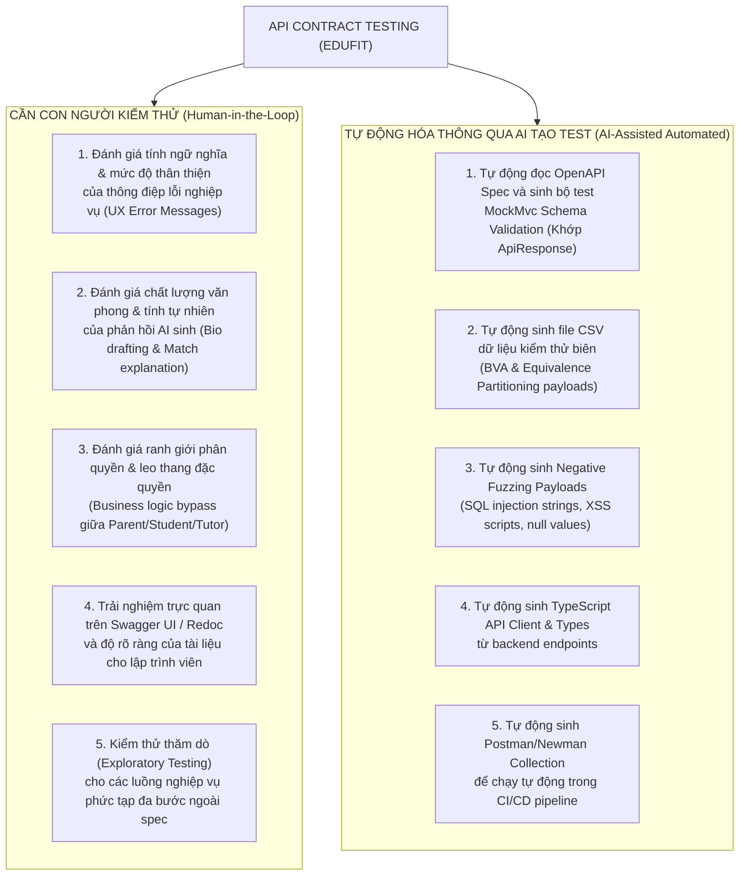

# ĐẶC TẢ CHI TIẾT KIỂM THỬ TRONG GIAI ĐOẠN PHÁT TRIỂN (IN-DEVELOPMENT TESTING SPECIFICATION)
## DỰ ÁN NỀN TẢNG EDUFIT (SWP391)

> **Mã tài liệu:** EDUFIT-IDTS-2026-V2.0  
> **Dự án:** EduFit — Nền tảng kết nối Gia sư và Học sinh / Phụ huynh  
> **Căn cứ nghiệp vụ & kỹ thuật:** [edufit_master_test_plan.md](file:///c:/University/Semester%205/SWP391/Edufit/EduFit/docs/edufit_master_test_plan.md), [software-architecture-design-specification.md](file:///c:/University/Semester%205/SWP391/Edufit/EduFit/docs/software-architecture-design-specification.md), [ADR-001](file:///c:/University/Semester%205/SWP391/Edufit/EduFit/docs/ADR-001-tech-stack.md), [ADR-002](file:///c:/University/Semester%205/SWP391/Edufit/EduFit/docs/ADR-002-multi-module-architecture.md), [iam-test-cases-specification.md](file:///c:/University/Semester%205/SWP391/Edufit/EduFit/docs/iam-test-cases-specification.md)  
> **Giai đoạn áp dụng:** Trong phát triển (In-Development Phase — Sprints 1..5)  
> **Phiên bản:** 2.0 (Bổ sung Frontend Testing, Code Quality Gates và Bản đồ Kỹ thuật Phần 3)  

---

## 1. Goal Description (Mục Tiêu & Định Hướng Giai Đoạn Trong Phát Triển)

Hệ thống EduFit hiện đang trong **Giai đoạn Lập trình & Ghép module (In-Development Phase)**. Để đảm bảo chất lượng phần mềm theo nguyên lý **Kiểm thử Trong-Ra (Inside-Out)** và phương pháp luận Agile Testing Quadrant Q1, tài liệu này thiết lập kế hoạch thực thi kỹ thuật chi tiết:

1. **Loại bỏ hoàn toàn Hardcode trong Unit Test (Cả Backend & Frontend):** 
   - Backend: Áp dụng bắt buộc mô hình **Data-Driven Testing (DDT)** thông qua JUnit 5 `@ParameterizedTest` kết hợp `@CsvFileSource` (đọc từ file CSV ngoại vi tại `src/test/resources/testdata/`) hoặc `@CsvSource`.
   - Frontend: Áp dụng `test.each` kết hợp Data Fixtures (JSON/CSV) cho kiểm thử Validation Schemas (Zod), Form inputs và UI states, tuyệt đối không hardcode dữ liệu đầu vào.
2. **Kế hoạch Sửa đổi & Nâng cấp Test cho các Module Hiện Tại:** Rà soát và tái cấu trúc test suite của 4 module đã có mã nguồn (`iam`, `profile`, `verification`, `platform/storage`) để đạt độ bao phủ phân tích biên (BVA), phân vùng tương đương (EP) và bảng quyết định.
3. **Đặc tả Chi Tiết Kiểm Thử Cho Các Feature Modules Tương Lai:** Thiết kế trước (Test-First Design) bộ kịch bản kiểm thử, máy trạng thái, thuật toán logic và cấu trúc file CSV cho các module chuẩn bị lập trình (`scheduling`, `connection`, `discovery`, `progress`, `review`, `notification`, `platform/ai`, `platform/audit`).
4. **Đặc Tả Frontend Unit & Component Testing (Next.js 16 + React 19):** Thiết lập kiến trúc kiểm thử giao diện với Vitest, React Testing Library, kiểm thử Client Components, Server Components, Custom Hooks và Form interactions.
5. **Thiết Lập Cổng Kiểm Soát Chất Lượng Mã Nguồn (Code Quality Gates):** Cấu hình chặt chẽ JaCoCo (ngưỡng tối thiểu $\ge 80\%$), ArchUnit, Spotless, Checkstyle, ESLint và TypeScript Compiler Check trong CI/CD pipeline.
6. **Bản Đồ Ứng Dụng Toàn Diện Các Kỹ Thuật Kiểm Thử Phần 3 (Master Test Plan):** Hiện thực hóa toàn bộ các kỹ thuật kiểm thử Hộp đen (EP, BVA, Decision Table, State Transition, Use Case), Hộp trắng (Statement, Branch, Path Coverage), Phi chức năng (Concurrency, Security, Storage Magic Bytes, Migration) và Kinh nghiệm (Error Guessing, Exploratory Testing).
7. **Chiến lược Kiểm thử Hợp đồng API (API Contract Testing):** Thiết lập quy chuẩn kiểm thử hợp đồng giao tiếp giữa Spring Boot Backend (`ApiResponse<T>`) và Next.js Frontend TypeScript types, **phân định rạch ròi** giữa:
   - Các nội dung **BẮT BUỘC CON NGƯỜI PHẢI TEST (Human Testing / Manual & Exploratory)**.
   - Các nội dung **TỰ ĐỘNG HÓA THÔNG QUA AI TẠO TEST (AI-Assisted Automated Testing)**.

---

## 2. Quy Chuẩn Kỹ Thuật: Unit Test Không Hardcode & Dữ Liệu Hóa Qua CSV / Data Fixtures

### 2.1. Tại sao phải loại bỏ Hardcode trong Unit Test?
* **Nhược điểm của Hardcode:** Làm mã kiểm thử cồng kềnh, khó bảo trì khi quy tắc nghiệp vụ thay đổi (ví dụ: đổi độ dài mật khẩu, đổi mức phí, đổi giới hạn ký tự), không bao phủ hết các giá trị biên (Boundary Values) và phân vùng tương đương (Equivalence Partitions).
* **Lợi ích của Data-Driven Testing (DDT):**
  - Tách rời mã logic kiểm thử khỏi dữ liệu kiểm thử.
  - Thêm một test case mới chỉ cần thêm một dòng trong file `.csv` mà không cần sửa code Java hay recompile.
  - Hỗ trợ chạy hàng chục kịch bản kiểm thử biên trong một phương thức `@ParameterizedTest` (Backend) hoặc `test.each` (Frontend) duy nhất.

### 2.2. Cấu trúc Tổ chức Thư Mục Test Data CSV & Fixtures

```
EduFit/
├── backend/
│   ├── modules/
│   │   ├── iam/src/test/resources/testdata/
│   │   │   ├── account-normalization-and-roles.csv
│   │   │   ├── account-lockout-scenarios.csv
│   │   │   └── password-policy-validation.csv
│   │   ├── profile/src/test/resources/testdata/
│   │   │   ├── student-profile-update.csv
│   │   │   └── tutor-availability-slots.csv
│   │   ├── verification/src/test/resources/testdata/
│   │   │   ├── credential-submission-rules.csv
│   │   │   └── verification-decision-matrix.csv
│   │   ├── scheduling/src/test/resources/testdata/
│   │   │   ├── conflict-policy-intervals.csv
│   │   │   └── session-state-transitions.csv
│   │   ├── connection/src/test/resources/testdata/
│   │   │   ├── link-invitation-rules.csv
│   │   │   └── connection-request-matrix.csv
│   │   ├── discovery/src/test/resources/testdata/
│   │   │   └── match-scorer-weight-dataset.csv
│   │   ├── progress/src/test/resources/testdata/
│   │   │   ├── progress-calculator-dataset.csv
│   │   │   └── session-note-bva.csv
│   │   └── review/src/test/resources/testdata/
│   │       └── review-rating-validation.csv
│   └── platform/
│       └── storage/src/test/resources/testdata/
│           └── magic-bytes-detection-matrix.csv
└── frontend/
    └── src/
        └── __tests__/
            ├── fixtures/
            │   ├── auth-validation-dataset.json
            │   ├── booking-form-fixtures.json
            │   └── error-messages-fixtures.json
            ├── components/
            ├── hooks/
            └── services/
```

---

## 3. Đặc Tả Kiểm Thử Frontend (Next.js 16 + React 19)

### 3.1. Tech Stack & Thư Viện Kiểm Thử Frontend
* **Test Runner & Assertion:** **Vitest** (tốc độ cao, tương thích ESM gốc của Next.js).
* **Component Testing:** **React Testing Library (RTL)** + **@testing-library/user-event** (kiểm thử hành vi người dùng, không kiểm thử implementation details).
* **Môi trường giả lập DOM:** **jsdom**.
* **Mocking Mạng & API:** **Mock Service Worker (MSW)** hoặc Vitest Spies cho `fetchApi`.

#### Cấu hình cài đặt `frontend/package.json` (devDependencies):
```json
{
  "devDependencies": {
    "vitest": "^3.0.0",
    "@testing-library/react": "^16.0.0",
    "@testing-library/dom": "^10.0.0",
    "@testing-library/user-event": "^14.5.0",
    "jsdom": "^25.0.0",
    "@vitejs/plugin-react": "^4.3.0"
  },
  "scripts": {
    "test": "vitest run",
    "test:watch": "vitest",
    "test:coverage": "vitest run --coverage",
    "type-check": "tsc --noEmit"
  }
}
```

---

### 3.2. Chiến Lược Kiểm Thử Các Tầng Frontend

```
KIẾN TRÚC TEST FRONTEND NEXT.JS 16:
├── 1. Validation Schemas (Zod / Logic) : Test độc lập, dùng test.each DDT (100% logic bao phủ).
├── 2. Custom Hooks (useAuth, useSession): Test qua renderHook() của RTL.
├── 3. Client Components (UI & Forms)   : Test tương tác người dùng, accessible queries, error feedback.
└── 4. API Services (authService)       : Test contract response, xử lý HTTP 400/401/409/500.
```

#### A. Kiểm thử Form Validation Không Hardcode với `test.each`:
Áp dụng cho schema xác thực đăng ký (`RegisterPayload`), đăng nhập (`LoginPayload`), đổi mật khẩu và đặt lịch:

* **File test mẫu: `frontend/src/__tests__/schemas/authValidation.test.ts`**
```typescript
import { describe, it, expect } from "vitest";
import { z } from "zod";

// Schema đăng ký khớp Business Rules BR-01, BR-02, BR-03
const registerSchema = z.object({
  email: z.string().trim().toLowerCase().email("Email không hợp lệ"),
  password: z
    .string()
    .min(8, "Mật khẩu tối thiểu 8 ký tự")
    .max(64, "Mật khẩu tối đa 64 ký tự")
    .regex(/[A-Za-z]/, "Phải chứa ít nhất 1 chữ cái")
    .regex(/[0-9]/, "Phải chứa ít nhất 1 chữ số"),
  fullName: z.string().trim().min(2, "Họ tên quá ngắn"),
  role: z.enum(["STUDENT", "PARENT", "TUTOR"]),
});

describe("Auth Validation Schemas (Data-Driven Testing)", () => {
  // Bộ dữ liệu test phân vùng tương đương (EP) & phân tích biên (BVA)
  const passwordCases = [
    { password: "Password123", valid: true, error: null, desc: "Mật khẩu mạnh hợp lệ" },
    { password: "Abc12345", valid: true, error: null, desc: "Đúng biên dưới 8 ký tự" },
    { password: "short1", valid: false, error: "Mật khẩu tối thiểu 8 ký tự", desc: "Dưới 8 ký tự" },
    { password: "OnlyLettersLong", valid: false, error: "Phải chứa ít nhất 1 chữ số", desc: "Không có số" },
    { password: "1234567890", valid: false, error: "Phải chứa ít nhất 1 chữ cái", desc: "Không có chữ" },
    { password: "a".repeat(65) + "1", valid: false, error: "Mật khẩu tối đa 64 ký tự", desc: "Vượt 64 ký tự" },
  ];

  it.each(passwordCases)("Kiểm tra mật khẩu: $desc ($password)", ({ password, valid, error }) => {
    const result = registerSchema.shape.password.safeParse(password);
    expect(result.success).toBe(valid);
    if (!valid && error) {
      expect(result.error?.issues[0].message).toBe(error);
    }
  });

  const roleCases = [
    { role: "STUDENT", valid: true },
    { role: "PARENT", valid: true },
    { role: "TUTOR", valid: true },
    { role: "ADMIN", valid: false }, // Cấm tự đăng ký ADMIN (BR-03)
    { role: "GUEST", valid: false },
  ];

  it.each(roleCases)("Kiểm tra hạn chế vai trò (BR-03): $role -> $valid", ({ role, valid }) => {
    const result = registerSchema.shape.role.safeParse(role);
    expect(result.success).toBe(valid);
  });
});
```

#### B. Kiểm thử Component Tương Tác Người Dùng (Client Component):
Kiểm thử trạng thái giao diện đăng nhập: Khi đang gửi request (Loading spinner, Disable button), khi đăng nhập thất bại (Alert thông báo lỗi), và khi đăng nhập thành công.

* **File test mẫu: `frontend/src/__tests__/components/LoginForm.test.tsx`**
```tsx
import { render, screen, waitFor } from "@testing-library/react";
import userEvent from "@testing-library/user-event";
import { describe, it, expect, vi } from "vitest";
import LoginPage from "@/app/login/page";
import { authService } from "@/services/auth";

vi.mock("@/services/auth", () => ({
  authService: {
    login: vi.fn(),
  },
}));

describe("LoginForm Component Testing", () => {
  it("Hiển thị lỗi khi người dùng gửi form rỗng", async () => {
    const user = userEvent.setup();
    render(<LoginPage />);

    const submitBtn = screen.getByRole("button", { name: /đăng nhập/i });
    await user.click(submitBtn);

    expect(await screen.findByText(/vui lòng nhập email/i)).toBeInTheDocument();
  });

  it("Khóa nút submit và hiển thị loading khi đang xử lý request", async () => {
    const user = userEvent.setup();
    // Giả lập API phản hồi chậm 200ms
    vi.mocked(authService.login).mockImplementation(
      () => new Promise((resolve) => setTimeout(resolve, 200))
    );

    render(<LoginPage />);

    await user.type(screen.getByLabelText(/email/i), "student@edufit.vn");
    await user.type(screen.getByLabelText(/mật khẩu/i), "Password123");
    
    const submitBtn = screen.getByRole("button", { name: /đăng nhập/i });
    await user.click(submitBtn);

    // Nút phải bị disabled trong khi đang loading để tránh duplicate click
    expect(submitBtn).toBeDisabled();
  });
});
```

---

## 4. Thiết Lập Cổng Kiểm Soát Chất Lượng Mã Nguồn (Code Quality Gates)

Để đảm bảo chất lượng kỹ thuật trong mọi lần build, dự án EduFit thiết lập **Code Quality Gates** tự động hóa hoàn toàn ở cả Backend và Frontend:

```mermaid
flowchart LR
    DEV["Developer Push Code / PR"] --> CI["GitHub Actions CI Pipeline"]
    
    subgraph GATE1 ["Gate 1: Static Code Quality"]
        Spotless["Spotless (Google Java Format)"]
        Checkstyle["Checkstyle (No Wildcard Imports)"]
        ESLint["ESLint (React / TypeScript Rules)"]
        TypeCheck["tsc --noEmit (0 Type Errors)"]
    end
    
    subgraph GATE2 ["Gate 2: Architecture & Structure"]
        ArchUnit["ArchUnit (Module Boundaries)"]
    end

    subgraph GATE3 ["Gate 3: Automated Tests & Coverage"]
        JUnit["JUnit 5 (Parallel Unit Tests)"]
        Vitest["Vitest (Frontend Components)"]
        JaCoCo["JaCoCo Quality Gate (Line >= 80%, Branch >= 80%)"]
    end

    CI --> GATE1 --> GATE2 --> GATE3 --> PASS["MERGE PULL REQUEST"]
    GATE1 -.->|Fail| BLOCKED["BLOCK MERGE"]
    GATE2 -.->|Fail| BLOCKED
    GATE3 -.->|Fail| BLOCKED
```



---

### 4.1. Backend Quality Gates

#### A. Cấu hình JaCoCo Code Coverage Gate (`backend/pom.xml`):
Cưỡng chế quy tắc: Quá trình build `mvn verify` sẽ bị **FAIL NGAY LẬP TỨC** nếu độ bao phủ dòng code (Line Coverage) hoặc độ bao phủ nhánh rẽ (Branch Coverage) thấp hơn **80%** đối với tầng `domain` và `application/service`.

```xml
<!-- Khai báo trong backend/pom.xml -->
<plugin>
  <groupId>org.jacoco</groupId>
  <artifactId>jacoco-maven-plugin</artifactId>
  <version>0.8.12</version>
  <executions>
    <execution>
      <goals>
        <goal>prepare-agent</goal>
      </goals>
    </execution>
    <execution>
      <id>report</id>
      <phase>test</phase>
      <goals>
        <goal>report</goal>
      </goals>
    </execution>
    <execution>
      <id>check-coverage-gate</id>
      <phase>verify</phase>
      <goals>
        <goal>check</goal>
      </goals>
      <configuration>
        <rules>
          <rule>
            <element>BUNDLE</element>
            <limits>
              <!-- Cổng kiểm soát độ bao phủ dòng tối thiểu 80% -->
              <limit>
                <counter>LINE</counter>
                <value>COVEREDRATIO</value>
                <minimum>0.80</minimum>
              </limit>
              <!-- Cổng kiểm soát độ bao phủ nhánh rẽ tối thiểu 80% -->
              <limit>
                <counter>BRANCH</counter>
                <value>COVEREDRATIO</value>
                <minimum>0.80</minimum>
              </limit>
            </limits>
          </rule>
        </rules>
      </configuration>
    </execution>
  </executions>
</plugin>
```

#### B. ArchUnit Architecture Gate:
Được kích hoạt tự động qua `ArchitectureTest.java` trong module `app`. Bất kỳ lập trình viên nào cố tình import entity hoặc service nội bộ của module khác thay vì gọi qua `*.api.XxxFacade` sẽ làm gãy build ngay lập tức.

#### C. Spotless & Checkstyle Gate:
* Tự động kiểm tra định dạng chuẩn Google Java Format.
* Cấm hoàn toàn wildcard import (`import vn.edufit.iam.infra.*`), cấm để sót `System.out.println` hoặc `e.printStackTrace()` trong mã nguồn sản phẩm.

---

### 4.2. Frontend Quality Gates
* **ESLint Flat Config (`eslint.config.mjs`):** Kiểm tra cú pháp, cấm sử dụng kiểu `any` tùy tiện, cấm vi phạm Rules of Hooks của React 19.
* **TypeScript Strict Compiler Gate:** Lệnh `npm run type-check` (`tsc --noEmit`) phải kết thúc với mã thoát `0` (Zero Type Errors). Không cho phép bất kỳ lỗi type casting nào lọt vào nhánh chính.

---

## 5. Bản Đồ Ứng Dụng Toàn Diện Các Kỹ Thuật Kiểm Thử Phần 3 (Master Test Plan) Vào Giai Đoạn Phát Triển

Dưới đây là ma trận ánh xạ chi tiết toàn bộ các kỹ thuật kiểm thử trong Phần 3 của [edufit_master_test_plan.md](file:///c:/University/Semester%205/SWP391/Edufit/EduFit/docs/edufit_master_test_plan.md) vào từng phân hệ cụ thể của EduFit:

```
+---------------------------------------------------------------------------------------------------------------+
|                       BẢN ĐỒ KỸ THUẬT KIỂM THỬ GIAI ĐOẠN TRONG PHÁT TRIỂN (EDUFIT)                           |
+--------------------------+--------------------------------------------------+---------------------------------+
| Kỹ thuật kiểm thử        | Vị trí / Đối tượng áp dụng tại EduFit            | Hình thức thực thi chi tiết     |
+--------------------------+--------------------------------------------------+---------------------------------+
| 1. KỸ THUẬT HỘP ĐEN      |                                                  |                                 |
| • Phân vùng tương đương  | Password Policy, Rating (1..5), File types       | @ParameterizedTest + CSV        |
| • Phân tích giá trị biên | SessionNote (5000 chars), Lockout (5 attempts),  | @ParameterizedTest + CSV        |
|                          | Sliding session (60m), Token reset (30m)         |                                 |
| • Bảng quyết định        | Phân quyền RBAC, Ma trận duyệt bằng cấp,         | Decision Table CSV              |
|                          | Ma trận liên kết phụ huynh - học sinh            |                                 |
| • Chuyển trạng thái      | Máy trạng thái Session (8 bước), Verification    | State Transition Test + CSV     |
|                          | (4 bước), LinkInvitation (4 bước)                |                                 |
| • Kiểm thử ca sử dụng    | Toàn bộ 28 Use Cases (UC1.1 đến UC6.3)           | Integration Slice & E2E Flows   |
+--------------------------+--------------------------------------------------+---------------------------------+
| 2. KỸ THUẬT HỘP TRẮNG    |                                                  |                                 |
| • Statement Coverage     | 100% các class trong Domain & Application        | JaCoCo Line Gate >= 80%         |
| • Branch Coverage        | Mọi khối if-else, switch trong Service/Policy    | JaCoCo Branch Gate >= 80%       |
| • Path Coverage          | ConflictPolicy, MatchScorer, ProgressCalculator  | 100% Independent Paths (POJO)   |
+--------------------------+--------------------------------------------------+---------------------------------+
| 3. PHI CHỨC NĂNG         |                                                  |                                 |
| • Concurrency & Race     | NFR-17: Đặt lịch đồng thời (Double-booking)      | CountDownLatch & Testcontainers |
| • Security Penetration   | NFR-01..06: Timing Attack, Argon2id, Session     | DummyVerify Mock, Cookie tests  |
| • Storage Magic Bytes    | NFR-08: Apache Tika quét header thực tế file     | Tika file detection tests       |
| • Migration Integrity    | Flyway scripts sạch, nâng cấp & phục hồi schema  | FlywayMigrationIT (Postgres 17) |
| • Performance Benchmark  | NFR-09/14: p95 < 300ms, AI timeout 15s           | k6 stress test script           |
+--------------------------+--------------------------------------------------+---------------------------------+
| 4. DỰA TRÊN KINH NGHIỆM  |                                                  |                                 |
| • Error Guessing         | Unicode email trim, lệch múi giờ UTC/GMT+7,     | Bộ test Negative Payloads       |
|                          | session hijacking, null pointer trong JSON DTO   |                                 |
| • Exploratory Testing    | Thao tác ngược quy trình, double submit form     | Time-boxed QA Charter (60 mins) |
+--------------------------+--------------------------------------------------+---------------------------------+
```

---

## 6. Kế Hoạch Sửa Đổi & Refactor Các Modules Hiện Tại (Current Modules)

Dưới đây là chi tiết các file test hiện có cần sửa đổi, các test case cần bổ sung và thiết kế bộ dữ liệu CSV tương ứng:

---

### 6.1. Module `iam` (Identity & Access Management)

#### A. Các File Cần Sửa Đổi:
1. **`PasswordPolicyTest.java`:**  
   * *Hiện trạng:* Đang hardcode các chuỗi `"Password123@"`, `"Abc12345"`, `"OnlyLettersLong"`, `"1234567890"`.
   * *Nâng cấp:* Chuyển sang `@ParameterizedTest` với `@CsvFileSource(resources = "/testdata/password-policy-validation.csv", numLinesToSkip = 1)`.
2. **`AccountTest.java`:**  
   * *Hiện trạng:* Hardcode các trường email, tên, số lần nhập sai liên tiếp trong các vòng lặp `for`.
   * *Nâng cấp:* Sử dụng CSV mô tả các trạng thái tài khoản, số lần sai và thời gian trôi qua.
3. **`AccountTokenTest.java` & `AuthenticateAccountServiceTest.java`:**  
   * *Nâng cấp:* Thay thế các giá trị token/email giả lập bằng bộ dữ liệu CSV mô phỏng tình huống token hết hạn, token đã dùng và chống Timing Attack.

#### B. Thiết Kế Bộ Dữ Liệu CSV Cho `iam`:

* **File: `backend/modules/iam/src/test/resources/testdata/password-policy-validation.csv`**
```csv
# testCaseId,rawPassword,expectedValid,expectedErrorCode,description
TC_PW_01,Abc12345,true,NONE,Mật khẩu chuẩn vừa đủ 8 ký tự có chữ và số
TC_PW_02,Password123@,true,NONE,Mật khẩu mạnh có ký tự đặc biệt
TC_PW_03,StrongPass999,true,NONE,Mật khẩu hợp lệ 13 ký tự
TC_PW_04,,false,VALIDATION_FAILED,Mật khẩu rỗng
TC_PW_05,   ,false,VALIDATION_FAILED,Mật khẩu toàn khoảng trắng
TC_PW_06,Abc1234,false,VALIDATION_FAILED,Biên dưới - 1: Chỉ 7 ký tự
TC_PW_07,short1,false,VALIDATION_FAILED,Độ dài 6 ký tự
TC_PW_08,OnlyLettersLong,false,VALIDATION_FAILED,Toàn chữ cái không có chữ số
TC_PW_09,1234567890,false,VALIDATION_FAILED,Toàn chữ số không có chữ cái
TC_PW_10,!@#$%^&*()_+~,false,VALIDATION_FAILED,Toàn ký tự đặc biệt không có chữ và số
TC_PW_11,Abcdefghijk1234567890Abcdefghijk1234567890Abcdefghijk12345678901234,true,NONE,Biên trên: Đúng 64 ký tự hợp lệ
TC_PW_12,Abcdefghijk1234567890Abcdefghijk1234567890Abcdefghijk123456789012345,false,VALIDATION_FAILED,Biên trên + 1: 65 ký tự vượt giới hạn
```

* **Mã Nguồn Test Sau Khi Sửa (`PasswordPolicyTest.java`):**
```java
@ParameterizedTest(name = "[{index}] {0} - Input: \"{1}\" -> Valid: {2}")
@CsvFileSource(resources = "/testdata/password-policy-validation.csv", numLinesToSkip = 1)
@DisplayName("BR-02: Kiểm thử Chính sách Mật khẩu qua dữ liệu CSV")
void shouldValidatePasswordRulesFromCsv(
    String testCaseId,
    String rawPassword,
    boolean expectedValid,
    String expectedErrorCode,
    String description
) {
    String input = rawPassword == null ? "" : rawPassword;
    if (expectedValid) {
        assertDoesNotThrow(() -> passwordPolicy.validate(input));
    } else {
        InvalidOperationException ex = assertThrows(
            InvalidOperationException.class,
            () -> passwordPolicy.validate(input)
        );
        assertEquals(ErrorCode.valueOf(expectedErrorCode), ex.getErrorCode());
    }
}
```

* **File: `backend/modules/iam/src/test/resources/testdata/account-normalization-and-roles.csv`**
```csv
# testCaseId,rawEmail,rawFullName,role,expectedNormalizedEmail,expectedFullName,shouldSucceed,expectedErrorCode
TC_ACC_01,  Student@EduFit.vn  ,  Nguyen Van A  ,STUDENT,student@edufit.vn,Nguyen Van A,true,NONE
TC_ACC_02,PARENT.USER@GMAIL.COM,Tran Thi B,PARENT,parent.user@gmail.com,Tran Thi B,true,NONE
TC_ACC_03,Tutor_Le@Yahoo.com  ,  Le Van C  ,TUTOR,tutor_le@yahoo.com,Le Van C,true,NONE
TC_ACC_04,admin@edufit.vn,Admin Master,ADMIN,admin@edufit.vn,Admin Master,false,FORBIDDEN
```

---

### 6.2. Module `platform/storage` (Credential Storage & Magic Bytes)

#### A. Các File Cần Sửa Đổi:
1. **`FileValidationServiceTest.java`:**  
   * *Hiện trạng:* Hardcode các mảng byte header PDF, HTML script và max file size.
   * *Nâng cấp:* Đọc toàn bộ ma trận định dạng tệp và kiểm tra Magic Bytes từ CSV.
2. **`LocalCredentialStorageServiceTest.java`:**  
   * *Nâng cấp:* Thử nghiệm hàng loạt các mẫu tấn công Path Traversal (`../`, `..\`, `%2e%2e%2f`) qua CSV.

#### B. Thiết Kế Bộ Dữ Liệu CSV Cho `platform/storage`:

* **File: `backend/platform/storage/src/test/resources/testdata/magic-bytes-detection-matrix.csv`**
```csv
# testCaseId,rawFileName,declaredContentType,headerType,expectedSanitizedName,expectedMime,isValid,expectedErrorCode
TC_STO_01,../Bang cap.pdf,application/octet-stream,PDF_HEADER,Bang_cap.pdf,application/pdf,true,NONE
TC_STO_02,IELTS_Certificate.jpg,image/jpeg,JPEG_HEADER,IELTS_Certificate.jpg,image/jpeg,true,NONE
TC_STO_03,degree_scan.png,image/png,PNG_HEADER,degree_scan.png,image/png,true,NONE
TC_STO_04,webshell.pdf,application/pdf,SCRIPT_HEADER,webshell.pdf,text/plain,false,INVALID_FILE_TYPE
TC_STO_05,trojan.exe,application/x-msdownload,EXE_HEADER,trojan.exe,application/x-dosexec,false,INVALID_FILE_TYPE
TC_STO_06,fake_image.jpg,image/jpeg,HTML_HEADER,fake_image.jpg,text/html,false,INVALID_FILE_TYPE
```

---

### 6.3. Module `profile` (Tutor & Student Profiles)

#### A. Các File Cần Sửa Đổi:
1. **`StudentProfileServiceTest.java`:**  
   * *Hiện trạng:* Hardcode tên khu vực "Hà Nội", "TP.HCM" và ID cấp học.
   * *Nâng cấp:* Dữ liệu hóa thông tin cập nhật hồ sơ qua CSV, kiểm tra phân vùng hoàn thành hồ sơ (`profileComplete = true/false`).
2. **`TutorProfileServiceTest.java`:**  
   * *Hiện trạng:* Hardcode bio, hourly rate, slot thứ trong tuần.
   * *Nâng cấp:* CSV hóa các slot lịch rảnh hàng tuần (`dayOfWeek, startMinute, endMinute, isValid`).

* **File: `backend/modules/profile/src/test/resources/testdata/tutor-availability-slots.csv`**
```csv
# testCaseId,dayOfWeek,startTime,endTime,isValid,expectedErrorCode,description
TC_SLOT_01,MONDAY,08:00,10:00,true,NONE,Slot 2 tiếng buổi sáng hợp lệ
TC_SLOT_02,WEDNESDAY,14:30,16:30,true,NONE,Slot 2 tiếng buổi chiều hợp lệ
TC_SLOT_03,FRIDAY,10:00,09:00,false,VALIDATION_FAILED,Thời gian kết thúc trước thời gian bắt đầu
TC_SLOT_04,SUNDAY,08:00,08:00,false,VALIDATION_FAILED,Thời gian bắt đầu bằng thời gian kết thúc
TC_SLOT_05,SATURDAY,23:00,01:00,false,VALIDATION_FAILED,Slot qua đêm qua ngày khác không hợp lệ
```

---

### 6.4. Module `verification` (Tutor Credentials & Admin Review)

#### A. Các File Cần Sửa Đổi:
1. **`AdminVerificationServiceTest.java` & `TutorVerificationServiceTest.java`:**  
   * *Nâng cấp:* Kiểm thử ma trận duyệt/từ chối hồ sơ xác minh qua CSV (Bao phủ các lý do từ chối, trạng thái chuyển đổi từ `PENDING` $\rightarrow$ `APPROVED` hoặc `REJECTED`).

* **File: `backend/modules/verification/src/test/resources/testdata/verification-decision-matrix.csv`**
```csv
# testCaseId,initialStatus,adminAction,rejectionReason,expectedFinalStatus,shouldUpdateTutorStatus,expectedErrorCode
TC_VER_01,PENDING,APPROVE,,APPROVED,true,NONE
TC_VER_02,PENDING,REJECT,Bằng cấp mờ không rõ chữ,REJECTED,false,NONE
TC_VER_03,PENDING,REJECT,,REJECTED,false,VALIDATION_FAILED
TC_VER_04,APPROVED,APPROVE,,APPROVED,false,INVALID_OPERATION
TC_VER_05,REJECTED,APPROVE,,REJECTED,false,INVALID_OPERATION
```

---

## 7. Đặc Tả Chi Tiết Kiểm Thử Cho Các Feature Modules Tương Lai (Future Feature Modules)

Dưới đây là kế hoạch thiết kế kiểm thử chi tiết trước khi triển khai code (Test-First Blueprint) cho các module sắp phát triển:

---

### 7.1. Module `scheduling` (Quản Lý Lịch Học & Giải Quyết Xung Đột)

Module này có rủi ro nghiệp vụ cao nhất toàn hệ thống. Cần áp dụng kiến trúc **DDD Clean Architecture (Loại 2)** với thư mục `domain/` viết bằng **Java thuần túy (POJO)**.

#### A. Các Kỹ Thuật Kiểm Thử Áp Dụng:
1. **100% Path Coverage & BVA cho `ConflictPolicy` (POJO):** Kiểm thử thuật toán phát hiện chồng lấn giữa các khoảng thời gian `TimeInterval`.
2. **State Transition Testing:** Kiểm thử máy trạng thái 8 bước của `tutoring_session` (BR-41..48).
3. **Concurrency Testing:** Kiểm thử tranh chấp đồng thời 50-100 Virtual Users đặt cùng 1 slot (NFR-17).

#### B. Thiết Kế Bộ Dữ Liệu CSV Cho `scheduling`:

* **File: `backend/modules/scheduling/src/test/resources/testdata/conflict-policy-intervals.csv`**
```csv
# testCaseId,existingStart,existingEnd,newStart,newEnd,expectedConflict,description
TC_CONF_01,14:00,16:00,14:00,16:00,true,Trùng khớp hoàn toàn cùng khung giờ
TC_CONF_02,14:00,16:00,14:30,15:30,true,Khung giờ mới nằm lọt hoàn toàn bên trong
TC_CONF_03,14:00,16:00,13:30,16:30,true,Khung giờ mới bao trùm hoàn toàn khung giờ cũ
TC_CONF_04,14:00,16:00,13:30,14:30,true,Chồng lấn một phần ở đầu (Overlaps start)
TC_CONF_05,14:00,16:00,15:30,16:30,true,Chồng lấn một phần ở cuối (Overlaps end)
TC_CONF_06,14:00,16:00,12:00,14:00,false,Biên kề nhau: Kết thúc cũ đúng bằng bắt đầu mới (Không trùng)
TC_CONF_07,14:00,16:00,16:00,18:00,false,Biên kề nhau: Kết thúc mới đúng bằng bắt đầu cũ (Không trùng)
TC_CONF_08,14:00,16:00,16:30,18:00,false,Cách xa nhau hoàn toàn (Không trùng)
```

* **File: `backend/modules/scheduling/src/test/resources/testdata/session-state-transitions.csv`**
```csv
# testCaseId,currentState,triggerAction,actorRole,expectedNextState,isAllowed,expectedErrorCode
TC_STATE_01,REQUESTED,ACCEPT,TUTOR,ACCEPTED,true,NONE
TC_STATE_02,REQUESTED,REJECT,TUTOR,REJECTED,true,NONE
TC_STATE_03,REQUESTED,CANCEL,STUDENT,CANCELLED,true,NONE
TC_STATE_04,REQUESTED,COMPLETE,TUTOR,REQUESTED,false,ILLEGAL_STATE_TRANSITION
TC_STATE_05,ACCEPTED,PROPOSE_RESCHEDULE,STUDENT,RESCHEDULE_PROPOSED,true,NONE
TC_STATE_06,ACCEPTED,COMPLETE,TUTOR,COMPLETED,true,NONE
TC_STATE_07,ACCEPTED,REPORT_NO_SHOW,TUTOR,NO_SHOW,true,NONE
TC_STATE_08,COMPLETED,PROPOSE_RESCHEDULE,STUDENT,COMPLETED,false,ILLEGAL_STATE_TRANSITION
TC_STATE_09,CANCELLED,ACCEPT,TUTOR,CANCELLED,false,ILLEGAL_STATE_TRANSITION
```

---

### 7.2. Module `connection` (Liên Kết Phụ Huynh - Con & Đề Nghị Ghép Cặp)

#### A. Kỹ Thuật Kiểm Thử:
1. **Decision Table Testing:** Ma trận quyền hạn giữa Parent và Student khi gửi đề nghị ghép cặp.
2. **Token Lifecycle Testing:** Mã lời mời kết nối phụ huynh (`link_invitation`) với TTL 48 giờ.

#### B. Thiết Kế Bộ Dữ Liệu CSV Cho `connection`:

* **File: `backend/modules/connection/src/test/resources/testdata/link-invitation-rules.csv`**
```csv
# testCaseId,invitationStatus,hoursElapsed,targetUserRole,isAllowedToConfirm,expectedErrorCode
TC_INV_01,PENDING,24,STUDENT,true,NONE
TC_INV_02,PENDING,47,STUDENT,true,NONE
TC_INV_03,PENDING,49,STUDENT,false,INVITATION_EXPIRED
TC_INV_04,ACCEPTED,1,STUDENT,false,INVITATION_ALREADY_USED
TC_INV_05,REVOKED,5,STUDENT,false,INVITATION_REVOKED
TC_INV_06,PENDING,10,TUTOR,false,FORBIDDEN_ROLE
```

---

### 7.3. Module `discovery` (Tìm Kiếm, Bộ Lọc & Thuật Toán Gợi Ý Gia Sư)

Áp dụng DDD Clean Architecture với class thuần POJO `MatchScorer.java`.

#### A. Kỹ Thuật Kiểm Thử:
* **White-box Path Coverage & BVA:** Đảm bảo công thức chấm điểm tương thích kết hợp các trọng số:
  $$\text{Score} = w_1 \cdot \text{SubjectMatch} + w_2 \cdot \text{LevelMatch} + w_3 \cdot \text{AreaMatch} + w_4 \cdot \text{RatingScore}$$

* **File: `backend/modules/discovery/src/test/resources/testdata/match-scorer-weight-dataset.csv`**
```csv
# testCaseId,sameSubject,sameLevel,sameArea,ratingAvg,reviewCount,expectedScoreMin,expectedScoreMax,description
TC_SCO_01,true,true,true,5.0,20,95.0,100.0,Khớp hoàn hảo mọi tiêu chí và rating tối đa
TC_SCO_02,true,true,false,4.5,10,75.0,85.0,Khớp môn và cấp học khác khu vực địa lý
TC_SCO_03,false,true,true,5.0,10,0.0,30.0,Khác môn học (Trọng số môn học chi phối mạnh)
TC_SCO_04,true,true,true,0.0,0,60.0,70.0,Khớp tiêu chí nhưng gia sư mới chưa có rating
```

---

### 7.4. Module `progress` (Lộ Trình Học Tập & Ghi Chú Buổi Học)

Áp dụng DDD Clean Architecture với class thuần POJO `ProgressCalculator.java`.

#### A. Kỹ Thuật Kiểm Thử:
1. **BVA cho `SessionNote`:** Giới hạn $0 \le \text{length} \le 5000$ ký tự (BR-47), tính bất biến (không sửa sau khi lưu).
2. **Equivalence Partitioning cho `ProgressCalculator`:** Tính % tiến độ từ các cột mốc `Milestone`.

* **File: `backend/modules/progress/src/test/resources/testdata/session-note-bva.csv`**
```csv
# testCaseId,charLength,isNoteEmpty,isValid,expectedErrorCode,description
TC_NOTE_01,0,true,true,NONE,Ghi chú rỗng được phép hợp lệ
TC_NOTE_02,1,false,true,NONE,Ghi chú 1 ký tự hợp lệ
TC_NOTE_03,2500,false,true,NONE,Ghi chú độ dài trung bình hợp lệ
TC_NOTE_04,5000,false,true,NONE,Biên trên: Đúng 5000 ký tự hợp lệ
TC_NOTE_05,5001,false,false,VALIDATION_FAILED,Biên trên + 1: 5001 ký tự bị từ chối
```

---

### 7.5. Module `review` (Đánh Giá Gia Sư & Chống Spam)

#### A. Kỹ Thuật Kiểm Thử:
* **EP & BVA cho Rating:** Rating hợp lệ từ 1 đến 5 (BR-57).
* **Unique Constraint IT:** Đảm bảo duy nhất 1 review giữa 1 học sinh và 1 gia sư (`UNIQUE(tutor_id, student_id)`).

* **File: `backend/modules/review/src/test/resources/testdata/review-rating-validation.csv`**
```csv
# testCaseId,ratingValue,commentLength,isValid,expectedErrorCode
TC_REV_01,1,50,true,NONE
TC_REV_02,5,100,true,NONE
TC_REV_03,3,,true,NONE
TC_REV_04,0,50,false,INVALID_RATING
TC_REV_05,6,50,false,INVALID_RATING
TC_REV_06,-1,50,false,INVALID_RATING
TC_REV_07,5,1001,false,VALIDATION_FAILED
```

---

### 7.6. Module `notification` & `platform/ai` & `platform/audit`

* **`notification`:** Integration test lắng nghe Domain Events qua `@RecordApplicationEvents` của Spring Test.
* **`platform/ai`:** Kỹ thuật Mocking WebClient gọi LLM (Gemini API) với kịch bản trả về thành công trong 3s, timeout sau 15s (NFR-10), và ghi nhận chi phí vào `ai_request_log`.
* **`platform/audit`:** Unit & Slice test xác minh mọi sự kiện nhạy cảm (đổi mật khẩu, khóa tài khoản, duyệt hồ sơ) đều sinh bản ghi `audit_log`.

---

## 8. Kiểm Thử Hợp Đồng API (API Contract Testing) & Ma Trận Phân Định Trách Nhiệm

Kiểm thử hợp đồng API nhằm bảo đảm Backend Spring Boot và Frontend Next.js đồng bộ 100% về cấu trúc Request/Response (`ApiResponse<T>`, `ApiError`), mã trạng thái HTTP, và các trường dữ liệu bắt buộc.

```
MÔ HÌNH HỢP ĐỒNG API TẠI EDUFIT:
[Spring Boot OpenAPI Spec] ──(OpenAPI Generator)──> [Next.js Generated TypeScript Interfaces]
          │                                                                 │
          ▼                                                                 ▼
[Backend Contract Test (MockMvc)]                         [Frontend Mock Service Worker (MSW)]
```

Dưới đây là ma trận phân định chi tiết những nội dung **Cần con người kiểm thử thủ công** và những nội dung **Có thể tự động hóa thông qua AI tạo test**:



---

### 8.1. Bảng Chi Tiết: Các Hạng Mục CẦN CON NGƯỜI TEST (Human Testing)

| # | Hạng mục kiểm thử hợp đồng API | Lý do bắt buộc phải có con người | Cách thức thực hiện |
|---|---|---|---|
| **H1** | **Tính Thấu Cảm & Rõ Ràng của Thông Điệp Lỗi (`ApiError`)** | Máy móc chỉ kiểm tra mã lỗi `SCHEDULE_CONFLICT`, nhưng con người cần đánh giá xem câu thông báo tiếng Việt có giúp người dùng hiểu tại sao họ bị trùng lịch và hướng dẫn họ chọn giờ khác hay không. | Tester/PO kiểm tra trực tiếp trên giao diện màn hình hoặc Postman. |
| **H2** | **Đánh Giá Chất Lượng Nội Dung Do AI Sinh Ra (UC1.7, UC2.5)** | AI có thể sinh JSON hợp lệ đúng schema nhưng nội dung tiểu sử gia sư (Bio) có thể bị ảo giác (hallucination), không đúng ngữ cảnh sư phạm hoặc văn phong không chuyên nghiệp. | QA / Chuyên viên nghiệp vụ đánh giá theo tiêu chí rubrics chất lượng văn bản. |
| **H3** | **Kiểm Thử Logic Nghiệp Vụ Chéo (Multi-Role Privilege Bypass)** | Các lỗ hổng logic phức tạp (ví dụ: Phụ huynh A cố tình đổi lịch của lớp học mà con mình không tham gia, hoặc Học sinh cố tình nộp đơn xác minh gia sư). AI tự động khó phát hiện nếu logic phân quyền bị hổng ở tầng nghiệp vụ. | Security QA thực hiện kiểm thử xâm nhập thủ công (Manual Penetration Testing). |
| **H4** | **Đánh Giá Tài Liệu Swagger UI & OpenAPI Specification** | Kiểm tra xem mô tả các tham số query, định dạng ngày tháng (`Asia/Ho_Chi_Minh` vs `UTC`), các mã ví dụ mẫu (Sample Payloads) có đủ trực quan và dễ hiểu cho đội Frontend hay không. | Tech Lead / Frontend Lead review tài liệu API trước mỗi Sprint. |
| **H5** | **Kiểm Thử Thăm Dò Khám Phá (Exploratory Testing)** | Tìm kiếm các hành vi bất thường khi người dùng cố tình thao tác ngược quy trình thông thường (ví dụ: vừa nhấn đồng ý vừa nhấn hủy, tải lên file ảnh bị hỏng cấu trúc header). | Tester thực hiện các phiên Exploratory session 60 phút. |

---

### 8.2. Bảng Chi Tiết: Các Hạng Mục TỰ ĐỘNG HÓA THÔNG QUA AI TẠO TEST (AI-Assisted Testing)

| # | Hạng mục kiểm thử hợp đồng API | Cơ chế AI hỗ trợ tạo test | Công cụ & Mã kiểm thử tự động |
|---|---|---|---|
| **A1** | **Khớp Cấu Trúc Khung Chuẩn `ApiResponse<T>`** | AI tự động phân tích cấu trúc Controller và sinh mã kiểm thử kiểm tra `success: boolean`, `data: object`, `error: object`, `timestamp: string`. | Spring MockMvc + JsonPath:  <br>`jsonPath("$.success").isBoolean()` |
| **A2** | **Tự Động Sinh Bộ Dữ Liệu CSV Cho BVA & EP** | Prompt AI đọc các annotation Bean Validation (`@Size(min=8, max=64)`, `@Min(1)`, `@Max(5)`) để tự động tạo ra hàng chục dòng test data CSV chuẩn xác. | AI sinh trực tiếp file `.csv` tại `src/test/resources/testdata/`. |
| **A3** | **Kiểm Thử Fuzzing & Tải Trọng Độc Hại (Security Fuzzing)** | AI tự động sinh các payload chứa SQL Injection (`' OR 1=1 --`), XSS (`<script>alert(1)</script>`), Unicode tràn bộ nhớ, chuỗi null để thử độ bền của API. | JUnit 5 `@ParameterizedTest` đọc bộ test fuzzing CSV. |
| **A4** | **Đồng Bộ Schema Giữa Backend và Frontend TypeScript** | AI sinh các script kiểm tra xem field nào trên Backend bị đổi tên hoặc xóa bỏ mà Frontend chưa cập nhật, tránh lỗi runtime trên Next.js. | TypeScript compiler check (`tsc --noEmit`) kết hợp OpenAPI generator. |
| **A5** | **Tự Động Sinh Regression Test Collection** | AI chuyển đổi toàn bộ đặc tả API thành Postman/Newman Collection có assertions tự động về Status Code và Response Time. | Newman CLI chạy tự động trong GitHub Actions workflow. |

---

## 9. Proposed Changes (Danh Mục Kế Hoạch Thay Đổi & Triển Khai)

Dưới đây là các đầu việc triển khai cụ thể được chia theo từng nhóm công việc:

### Nhóm 1: Cấu hình Testing & Quality Gate cho Frontend (Next.js)
* [x] Cài đặt Vitest, React Testing Library, user-event, jsdom vào `frontend/package.json`.
* [x] Tạo file cấu hình `vitest.config.ts` hỗ trợ path alias `@/*`.
* [x] Tạo thư mục `frontend/src/__tests__/fixtures/` và viết test parameterized cho auth/booking schemas.
* [x] Cấu hình script `npm run type-check` và bổ sung vào CI workflow.

### Nhóm 2: Cấu hình Quality Gate cho Backend (Maven)
* [x] Bổ sung cấu hình `jacoco-maven-plugin` vào `backend/pom.xml` với rule `minimum 0.80` cho LINE và BRANCH coverage.
* [x] Kiểm tra lệnh `mvn clean verify` để kích hoạt JaCoCo check gate.

### Nhóm 3: Tái cấu trúc (Refactor) Test Suite của các Module Hiện Tại
* [ ] Tạo thư mục `src/test/resources/testdata/` trong các module `iam`, `profile`, `verification`, `platform/storage`.
* [ ] Chuyển đổi `PasswordPolicyTest.java` và `AccountTest.java` sang `@ParameterizedTest` + CSV.
* [ ] Chuyển đổi `FileValidationServiceTest.java` sang ma trận Magic Bytes CSV.
* [ ] Chuyển đổi `StudentProfileServiceTest.java` & `TutorProfileServiceTest.java` sang CSV.

### Nhóm 4: Chuẩn bị Dữ liệu & Kịch bản Test-First cho các Module Tương Lai
* [ ] Module `scheduling`: Chuẩn bị file CSV kiểm tra xung đột `conflict-policy-intervals.csv` và máy trạng thái `session-state-transitions.csv`.
* [ ] Module `connection`: Chuẩn bị file CSV kiểm tra token lời mời `link-invitation-rules.csv`.
* [ ] Module `discovery`: Chuẩn bị bộ trọng số CSV `match-scorer-weight-dataset.csv`.
* [ ] Module `progress`: Chuẩn bị bộ test BVA `session-note-bva.csv` và `progress-calculator-dataset.csv`.
* [ ] Module `review`: Chuẩn bị bộ test rating `review-rating-validation.csv`.

---

## 10. Verification Plan (Kế Hoạch Xác Minh Hoàn Thành)

### 10.1. Kiểm thử Tự Động (Automated Verification)
Thực thi toàn bộ bộ test suite trên Backend và Frontend:
```powershell
# 1. Chạy kiểm tra Frontend Unit & Component Tests:
cd frontend
npm run test
npm run type-check
cd ..

# 2. Chạy kiểm thử Backend với các test CSV Parameterized:
.\mvnw.cmd test -pl modules/iam,modules/profile,modules/verification,platform/storage

# 3. Chạy kiểm tra ranh giới kiến trúc bằng ArchUnit:
.\mvnw.cmd test -pl app -Dtest=ArchitectureTest

# 4. Chạy toàn bộ verify để kích hoạt JaCoCo Quality Gate (Yêu cầu >= 80% coverage):
.\mvnw.cmd clean verify
```
* **Tiêu chí thành công:**
  - 100% test cases parameterized qua CSV và `test.each` chạy xanh (Pass).
  - Không còn bất kỳ test case nào chứa hardcode giá trị kiểm thử.
  - Tỉ lệ bao phủ mã nguồn JaCoCo đạt $\ge 80\%$.
  - 0 lỗi TypeScript compilation (`tsc --noEmit`).

### 10.2. Kiểm thử Thủ Công (Manual Verification)
* **Xác minh file CSV & Fixtures:** Mở từng file `.csv` trong `src/test/resources/testdata/` và `.json` trong `frontend/src/__tests__/fixtures/` để đảm bảo định dạng chuẩn, có header và chú thích rõ ràng.
* **Review API Contract Human Checklist:** Thực hiện rà soát thông điệp lỗi của các API và chất lượng nội dung văn phong do AI sinh ra.
