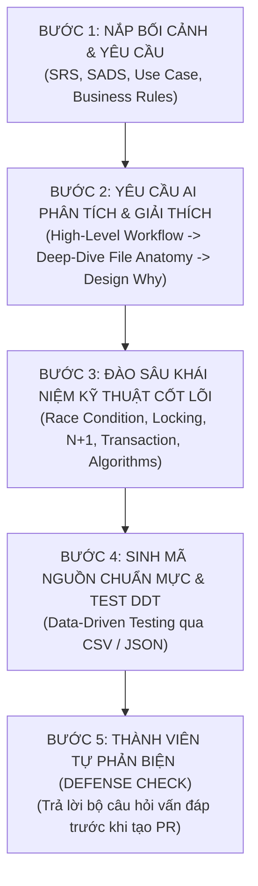
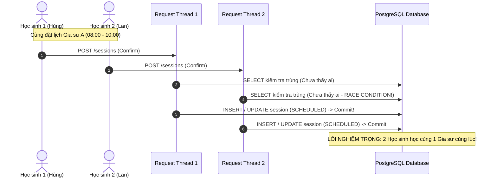
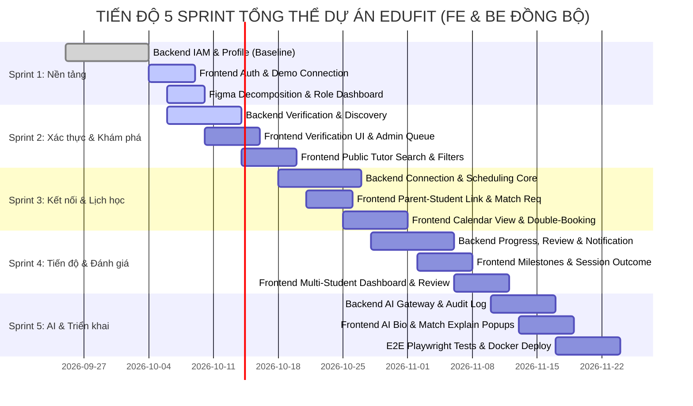

# KẾ HOẠCH TỔNG THỂ 5 SPRINT & KHUNG PHƯƠNG PHÁP LUẬN LẬP TRÌNH VỪA HỌC VỪA LÀM VỚI AI (EDUFIT MASTER ROADMAP & AI-ASSISTED LEARNING PROTOCOL)

> **Mã tài liệu:** EDUFIT-MSP-AI-2026-V1.0  
> **Dự án:** EduFit — Nền tảng Gia sư THCS (SWP391 - Semester 5)  
> **Tài liệu tham chiếu:** [ADR-001 (Tech Stack)](file:///c:/University/Semester%205/SWP391/Edufit/EduFit/docs/ADR-001-tech-stack.md), [ADR-002 (Multi-Module Architecture)](file:///c:/University/Semester%205/SWP391/Edufit/EduFit/docs/ADR-002-multi-module-architecture.md), [SADS (Software Architecture Design Specification)](file:///c:/University/Semester%205/SWP391/Edufit/EduFit/docs/software-architecture-design-specification.md), [Frontend Master Roadmap](file:///c:/University/Semester%205/SWP391/Edufit/EduFit/docs/frontend-master-roadmap-and-architecture-plan.md), [Frontend Phase 1 Action Plan](file:///c:/University/Semester%205/SWP391/Edufit/EduFit/docs/frontend-phase1-demo-and-figma-refactor-plan.md), [In-Development Testing Specification](file:///c:/University/Semester%205/SWP391/Edufit/EduFit/docs/in-development-testing-specification.md)  
> **Đối tượng áp dụng:** Toàn bộ thành viên nhóm phát triển EduFit (4 thành viên), AI Pair Programmer  

---

## 1. Goal Description (Mục Tiêu & Bối Cảnh Thực Tế)

### 1.1. Bối cảnh & Thách thức
Dự án **EduFit** là một hệ thống SaaS quy mô lớn phục vụ 4 vai trò (**Student**, **Parent**, **Tutor**, **Admin**) với 9 phân hệ nghiệp vụ theo kiến trúc **Modular Monolith (Spring Boot 4.x / Java 21)** và **Next.js 16 (React 19, Tailwind CSS v4)**. 

Nhóm phát triển đang đối mặt với 2 thách thức đặc thù:
1. **Thành viên "Vừa học vừa làm":** Kiến thức về thiết kế kiến trúc (Clean Architecture, DDD, Modular Monolith), cơ chế cơ sở dữ liệu nâng cao (Transaction Isolation, Concurrency Control, PostgreSQL Exclusion Constraints), và kiểm thử chất lượng cao còn mới mẻ.
2. **Quá trình viết code phụ thuộc vào AI (AI-Assisted Coding):** Nguy cơ lớn nhất khi dùng AI là **"copy-paste code chạy được nhưng không hiểu bản chất"**. Khi gặp bug phức tạp, khi tích hợp chéo module, hoặc khi giảng viên phản biện đồ án (SWP Defense) hỏi sâu vào lý do thiết kế, sinh viên sẽ rơi vào thế bị động nếu không nắm rõ:
   - Tại sao file này tồn tại?
   - Luồng dữ liệu (Data flow) đi qua các tầng như thế nào?
   - Tại sao thiết kế class/interface như vậy mà không gộp vào Controller/Service?
   - Cách hệ thống giải quyết các bài toán hóc búa: **Race Condition**, **Optimistic/Pessimistic Locking**, **N+1 Query**, **Thuật toán tính toán (Algorithms)**, **Máy trạng thái (State Machine)**?

### 1.2. Mục tiêu của Kế hoạch này
* **Đồng bộ hóa 100% giữa Frontend và Backend:** Ánh xạ lộ trình 5 Sprint chi tiết từ Sprint 1 (hoàn tất nền tảng) đến Sprint 5 (đóng gói nghiệm thu).
* **Thiết lập Chuẩn mực Làm việc với AI (AI-Assisted Learning & Coding Protocol):** Một bộ quy tắc và prompt mẫu bắt buộc AI phải giải thích cặn kẽ Workflow $\rightarrow$ File Anatomy $\rightarrow$ Design Rationale $\rightarrow$ Deep Concepts trước khi sinh code.
* **Cẩm nang Khái niệm Kỹ thuật Cốt lõi (Core Technical Concepts Master Guide):** Phân tích trực quan các khái niệm then chốt để thành viên tự tin bảo vệ trước Hội đồng chấm thi.
* **Checklist Tự kiểm tra & Bộ câu hỏi Phản biện (Defense Readiness Checklist):** Giúp thành viên tự đánh giá mức độ hiểu sâu về module của mình sau mỗi Sprint.

---

## 2. User Review Required (Nội Dung Cần Nhóm Thống Nhất)

> [!IMPORTANT]
> **1. Quy tắc "Hiểu rồi mới Merge" (Understanding Gate):**
> Tuyệt đối không commit hoặc mở Pull Request code do AI sinh ra nếu thành viên phụ trách chưa thể vẽ lại sơ đồ luồng (Flowchart) hoặc chưa trả lời được 3 câu hỏi: *"File này giải quyết bài toán gì?", "Nếu không có nó thì hệ thống bị lỗi gì?", "Khái niệm kỹ thuật trọng tâm ở đây là gì?"*.
>
> **2. Quy ước Khóa đồng thời (Concurrency Control Strategy):**
> Đối với module `scheduling` (xếp lịch học), nhóm đã thống nhất sử dụng **2 tầng bảo vệ**:
> - Tầng 1 (Database): Ràng buộc loại trừ **PostgreSQL Exclusion GiST (`btree_gist`)** chống Double-Booking tuyệt đối ở cấp độ ổ đĩa.
> - Tầng 2 (Application/JPA): **Khóa lạc quan (`@Version`)** trên bảng `tutoring_session` kết hợp **`SELECT ... FOR UPDATE` (Khóa bi quan)** khi đổi trạng thái phiên sang `SCHEDULED` để chống Race Condition và Lost Update.
>
> **3. Quy chuẩn Kiểm thử Dữ liệu hóa (Data-Driven Testing - DDT):**
> Cả Backend (JUnit 5 `@ParameterizedTest` + CSV) và Frontend (Vitest `test.each` + JSON Fixtures) bắt buộc không được hardcode dữ liệu kiểm thử trong code.

---

## 3. Khung Phương Pháp Luận: Vừa Học Vừa Code Với AI (AI Learning Protocol)

Để biến AI từ một "cỗ máy sinh code thụ động" thành một **"Gia sư Lập trình Cấp cao (Senior AI Mentor)"**, toàn bộ thành viên bắt buộc tuân thủ quy trình 4 giai đoạn khi làm việc với AI:



### 3.1. Cấu Trúc Bắt Buộc của một Phiên Code Cùng AI (The 4-Tier Explanation Rule)
Mỗi khi thành viên yêu cầu AI viết mã nguồn cho một tính năng/module, câu trả lời của AI **BẮT BUỘC** phải gồm 4 phần theo thứ tự:

1. **Tier 1 — High-Level Workflow (Bức tranh tổng thể):**
   - Luồng nghiệp vụ từ người dùng bấm nút trên màn hình Next.js $\rightarrow$ gửi HTTP request $\rightarrow$ đi qua Security Filter $\rightarrow$ vào Controller $\rightarrow$ Service điều phối $\rightarrow$ tương tác Domain Policy / Database $\rightarrow$ trả về Client.
2. **Tier 2 — File Anatomy & Architectural Rationale (Giải phẫu từng file & Lý do tồn tại):**
   - Danh sách mọi file tham gia: Tại sao cần `RequestDTO`, tại sao cần `ResponseDTO` (không dùng Entity), tại sao tách `Facade` và `FacadeImpl`, tại sao có `Mapper`?
   - **Vấn đề nó giải quyết:** Nếu gộp tất cả vào Controller thì xảy ra hậu quả gì? (Vi phạm Single Responsibility, Coupling chặt, khó Unit Test).
3. **Tier 3 — Deep-Dive Core Concepts (Khái niệm chuyên sâu & Cạm bẫy kỹ thuật):**
   - Chỉ rõ khái niệm Khoa học Máy tính trọng tâm trong tính năng đó: Optimistic Locking, Pessimistic Locking, Race Condition, JPA N+1, Boundary Analysis, Idempotency, Transaction Boundaries,...
   - Giải thích bản chất cơ chế hoạt động ở tầng RAM, Thread, SQL.
4. **Tier 4 — Implementation & Data-Driven Unit Tests:**
   - Mã nguồn sạch sẽ, tuân thủ Clean Architecture/Modular Monolith.
   - Kèm file CSV kịch bản test biên (Happy path, Edge case, Invalid input).

### 3.2. Mẫu Prompt Chuẩn Cho Thành Viên Khi Yêu Cầu AI Code (Master Prompt Template)

```markdown
Tôi đang thực hiện tính năng [Tên tính năng, ví dụ: Đặt lịch học và Chống trùng lịch - Module scheduling] trong dự án EduFit (SWP391).
Công nghệ: Java 21, Spring Boot 4.x, Spring Data JPA, PostgreSQL 17 (Backend) và Next.js 16, React 19, Tailwind CSS v4 (Frontend).

Vì tôi vừa học vừa làm, hãy đóng vai trò là một Senior Software Architect & Tech Lead hướng dẫn tôi theo các yêu cầu sau:
1. WORKFLOW TỔNG QUAN: Vẽ sơ đồ luồng (Mermaid sequence diagram) giải thích luồng đi của dữ liệu từ Frontend React Component đến Database PostgreSQL và quay ngược lại.
2. TẠI SAO LẠI TỒN TẠI CÁC FILE NÀY?: Liệt kê cấu trúc các file cần tạo/chỉnh sửa theo chuẩn Modular Monolith (web/, application/, domain/, infra/, api/). Với mỗi file, giải thích:
   - File này đại diện cho tầng nào?
   - Tại sao lại tạo file này mà không gộp vào Controller hay Service?
   - Nó giải quyết bài toán kỹ thuật gì?
3. KHÁI NIỆM KỸ THUẬT CỐT LÕI: Giải thích cặn kẽ các khái niệm quan trọng liên quan trực tiếp đến tính năng này (ví dụ: Race Condition khi 2 học sinh cùng đặt lịch, Optimistic Locking @Version, PostgreSQL GiST Exclusion constraint, Transaction Isolation). Giải thích bằng ngôn ngữ dễ hiểu kèm ví dụ thực tế.
4. MÃ NGUỒN CHUẨN MỰC & TEST: 
   - Viết mã nguồn hoàn chỉnh tuân thủ kiến trúc.
   - Tạo file kịch bản kiểm thử CSV ngoại vi và viết Unit Test JUnit 5 @ParameterizedTest (@CsvFileSource) bao phủ toàn bộ các trường hợp biên.
5. CÂU HỎI BẢO VỆ ĐỒ ÁN (DEFENSE Q&A): Cho tôi 3 câu hỏi hóc búa mà Giảng viên phản biện có thể hỏi về tính năng này, kèm theo gợi ý câu trả lời chuẩn kiến trúc nhất.
```

---

## 4. Cẩm Nang Khái Niệm Kỹ Thuật Trọng Tâm (Core Technical Concepts Master Guide)

Phần này phân tích sâu các bài toán kỹ thuật mà mọi thành viên cần nằm lòng để làm chủ mã nguồn và tự tin trước hội đồng phản biện.

```
+---------------------------------------------------------------------------------------------------------+
|                                    BẢN ĐỒ KHÁI NIỆM KỸ THUẬT CỐT LÕI EDUFIT                             |
+--------------------------+------------------------------+-----------------------------------------------+
| Nhóm Khái niệm           | Hiện tượng / Nguy cơ         | Giải pháp Kiến trúc trong EduFit              |
+--------------------------+------------------------------+-----------------------------------------------+
| 1. Xử lý Đồng thời       | • Race Condition             | • PostgreSQL GiST Exclusion Constraint        |
|    (Concurrency)         | • Double-Booking             | • SELECT ... FOR UPDATE (Pessimistic Locking) |
|                          | • Lost Update                | • @Version Long version (Optimistic Locking)  |
+--------------------------+------------------------------+-----------------------------------------------+
| 2. Hiệu năng Cơ sở dữ    | • N+1 Query Problem          | • JOIN FETCH / @EntityGraph                   |
|    liệu (ORM / Database) | • Database Connection Leak   | • DTO Projection (Không load dư Entity)       |
|                          | • LazyInitializationException| • B-Tree Indexing trên Composite Keys         |
+--------------------------+------------------------------+-----------------------------------------------+
| 3. Tính Toàn vẹn &       | • Phantom Read / Dirty Read  | • Ranh giới @Transactional chuẩn mực          |
|    Giao dịch             | • Inconsistent Multi-table   | • In-memory Domain Events (Cùng Transaction)  |
|                          | • Duplicate Submission       | • Unique Index chống Spam/Double-Submit       |
+--------------------------+------------------------------+-----------------------------------------------+
| 4. Thuật toán & Logic    | • Sai lệch xếp hạng gia sư   | • Composite Multi-Factor MatchScorer Policy   |
|    Cốt lõi               | • Sai lệch tính tiến độ con  | • Weighted Average ProgressCalculator Policy  |
|                          | • Sai lệch khoảng thời gian  | • Interval Overlap Detection [start, end)     |
+--------------------------+------------------------------+-----------------------------------------------+
```

---

### 4.1. Race Condition, Double-Booking & Locking Strategies

#### A. Race Condition là gì?
* **Định nghĩa:** Race Condition (Tình trạng chạy đua) xảy ra khi hai hoặc nhiều luồng (Threads / Requests) cùng truy cập và cố gắng thay đổi cùng một vùng dữ liệu chia sẻ tại cùng một thời điểm, và kết quả cuối cùng phụ thuộc vào thứ tự thực thi của các luồng đó.
* **Kịch bản thực tế trong EduFit:**
  - Gia sư A có khung giờ trống từ `08:00 - 10:00` sáng Chủ Nhật.
  - Tại giây thứ `10:00.000`, Học sinh 1 (Hùng) bấm nút "Xác nhận đặt lịch". Luồng 1 đọc DB thấy slot trống $\rightarrow$ chuẩn bị ghi `SCHEDULED`.
  - Tại giây thứ `10:00.010`, Học sinh 2 (Lan) cũng bấm nút "Xác nhận đặt lịch". Luồng 2 đọc DB cũng thấy slot trống (do Luồng 1 chưa kịp commit)!
  - Kết quả: Cả 2 buổi học đều được ghi vào CSDL! Gia sư A bị **Double-Booking** (trùng lịch 2 học sinh cùng giờ), vi phạm nghiêm trọng quy tắc nghiệp vụ BR-42 và NFR-17.



#### B. Giải pháp 1: Khóa Lạc Quan (Optimistic Locking) qua `@Version`
* **Cơ chế:** Thêm một trường số nguyên `@Version private Long version;` vào Entity JPA (`TutoringSessionEntity`).
* **Cách hoạt động:** Khi đọc dữ liệu lên, Hibernate nhớ `version = 1`. Khi lưu xuống:
  ```sql
  UPDATE tutoring_session 
  SET status = 'SCHEDULED', version = 2 
  WHERE id = '...' AND version = 1;
  ```
* Nếu luồng khác đã update trước và nâng version lên `2`, câu lệnh trên trả về `0 rows affected`. Hibernate lập tức ném ra ngoại lệ `OptimisticLockException` (Spring dịch thành `ObjectOptimisticLockingFailureException`). Hệ thống chặn đứng luồng thứ hai và thông báo cho người dùng: *"Dữ liệu đã bị thay đổi bởi thao tác khác, vui lòng tải lại trang!"*.
* **Khi nào dùng:** Dùng khi tỉ lệ xung đột thấp đến trung bình (ví dụ: cập nhật ghi chú buổi học, sửa kế hoạch học tập).

#### C. Giải pháp 2: Khóa Bi Quan (Pessimistic Locking) qua `SELECT ... FOR UPDATE`
* **Cơ chế:** Khóa trực tiếp dòng dữ liệu trong bảng CSDL ngay khi đọc lên.
  ```sql
  SELECT * FROM tutoring_session 
  WHERE tutor_id = '...' AND status = 'SCHEDULED' 
  FOR UPDATE;
  ```
* Các transaction khác muốn đọc/ghi dòng này sẽ **bị treo (block)** chờ transaction đầu tiên commit hoặc rollback.
* **Khi nào dùng:** Dùng cho các luồng đổi trạng thái phiên học quan trọng để bảo đảm tính tuần tự tuyệt đối.

#### D. Giải pháp 3: Vũ khí tối thượng — PostgreSQL GiST Exclusion Constraint
* **Tại sao cần cấp độ Database?** Mọi tầng logic trong Java (Code `if (overlap) throw ...`) đều có thể bị xuyên thủng nếu 2 requests vào cùng mili-giây trước khi lệnh ghi diễn ra. Chỉ có cơ sở dữ liệu mới là chốt chặn cuối cùng.
* **Cú pháp trong EduFit (`V1.05__create_tutoring_session_tables.sql`):**
  ```sql
  -- Kích hoạt extension btree_gist để hỗ trợ so sánh kết hợp khóa ngoại UUID và dải thời gian
  CREATE EXTENSION IF NOT EXISTS btree_gist;

  -- Ràng buộc loại trừ chống Double-Booking cho Gia sư
  ALTER TABLE tutoring_session 
  ADD CONSTRAINT exclude_tutor_overlapping_sessions
  EXCLUDE USING gist (
      tutor_id WITH =,
      tstzrange(start_time, end_time) WITH &&
  )
  WHERE (status IN ('SCHEDULED', 'IN_PROGRESS'));
  ```
* **Ý nghĩa toán tử `&&`:** Kiểm tra dải thời gian (`start_time`, `end_time`) có giao nhau hay không. Nếu có một bản ghi khác của cùng `tutor_id` có khoảng thời gian giao nhau (`&&`), PostgreSQL **ngay lập tức từ chối và ném lỗi vi phạm ràng buộc (Exclusion Violation)** ở mức storage engine, bảo đảm tính toàn vẹn 100%!

---

### 4.2. Vấn Đề N+1 Query Trong Spring Data JPA & Giải Pháp

#### A. N+1 Query là gì?
* **Định nghĩa:** N+1 Query xảy ra khi ORM (Hibernate) thực hiện **1 câu truy vấn** để lấy danh sách $N$ bản ghi cha, nhưng sau đó lại tự động bắn thêm **$N$ câu truy vấn con** để nạp dữ liệu của từng đối tượng quan hệ (Lazy Loading).
* **Kịch bản thực tế trong EduFit (Module Discovery / Profile):**
  - Trang tìm kiếm hiển thị danh sách 20 Gia sư (`N = 20`).
  - Hibernate bắn 1 câu query đầu tiên:
    ```sql
    SELECT * FROM tutor_profile LIMIT 20; -- (1 Query)
    ```
  - Khi serialize sang JSON hoặc khi mapper truy cập `tutor.getSubjects()` và `tutor.getAvailabilitySlots()`:
    - Hibernate bắn thêm 20 câu query lấy môn học: `SELECT * FROM tutor_subject WHERE tutor_id = ?;` (20 Queries)
    - Hibernate bắn thêm 20 câu query lấy lịch rảnh: `SELECT * FROM availability_slot WHERE tutor_id = ?;` (20 Queries)
  - **Tổng số query: $1 + 20 + 20 = 41$ queries cho 1 request duy nhất!**
* **Hậu quả:** Làm CPU cơ sở dữ liệu tăng vọt, tiêu tốn connection pool, làm thời gian phản hồi API vọt lên $> 1000\text{ms}$, vi phạm NFR-09 và NFR-14 ($< 500\text{ms}$).

#### B. Các Giải Pháp Triệt Để trong EduFit:
1. **Giải pháp 1: Sử dụng `JOIN FETCH` trong JPQL:**
   ```java
   @Query("""
       SELECT DISTINCT t FROM TutorProfileEntity t
       LEFT JOIN FETCH t.subjects s
       LEFT JOIN FETCH t.availabilitySlots a
       WHERE t.status = 'ACTIVE'
   """)
   List<TutorProfileEntity> findAllActiveTutorsWithDetails();
   ```
   *Kết quả:* Hibernate chỉ sinh **đúng 1 câu SQL** duy nhất dùng `LEFT OUTER JOIN`, giải quyết triệt để N+1!
2. **Giải pháp 2: Sử dụng `@EntityGraph`:**
   ```java
   @EntityGraph(attributePaths = {"subjects", "availabilitySlots"})
   Page<TutorProfileEntity> findByStatus(TutorStatus status, Pageable pageable);
   ```
3. **Giải pháp 3 (Khuyên dùng cho Modular Monolith): DTO Projection:**
   Không load toàn bộ Entity nặng nề, chỉ select trực tiếp các trường cần thiết vào Java Record DTO:
   ```java
   @Query("""
       SELECT new vn.edufit.discovery.infra.persistence.dto.TutorCardProjection(
           t.id, t.fullName, t.hourlyRate, t.ratingAverage, t.reviewCount
       ) FROM TutorProfileEntity t WHERE ...
   """)
   List<TutorCardProjection> findTutorCards();
   ```

---

### 4.3. Thuật Toán Nghiệp Vụ Cốt Lõi (Core Algorithms & Policies)

Trong EduFit, 3 module có nghiệp vụ phức tạp bắt buộc phải tách riêng tầng `domain/policy/` bằng **Java thuần (POJO)** để chạy Unit Test độc lập siêu tốc:

#### 1. Thuật toán Xếp hạng Gợi ý Gia sư (`MatchScorer` — Module `discovery`)
* **Mục tiêu:** Tính điểm tương thích ($0 - 100\%$) giữa một Gia sư và yêu cầu của Học sinh/Phụ huynh.
* **Công thức phối hợp trọng số:**
  $$\text{Score} = (W_{\text{subject}} \times S_{\text{subject}}) + (W_{\text{level}} \times S_{\text{level}}) + (W_{\text{price}} \times S_{\text{price}}) + (W_{\text{rating}} \times S_{\text{rating}}) + (W_{\text{time}} \times S_{\text{time}})$$
  - $S_{\text{subject}}$: Khớp môn học chính xác ($1.0$ hoặc $0.0$).
  - $S_{\text{level}}$: Khớp cấp học (Ví dụ: Lớp 9 - THCS).
  - $S_{\text{price}}$: Độ vừa túi tiền (Giá gia sư nằm trong khoảng ngân sách học sinh mong muốn).
  - $S_{\text{rating}}$: Điểm đánh giá trung bình chuẩn hóa về thang $0..1$.
  - $S_{\text{time}}$: Tỉ lệ trùng giữa khung giờ rảnh của gia sư và giờ mong muốn của học sinh.

#### 2. Thuật toán Tính Tiến độ Học tập (`ProgressCalculator` — Module `progress`)
* **Mục tiêu:** Tính phần trăm hoàn thành mục tiêu học tập dựa trên các Cột mốc (Milestones) có trọng số khác nhau ($1..5$).
* **Công thức toán học:**
  $$\text{Progress \%} = \frac{\sum_{i=1}^{M} (\text{Weight}_i \times \text{IsCompleted}_i)}{\sum_{i=1}^{M} \text{Weight}_i} \times 100\%$$
* **Trường hợp biên (Edge Cases) bắt buộc xử lý:**
  - Nếu tổng số milestone $M = 0$: Tiến độ $= 0\%$ (Tránh chia cho 0 — `ArithmeticException / NaN`).
  - Trọng số mỗi milestone hợp lệ: $1 \le \text{Weight} \le 5$.

#### 3. Thuật toán Phát hiện Khoảng Thời gian Chồng lấn (`ConflictPolicy` — Module `scheduling`)
* **Mục tiêu:** Kiểm tra 2 khoảng thời gian $[S_1, E_1)$ và $[S_2, E_2)$ có giao nhau hay không theo quy tắc nửa mở (Half-open intervals):
* **Công thức:**
  $$\text{IsOverlapping} = (S_1 < E_2) \land (S_2 < E_1)$$
* **Bảng 7 trường hợp biên (Kiểm thử tham số hóa CSV):**
  - Khoảng 2 nằm trọn trong khoảng 1 $\rightarrow$ Overlap (True).
  - Khoảng 2 đè vào đầu khoảng 1 $\rightarrow$ Overlap (True).
  - Khoảng 2 đè vào đuôi khoảng 1 $\rightarrow$ Overlap (True).
  - Khoảng 2 bao trọn khoảng 1 $\rightarrow$ Overlap (True).
  - Khoảng 2 tiếp giáp đuôi khoảng 1 ($E_1 = S_2$) $\rightarrow$ Hợp lệ (False).
  - Khoảng 2 tiếp giáp đầu khoảng 1 ($E_2 = S_1$) $\rightarrow$ Hợp lệ (False).
  - Hai khoảng rời nhau hoàn toàn $\rightarrow$ Hợp lệ (False).

---

### 4.4. Tính Toàn Vẹn Dữ Liệu & Ràng Buộc Độc Nhất (Idempotency & Unique Constraints)

* **Quy tắc Đánh giá Gia sư (BR-61 & NFR-24):** Đúng **1 lượt đánh giá duy nhất** giữa 1 Học sinh và 1 Gia sư cho mỗi Engagement (`class_id`).
  - Nếu học sinh bấm gửi đánh giá 2 lần liên tiếp do lag mạng (Double Click) $\rightarrow$ Database Unique Constraint `UNIQUE (class_id, student_id)` sẽ chặn lại.
  - Tầng Service bắt ngoại lệ `DataIntegrityViolationException` và chuyển đổi thành thông báo thân thiện `409 Conflict: "Bạn đã đánh giá buổi học này rồi"`.
* **Quy tắc Liên kết Phụ huynh - Con (BR-31):** Một phụ huynh chỉ có tối đa 1 liên kết đang hoạt động (`ACTIVE`) với cùng một học sinh.

---

## 5. Kế Hoạch 5 Sprint Chi Tiết (Full 5-Sprint Roadmap)

Dưới đây là kế hoạch chi tiết từng Sprint kết hợp cả Frontend, Backend, Kiến thức trọng tâm, Workflow và Tiêu chí nghiệm thu.



---

### SPRINT 1: NỀN TẢNG XÁC THỰC, HỒ SƠ & THIẾT KẾ DÙNG CHUNG (FOUNDATION)
* **Thời gian:** 25/09/2026 – 10/10/2026 (Đang giai đoạn về đích hoàn tất dứt điểm)
* **Trọng tâm Sprint:** Xây dựng khung kiến trúc vững chắc, thiết lập liên lạc thông suốt giữa Next.js và Spring Boot, phân rã Figma.

#### 1. Nhiệm vụ Backend (Java 21 / Spring Boot 4.x)
- [x] **`platform/shared`:** Cung cấp Value Objects (`Money`, `TimeInterval`), mã lỗi `ErrorCode`, `ApiResponse<T>`, `ApiError`.
- [x] **`modules/iam`:**
  - Đăng ký tài khoản (`STUDENT`, `TUTOR`, `PARENT`). Băm mật khẩu Argon2id (16MB memory, 2 iterations).
  - Đăng nhập, cấp Cookie phiên Stateful `EDUFIT_SESSION` (HttpOnly, SameSite=Lax).
  - Khóa tài khoản 15 phút sau 5 lần nhập sai liên tiếp.
  - Quên/đặt lại mật khẩu qua email token (lưu hash SHA-256).
- [x] **`modules/profile`:**
  - Quản lý hồ sơ Học sinh, Gia sư.
  - Quản lý danh mục Cấp học (`education_level`) và Môn học (`subject`) tại `/api/v1/catalogs`.
  - Cập nhật khung giờ rảnh hàng tuần của Gia sư (`availability_slot`).

#### 2. Nhiệm vụ Frontend (Next.js 16 / React 19)
- [x] Tạo `shared/lib/api.ts` (wrapper fetch tự đính kèm cookie và unwrapping `ApiResponse`).
- [ ] Phân rã giao diện Monolithic Figma:
  - Tách `shared/ui/Sidebar.tsx`, `shared/ui/TopHeader.tsx`, `shared/ui/StatCard.tsx`.
  - Tách `features/auth/components/QuickLoginPills.tsx` (3 nút demo 1-click cho Student, Tutor, Parent).
  - Phân hóa `dashboard/page.tsx` thành 3 view: `StudentDashboardView`, `TutorDashboardView`, `ParentDashboardView`.
- [ ] Kết nối `profileService` và `catalogService` hiển thị dữ liệu thật từ Backend.

#### 3. Cấu trúc File & Lý Do Tồn Tại (File Anatomy)
* `backend/.../iam/infra/security/Argon2PasswordEncoder.java`: Tại sao tồn tại? $\rightarrow$ Để bảo vệ mật khẩu trước các cuộc tấn công bẻ khóa bằng phần cứng GPU chuyên dụng. Thuật toán Argon2id đòi hỏi cả thời gian CPU lẫn dung lượng RAM thực tế khi tính toán hàm băm.
* `frontend/src/shared/ui/Sidebar.tsx`: Tại sao tách khỏi `dashboard/page.tsx`? $\rightarrow$ Tránh trùng lặp code khi mở rộng sang các trang con (`/student/profile`, `/tutor/classes`, `/parent/dashboard`), đảm bảo menu tự co giãn theo role.

#### 4. Khái niệm Kỹ thuật Trọng tâm Cần Nắm
* **Stateful Session Cookie vs Stateless JWT:** Tại sao dự án chọn Stateful Session lưu DB? $\rightarrow$ Vì đáp ứng NFR-04: cho phép Admin hoặc hệ thống hủy phiên ngay lập tức khi đăng xuất hoặc đổi mật khẩu (JWT không làm được điều này nếu không dùng Redis Blacklist).
* **Timing Attack:** Tại sao phải so sánh mật khẩu bằng hàm so sánh thời gian hằng số (`MessageDigest.isEqual`)? $\rightarrow$ Ngăn chặn tin tặc đo thời gian phản hồi CPU để đoán từng ký tự đúng.

#### 5. Checklist Tự Kiểm Tra & Câu Hỏi Phản Biện (Defense Prep)
> **Q1: "Tại sao nhóm không lưu Access Token trong `localStorage`?"**  
> *Trả lời:* `localStorage` có thể bị đọc bởi bất kỳ mã JavaScript độc hại nào chạy trên trình duyệt thông qua lỗ hổng XSS (Cross-Site Scripting). Dự án sử dụng Cookie `httpOnly` được trình duyệt bảo vệ nghiêm ngặt, JavaScript phía client hoàn toàn không thể chạm vào token.
>
> **Q2: "Cơ chế bảo vệ CSRF trong hệ thống hoạt động như thế nào?"**  
> *Trả lời:* Hệ thống sử dụng cơ chế `CookieCsrfTokenRepository` với header `X-XSRF-TOKEN`. Khi Next.js gửi request POST/PUT/DELETE, client phải đọc token từ cookie và gắn vào request header; kẻ tấn công từ trang web khác không thể đọc được cookie này do chính sách Same-Origin.

---

### SPRINT 2: NIỀM TIN & KHÁM PHÁ (VERIFICATION & DISCOVERY)
* **Thời gian:** 11/10/2026 – 22/10/2026
* **Trọng tâm Sprint:** Màn hình xác minh chứng chỉ bằng cấp gia sư (Admin duyệt) và Công cụ tìm kiếm, lọc gia sư công khai.

#### 1. Nhiệm vụ Backend
- [x] **`platform/storage`:** `CredentialStorageService` (lưu file local disk trong dev, bảo mật Private storage).
- [x] **`modules/verification`:**
  - Gia sư nộp chứng chỉ (`POST /api/v1/verifications`, multipart/form-data).
  - Kiểm tra Magic Bytes tệp tin (Apache Tika) chống giả mạo đuôi file (.pdf, .png, .jpg).
  - Admin duyệt/từ chối hồ sơ kèm lý do (`POST /api/v1/verifications/{id}/approve`, `/reject`).
- [ ] **`modules/discovery`:**
  - `GET /api/v1/tutors`: Tìm kiếm gia sư công khai kèm phân trang (Pageable).
  - Bộ lọc đa tiêu chí: theo môn học (`subjectId`), cấp lớp (`levelId`), mức giá tối đa/tối thiểu (`minPrice`, `maxPrice`), rating tối thiểu.
  - Tích hợp `MatchScorer` tính điểm tương thích.

#### 2. Nhiệm vụ Frontend
- [ ] **`features/verification`:**
  - `TutorVerificationBanner.tsx`: Hiển thị trạng thái hồ sơ của Gia sư (VERIFIED, PENDING, REJECTED).
  - `UploadCredentialModal.tsx`: Form nộp bằng cấp kèm preview file và kiểm tra dung lượng (< 10MB).
  - `admin/verification-queue/page.tsx`: Bảng danh sách hồ sơ chờ duyệt cho Admin kèm modal xem trước ảnh và nút Duyệt/Từ chối.
- [ ] **`features/discovery`:**
  - `(public)/tutors/page.tsx`: Giao diện tìm kiếm gia sư công khai với thanh lọc bên trái và danh sách thẻ gia sư bên phải.
  - `(public)/tutors/[id]/page.tsx`: Trang chi tiết gia sư (tiểu sử, các môn dạy, bằng cấp đã xác minh, lịch rảnh trong tuần).

#### 3. Cấu trúc File & Lý Do Tồn Tại (File Anatomy)
* `backend/.../verification/infra/storage/TikaFileTypeValidator.java`: Tại sao tồn tại? $\rightarrow$ Tin tặc có thể đổi tên file độc hại `shell.php` hoặc `virus.exe` thành `bang_dai_hoc.png`. Nếu chỉ kiểm tra đuôi file (`.endsWith(".png")`), hệ thống sẽ bị tấn công Remote Code Execution. Apache Tika đọc các byte nhị phân đầu tiên (Magic Bytes) để xác định định dạng tệp thực tế.
* `backend/.../discovery/domain/policy/MatchScorer.java`: Tại sao là Java thuần (POJO)? $\rightarrow$ Để có thể viết Unit Test kiểm thử hàng trăm bộ trọng số khác nhau mà không cần bật Spring Container hay khởi động CSDL, thời gian chạy chỉ mất vài mili-giây.

#### 4. Khái niệm Kỹ thuật Trọng tâm Cần Nắm
* **JPA N+1 Problem:** Khi tìm kiếm 20 gia sư, làm thế nào để không bị bắn 60 câu lệnh SQL? $\rightarrow$ Áp dụng `JOIN FETCH` hoặc DTO Projection trong `TutorRepository`.
* **Database Indexing:** Tạo Composite Index trên PostgreSQL `(status, rating_average DESC, hourly_rate)` để tăng tốc độ truy vấn tìm kiếm lọc dưới $100\text{ms}$.

#### 5. Checklist Tự Kiểm Tra & Câu Hỏi Phản Biện (Defense Prep)
> **Q1: "Tại sao file chứng chỉ của gia sư không được lưu công khai trên thư mục `public` của web server?"**  
> *Trả lời:* Chứng chỉ của gia sư chứa thông tin cá nhân nhạy cảm (CCCD, bằng đại học, bảng điểm). Để đáp ứng NFR-08, file được lưu trong private storage và chỉ được đọc thông qua endpoint có kiểm tra quyền Admin hoặc chính Gia sư sở hữu.
>
> **Q2: "Làm thế nào để hệ thống ngăn chặn việc Admin và Gia sư cùng sửa trạng thái hồ sơ cùng một lúc?"**  
> *Trả lời:* Sử dụng State Machine kiểm tra trạng thái: chỉ những hồ sơ ở trạng thái `SUBMITTED` mới được phép duyệt/từ chối; nếu hồ sơ đã sang `APPROVED` thì các thao tác duyệt lại sẽ bị từ chối ngay ở tầng Domain Service.

---

### SPRINT 3: LIÊN KẾT PHỤ HUYNH & ĐẶT LỊCH HỌC (CONNECTION & SCHEDULING - TRỌNG TÂM RỦI RO)
* **Thời gian:** 23/10/2026 – 03/11/2026
* **Trọng tâm Sprint:** Giải quyết bài toán xếp lịch học chống trùng lặp (Double-booking), Race condition và liên kết tài khoản con.

#### 1. Nhiệm vụ Backend
- [ ] **`modules/connection`:**
  - Phụ huynh mời liên kết học sinh qua mã mời/email (`POST /api/v1/connections/parent-student/invite`).
  - Học sinh chấp nhận/từ chối liên kết (`POST .../accept`, `.../reject`).
  - Phụ huynh/Học sinh gửi yêu cầu ghép cặp Gia sư (`POST /api/v1/connections/requests`).
  - Tạo lớp học 1-1 (`Engagement` / bảng `class`) khi gia sư đồng ý.
- [ ] **`modules/scheduling`:**
  - Đề xuất buổi học (`POST /api/v1/sessions`).
  - Xác nhận buổi học $\rightarrow$ Chuyển sang trạng thái `SCHEDULED`.
  - Đổi lịch học (`RESCHEDULE`) và Hủy buổi học kèm lý do.
  - **Bảo vệ toàn vẹn:** Kích hoạt PostgreSQL Exclusion GiST và Khóa lạc quan `@Version`.

#### 2. Nhiệm vụ Frontend
- [ ] **`features/connection`:**
  - `parent/link-student/page.tsx`: Giao diện mời con và quản lý danh sách con đã liên kết.
  - `student/link-parent/page.tsx`: Thông báo nhận lời mời từ phụ huynh kèm nút Chấp nhận/Từ chối.
  - `ConnectionRequestModal.tsx`: Hộp thoại gửi đề nghị học kèm tới gia sư.
- [ ] **`features/scheduling`:**
  - `shared/ui/CalendarView.tsx`: Giao diện xem lịch học theo tuần và theo tháng.
  - `ProposeSessionModal.tsx`: Chọn ngày, giờ bắt đầu, giờ kết thúc, địa điểm/link online.
  - Xử lý phản hồi lỗi: Bắt mã lỗi `409 CONFLICT` khi bị trùng lịch và hiển thị cảnh báo đỏ trực quan.

#### 3. Cấu trúc File & Lý Do Tồn Tại (File Anatomy)
* `backend/.../scheduling/domain/policy/ConflictPolicy.java`: Tại sao tồn tại? $\rightarrow$ Đóng gói thuật toán kiểm tra chồng lấn thời gian độc lập. Bất kỳ khi nào có đề xuất lịch mới hoặc đổi lịch, Service sẽ gọi policy này trước khi chạm vào DB.
* `backend/.../scheduling/infra/persistence/entity/TutoringSessionEntity.java`: Có trường `@Version private Long version;` $\rightarrow$ Tại sao? Chống tình trạng 2 bên (Học sinh và Gia sư) cùng bấm sửa thông tin buổi học tại cùng 1 giây dẫn đến Lost Update.

#### 4. Khái niệm Kỹ thuật Trọng tâm Cần Nắm
* **PostgreSQL GiST Exclusion Constraint & btree_gist:** Xem chi tiết mục 4.1.
* **Optimistic vs Pessimistic Locking:** Hiểu rõ khi nào dùng `@Version` và khi nào dùng `SELECT FOR UPDATE`.
* **Half-Open Interval $[start, end)$:** Tại sao buổi học $08:00 - 10:00$ và $10:00 - 12:00$ không bị coi là trùng nhau? $\rightarrow$ Vì điểm cuối của khoảng trước là điểm bắt đầu của khoảng sau ($E_1 = S_2$).

#### 5. Checklist Tự Kiểm Tra & Câu Hỏi Phản Biện (Defense Prep)
> **Q1: "Nếu 2 yêu cầu đặt lịch cho cùng 1 gia sư gửi lên server trong cùng 1 mili-giây, cơ chế nào đảm bảo không bị double-booking?"**  
> *Trả lời:* Dự án sử dụng 2 tầng bảo vệ: Tầng 1 là transaction với khóa hàng; Tầng 2 là ràng buộc loại trừ PostgreSQL Exclusion GiST (`tstzrange(start, end) WITH &&`). Khi transaction thứ 2 cố ghi dải thời gian bị chồng lấn, database engine sẽ ném lỗi Exclusion Violation và transaction bị rollback ngay lập tức.
>
> **Q2: "Tại sao không dùng Redis Distributed Lock cho bài toán đặt lịch này?"**  
> *Trả lời:* Hệ thống là Modular Monolith chạy trên 1 database PostgreSQL duy nhất. Việc đưa thêm Redis vào sẽ tăng độ phức tạp vận hành (thêm hạ tầng), gây nguy cơ mất đồng bộ giữa Redis và PostgreSQL, và không tận dụng được sức mạnh có sẵn của PostgreSQL GiST.

---

### SPRINT 4: KẾ HOẠCH HỌC TẬP, TIẾN ĐỘ & ĐÁNH GIÁ (PROGRESS & REVIEW)
* **Thời gian:** 04/11/2026 – 17/11/2026
* **Trọng tâm Sprint:** Minh bạch hóa tiến độ học tập cho Phụ huynh, ghi nhận biên bản buổi học và đánh giá gia sư.

#### 1. Nhiệm vụ Backend
- [ ] **`modules/progress`:**
  - Gia sư tạo Kế hoạch học tập (`LearningPlan`) và các Cột mốc (`Milestone`) có trọng số 1..5.
  - Gia sư ghi nhận kết quả buổi học (`SessionOutcome`), đánh dấu hoàn thành cột mốc và điểm danh học sinh (`ATTENDED`, `ABSENT`).
  - Phụ huynh xem tiến độ tổng hợp đa học sinh (`ProgressCalculator`).
- [ ] **`modules/review`:**
  - Học sinh gửi đánh giá gia sư sau số buổi quy định (1–5 sao, nhận xét 10–1000 ký tự).
  - Áp dụng ràng buộc độc nhất: 1 đánh giá duy nhất/cặp.
- [ ] **`modules/notification`:**
  - Lắng nghe Domain Events (`SessionScheduledEvent`, `MilestoneCompletedEvent`) qua `@EventListener`.
  - Lưu thông báo vào bảng `notification`.

#### 2. Nhiệm vụ Frontend
- [ ] **`features/progress`:**
  - `tutor/classes/[classId]/plan/page.tsx`: Giao diện soạn thảo Kế hoạch học tập và Milestones (kéo thả trọng số).
  - `tutor/classes/[classId]/sessions/[sessionId]/page.tsx`: Form ghi nhận biên bản buổi học và nhận xét học sinh.
  - `parent/dashboard/page.tsx`: Multi-Student Dashboard với biểu đồ tròn/thanh hiển thị tiến độ của từng con.
- [ ] **`features/review`:**
  - `ReviewModal.tsx`: Hộp thoại chấm điểm sao và nhập nhận xét gia sư.
- [ ] **`features/notification`:**
  - Chuông thông báo trên `TopHeader.tsx` kèm dropdown danh sách thông báo và số lượng chưa đọc.

#### 3. Cấu trúc File & Lý Do Tồn Tại (File Anatomy)
* `backend/.../progress/domain/policy/ProgressCalculator.java`: Tại sao tồn tại? $\rightarrow$ Đóng gói công thức toán học tính tiến độ bình quân gia quyền. Tránh việc tính toán rải rác ở Controller hay SQL query làm sai lệch logic.
* `backend/.../review/infra/persistence/entity/ReviewEntity.java`: Chứa `@Table(uniqueConstraints = @UniqueConstraint(columnNames = {"class_id", "student_id"}))` $\rightarrow$ Tại sao? Chống spam đánh giá trùng lặp ở cấp độ cơ sở dữ liệu.

#### 4. Khái niệm Kỹ thuật Trọng tâm Cần Nắm
* **Domain Events & Spring `@EventListener`:** Tại sao khi đổi lịch, module `scheduling` không gọi trực tiếp `NotificationService`? $\rightarrow$ Để bảo đảm tính phân rã module (Decoupling). `scheduling` chỉ cần "bắn tin" rằng lịch đã đổi, module `notification` tự nghe và tự xử lý. Nếu sau này thêm gửi SMS, chỉ cần thêm Listener mà không sửa code của `scheduling`.
* **Weighted Average Algorithm:** Xem chi tiết mục 4.3.

#### 5. Checklist Tự Kiểm Tra & Câu Hỏi Phản Biện (Defense Prep)
> **Q1: "Nếu tiến trình gửi thông báo bị lỗi thì lịch học có bị hủy không?"**  
> *Trả lời:* Trong EduFit, event được lắng nghe đồng bộ trong cùng Transaction (`@Transactional`). Nếu thông báo thất bại mang tính chí mạng, toàn bộ giao dịch sẽ rollback để đảm bảo toàn vẹn. Đối với các tác vụ phụ (như gửi email), hệ thống bọc `try-catch` và ghi log để không làm ảnh hưởng đến luồng lưu lịch chính.
>
> **Q2: "Tại sao không cho phép học sinh chỉnh sửa đánh giá gia sư nhiều lần?"**  
> *Trả lời:* Theo nghiệp vụ BR-61 và NFR-24, mỗi đánh giá là cam kết khách quan sau quá trình học tập. Việc cho phép sửa đổi liên tục có thể dẫn đến việc gia sư gây áp lực yêu cầu học sinh đổi rating, làm sai lệch điểm uy tín của nền tảng.

---

### SPRINT 5: TRÍ TUỆ NHÂN TẠO, AUDIT LOG & ĐÓNG GÓI TRIỂN KHAI (AI & LAUNCH)
* **Thời gian:** 18/11/2026 – 27/11/2026
* **Trọng tâm Sprint:** Trợ lý AI (LLM), Kiểm toán hệ thống (Audit Trail), Kiểm thử tự động E2E và đóng gói Docker chạy thật.

#### 1. Nhiệm vụ Backend
- [ ] **`platform/ai`:**
  - Cổng kết nối LLM (OpenAI API / Google Gemini API).
  - Tính năng 1: Gợi ý viết tiểu sử gia sư chuyên nghiệp (`Bio Drafting`).
  - Tính năng 2: Giải thích độ tương thích khi ghép cặp (`Match Explanation`).
  - **Khả năng chịu lỗi:** Cấu hình timeout cứng 15 giây (NFR-10) và cơ chế Rule-based Fallback (nếu AI lỗi thì trả về lý do ghép cặp theo thuật toán truyền thống).
- [ ] **`platform/audit`:**
  - Ghi nhật ký kiểm toán cho các hành động nhạy cảm của Admin (duyệt bằng cấp, thu hồi liên kết phụ huynh).
- [ ] **Bảo mật & Tối ưu:** Rà soát SonarQube / Spotless / JaCoCo $\ge 80\%$.

#### 2. Nhiệm vụ Frontend
- [ ] **`features/ai`:**
  - Nút "✨ Gợi ý tiểu sử bằng AI" tại trang hồ sơ gia sư.
  - Hộp thoại "💡 Tại sao gia sư này phù hợp với bạn?" tại màn hình xem chi tiết gia sư.
- [ ] **Kiểm thử E2E:** Viết bộ kịch bản E2E bằng Playwright kiểm tra luồng xuyên suốt từ Đăng ký $\rightarrow$ Duyệt bằng $\rightarrow$ Đặt lịch $\rightarrow$ Đánh giá.
- [ ] **Đóng gói Production:** Cấu hình multi-stage Docker build cho Next.js và Spring Boot.

#### 3. Cấu trúc File & Lý Do Tồn Tại (File Anatomy)
* `backend/.../platform/ai/infra/client/AiCircuitBreakerFallback.java`: Tại sao tồn tại? $\rightarrow$ Các dịch vụ AI bên thứ ba có thể bị quá tải hoặc mất mạng quốc tế. Nếu không có lớp Fallback và Timeout, cả hệ thống backend sẽ bị nghẽn Virtual Threads và đơ giao diện người dùng.

#### 4. Khái niệm Kỹ thuật Trọng tâm Cần Nắm
* **Circuit Breaker & Fallback Pattern:** Cơ chế ngắt mạch khi dịch vụ ngoại vi gặp sự cố để bảo vệ hệ thống cốt lõi.
* **Audit Logging vs Application Logging:** Application Log (`log.info`) để lập trình viên debug; Audit Log (`audit_log` table) là bằng chứng pháp lý ghi lại ai đã làm gì, vào thời điểm nào, với bản ghi nào, không thể bị xóa sửa tùy tiện.

#### 5. Checklist Tự Kiểm Tra & Câu Hỏi Phản Biện (Defense Prep)
> **Q1: "Nếu API AI của OpenAI bị sập thì chức năng tìm kiếm gia sư có hoạt động được không?"**  
> *Trả lời:* Hoàn toàn hoạt động bình thường! Kiến trúc EduFit thiết kế AI ở tầng bổ trợ (`platform/ai`). Thuật toán tìm kiếm và tính điểm chính nằm ở `MatchScorer` nội bộ. Nếu AI Gateway gặp lỗi hoặc quá thời gian 15 giây, hệ thống tự động kích hoạt Rule-based Fallback để hiển thị lý do ghép cặp theo môn học và cấp lớp.
>
> **Q2: "Làm thế nào để chứng minh hệ thống đạt độ tin cậy trước khi bàn giao?"**  
> *Trả lời:* Dự án vượt qua 3 cổng kiểm soát chất lượng tự động: (1) Unit & Integration Test đạt độ bao phủ JaCoCo $\ge 80\%$; (2) Kiểm tra quy tắc kiến trúc ArchUnit 100% pass; (3) Bộ kiểm thử E2E Playwright chạy thành công toàn bộ 4 vai trò người dùng trong môi trường Docker Container.

---

## 6. Verification Plan & Code Quality Gates (Kế Hoạch Xác Minh)

Để bảo đảm toàn bộ hệ thống vận hành chuẩn mực, mọi Pull Request và commit trước khi merge đều phải vượt qua 2 tầng xác minh:

### 6.1. Tầng Kiểm Thử Tự Động (Automated Quality Gates)

```bash
# 1. Kiểm tra Backend (Code format, Biên dịch, Unit Test DDT, ArchUnit)
cd backend
.\mvnw.cmd -B -ntp clean verify

# 2. Kiểm tra Frontend (TypeScript compilation, ESLint boundaries)
cd frontend
npm run lint
npm run build

# 3. Chạy Unit Test Frontend (Vitest)
npm run test
```

### 6.2. Tiêu Chuẩn Nghiệm Thu Kỹ Thuật (Acceptance Criteria Matrix)
1. **Zero Architecture Violation:** Bộ kiểm thử `ArchitectureTest.java` (ArchUnit) không có bất kỳ vi phạm nào về việc import xuyên tầng hoặc bypass interface `api/`.
2. **Zero Hardcoded Tests:** 100% các lớp kiểm thử nghiệp vụ mới sử dụng `@ParameterizedTest` với dữ liệu đọc từ CSV ngoại vi tại `src/test/resources/testdata/`.
3. **Double-Booking Prevention Verified:** Chạy integration test giả lập 2 luồng đồng thời gọi `confirmSession()` và xác nhận có đúng 1 luồng thành công và 1 luồng bị chặn bởi GiST constraint.
4. **Code Format Compliance:** 100% mã nguồn tuân thủ Spotless (Google Java Format). Không có cảnh báo Type error trong Next.js Turbopack.

---

## 7. Lời Kết & Hành Động Tiếp Theo Dành Cho Nhóm

Kế hoạch này là kim chỉ nam toàn diện giúp các thành viên nhóm vừa học, vừa làm, vừa làm chủ hoàn toàn mã nguồn do AI hỗ trợ. Khi bắt tay vào thực hiện từng module, thành viên chỉ cần:
1. Mở phần Sprint tương ứng trong tài liệu này.
2. Sao chép **Master Prompt Template** tại Mục 3.2 để làm việc với AI.
3. Đối chiếu mã nguồn sinh ra với **Cẩm nang Khái niệm Trọng tâm** tại Mục 4.
4. Tự kiểm tra bằng **Bộ câu hỏi Phản biện (Defense Prep)** trước khi nộp code.
