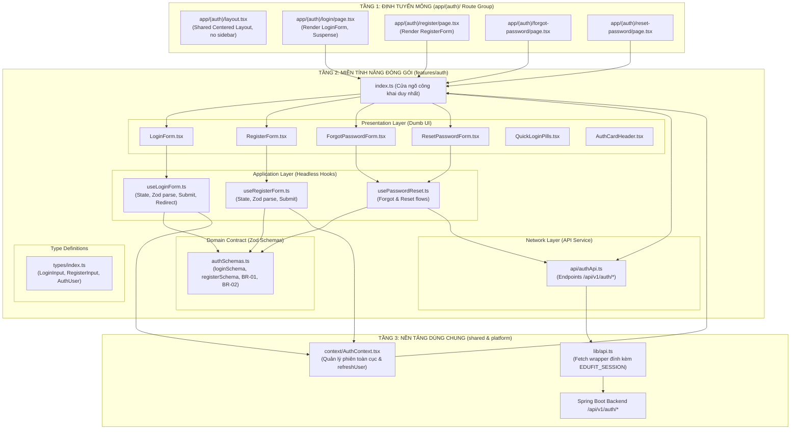

# KẾ HOẠCH TÁI CẤU TRÚC (REFACTOR PLAN): MIỀN XÁC THỰC `feature/frontend-auth`

> **Mã tài liệu:** EDUFIT-AUTH-REFACTOR-PLAN-V1.0  
> **Dự án:** EduFit (SWP391 - Semester 5)  
> **Tài liệu tham chiếu:** [ADR-001 (Tech Stack)](file:///c:/University/Semester%205/SWP391/Edufit/EduFit/docs/ADR-001-tech-stack.md), [ADR-002 (Multi-Module Architecture)](file:///c:/University/Semester%205/SWP391/Edufit/EduFit/docs/ADR-002-multi-module-architecture.md), [Frontend Master Roadmap](file:///c:/University/Semester%205/SWP391/Edufit/EduFit/docs/frontend-master-roadmap-and-architecture-plan.md), [Frontend Phase 1 Action Plan](file:///c:/University/Semester%205/SWP391/Edufit/EduFit/docs/frontend-phase1-demo-and-figma-refactor-plan.md), [Authentication Contract](file:///c:/University/Semester%205/SWP391/Edufit/EduFit/docs/authentication-contract.md), [In-Development Testing Specification](file:///c:/University/Semester%205/SWP391/Edufit/EduFit/docs/in-development-testing-specification.md)  
> **Công nghệ áp dụng:** Next.js 16 (App Router), React 19, TypeScript 5, Tailwind CSS v4, Zod, Vitest.

---

## 1. Goal Description (Mục Tiêu & Bối Cảnh Thực Tế)

Nhánh `feature/frontend-auth` đã thiết lập được lớp kết nối mạng cơ bản (Stateful Session qua `EDUFIT_SESSION` cookie và `lib/api.ts`), cùng với các biểu mẫu giao diện tương đối đầy đủ (`LoginForm`, `RegisterForm`, `ForgotPasswordForm`, `ResetPasswordForm`). Tuy nhiên, khi đối chiếu với các quy chuẩn kiến trúc trong tài liệu dự án, cấu trúc hiện tại bộc lộ **4 khiếm khuyết nghiêm trọng**:

1. **Vi phạm Ranh giới Đóng gói Module (Feature Boundary Violation):**
   * Thư mục `src/features/auth/` hiện tại chỉ là một "kho chứa components" thuần túy (`components/`). Không có `schemas/`, không có `hooks/`, không có `types/`, và thiếu `index.ts` (Public API Gateway).
   * Schema xác thực Zod lại bị đặt tản mạn tại `src/lib/validation.ts` và gộp chung một file với `bookingFormSchema` (thuộc module xếp lịch học).
2. **"Dead Code" Validation — Mất kết nối giữa Zod và Giao diện:**
   * Mặc dù dự án đã cài đặt Zod và có bộ test `authValidation.test.ts`, **toàn bộ các form (`LoginForm.tsx`, `RegisterForm.tsx`) lại hoàn toàn KHÔNG sử dụng Zod!**
   * Các form đang kiểm tra hợp lệ bằng các câu lệnh `if (password.length < 8)` thủ công, bỏ qua toàn bộ chính sách bảo mật mật khẩu BR-02 (chữ, số, ký tự đặc biệt, chuẩn hóa email BR-01).
3. **Pha trộn Hỗn loạn Trách nhiệm (God Component Anti-Pattern):**
   * Component `LoginForm.tsx` dài hơn 160 dòng, vừa phụ trách render HTML/Tailwind, vừa quản lý state form, vừa gọi trực tiếp API `profileService.getMyStudentProfile()`, vừa đọc `localStorage` để quyết định điều hướng Onboarding.
   * Logic điều hướng hậu đăng nhập (Post-auth navigation) bị gán cứng vào component thay vì được tách lớp độc lập.
   *(Lưu ý tích cực: Thành viên trong nhóm đã triển khai thành công `QuickLoginPills.tsx` với 4 tài khoản Demo chuẩn mực — thành phần này hoạt động rất tốt và sẽ được giữ nguyên 100%).*
4. **Bộ Test Suite Đang Bị Lỗi (Broken Test Execution):**
   * Tệp `src/features/profile/components/availabilitySlotUtils.test.mjs` sử dụng Node test runner native (`node:test`) thay vì Vitest, dẫn đến lệnh `npm test` bị **FAIL 1 test suite**.

**Mục tiêu của kế hoạch này:** Tái cấu trúc miền `features/auth` đạt chuẩn **Clean Architecture / Package-by-Feature (FSD)**, kích hoạt Zod validation trên 100% biểu mẫu auth, tách biệt Presentation và Logic qua Custom Hooks, sửa chữa bộ test Vitest, và đảm bảo 100% build sạch, kiểm thử pass.

---

## 2. Nền Tảng Kiến Trúc & Giải Thích Chi Tiết Cơ Chế Hoạt Động

Để đảm bảo mọi thành viên trong nhóm hiểu sâu bản chất kỹ thuật (theo đúng phương pháp luận [AI Learning Protocol](file:///c:/University/Semester%205/SWP391/Edufit/EduFit/docs/master_sprint_plan_and_ai_learning_framework.md)), phần này phân tích từ định nghĩa, lý do tồn tại đến cách các thành phần phối hợp với nhau:

### 2.1. Kiến Trúc 3 Tầng (3-Tier Clean Frontend Architecture)



### 2.2. Giải Phẫu Từng Lớp & Lý Do Tồn Tại (Architectural Rationale)

#### 1. Tại sao cần `features/auth/schemas/authSchemas.ts` thay vì để ở `lib/validation.ts`?
* **Định nghĩa:** Zod Schema là bản hợp đồng dữ liệu phía Client, định nghĩa cấu trúc, kiểu dữ liệu và ràng buộc biên của từng payload.
* **Lý do tách biệt:** 
  * Hiện tại `src/lib/validation.ts` đang chứa lẫn lộn cả schema đăng nhập, đăng ký và `bookingFormSchema` (đặt lịch học). Điều này vi phạm nguyên tắc ranh giới module (Modular Boundaries): module `auth` và module `scheduling` bị phụ thuộc chéo vào 1 file chung.
  * Mỗi feature phải tự quản lý schema của chính nó. Module `auth` sở hữu các schema xác thực của chính nó, giúp việc đóng gói, di chuyển hoặc kiểm thử độc lập trở nên dễ dàng.
* **Đồng bộ đối xứng với Backend (Jakarta Bean Validation):**
  * `@NotBlank @Email` trên Java Spring $\longleftrightarrow$ `z.string().email().trim().toLowerCase()` trên Next.js.
  * `@Size(min=8, max=64) @Pattern(...)` trên Java $\longleftrightarrow$ `z.string().min(8).max(64).regex(...)` trên Zod.

#### 2. Tại sao cần tách Custom Hooks (`useLoginForm.ts`, `useRegisterForm.ts`) khỏi UI Component?
* **Mô hình Headless UI / Dumb Component:**
  * Component UI (`LoginForm.tsx`) chỉ nên chịu trách nhiệm về **Visual**: Vẽ ô input, hiển thị icon, áp dụng class Tailwind CSS, hiển thị thông báo lỗi khi có `errors.email`.
  * Hook (`useLoginForm.ts`) chịu trách nhiệm về **Logic**:
    1. Quản lý trạng thái form (`formData`, `errors`, `isSubmitting`).
    2. Chạy hàm `loginSchema.safeParse(formData)` trước khi gửi mạng.
    3. Trích xuất lỗi Zod chuyển thành thông báo trực quan theo từng field.
    4. Gọi `authContext.login()`.
    5. Điều hướng vai trò người dùng (Student $\rightarrow$ `/onboarding/student` hoặc `/dashboard`).
* **Lợi ích to lớn khi Viết Unit Test:**
  * Chúng ta có thể dùng Vitest kiểm thử 100% logic của `useLoginForm` (trường hợp sai pass, đúng pass, tài khoản bị khóa BR-06, điều hướng) mà **không cần phải render DOM hay giả lập click chuột phức tạp**.

#### 3. Tại sao cần Public API Gateway (`features/auth/index.ts`)?
* **Định nghĩa:** `index.ts` là cửa ngõ công khai duy nhất cho phép bên ngoài (`app/`, `features/dashboard/`) import các thành phần của module `auth`.
* **Quy tắc ranh giới (Boundary Enforcement):**
  * Bên ngoài chỉ được phép: `import { LoginForm, RegisterForm, useAuth } from "@/features/auth"`.
  * Bên ngoài **tuyệt đối không được phép** import xuyên tầng vào file nội bộ: `import ... from "@/features/auth/components/LoginForm"`.
  * Điều này ngăn chặn tình trạng Coupling (ràng buộc chặt chẽ), cho phép bạn thoải mái tái cấu trúc file bên trong `features/auth/` mà không làm hỏng code của các trang bên ngoài.

---

## 3. User Review Required (Nội Dung Cần Nhóm Thống Nhất)

> [!IMPORTANT]
> **1. Quy Chuẩn Xử Lý Onboarding Hậu Đăng Nhập:**
> Hiện tại trong `LoginForm.tsx` có đoạn code đọc `localStorage.getItem("edufit_tutor_onboarding_completed")`.  
> *Đánh giá Senior Engineer:* Việc lưu trạng thái hoàn thành onboarding ở `localStorage` của trình duyệt là một anti-pattern vì dữ liệu sẽ mất khi đổi máy hoặc xóa cookie. Tuy nhiên, để bảo toàn tính năng mà thành viên khác vừa phát triển, ta sẽ đóng gói logic này vào một hàm điều hướng chuẩn `resolvePostLoginRedirect(user)` trong hook, kết hợp kiểm tra `profileService` và fallback `localStorage`.
>
> **2. Giữ Tính Tương Thích Ngược cho `src/lib/validation.ts`:**
> Để không làm gãy các file đang import từ `src/lib/validation.ts` (như bộ test `authValidation.test.ts`), file `src/lib/validation.ts` sẽ re-export lại các schema từ `src/features/auth/schemas/authSchemas.ts`.

---

## 4. Proposed Changes (Chi Tiết Cấu Trúc Thư Mục & Từng Tệp Tin Sẽ Thay Đổi)

### 4.1. Cấu Trúc Thư Mục & Từng File Sau Khi Refactor (Target Directory Tree)

```text
frontend/src/
├── features/
│   └── auth/                                   # 🌟 MIỀN TÍNH NĂNG XÁC THỰC ĐÓNG GÓI (PACKAGE-BY-FEATURE)
│       ├── schemas/
│       │   └── authSchemas.ts                  # [NEW] Domain Contract: Toàn bộ Zod schemas xác thực & regex BR-01, BR-02
│       ├── types/
│       │   └── index.ts                        # [NEW] Kiểu dữ liệu TypeScript suy luận từ Zod & AuthFieldErrors
│       ├── hooks/
│       │   ├── useLoginForm.ts                 # [NEW] Headless hook điều phối form đăng nhập, Zod parse & redirect
│       │   ├── useRegisterForm.ts              # [NEW] Headless hook điều phối form đăng ký & real-time criteria
│       │   └── usePasswordReset.ts             # [NEW] Headless hook xử lý quên mật khẩu & đặt lại mật khẩu
│       ├── components/
│       │   ├── LoginForm.tsx                   # [MODIFY] Dumb UI: Tinh gọn, chỉ nhận state từ useLoginForm
│       │   ├── RegisterForm.tsx                # [MODIFY] Dumb UI: Tinh gọn, hiển thị tiêu chí mật khẩu BR-02
│       │   ├── ForgotPasswordForm.tsx          # [MODIFY] Dumb UI: Form gửi yêu cầu quên mật khẩu
│       │   ├── ResetPasswordForm.tsx           # [MODIFY] Dumb UI: Form đặt lại mật khẩu với token
│       │   ├── QuickLoginPills.tsx             # [GIỮ NGUYÊN] Nút 1-Click điền 4 tài khoản Demo chuẩn mực
│       │   ├── RoleSelector.tsx                # [GIỮ NGUYÊN] Bộ chọn vai trò Học sinh / Gia sư / Phụ huynh
│       │   ├── SocialAuthButtons.tsx           # [GIỮ NGUYÊN] Nút đăng nhập Google / Facebook
│       │   └── AuthCardHeader.tsx              # [GIỮ NGUYÊN] Header thẻ Auth card kèm logo EduFit
│       └── index.ts                            # [NEW] Public API Gateway duy nhất xuất khẩu ra bên ngoài
│
├── app/
│   └── (auth)/                                 # 🌟 ROUTE GROUP XÁC THỰC (Theo chuẩn Frontend Master Roadmap)
│       ├── layout.tsx                          # [NEW] Layout tập trung căn giữa màn hình, dùng chung cho 4 trang
│       ├── login/page.tsx                      # [MOVE & MODIFY] Trang Đăng nhập (URL: /login)
│       ├── register/page.tsx                   # [MOVE & MODIFY] Trang Đăng ký (URL: /register)
│       ├── forgot-password/page.tsx            # [MOVE & MODIFY] Trang Quên mật khẩu (URL: /forgot-password)
│       └── reset-password/page.tsx             # [MOVE & MODIFY] Trang Đặt lại mật khẩu (URL: /reset-password)
│
├── lib/
│   └── validation.ts                           # [MODIFY] Re-export schemas từ auth để duy trì tương thích ngược
│
└── __tests__/
    ├── schemas/
    │   └── authValidation.test.ts              # [GIỮ NGUYÊN] 25 test cases Zod data-driven
    ├── features/auth/
    │   └── useLoginForm.test.ts                # [NEW] Unit test kiểm thử headless hook useLoginForm độc lập
    └── features/profile/components/
        └── availabilitySlotUtils.test.ts       # [REPLACE] Sửa test mjs cũ sang Vitest TypeScript
```

---

### 4.2. Bảng Đặc Tả Chi Tiết Từng Tệp Tin (File-by-File Specification)

| STT | Đường Dẫn Tệp | Trạng Thái | Trách Nhiệm Kiến Trúc & Nội Dung Kỹ Thuật |
| :---: | :--- | :---: | :--- |
| **1** | `src/features/profile/components/availabilitySlotUtils.test.ts` | **[REPLACE]** | Chuyển đổi từ file test `.mjs` dùng `node:test` sang Vitest TypeScript (`describe`, `it`, `expect`). Xóa file `.mjs` cũ để đưa toàn bộ test suite về trạng thái Green baseline. |
| **2** | `src/features/auth/schemas/authSchemas.ts` | **[NEW]** | Lưu trữ toàn bộ Client Domain Validation Contract bằng Zod: `loginSchema`, `registerSchema` (BR-01, BR-02, BR-03), `forgotPasswordSchema`, `resetPasswordSchema`, `changePasswordSchema`, và hàm tiện ích `evaluatePasswordCriteria(password)` phục vụ UI real-time checklist. |
| **3** | `src/features/auth/types/index.ts` | **[NEW]** | Định nghĩa kiểu TypeScript suy luận từ Zod (`LoginInput`, `RegisterInput`, `ForgotPasswordInput`, `ResetPasswordInput`, `ChangePasswordInput`), định nghĩa `AuthFieldErrors<T>`, và re-export các kiểu nghiệp vụ `AuthUser`, `UserRole`, `AccountStatus`. |
| **4** | `src/lib/validation.ts` | **[MODIFY]** | Re-export các auth schemas từ `src/features/auth/schemas/authSchemas.ts` để bảo toàn tương thích ngược cho codebase và test suite cũ; giữ nguyên `bookingFormSchema`. |
| **5** | `src/features/auth/hooks/useLoginForm.ts` | **[NEW]** | Headless hook quản lý trạng thái form login (`email`, `password`, `isSubmitting`, `fieldErrors`, `generalError`), chạy `loginSchema.safeParse()`, gọi `useAuth().login()`, đóng gói logic điều hướng Onboarding thông minh `resolvePostLoginRedirect()`, và cung cấp `fillQuickLogin()`. |
| **6** | `src/features/auth/hooks/useRegisterForm.ts` | **[NEW]** | Headless hook quản lý form đăng ký: state, real-time criteria checklist (BR-02: độ dài, chữ cái, chữ số), `registerSchema.safeParse()`, gọi `useAuth().register()`, và điều hướng onboarding theo vai trò. |
| **7** | `src/features/auth/hooks/usePasswordReset.ts` | **[NEW]** | Headless hooks đóng gói 2 luồng: `useForgotPasswordForm` (gửi mail khôi phục) và `useResetPasswordForm` (xác thực token và cập nhật mật khẩu mới). |
| **8** | `src/features/auth/components/LoginForm.tsx` | **[MODIFY]** | Dumb UI Component: Tinh gọn từ 160 dòng xuống ~80 dòng, loại bỏ logic API/routing, kết nối trực tiếp vào `useLoginForm()`, hiển thị thông báo lỗi màu đỏ theo từng trường (`fieldErrors.email`, `fieldErrors.password`), tích hợp với `<QuickLoginPills />`. |
| **9** | `src/features/auth/components/RegisterForm.tsx` | **[MODIFY]** | Dumb UI Component: Kết nối vào `useRegisterForm()`, hiển thị badge/checklist tiêu chí mật khẩu trực quan đổi màu real-time (BR-02), hiển thị lỗi theo trường. |
| **10** | `src/features/auth/components/ForgotPasswordForm.tsx` | **[MODIFY]** | Dumb UI Component: Sử dụng `useForgotPasswordForm()`, áp dụng Zod validation. |
| **11** | `src/features/auth/components/ResetPasswordForm.tsx` | **[MODIFY]** | Dumb UI Component: Sử dụng `useResetPasswordForm()`, kiểm tra tiêu chí mật khẩu BR-02. |
| **12** | `src/features/auth/components/QuickLoginPills.tsx` | **[GIỮ NGUYÊN]** | Nút bấm 1-Click điền nhanh 4 tài khoản Demo (Học sinh, Gia sư, Phụ huynh, Admin). Hoạt động hoàn hảo, giữ nguyên 100%. |
| **13** | `src/features/auth/components/RoleSelector.tsx` | **[GIỮ NGUYÊN]** | Component chọn vai trò khi đăng ký (`STUDENT`, `TUTOR`, `PARENT`). |
| **14** | `src/features/auth/components/SocialAuthButtons.tsx` | **[GIỮ NGUYÊN]** | Nút bấm mạng xã hội Google / Facebook. |
| **15** | `src/features/auth/components/AuthCardHeader.tsx` | **[GIỮ NGUYÊN]** | Logo EduFit và tiêu đề thẻ xác thực. |
| **16** | `src/features/auth/index.ts` | **[NEW]** | **Public API Gateway** duy nhất xuất khẩu các components, hooks, schemas và types của module auth ra bên ngoài hệ thống. |
| **17** | `src/app/(auth)/layout.tsx` | **[NEW]** | **Shared Centered Layout** dùng chung cho nhóm Route Group `(auth)`: Căn giữa màn hình (`min-h-screen`, `bg-stone-50`), loại bỏ sự lặp lại container ở cả 4 trang con. |
| **18** | `src/app/(auth)/login/page.tsx` | **[MOVE & MODIFY]** | Di chuyển từ `src/app/login/page.tsx` vào nhóm `(auth)`. Giữ nguyên URL `/login`. Import `{ LoginForm }` từ `@/features/auth`. |
| **19** | `src/app/(auth)/register/page.tsx` | **[MOVE & MODIFY]** | Di chuyển từ `src/app/register/page.tsx` vào nhóm `(auth)`. Giữ nguyên URL `/register`. Import `{ RegisterForm }` từ `@/features/auth`. |
| **20** | `src/app/(auth)/forgot-password/page.tsx` | **[MOVE & MODIFY]** | Di chuyển từ `src/app/forgot-password/page.tsx` vào nhóm `(auth)`. Giữ nguyên URL `/forgot-password`. Import `{ ForgotPasswordForm }` từ `@/features/auth`. |
| **21** | `src/app/(auth)/reset-password/page.tsx` | **[MOVE & MODIFY]** | Di chuyển từ `src/app/reset-password/page.tsx` vào nhóm `(auth)`. Giữ nguyên URL `/reset-password`. Import `{ ResetPasswordForm }` từ `@/features/auth`. |
| **22** | `src/__tests__/features/auth/useLoginForm.test.ts` | **[NEW]** | Unit test Vitest kiểm thử logic của hook `useLoginForm` độc lập mà không cần mount DOM nặng. |

---

### Component 1: Fix Lỗi Test Suite Vitest Hiện Tại

#### [DELETE] `frontend/src/features/profile/components/availabilitySlotUtils.test.mjs`
Xóa file test cũ sử dụng `node:test`.

#### [NEW] `frontend/src/features/profile/components/availabilitySlotUtils.test.ts`
* Chuyển đổi sang cú pháp Vitest chuẩn (`describe`, `it`, `expect`).
* Đảm bảo khi chạy `npm test`, test suite này chạy pass 100% cùng với các bài test khác.

---

### Component 2: Tầng Schema & Hợp Đồng Dữ Liệu (`features/auth/schemas`)

#### [NEW] `frontend/src/features/auth/schemas/authSchemas.ts`
* Định nghĩa đầy đủ các schema theo quy tắc nghiệp vụ:
  * `registerSchema`: Email chuẩn hóa, mật khẩu (BR-02: 8-64 ký tự, có chữ, có số), họ tên $\ge 2$ ký tự, vai trò (BR-03: STUDENT, PARENT, TUTOR).
  * `loginSchema`: Email định dạng hợp lệ, mật khẩu không rỗng.
  * `forgotPasswordSchema`: Email bắt buộc và đúng định dạng.
  * `resetPasswordSchema`: Token 32 hex chars, mật khẩu mới tuân thủ BR-02, xác nhận mật khẩu khớp.
  * `changePasswordSchema`: Mật khẩu hiện tại, mật khẩu mới tuân thủ BR-02.
* Bổ sung helper `evaluatePasswordCriteria(password)` để hỗ trợ validate real-time khi người dùng gõ từng phím trên UI.

#### [NEW] `frontend/src/features/auth/types/index.ts`
* Re-export các types suy luận từ Zod (`z.infer<typeof ...>`).
* Khai báo kiểu `AuthUser`, `UserRole`, `AccountStatus`, `AuthFieldErrors`.

#### [MODIFY] `frontend/src/lib/validation.ts`
* Re-export các auth schemas từ `src/features/auth/schemas/authSchemas.ts` để bảo tồn tương thích ngược cho toàn bộ codebase và test suite cũ.

---

### Component 3: Tầng Application Logic (`features/auth/hooks`)

#### [NEW] `frontend/src/features/auth/hooks/useLoginForm.ts`
* Hook quản lý form đăng nhập:
  * State: `email`, `password`, `isSubmitting`, `fieldErrors`, `generalError`.
  * Validate qua `loginSchema.safeParse()`.
  * Xử lý ngoại lệ `ApiError` (phân loại lỗi sai mật khẩu, lỗi khóa tài khoản BR-06).
  * Hỗ trợ hàm `fillQuickLogin(email, pass)` cho các nút Demo 1-click.
  * Điều hướng thông minh: `resolvePostLoginRedirect(loggedUser)` xử lý phân nhánh vai trò và onboarding.

#### [NEW] `frontend/src/features/auth/hooks/useRegisterForm.ts`
* Hook quản lý form đăng ký:
  * State: `fullName`, `email`, `password`, `confirmPassword`, `role`.
  * Real-time criteria indicators: Tính toán trạng thái hợp lệ của mật khẩu (đủ độ dài, có chữ, có số) theo thời gian thực để UI hiển thị tick xanh/đỏ (BR-02).
  * Validate qua `registerSchema.safeParse()`.
  * Điều hướng đúng vai trò sang Onboarding Wizard tương ứng.

#### [NEW] `frontend/src/features/auth/hooks/usePasswordReset.ts`
* Đóng gói logic gửi email quên mật khẩu và đặt lại mật khẩu với token.

---

### Component 4: Tầng Giao Diện Người Dùng (`features/auth/components`) & Gateway (`features/auth/index.ts`)

#### [MODIFY] `frontend/src/features/auth/components/LoginForm.tsx`
* Bỏ toàn bộ code logic dài dòng, chuyển sang dùng `useLoginForm()`.
* Hiển thị thông báo lỗi tương ứng dưới từng trường nhập liệu (`fieldErrors.email`, `fieldErrors.password`).
* Tích hợp mượt mà với `<QuickLoginPills />`.

#### [MODIFY] `frontend/src/features/auth/components/RegisterForm.tsx`
* Chuyển sang dùng `useRegisterForm()`.
* Hiển thị bảng tiêu chí mật khẩu trực quan (BR-02) dựa trên state tính toán từ hook.
* Hiển thị lỗi Zod rõ ràng khi submit form.

#### [MODIFY] `frontend/src/features/auth/components/ForgotPasswordForm.tsx` & `ResetPasswordForm.tsx`
* Sử dụng hook từ `usePasswordReset.ts`, hiển thị lỗi validate Zod trước khi gửi yêu cầu.

#### [NEW] `frontend/src/features/auth/index.ts`
* Cửa ngõ công khai export:
  ```typescript
  // Components
  export { LoginForm } from "./components/LoginForm";
  export { RegisterForm } from "./components/RegisterForm";
  export { ForgotPasswordForm } from "./components/ForgotPasswordForm";
  export { ResetPasswordForm } from "./components/ResetPasswordForm";
  export { QuickLoginPills } from "./components/QuickLoginPills";
  export { RoleSelector } from "./components/RoleSelector";
  export { SocialAuthButtons } from "./components/SocialAuthButtons";
  export { AuthCardHeader } from "./components/AuthCardHeader";

  // Hooks
  export { useLoginForm } from "./hooks/useLoginForm";
  export { useRegisterForm } from "./hooks/useRegisterForm";
  export { useForgotPasswordForm, useResetPasswordForm } from "./hooks/usePasswordReset";

  // Schemas & Types
  export * from "./schemas/authSchemas";
  export * from "./types";
  ```

---

### Component 5: Tầng Định Tuyến & Layout Chuẩn Hóa (`app/(auth)/` Route Group)

#### [NEW] `frontend/src/app/(auth)/layout.tsx`
* Layout tập trung dùng chung cho toàn bộ các trang xác thực (Route Group `(auth)` theo đúng chuẩn [Frontend Master Roadmap](file:///c:/University/Semester%205/SWP391/Edufit/EduFit/docs/frontend-master-roadmap-and-architecture-plan.md)):
  * Căn giữa màn hình (`min-h-screen`, `bg-stone-50`, `flex items-center justify-center`).
  * Loại bỏ hoàn toàn sự lặp lại đoạn mã container wrapper ở cả 4 trang riêng lẻ.
  * Vì đặt trong thư mục có ngoặc đơn `(auth)`, Next.js Route Group **KHÔNG làm thay đổi URL**, các đường dẫn vẫn giữ nguyên 100%: `/login`, `/register`, `/forgot-password`, `/reset-password`.

#### [MOVE & MODIFY] `frontend/src/app/login/page.tsx` $\rightarrow$ `frontend/src/app/(auth)/login/page.tsx`
#### [MOVE & MODIFY] `frontend/src/app/register/page.tsx` $\rightarrow$ `frontend/src/app/(auth)/register/page.tsx`
#### [MOVE & MODIFY] `frontend/src/app/forgot-password/page.tsx` $\rightarrow$ `frontend/src/app/(auth)/forgot-password/page.tsx`
#### [MOVE & MODIFY] `frontend/src/app/reset-password/page.tsx` $\rightarrow$ `frontend/src/app/(auth)/reset-password/page.tsx`
* Di chuyển vào `src/app/(auth)/`, loại bỏ wrapper trùng lặp (đã có `layout.tsx` lo), và chuẩn hóa import từ `@/features/auth` (Public API Gateway).

---

### Component 6: Tầng Kiểm Thử Tự Động (`src/__tests__`)

#### [NEW] `frontend/src/__tests__/features/auth/useLoginForm.test.ts`
* Unit test cho hook `useLoginForm` với Vitest:
  * Test case 1: Validate từ chối khi email sai định dạng (không gọi API).
  * Test case 2: Validate từ chối khi mật khẩu rỗng.
  * Test case 3: Điền hợp lệ $\rightarrow$ gọi `login` thành công $\rightarrow$ điều hướng đúng role.
  * Test case 4: Xử lý lỗi từ Backend (HTTP 401 hoặc tài khoản bị khóa).

---

## 5. Verification Plan (Kế Hoạch Xác Minh & Tiêu Chí Nghiệm Thu)

### 5.1. Automated Tests (Kiểm Thử Tự Động)
Chạy toàn bộ các lệnh kiểm tra chất lượng từ thư mục `frontend`:

1. **Kiểm tra Type TypeScript:**
   ```bash
   cd frontend
   npm run type-check
   ```
   *Yêu cầu:* Thoát với mã 0 (`Exit code 0`), 0 lỗi Type error.

2. **Chạy Bộ Kiểm Thử Vitest:**
   ```bash
   cd frontend
   npm test
   ```
   *Yêu cầu:* Toàn bộ các test suite (bao gồm auth schemas, booking validation, availability slot utils, và unit test mới của hook auth) đều **PASSED 100%**.

3. **Kiểm tra Linting & Định Dạng:**
   ```bash
   cd frontend
   npm run lint
   ```
   *Yêu cầu:* Không có cảnh báo import chéo hoặc biến thừa không sử dụng.

4. **Kiểm tra Biên Dịch Build Sản Phẩm:**
   ```bash
   cd frontend
   npm run build
   ```
   *Yêu cầu:* Build Next.js Turbopack thành công tuyệt đối, tạo đầy đủ static/dynamic routes.

### 5.2. Manual Verification (Kiểm Thử Thủ Công qua Giao Diện)
Khởi động server dev:
```bash
npm run dev
```
1. **Kiểm tra Trang Đăng Nhập (`http://localhost:3000/login`):**
   * Nhấp thử các nút Quick Login `[Học sinh]`, `[Gia sư]`, `[Phụ huynh]` $\rightarrow$ Form tự động điền email và mật khẩu tương ứng.
   * Cố tình nhập email sai định dạng (ví dụ: `abc`) $\rightarrow$ Bấm Đăng nhập $\rightarrow$ Hiển thị lỗi Zod đỏ ngay dưới ô email mà không bắn request lên server.
   * Nhập mật khẩu sai $\rightarrow$ Hiển thị thông báo lỗi thân thiện.
2. **Kiểm tra Trang Đăng Ký (`http://localhost:3000/register`):**
   * Gõ mật khẩu $\rightarrow$ Bảng tiêu chí (Tối thiểu 8 ký tự, có chữ, có số) tự động chuyển từ màu xám sang tick xanh theo thời gian thực.
   * Nhập mật khẩu xác nhận không khớp $\rightarrow$ Báo lỗi rõ ràng.
3. **Kiểm tra Luồng Điều Hướng:**
   * Đăng nhập thành công với tài khoản học sinh $\rightarrow$ Tự động chuyển hướng đến `/dashboard` (hoặc wizard onboarding nếu chưa hoàn thành).
