# Kế Hoạch Triển Khai Kiến Trúc Chi Tiết: Phân Hệ Backend Scheduling (EduFit)

- **Trạng thái:** Chờ phê duyệt (Under Review)
- **Căn cứ tài liệu:** 
  - [software-architecture-design-specification.md](file:///c:/University/Semester%205/SWP391/Edufit/EduFit/docs/software-architecture-design-specification.md) (Mục 3.2, 4.3, 5.2 - Luồng 3 & 4)
  - [master_sprint_plan_and_ai_learning_framework.md](file:///c:/University/Semester%205/SWP391/Edufit/EduFit/docs/master_sprint_plan_and_ai_learning_framework.md) (Sprint 3, Mục 4.1, 4.3.3)
  - [backend-module-structure-guide.md](file:///c:/University/Semester%205/SWP391/Edufit/EduFit/docs/backend-module-structure-guide.md) (Loại 2: Complex Domain / DDD Clean Architecture)
  - [V1.05__create_tutoring_session_tables.sql](file:///c:/University/Semester%205/SWP391/Edufit/EduFit/backend/app/src/main/resources/db/migration/scheduling/V1.05__create_tutoring_session_tables.sql)
  - [SchedulingConfig.java](file:///c:/University/Semester%205/SWP391/Edufit/EduFit/backend/app/src/main/java/vn/edufit/config/SchedulingConfig.java)

---

## 1. Mục Tiêu & Bối Cảnh (Goal Description)

Phân hệ **Backend Scheduling** trong nền tảng EduFit đóng vai trò then chốt và là **phân hệ có rủi ro kỹ thuật cao nhất toàn hệ thống (Sprint 3 Focus)**. Phân hệ này giải quyết trọn vẹn 2 mảng nghiệp vụ:

1. **Quản lý Vòng đời Buổi học 1-1 (Domain-Driven Session Scheduling - `modules/scheduling`):**
   - Đảm nhiệm toàn bộ vòng đời của buổi học dạy kèm giữa đúng 1 Gia sư và 1 Học sinh trong một lớp học (`class_id` - kế thừa từ quan hệ `Engagement`).
   - Xử lý các nghiệp vụ: Đề xuất buổi học (`PROPOSE`), Xác nhận/Từ chối (`RESPOND`), Đổi lịch (`RESCHEDULE`), Hủy lịch (`CANCEL`), Ghi nhận kết quả buổi học (`OUTCOME`), và Tra cứu lịch tổng hợp (`CALENDAR`).
   - Thực thi thuật toán chống trùng lặp lịch (Double-Booking Protection - NFR-17, BR-42) với mô hình khoảng thời gian nửa mở $[start, end)$.
2. **Tác vụ Lập lịch Tự động theo Thời gian (Temporal Background Scheduling Jobs):**
   - Tận dụng `ThreadPoolTaskScheduler` (`@EnableScheduling` đã cấu hình ở `SchedulingConfig.java`) để định kỳ quét và xử lý các tác vụ ngầm:
     - Tự động chuyển các đề xuất buổi học quá hạn sang trạng thái `EXPIRED` (FR-17, BR-43).
     - Gửi thông báo nhắc nhở trước giờ học 24 giờ và 2 giờ cho các bên (FR-20, FR-31).
     - Nhắc nhở Gia sư ghi nhận kết quả và biên bản buổi học (`SessionNote`) sau khi buổi học kết thúc.

Hệ thống được thiết kế theo mô hình **DDD Clean Architecture (Loại 2 - Complex Domain)** với tầng `domain/` viết hoàn toàn bằng **Java thuần túy (POJO)**, tách rời khỏi Spring Boot Framework và Hibernate/JPA, cho phép Unit Test siêu tốc đạt độ bao phủ 100% các trường hợp biên.

---

## 2. Giải Thích Chi Tiết: Từ Định Nghĩa Đến Cơ Chế Hoạt Động

### 2.1. Bản Chất Kỹ Thuật: Scheduling trong EduFit Là Gì?

Trong các hệ thống phần mềm, "Scheduling" thường bị hiểu nhầm là chỉ việc chạy cron job định kỳ. Trong EduFit, Scheduling là sự **kết hợp nhịp nhàng giữa 2 khái niệm**:

```
+---------------------------------------------------------------------------------------------------+
|                                     HỆ THỐNG SCHEDULING (EDUFIT)                                   |
+-------------------------------------------------+-------------------------------------------------+
| 1. DOMAIN SCHEDULING (Nghiệp Vụ Lịch Học)       | 2. TEMPORAL SCHEDULING (Tác Vụ Ngầm Định Kỳ)    |
| • Quản lý tài nguyên thời gian của con người   | • Quản lý các tiến trình ngầm của máy chủ       |
| • Xử lý tương tác giữa Tutor và Student/Parent  | • Chạy trên ThreadPoolTaskScheduler (Spring)    |
| • Chặn tranh chấp đồng thời (Double-booking)   | • Quét dữ liệu hết hạn (TTL, Expiration Jobs)   |
| • Tuân thủ máy trạng thái 8 bước (FSM)          | • Bắn Event thông báo nhắc nhở định kỳ (Cron)   |
+-------------------------------------------------+-------------------------------------------------+
```

### 2.2. Vấn Đề Trọng Tâm: Race Condition & Double-Booking (Hiểm Họa Rung Lắc)

#### Định nghĩa:
- **Race Condition (Tình trạng chạy đua):** Xảy ra khi hai yêu cầu HTTP từ hai người dùng khác nhau (ví dụ: Học sinh A và Học sinh B cùng chọn slot `14:00 - 16:00` của Gia sư C) đến hệ thống gần như cùng một tích tắc ($t_1 \approx t_2$).
- **Double-Booking:** Nếu hệ thống chỉ kiểm tra bằng câu lệnh SQL thông thường (`SELECT COUNT(*) FROM tutoring_session WHERE ...`), cả 2 luồng đều thấy kết quả `COUNT = 0` (vì chưa luồng nào commit). Cả 2 luồng đều thực hiện `INSERT` hoặc `UPDATE -> SCHEDULED`. Kết quả: Gia sư bị xếp trùng 2 học sinh cùng giờ, vi phạm nghiêm trọng NFR-17.

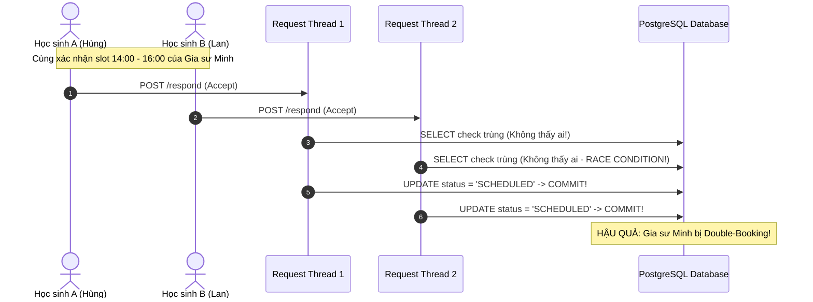

### 2.3. Giải Pháp: Chiến Lược Bảo Vệ 2 Tầng & Kiến Thức Chuyên Sâu (Concurrency & Indexing Deep-Dive)

Để triệt tiêu vĩnh viễn nguy cơ **Double-Booking (NFR-17)** và hiện tượng mất mát dữ liệu (**Lost Update**) trong môi trường phân tán đa luồng, EduFit thiết lập kiến trúc phòng thủ **2 tầng độc lập (Two-Tier Defense)** kết hợp cả 3 kỹ thuật tiên tiến: **Optimistic Locking**, **Pessimistic Locking**, và **PostgreSQL GiST Exclusion Constraints (`btree_gist`)**.

Dưới đây là phần giải thích toàn diện từ lý thuyết nền tảng, cơ chế hoạt động tầng máy chủ, câu lệnh SQL thực thi, đến cách áp dụng thực tế trong mã nguồn dự án:

---

#### 2.3.1. Khóa Lạc Quan (Optimistic Locking) với `@Version`

##### A. Khái niệm & Triết lý:
- **Tư tưởng chủ đạo:** "Lạc quan" (Optimistic) giả định rằng xung đột dữ liệu rất hiếm khi xảy ra. Do đó, hệ thống **không khóa bất kỳ tài nguyên hay dòng dữ liệu nào** trong suốt thời gian người dùng đọc và xử lý nghiệp vụ trên bộ nhớ RAM.
- **Cơ chế nhận diện xung đột:** Sử dụng một trường số nguyên phiên bản (`version`) đi kèm mỗi bản ghi. Khi đọc dữ liệu ra, hệ thống lưu lại số phiên bản hiện tại (ví dụ: `version = 1`). Khi cập nhật (`UPDATE`), hệ thống sẽ kiểm tra xem phiên bản dưới database có còn đúng bằng `1` hay không. Nếu còn đúng bằng `1`, lệnh ghi thành công và tự động tăng `version` lên `2`. Nếu một giao dịch khác đã cập nhật trước đó và đẩy `version` lên `2`, câu lệnh cập nhật sẽ phát hiện số dòng bị tác động là 0 (`0 rows updated`) và báo lỗi xung đột ngay lập tức!

##### B. Hiện thực hóa trong EduFit (`TutoringSessionJpaEntity`):
```java
@Entity
@Table(name = "tutoring_session")
public class TutoringSessionJpaEntity {
    // ...
    @Version
    @Column(name = "version", nullable = false)
    private int version;
}
```

##### C. Câu lệnh SQL do Hibernate tự động sinh ngầm:
Khi bạn gọi `repository.save(session)` để cập nhật trạng thái hoặc dữ liệu:
```sql
UPDATE tutoring_session
SET status = 'CANCELLED',
    cancelled_by = '3fa85f64-5717-4562-b3fc-2c963f66afa6',
    version = 2                     -- Tự động tăng phiên bản
WHERE session_id = 'c1a2b3c4-...' 
  AND version = 1;                  -- BẮT BUỘC phiên bản hiện tại ở DB phải là 1!
```
- Nếu một người khác đã thay đổi bản ghi này trước đó (phiên bản ở DB đã là `2`):
  $\rightarrow$ Điều kiện `version = 1` không khớp $\rightarrow$ Database trả về `0 rows updated`.
  $\rightarrow$ Hibernate lập tức ném ra ngoại lệ: `jakarta.persistence.OptimisticLockException` (được Spring Data gói lại thành `org.springframework.orm.ObjectOptimisticLockingFailureException`).

##### D. Ưu điểm & Giới hạn:
- **Ưu điểm vượt trội:**
  - **Non-blocking (Hoàn toàn không khóa):** Các luồng đọc và ghi không bao giờ phải xếp hàng chờ đợi nhau. Băng thông xử lý (Throughput) của hệ thống đạt mức tối đa.
  - **Không sợ Deadlock:** Vì không giữ khóa tài nguyên DB trong thời gian dài.
- **Giới hạn:**
  - Nếu tỷ lệ tranh chấp cao (nhiều người cùng tranh nhau cập nhật 1 bản ghi), luồng đến sau sẽ bị thất bại và bắt buộc phải Rollback giao dịch hoặc Retry lại từ đầu.
- **Phạm vi sử dụng trong EduFit:**
  - Áp dụng làm chốt chặn an toàn nền tảng cho **toàn bộ các hành động sửa đổi buổi học** (chỉnh sửa ghi chú `SessionNote`, hủy buổi học song song, rút lại đề xuất) để triệt tiêu lỗi **Lost Update** kinh điển.

---

#### 2.3.2. Khóa Bi Quan (Pessimistic Locking) với `@Lock(LockModeType.PESSIMISTIC_WRITE)`

##### A. Khái niệm & Triết lý:
- **Tư tưởng chủ đạo:** "Bi quan" (Pessimistic) giả định rằng nguy cơ xung đột là rất cao (ví dụ: thời khắc Gia sư bấm Chấp nhận lịch dạy, hoặc 2 học sinh cùng muốn giành 1 khung giờ). Hệ thống quyết định **khóa chặt dòng dữ liệu ngay từ lúc đọc (SELECT)**, ngăn chặn tất cả các giao dịch khác không được phép đọc-để-ghi hoặc sửa đổi dòng đó cho đến khi giao dịch hiện tại hoàn tất (`COMMIT` hoặc `ROLLBACK`).

##### B. Hiện thực hóa trong EduFit (`SpringDataTutoringSessionRepository`):
```java
@Repository
public interface SpringDataTutoringSessionRepository extends JpaRepository<TutoringSessionJpaEntity, UUID> {

    @Lock(LockModeType.PESSIMISTIC_WRITE)
    @Query("SELECT s FROM TutoringSessionJpaEntity s WHERE s.sessionId = :sessionId")
    Optional<TutoringSessionJpaEntity> findByIdForUpdate(@Param("sessionId") UUID sessionId);
}
```

##### C. Câu lệnh SQL do Hibernate chuyển thể xuống PostgreSQL:
```sql
SELECT session_id, class_id, tutor_id, student_id, start_at, end_at, status, version, ...
FROM tutoring_session
WHERE session_id = 'c1a2b3c4-...'
FOR UPDATE;    -- Khóa ghi độc quyền (Exclusive Row-Level Lock) tại mức Engine!
```
- **Cơ chế cấp thấp tại Storage Engine của PostgreSQL:**
  1. Transaction 1 (`T1`) gọi `findByIdForUpdate`: PostgreSQL cấp một khóa độc quyền (Exclusive Lock) trên tuple (dòng) vật lý tương ứng trong bảng `tutoring_session`.
  2. Transaction 2 (`T2`) gọi `findByIdForUpdate` cùng dòng đó trong lúc `T1` chưa commit: `T2` sẽ **lập tức bị chặn (Blocked / Suspended)** ở trạng thái chờ.
  3. Khi `T1` hoàn tất nghiệp vụ và `COMMIT`: Khóa được giải phóng. `T2` được đánh thức và đọc dữ liệu **mới nhất** mà `T1` vừa ghi. Khi đó `T2` sẽ thấy trạng thái đã chuyển thành `SCHEDULED` và bị Domain Policy từ chối một cách an toàn!

##### D. Ưu điểm & Giới hạn:
- **Ưu điểm:**
  - **Bảo toàn tính nhất quán tuyệt đối:** Tuần tự hóa (Serialize) các yêu cầu tranh chấp, ngăn chặn hoàn toàn hiện tượng Dirty Read, Non-repeatable Read và Race Condition logic.
  - Phù hợp hoàn hảo cho luồng chuyển đổi trạng thái then chốt (`PROPOSE -> SCHEDULED`, `RESCHEDULE -> ACCEPTED`).
- **Giới hạn:**
  - Có thể gây nghẽn tài nguyên (Thread starvation / DB Connection Pool exhaustion) nếu một giao dịch giữ khóa quá lâu.
  - Nguy cơ Deadlock nếu hai giao dịch cùng khóa chéo các dòng dữ liệu khác nhau.
- **Chiến lược áp dụng của EduFit:**
  - Chỉ khóa đúng 1 dòng cần thiết (`findByIdForUpdate`).
  - Toàn bộ thao tác bên trong Transaction (kiểm tra `ConflictPolicy`, bắn Event) đều chạy thuần RAM trong vòng chưa đầy $5 \text{ ms}$, giải phóng khóa tức thì.

---

#### 2.3.3. Cây Chỉ Mục GiST (Generalized Search Tree) & PostgreSQL Extension `btree_gist`

Đây là "vũ khí tối thượng" ở tầng lưu trữ vật lý của cơ sở dữ liệu để triệt tiêu hoàn toàn bài toán Double-Booking.

##### A. Giới hạn cốt lõi của B-Tree truyền thống:
- Hầu hết các hệ quản trị cơ sở dữ liệu (MySQL, SQL Server, Oracle) mặc định dùng chỉ mục **B-Tree (Balanced Tree)**.
- **Đặc tính của B-Tree:** Dựa trên quan hệ thứ tự 1 chiều tuyệt đối: `<`, `=`, `>`. B-Tree chỉ kiểm tra được sự trùng lặp giá trị đơn lẻ (Ví dụ: `UNIQUE(tutor_id, start_at)`).
- **Tại sao B-Tree bất lực trước dải thời gian:**
  - Hai buổi học trùng giờ nhau **không nhất thiết phải có cùng `start_at` hay `end_at`**!
  - *Ví dụ:* Buổi 1 học từ `14:00 - 16:00`. Buổi 2 học từ `15:00 - 17:00`.
    - Rõ ràng: $14:00 \neq 15:00$ và $16:00 \neq 17:00$. Ràng buộc `UNIQUE(tutor_id, start_at)` của B-Tree hoàn toàn vô tác dụng và cho phép cả 2 buổi cùng tồn tại!
    - Việc kiểm tra trùng dải thời gian đòi hỏi toán tử **giao thoa tập hợp (Overlap Operator `&&`)**:
      $$[14:00, 16:00) \cap [15:00, 17:00) \neq \emptyset \implies \text{TRÙNG LỊCH!}$$
    - B-Tree không thể lập chỉ mục hay giải quyết toán tử `&&` trong không gian 2 chiều $[start, end)$.

##### B. Bản chất của GiST (Generalized Search Tree):
- **GiST** là một cấu trúc cây cân bằng tổng quát hóa (được phát triển bởi Hellerstein et al. tại UC Berkeley).
- **Nguyên lý Bounding Box / Bounding Range:**
  - Thay vì lưu các giá trị đơn lẻ như B-Tree, mỗi nút nhánh của cây GiST lưu trữ một **Vùng bao (Bounding Interval)** chứa toàn bộ các khoảng thời gian con bên dưới.
  - Khi cần kiểm tra xem khoảng $[S_x, E_x)$ có giao nhau với bất kỳ khoảng nào trong DB hay không:
    - PostgreSQL duyệt từ nút gốc của cây GiST.
    - Nếu khoảng cần kiểm tra không giao với Vùng bao của một nhánh, thuật toán **bỏ qua toàn bộ nhánh con đó (Pruning)**.
    - Nhờ vậy, phép kiểm tra giao thoa dải thời gian đạt tốc độ cực nhanh: $\mathcal{O}(\log N)$ thay vì phải quét toàn bộ bảng ($\mathcal{O}(N)$ - Full Table Scan).

```
                            [CÂY CHỈ MỤC GiST: PHẠM VI DẢI THỜI GIAN]
                                       ┌───────────────────────┐
                                       │ Root Bounding Range:  │
                                       │   [08:00, 20:00)      │
                                       └───────────┬───────────┘
                         ┌─────────────────────────┴─────────────────────────┐
                         ▼                                                   ▼
            ┌─────────────────────────┐                         ┌─────────────────────────┐
            │ Branch 1 Bounding Range:│                         │ Branch 2 Bounding Range:│
            │      [08:00, 14:00)     │                         │      [14:00, 20:00)     │
            └────────────┬────────────┘                         └────────────┬────────────┘
        ┌────────────────┴────────────────┐                 ┌────────────────┴────────────────┐
        ▼                                 ▼                 ▼                                 ▼
   [Leaf: 08:00-10:00)               [Leaf: 10:00-12:00) [Leaf: 14:00-16:00)               [Leaf: 18:00-20:00)
```

##### C. Extension `btree_gist` trong PostgreSQL:
- Mặc định, GiST chỉ hỗ trợ các kiểu dữ liệu hình học hoặc dải số/thời gian (`box`, `polygon`, `range`). Nó **không hỗ trợ** các kiểu dữ liệu vô hướng thông thường như `UUID` hay `BIGINT`.
- Do đó, PostgreSQL không thể vừa kiểm tra `tutor_id` (kiểu `UUID`, dùng toán tử so bằng `=`) vừa kiểm tra khoảng thời gian (kiểu `tstzrange`, dùng toán tử giao thoa `&&`) trên cùng một cây GiST.
- **Extension `btree_gist` ra đời để giải quyết vấn đề này:** Nó cài đặt các hàm toán tử của B-Tree (như `=`) tương thích hoàn toàn vào kiến trúc cây GiST!
- Nhờ kích hoạt extension này:
  ```sql
  CREATE EXTENSION IF NOT EXISTS btree_gist;
  ```
  PostgreSQL cho phép ta tạo một ràng buộc loại trừ kết hợp cả trường định danh vô hướng lẫn dải thời gian đa chiều trong cùng một chỉ mục duy nhất!

##### D. Kiểu dữ liệu Range `tstzrange` và Ký hiệu nửa mở `[)`:
Trong file migration [`V1.05__create_tutoring_session_tables.sql`](file:///c:/University/Semester%205/SWP391/Edufit/EduFit/backend/app/src/main/resources/db/migration/scheduling/V1.05__create_tutoring_session_tables.sql):
```sql
CONSTRAINT ex_tutoring_session_no_tutor_overlap EXCLUDE USING gist (
    tutor_id WITH =,
    tstzrange(start_at, end_at, '[)') WITH &&
) WHERE (status IN ('SCHEDULED', 'PROPOSED'));
```
- `tstzrange`: Kiểu dữ liệu khoảng thời gian có múi giờ (`timestamp with time zone range`).
- Chuỗi format `'[)'`:
  - `[` (Dấu ngoặc vuông bên trái): **Inclusive (Bao gồm điểm bắt đầu)** $\rightarrow$ $t \ge start\_at$.
  - `)` (Dấu ngoặc đơn bên phải): **Exclusive (Không bao gồm điểm kết thúc)** $\rightarrow$ $t < end\_at$.
- **Ý nghĩa sống còn:**
  - Nếu Gia sư có buổi 1: `[08:00, 10:00)` và buổi 2: `[10:00, 12:00)`.
  - Hai khoảng này tiếp giáp nhau tại đúng mốc `10:00:00`. Nhưng vì buổi 1 là ngoặc tròn `)`, nó không chứa điểm `10:00:00`.
  - Phép toán `[08:00, 10:00) && [10:00, 12:00)` trả về **FALSE (Không giao nhau)** $\rightarrow$ Gia sư dạy 2 ca liền kề hoàn toàn hợp lệ!

##### E. Cơ chế bẫy lỗi Exclusion Constraint ở tầng Storage Engine:
Khi có 2 giao dịch đồng thời gửi dữ liệu vi phạm:
1. PostgreSQL kiểm tra cây GiST: Thấy đã tồn tại một dòng có cùng `tutor_id` mà khoảng thời gian giao nhau (`&&`) và `status` nằm trong `('SCHEDULED', 'PROPOSED')`.
2. PostgreSQL lập tức từ chối thao tác ghi và trả về mã lỗi chuẩn SQL:
   - **SQLSTATE:** `23P01` (`exclusion_violation`).
3. Spring Boot / Hibernate nhận lỗi SQL và bọc lại thành:
   - `org.springframework.dao.DataIntegrityViolationException`.
4. Tầng Application Service của EduFit bắt ngoại lệ này và dịch sang mã lỗi nghiệp vụ:
   - Ném: `ResourceConflictException(ErrorCode.SCHEDULE_OVERLAP)`.
   - Kết quả: REST API trả về mã HTTP `409 Conflict` kèm thông báo rõ ràng cho phía người dùng, bảo vệ hệ thống tuyệt đối không bị sập hay lưu sai dữ liệu.

---

#### 2.3.4. Bảng So Sánh Toàn Diện Giữa 3 Cơ Chế Khóa & Ràng Buộc

| Tiêu Chí So Sánh | Optimistic Locking (`@Version`) | Pessimistic Locking (`@Lock`) | PostgreSQL GiST Exclusion (`btree_gist`) |
| :--- | :--- | :--- | :--- |
| **Bản chất kỹ thuật** | Phi khóa (Lock-free), so sánh số phiên bản `version` khi UPDATE. | Khóa dòng vật lý (`SELECT ... FOR UPDATE`) tại DB. | Ràng buộc loại trừ hình học/dải giá trị ở cấp Storage Engine. |
| **Vị trí thực thi** | Ứng dụng (JPA/Hibernate) + SQL `WHERE version = ?`. | Database Engine (PostgreSQL Lock Manager). | Database Storage Engine (Cây chỉ mục GiST trên ổ đĩa). |
| **Mức độ ảnh hưởng hiệu năng** | **Rất nhẹ (Tối ưu nhất):** Không tốn tài nguyên khóa hay hàng đợi. | **Trung bình:** Các luồng phải xếp hàng chờ giải phóng khóa. | **Cực nhanh cho kiểm tra dải ($\mathcal{O}(\log N)$):** Tối ưu hóa trên cây chỉ mục. |
| **Khả năng chống Race Condition** | Chỉ bảo vệ bản ghi đơn lẻ khi cập nhật (chống Lost Update). | Bảo vệ bản ghi đơn lẻ khi đọc để chuyển trạng thái. | **Toàn năng:** Bảo vệ toàn bộ dải thời gian liên tục chống Double-Booking. |
| **Môi trường đa máy chủ (Multi-Pod / Multi-Server)** | Hoạt động tốt (dựa trên DB `version`). | Hoạt động tốt (dựa trên DB Lock Manager). | **Bất khả xâm phạm (Ultimate defense):** Ngay cả khi có 100 Pods chạy song song hay lệnh SQL thủ công. |
| **Hành vi khi phát hiện xung đột** | Ném `OptimisticLockException` $\rightarrow$ Rollback transaction. | Luồng đến sau xếp hàng chờ luồng trước hoàn tất. | Ném `SQLSTATE 23P01` $\rightarrow$ Ném `DataIntegrityViolationException`. |
| **Ứng dụng cụ thể trong EduFit** | Bảo vệ sửa đổi ghi chú, hủy lịch, rút lại đề xuất. | Khóa phiên học khi Xác nhận (`RESPOND`) hoặc Đổi lịch (`RESCHEDULE`). | Chặn đứng trùng giờ dạy của Gia sư và giờ học của Học sinh. |

---

#### 2.3.5. Sự Phối Hợp Nhịp Nhàng 2 Tầng (Two-Tier Synergy) trong EduFit

EduFit không phụ thuộc vào một kỹ thuật đơn lẻ, mà kết hợp chúng thành một quy trình phòng ngự có chiều sâu:

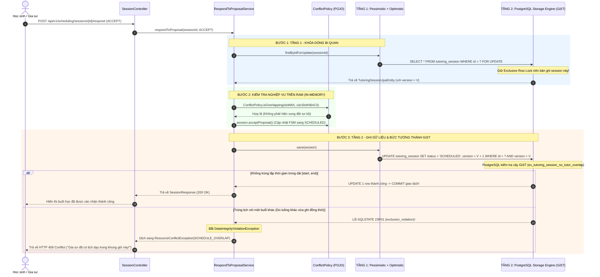

---

#### 2.3.6. So Sánh với Redis Distributed Lock & Lý Do Lựa Chọn Giải Pháp Này

Trong quá trình thiết kế kiến trúc, nhóm kỹ sư EduFit đã cân nhắc việc sử dụng **Redis Distributed Lock (Redlock)**. Tuy nhiên, giải pháp phối hợp **PostgreSQL GiST (`btree_gist`) + Pessimistic Lock** được lựa chọn vì những ưu điểm vượt trội sau:

1. **Tuân thủ triệt để nguyên lý KISS & Tối ưu hóa tài nguyên:**
   - EduFit là một kiến trúc **Modular Monolith** hoạt động trên một cơ sở dữ liệu PostgreSQL 17 duy nhất.
   - Việc đưa thêm Redis vào hệ thống đồng nghĩa với việc phát sinh thêm 1 thành phần hạ tầng độc lập cần cấu hình, bảo trì, giám sát, cấp phát bộ nhớ RAM và dự phòng sự cố (failover).
2. **Loại bỏ rủi ro mất đồng bộ giữa Cache và Database:**
   - Khóa phân tán trên Redis là khóa "ngoài luồng" (out-of-band lock). Nếu tiến trình ứng dụng bị tạm dừng vì Garbage Collection (GC pause) hoặc rớt mạng khi Redis key hết hạn (TTL expired), hai luồng vẫn có thể ghi đè dữ liệu lên database.
   - Ngược lại, **GiST Exclusion Constraint nằm ngay bên trong PostgreSQL Storage Engine**, gắn liền với giao dịch ACID. Dữ liệu chỉ được commit nếu vượt qua ràng buộc hình học này.
3. **Hiệu năng và độ tin cậy được chứng minh:**
   - Cây chỉ mục GiST hoạt động với độ phức tạp $\mathcal{O}(\log N)$, chạy hoàn toàn bằng mã C tối ưu của PostgreSQL core engine, đem lại tốc độ cực kỳ nhanh chóng và độ tin cậy 100%.

### 2.4. Thuật Toán Giao Thoa Khoảng Thời Gian Nửa Mở: Half-Open Interval $[start, end)$ (BR-42)

#### Quy tắc toán học:
Trong EduFit, một buổi học từ 14:00 đến 16:00 được định nghĩa toán học là nửa khoảng mở $[14:00, 16:00)$. Nghĩa là bao gồm thời điểm bắt đầu $14:00:00$, nhưng **không bao gồm** thời điểm kết thúc $16:00:00$.
- Do đó, buổi học tiếp theo bắt đầu lúc $16:00$ (khoảng $[16:00, 18:00)$) **hoàn toàn hợp lệ** và không bị coi là trùng lịch!

#### Công thức kiểm tra giao nhau giữa 2 khoảng $A = [S_1, E_1)$ và $B = [S_2, E_2)$:
$$\text{IsOverlapping}(A, B) \iff (S_1 < E_2) \land (S_2 < E_1)$$

#### Bảng 7 trường hợp biên (Kiểm thử BVA - Boundary Value Analysis):
| STT | Tình huống | Minh họa | Kết quả | Lý do |
|:---:|---|---|:---:|---|
| 1 | Trùng khớp hoàn toàn | $A: [14:00, 16:00), B: [14:00, 16:00)$ | **True** (Xung đột) | Trùng khít thời gian |
| 2 | B nằm lọt bên trong A | $A: [14:00, 16:00), B: [14:30, 15:30)$ | **True** (Xung đột) | B bị bao trọn |
| 3 | B bao trùm toàn bộ A | $A: [14:00, 16:00), B: [13:30, 16:30)$ | **True** (Xung đột) | A bị bao trọn |
| 4 | Chồng lấn phần đầu | $A: [14:00, 16:00), B: [13:30, 14:30)$ | **True** (Xung đột) | Giao nhau từ 14:00 đến 14:30 |
| 5 | Chồng lấn phần đuôi | $A: [14:00, 16:00), B: [15:30, 16:30)$ | **True** (Xung đột) | Giao nhau từ 15:30 đến 16:00 |
| 6 | Tiếp giáp đuôi ($E_1 = S_2$) | $A: [14:00, 16:00), B: [16:00, 18:00)$ | **False** (Hợp lệ) | Quy tắc nửa mở $[start, end)$ |
| 7 | Tiếp giáp đầu ($E_2 = S_1$) | $A: [14:00, 16:00), B: [12:00, 14:00)$ | **False** (Hợp lệ) | Quy tắc nửa mở $[start, end)$ |
| 8 | Rời rạc xa nhau | $A: [14:00, 16:00), B: [18:00, 20:00)$ | **False** (Hợp lệ) | Không có điểm chung |

### 2.5. Máy Trạng Thái Buổi Học (Finite State Machine - FSM)

Theo đặc tả database `V1.05__create_tutoring_session_tables.sql` và nghiệp vụ BR-41..48, `tutoring_session` trải qua **8 trạng thái nghiêm ngặt**:

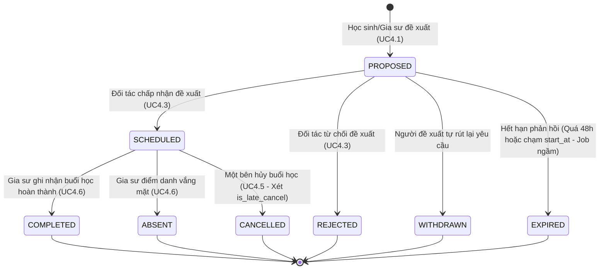

#### Quy tắc biến chuyển (State Transition Rules):
1. **Tính bất biến của trạng thái cuối (Terminal States):** Một khi buổi học đã đạt trạng thái `COMPLETED`, `ABSENT`, `CANCELLED`, `REJECTED`, `WITHDRAWN`, hoặc `EXPIRED`, **tuyệt đối không cho phép** bất kỳ hành động nào sửa đổi trạng thái của nó. Nếu cố tình vi phạm, hệ thống ném `InvalidOperationException(SESSION_ALREADY_FINALIZED)`.
2. **Quy tắc đổi lịch (`RESCHEDULE`):** Khi một bên yêu cầu dời lịch, bản ghi `tutoring_session` **vẫn giữ nguyên trạng thái `SCHEDULED`**, hệ thống tạo một bản ghi đề xuất đổi lịch trong bảng `session_reschedule_proposal` với trạng thái `PENDING`.
   - Nếu bên kia chấp nhận: `session_reschedule_proposal` $\rightarrow$ `ACCEPTED`, cập nhật `start_at` và `end_at` mới của `tutoring_session`.
   - Nếu bên kia từ chối hoặc hết hạn: `session_reschedule_proposal` $\rightarrow$ `REJECTED`/`EXPIRED`, buổi học gốc **vẫn giữ nguyên khung giờ cũ**!
   - Điều này tránh việc hủy lịch của buổi học đang có chỉ vì một lời đề nghị dời lịch chưa được chấp thuận.

---

## 3. Bản Đồ Tích Hợp Đa Phân Hệ (System Architecture & Workflows)

### 3.1. Sơ Đồ Kiến Trúc Thư Mục Chuẩn DDD Clean Architecture

Tuân thủ nghiêm ngặt [backend-module-structure-guide.md](file:///c:/University/Semester%205/SWP391/Edufit/EduFit/docs/backend-module-structure-guide.md) (Loại 2: Complex Domain):

```
backend/modules/scheduling/
├── pom.xml
└── src/
    ├── main/java/vn/edufit/scheduling/
    │   ├── api/                                      # [BỀ MẶT CÔNG KHAI - JVM RAM]
    │   │   ├── SessionFacade.java                   # Interface cho discovery, progress, review gọi
    │   │   ├── dto/
    │   │   │   ├── SessionSummaryView.java          # Java Record an toàn (chỉ chứa ID, startAt, status)
    │   │   │   ├── TutorBusySlotView.java           # Khung giờ bận để discovery loại trừ khi gợi ý
    │   │   │   └── CompletedSessionStatsView.java   # Thống kê buổi học phục vụ review & progress
    │   │   └── event/                               # Domain Events cho Notification lắng nghe
    │   │       ├── SessionProposedEvent.java
    │   │       ├── SessionScheduledEvent.java
    │   │       ├── SessionRescheduleProposedEvent.java
    │   │       ├── SessionRescheduledEvent.java
    │   │       ├── SessionCancelledEvent.java
    │   │       ├── SessionOutcomeRecordedEvent.java
    │   │       └── SessionExpiredEvent.java
    │   │
    │   ├── web/                                      # [TẦNG GIAO TIẾP HTTP REST]
    │   │   ├── SessionController.java               # Endpoints: /api/v1/scheduling/sessions & calendar
    │   │   ├── request/                             # Request DTOs kèm Jakarta Validation (@NotNull, @Future...)
    │   │   │   ├── ProposeSessionRequest.java
    │   │   │   ├── RespondProposalRequest.java
    │   │   │   ├── RescheduleSessionRequest.java
    │   │   │   ├── RespondRescheduleRequest.java
    │   │   │   ├── CancelSessionRequest.java
    │   │   │   └── RecordOutcomeRequest.java
    │   │   └── response/                            # Response DTOs bọc trong ApiResponse<T>
    │   │       ├── SessionResponse.java
    │   │       ├── CalendarItemResponse.java
    │   │       └── RescheduleProposalResponse.java
    │   │
    │   ├── domain/                                   # [TRÁI TIM NGHIỆP VỤ - POJO THUẦN 100%]
    │   │   │                                         # (KHÔNG import Spring, KHÔNG import JPA)
    │   │   ├── model/
    │   │   │   ├── TutoringSession.java             # Aggregate Root quản lý invariants
    │   │   │   ├── SessionRescheduleProposal.java   # Entity đề xuất đổi lịch
    │   │   │   ├── SessionHistory.java              # Audit Trail lịch sử thay đổi
    │   │   │   ├── SessionStatus.java               # Enum 8 trạng thái
    │   │   │   ├── SessionMode.java                 # Enum ONLINE, OFFLINE
    │   │   │   ├── CancelReason.java                # Enum lý do hủy
    │   │   │   └── ProposalStatus.java              # Enum trạng thái đổi lịch
    │   │   ├── policy/                              # Thuật toán cốt lõi
    │   │   │   ├── ConflictPolicy.java              # BR-42: Half-open interval overlap math
    │   │   │   ├── ProposalWindowPolicy.java        # BR-41: Duration 30-240m; BR-43: TTL calculation
    │   │   │   ├── LateCancelPolicy.java            # BR-46: Hủy dưới 12h -> isLateCancel = true
    │   │   │   └── SessionStateMachine.java         # BR-41..48: Ma trận chuyển trạng thái hợp lệ
    │   │   └── repository/                          # Interface repository do Domain làm chủ
    │   │       ├── TutoringSessionDomainRepository.java
    │   │       ├── SessionRescheduleProposalDomainRepository.java
    │   │       └── SessionHistoryDomainRepository.java
    │   │
    │   ├── application/                              # [TẦNG ĐIỀU PHỐI - TRANSACTION BOUNDARY]
    │   │   ├── service/
    │   │   │   ├── ProposeSessionService.java       # UC4.1: Xử lý tạo đề xuất
    │   │   │   ├── RespondToProposalService.java    # UC4.3: Xác nhận/Từ chối với Row-Lock
    │   │   │   ├── RescheduleSessionService.java    # UC4.4: Tạo & phản hồi đề xuất đổi lịch
    │   │   │   ├── CancelSessionService.java        # UC4.5: Hủy lịch & audit
    │   │   │   ├── RecordSessionOutcomeService.java # UC4.6: Ghi nhận kết quả & gọi Progress
    │   │   │   ├── GetCalendarService.java          # Tra cứu lịch học theo khoảng thời gian
    │   │   │   └── SessionFacadeImpl.java           # Triển khai SessionFacade công khai
    │   │   └── port/                                # Cổng giao tiếp ngoại vi (Dependency Inversion)
    │   │       ├── ConnectionValidationPort.java    # Kiểm tra lớp học (classId) hợp lệ
    │   │       └── ProgressSyncPort.java            # Lưu SessionNote sang module progress
    │   │
    │   └── infra/                                    # [TẦNG HẠ TẦNG & CƠ SỞ DỮ LIỆU]
    │       ├── persistence/
    │       │   ├── entity/
    │       │   │   ├── TutoringSessionJpaEntity.java       # @Entity, @Version int version
    │       │   │   ├── SessionRescheduleProposalJpaEntity.java
    │       │   │   └── SessionHistoryJpaEntity.java
    │       │   ├── repository/
    │       │   │   ├── SpringDataTutoringSessionRepository.java
    │       │   │   ├── SpringDataSessionRescheduleProposalRepository.java
    │       │   │   └── SpringDataSessionHistoryRepository.java
    │       │   ├── mapper/
    │       │   │   └── SessionMapper.java               # Ánh xạ 2 chiều: POJO <---> JPA Entity
    │       │   └── adapter/
    │       │       ├── TutoringSessionRepositoryAdapter.java
    │       │       ├── SessionRescheduleProposalRepositoryAdapter.java
    │       │       └── SessionHistoryRepositoryAdapter.java
    │       ├── job/                                 # Spring @Scheduled Background Jobs
    │       │   ├── ExpireProposalsJob.java          # FR-17: Quét đề xuất hết hạn mỗi 15 phút
    │       │   ├── OverdueOutcomeReminderJob.java   # FR-20: Nhắc gia sư ghi nhận outcome
    │       │   └── SessionReminderJob.java          # FR-31: Nhắc nhở buổi học trước 24h & 2h
    │       └── adapter/
    │           ├── ConnectionValidationAdapter.java # Gọi ConnectionFacade qua JVM RAM
    │           └── ProgressSyncAdapter.java         # Gọi ProgressFacade qua JVM RAM
    │
    └── test/
        ├── java/vn/edufit/scheduling/
        │   ├── domain/                              # Unit Test thuần POJO (Thời gian chạy tính bằng ms)
        │   │   ├── ConflictPolicyTest.java
        │   │   ├── ProposalWindowPolicyTest.java
        │   │   ├── LateCancelPolicyTest.java
        │   │   └── SessionStateMachineTest.java
        │   ├── application/                         # Unit Test Use Cases (Mockito + Clock.fixed)
        │   │   ├── ProposeSessionServiceTest.java
        │   │   ├── RespondToProposalServiceTest.java
        │   │   └── CancelSessionServiceTest.java
        │   └── integration/                         # Integration Test với Testcontainers PostgreSQL
        │       └── ConcurrentSchedulingIT.java      # NFR-17: Stress Test 10 threads tranh chấp
        └── resources/testdata/                      # Kịch bản kiểm thử tham số hóa CSV
            ├── conflict-policy-intervals.csv
            ├── session-state-transitions.csv
            ├── proposal-window-rules.csv
            └── late-cancel-rules.csv
```

---

### 3.2. Chi Tiết Các Luồng Thực Thi Nghiệp Vụ (Workflows & Sequence Diagrams)

#### Workflow 1: Đề Xuất Buổi Học & Chống Trùng Lịch Đồng Thời (Luồng 3 - SADS)

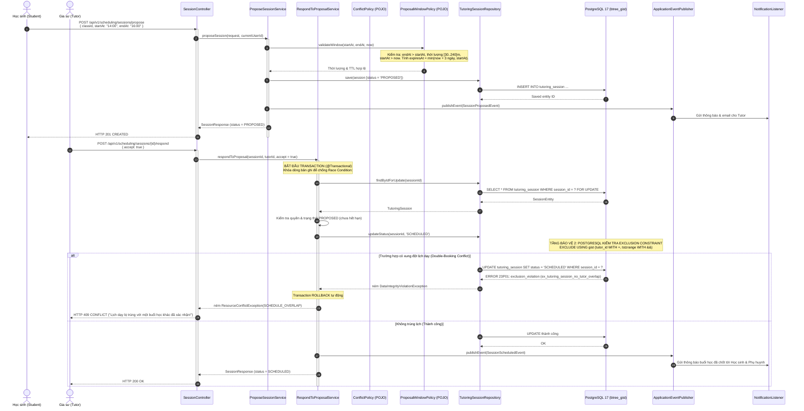

---

#### Workflow 2: Ghi Nhận Kết Quả Buổi Học & Đồng Bộ Tiến Độ (Luồng 4 - SADS)

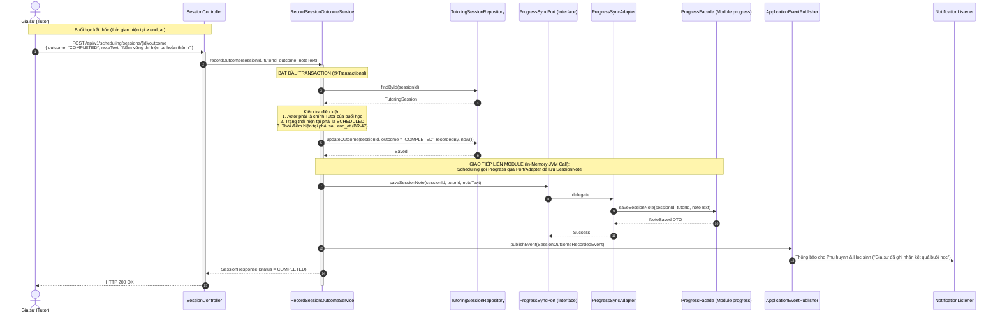

---

#### Workflow 3: Tác Vụ Lập Lịch Ngầm Tự Động (Background Scheduled Jobs)

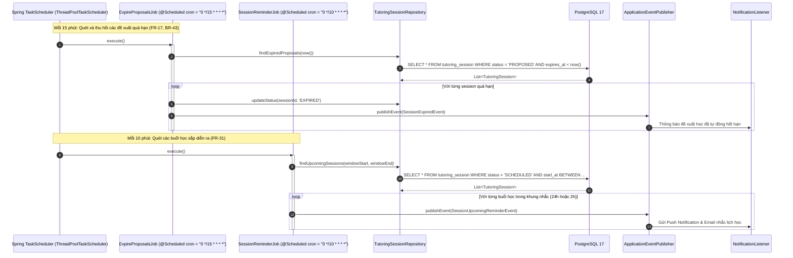

---

### 3.3. Sơ Đồ Khối Luồng Logic Mã Nguồn Chi Tiết (Code Logic Flowcharts)

Phần này mô tả chi tiết logic rẽ nhánh, kiểm tra điều kiện (Decision Points), bẫy ngoại lệ và xử lý dữ liệu bên trong từng class nghiệp vụ để tiện theo dõi và đối chiếu với mã nguồn.

#### Flowchart 1: Thuật Toán Kiểm Tra Giao Thoa Thời Gian Nửa Mở (`ConflictPolicy.isOverlapping`)

Mô tả thuật toán kiểm tra chồng lấn thời gian theo quy tắc nửa mở $[start, end)$ (BR-42):

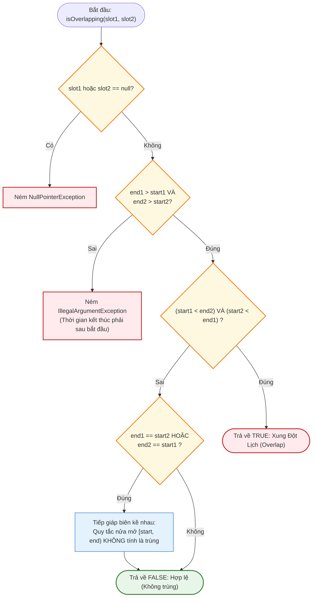

---

#### Flowchart 2: Luồng Xử Lý Đề Xuất Buổi Học Mới (`ProposeSessionService`)

Mô tả toàn bộ quá trình đón nhận yêu cầu đề xuất, kiểm tra nghiệp vụ và phát sinh bản ghi:

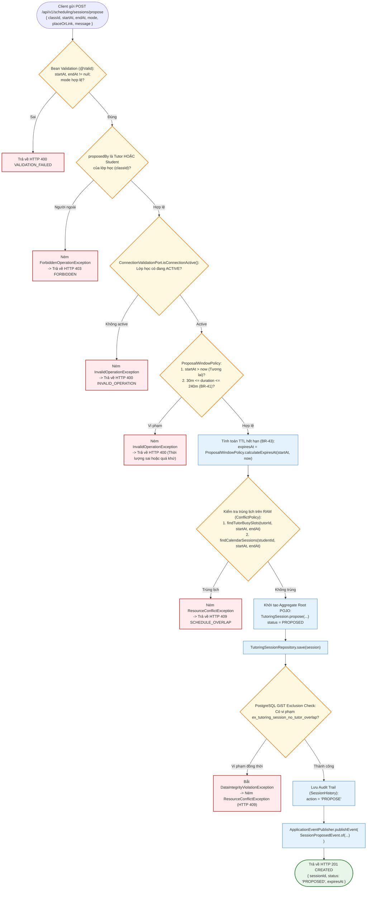

---

#### Flowchart 3: Luồng Xác Nhận Buổi Học & Chống Trùng Lặp 2 Tầng (`RespondToProposalService`)

Mô tả cơ chế khóa bi quan (Pessimistic Row Lock) kết hợp PostgreSQL GiST Exclusion Constraint chống Race Condition tuyệt đối:

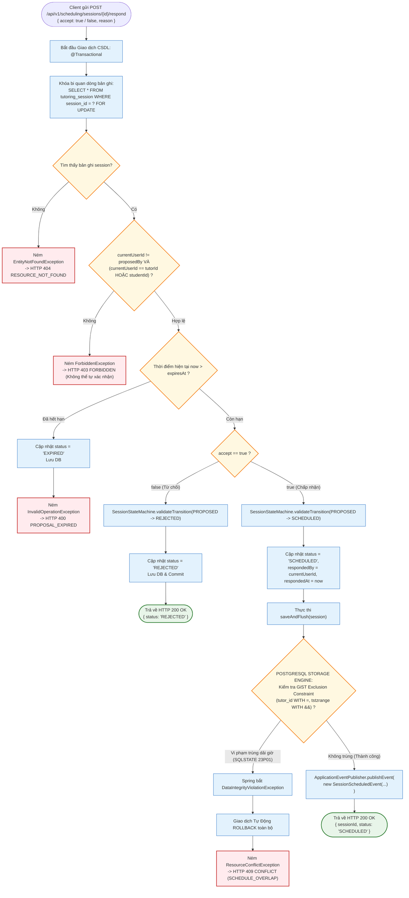

---

#### Flowchart 4: Luồng Hủy Buổi Học & Phân Loại Hủy Trễ (`CancelSessionService`)

Mô tả thuật toán kiểm tra ngưỡng 12 giờ trước giờ học và cập nhật Audit Trail:

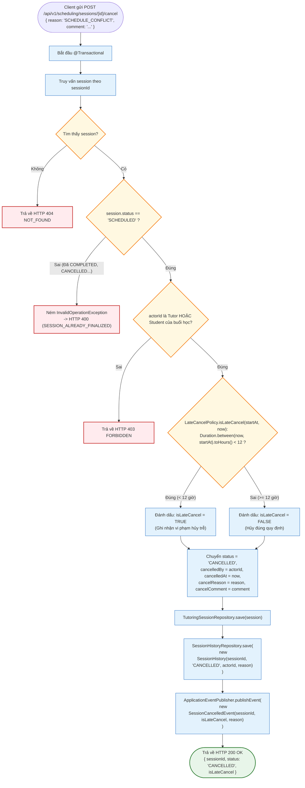

---

#### Flowchart 5: Luồng Đề Xuất & Phản Hồi Đổi Lịch (`RescheduleSessionService`)

Mô tả nghiệp vụ đàm phán đổi thời gian buổi học theo BR-44:

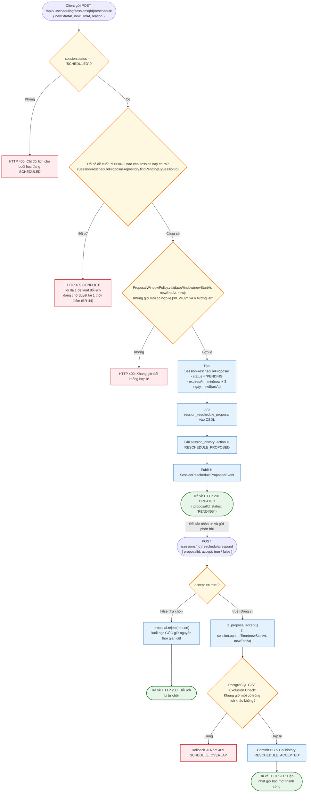

---

#### Flowchart 6: Luồng Quét Tự Động Định Kỳ của Scheduled Background Jobs (`ExpireProposalsJob`)

Mô tả tiến trình tự động thu hồi đề xuất quá hạn chạy trên `ThreadPoolTaskScheduler` (FR-17):

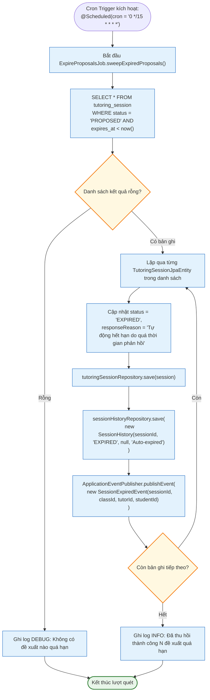

---

#### Flowchart 7: Luồng Ghi Nhận Kết Quả Buổi Học & Đồng Bộ Biên Bản Học Tập (`RecordSessionOutcomeService`)

Mô tả logic xử lý Use Case UC4.6 khi Gia sư ghi nhận buổi học hoàn thành (`COMPLETED`) hoặc vắng mặt (`ABSENT`), và chuyển tiếp `SessionNote` sang phân hệ `progress`:

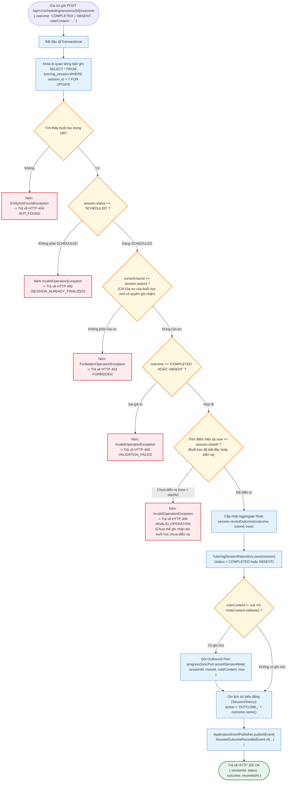

---

#### Flowchart 8: Cơ Chế Điều Phối Độc Lập Qua Outbound Port & Adapter (`ConnectionValidationPort` & `@ConditionalOnProperty`)

Mô tả cơ chế chuyển mạch Adapter thông minh giúp phân hệ `scheduling` phát triển và test độc lập với tiến độ của phân hệ `connection`:

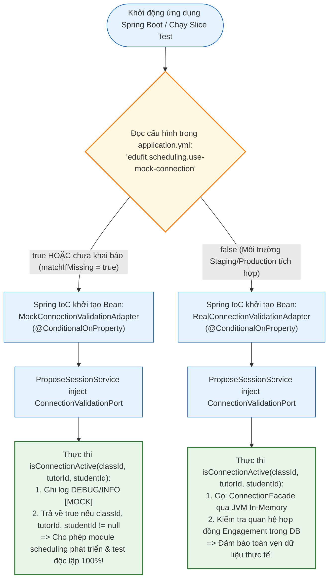

---

#### Flowchart 9: Luồng Tra Cứu Xuyên Phân Hệ Qua `SessionFacade` (Modular Monolith Public Contract)

Mô tả cách các phân hệ khác (`discovery`, `progress`, `review`) truy vấn dữ liệu lịch học qua Interface công khai duy nhất mà không làm rò rỉ JPA Entity hoặc vi phạm tính đóng gói:

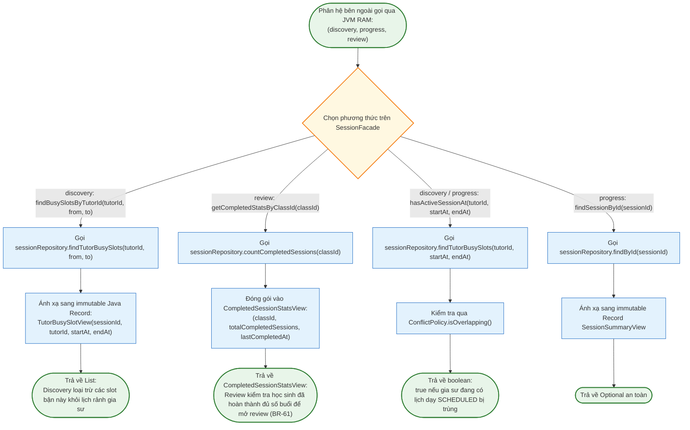

---

## 4. Giải Phẫu Từng File & Lý Do Tồn Tại (File Anatomy & Architectural Rationale)

Bảng phân tích giải thích vì sao từng file lại tồn tại, nó giải quyết bài toán gì, và nếu không có nó thì hệ thống sẽ gặp sự cố gì:

| File Name & Path | Thuộc Tầng | Giải Quyết Bài Toán Gì? | Nếu Không Có Nó Thì Hậu Quả Gì? |
|---|---|---|---|
| `api/SessionFacade.java` | `api/` | Cung cấp interface công khai duy nhất cho các module khác (`discovery`, `progress`, `review`) truy vấn dữ liệu lịch học. | Các module ngoài sẽ inject trực tiếp `SessionRepository`, dẫn đến vi phạm Modular Monolith, coupling chặt, không thể refactor DB sau này. |
| `api/dto/SessionSummaryView.java` | `api/` | Record mang thông tin an toàn trả ra ngoài JVM. | Nếu để lộ JPA Entity ra ngoài module khác, module đó có thể vô tình gọi setter làm biến đổi dữ liệu ngoài ranh giới Transaction hoặc bị `LazyInitializationException`. |
| `api/event/SessionScheduledEvent.java` | `api/` | Phát sự kiện miền khi lịch học được chốt để `notification` tự nghe và gửi tin. | Module `scheduling` sẽ phải phụ thuộc trực tiếp vào `notification` (tạo vòng lặp phụ thuộc Circular Dependency hoặc Coupling cao). |
| `domain/model/TutoringSession.java` | `domain/` | Aggregate Root quản lý trạng thái, phiên bản và quy tắc bất biến bằng **Java thuần túy**. | Nghiệp vụ bị phân tán vào tầng Service hoặc DB Trigger, không thể viết Unit Test kiểm thử logic nghiệp vụ độc lập mà không bật Spring. |
| `domain/policy/ConflictPolicy.java` | `domain/` | Đóng gói thuật toán toán học kiểm tra chồng lấn dải thời gian nửa mở $[start, end)$. | Logic toán học bị viết lẫn trong SQL hoặc Service, kiểm thử trường hợp biên rất khó khăn và dễ gây lỗi lặp code (DRY violation). |
| `domain/policy/ProposalWindowPolicy.java` | `domain/` | Kiểm tra thời lượng buổi học $[30..240]$ phút và tính toán thời hạn hết hạn đề xuất ($TTL$). | Dữ liệu rác (buổi học 1 phút hoặc 24 tiếng) lọt vào hệ thống; thời hạn hết hạn bị tính sai gây tranh cãi giữa học sinh và gia sư. |
| `domain/policy/LateCancelPolicy.java` | `domain/` | Kiểm tra quy tắc hủy trễ: nếu hủy dưới 12 giờ trước giờ học thì đánh dấu `isLateCancel = true`. | Học sinh hoặc Gia sư bùng lịch sát giờ mà hệ thống không ghi nhận vết vi phạm, gây thiệt hại uy tín nền tảng. |
| `domain/policy/SessionStateMachine.java` | `domain/` | Ma trận kiểm soát chuyển trạng thái hợp lệ giữa 8 trạng thái. | Người dùng có thể gọi API chuyển trực tiếp từ `PROPOSED` sang `COMPLETED`, hoặc "hồi sinh" một buổi học đã bị hủy (`CANCELLED`). |
| `application/service/ProposeSessionService.java` | `application/` | Nhạc trưởng điều phối use case Đề xuất buổi học, quản lý ranh giới `@Transactional`. | Controller sẽ phải gánh toàn bộ logic nghiệp vụ (Fat Controller), vi phạm Single Responsibility Principle. |
| `application/service/RespondToProposalService.java` | `application/` | Điều phối chấp nhận/từ chối đề xuất, kích hoạt cơ chế khóa dòng (`Pessimistic Locking`). | Dễ xảy ra Race Condition khi 2 bên cùng phản hồi một lúc. |
| `infra/persistence/entity/TutoringSessionJpaEntity.java` | `infra/` | Ánh xạ bảng CSDL `tutoring_session`, chứa `@Version private int version;`. | Thiếu Optimistic Locking, dẫn đến nguy cơ Lost Update khi 2 người dùng cùng sửa ghi chú hoặc hủy lịch cùng một giây. |
| `infra/persistence/mapper/SessionMapper.java` | `infra/` | Ánh xạ 2 chiều giữa Domain POJO và JPA Entity. | Buộc Domain Model phải mang các annotation JPA/Hibernate, làm vấy bẩn tính độc lập của kiến trúc Clean Architecture. |
| `infra/job/ExpireProposalsJob.java` | `infra/` | Cron job chạy ngầm định kỳ quét đề xuất quá hạn chuyển sang `EXPIRED`. | Đề xuất cũ bị treo vĩnh viễn ở trạng thái `PROPOSED`, làm tắc nghẽn lịch học và gây hiểu nhầm cho gia sư. |

---

## 5. User Review Required (Những Điểm Cần Người Dùng Xác Nhận)

> [!IMPORTANT]
> **Điểm 1: Quy ước thời gian UTC và Múi giờ Hiển thị (NFR-18)**
> Mọi trường thời gian (`start_at`, `end_at`, `expires_at`) trong database `tutoring_session` đều lưu trữ dưới dạng **`TIMESTAMPTZ` (UTC)**.
> - Khi gửi từ Next.js lên Backend: Frontend bắt buộc gửi chuỗi ISO-8601 UTC (ví dụ: `2026-10-25T07:00:00Z`).
> - Khi trả về Frontend: Backend trả chuỗi ISO-8601 UTC, Frontend chịu trách nhiệm format về múi giờ địa phương của người dùng (`Asia/Ho_Chi_Minh` - GMT+7).

> [!IMPORTANT]
> **Điểm 2: Cơ chế khóa khi Phản hồi Buổi học (`RespondToProposalService`)**
> Khi Gia sư hoặc Học sinh bấm Xác nhận buổi học (`status -> SCHEDULED`), hệ thống sẽ:
> 1. Gọi `tutoringSessionRepository.findByIdForUpdate(sessionId)` để khóa dòng dữ liệu (`SELECT ... FOR UPDATE`).
> 2. Đổi trạng thái sang `SCHEDULED` và ghi xuống DB.
> 3. Cơ sở dữ liệu kích hoạt **PostgreSQL Exclusion GiST (`ex_tutoring_session_no_tutor_overlap`)**. Nếu có xung đột, Spring bắt `DataIntegrityViolationException` và ném `ResourceConflictException(SCHEDULE_OVERLAP)` trả về HTTP 409. Bạn có đồng ý với thiết kế này không?

> [!WARNING]
> **Điểm 3: Tần suất chạy Scheduled Jobs (`ExpireProposalsJob` & `SessionReminderJob`)**
> Đề xuất cấu hình tần suất quét:
> - `ExpireProposalsJob`: Chạy mỗi 15 phút (`0 */15 * * * *`).
> - `SessionReminderJob`: Chạy mỗi 10 phút (`0 */10 * * * *`).
> - `OverdueOutcomeReminderJob`: Chạy mỗi 30 phút (`0 */30 * * * *`).
> Bạn có muốn thay đổi chu kỳ này thành thời gian khác không?

---

## 6. Open Questions (Câu Hỏi Cần Làm Rõ)

> [!NOTE]
> 1. **Về việc Đổi Lịch (`RESCHEDULE`):** Hiện tại theo thiết kế `session_reschedule_proposal`, chỉ cho phép **tối đa 1 đề xuất đổi lịch ở trạng thái `PENDING`** cho mỗi buổi học tại một thời điểm (được bảo vệ bởi partial unique index `uq_session_reschedule_pending`). Bạn có muốn cho phép hủy đề xuất đổi lịch cũ để tạo đề xuất mới không? (Kế hoạch hiện tại: Hỗ trợ nút `WITHDRAW` cho người đề xuất).
> 2. **Về Giao Tiếp với Module `connection`:** Khi gọi `POST /sessions/propose`, hệ thống cần kiểm tra `classId` có đang `ACTIVE` không. Do `modules/connection` chưa triển khai hoàn chỉnh, tầng `application` của `scheduling` sẽ định nghĩa port `ConnectionValidationPort`, và triển khai một Mock Adapter tạm thời trong Sprint 3 trước khi module `connection` hoàn tất. Bạn có đồng ý phương án này không?

---

## 7. Đề Xuất Mã Nguồn Chi Tiết (Proposed Changes)

Dưới đây là chi tiết mã nguồn hoàn chỉnh của các lớp cốt lõi trong phân hệ `scheduling`.

### 7.1. Tầng Domain (Java Thuần - POJO)

#### [NEW] `ConflictPolicy.java`
*Đường dẫn:* `backend/modules/scheduling/src/main/java/vn/edufit/scheduling/domain/policy/ConflictPolicy.java`
*Mục đích:* Hiện thực hóa thuật toán kiểm tra giao thoa khoảng thời gian nửa mở $[start, end)$ theo BR-42 và NFR-17.

```java
package vn.edufit.scheduling.domain.policy;

import java.util.Objects;
import vn.edufit.shared.domain.valueobject.TimeInterval;

/**
 * Chính sách miền (Domain Policy) chịu trách nhiệm kiểm tra xung đột thời gian (BR-42).
 * Viết bằng Java thuần (POJO), hoàn toàn không phụ thuộc vào Spring hoặc cơ sở dữ liệu.
 */
public class ConflictPolicy {

  /**
   * Kiểm tra xem hai khoảng thời gian có bị giao nhau (xung đột) hay không.
   * Tuân thủ quy tắc nửa mở [start, end): Điểm kết thúc của khoảng này trùng điểm bắt đầu của khoảng kia là HỢP LỆ.
   *
   * @param slot1 Khoảng thời gian thứ nhất.
   * @param slot2 Khoảng thời gian thứ hai.
   * @return {@code true} nếu bị chồng lấn (xung đột), ngược lại {@code false}.
   */
  public boolean isOverlapping(TimeInterval slot1, TimeInterval slot2) {
    Objects.requireNonNull(slot1, "Khoảng thời gian slot1 không được null");
    Objects.requireNonNull(slot2, "Khoảng thời gian slot2 không được null");
    return slot1.overlapsWith(slot2);
  }
}
```

#### [NEW] `ProposalWindowPolicy.java`
*Đường dẫn:* `backend/modules/scheduling/src/main/java/vn/edufit/scheduling/domain/policy/ProposalWindowPolicy.java`
*Mục đích:* Kiểm tra thời lượng hợp lệ $[30..240]$ phút (BR-41) và tính toán thời hạn phản hồi `expiresAt` (BR-43).

```java
package vn.edufit.scheduling.domain.policy;

import java.time.Duration;
import java.time.Instant;
import java.time.temporal.ChronoUnit;
import vn.edufit.shared.exception.ErrorCode;
import vn.edufit.shared.exception.InvalidOperationException;

public class ProposalWindowPolicy {

  public static final long MIN_DURATION_MINUTES = 30;
  public static final long MAX_DURATION_MINUTES = 240;
  public static final long PROPOSAL_EXPIRY_DAYS = 3;

  public void validateWindow(Instant startAt, Instant endAt, Instant now) {
    if (startAt == null || endAt == null) {
      throw new InvalidOperationException(ErrorCode.VALIDATION_FAILED, "Thời gian bắt đầu và kết thúc không được null");
    }
    if (!startAt.isAfter(now)) {
      throw new InvalidOperationException(ErrorCode.VALIDATION_FAILED, "Thời gian bắt đầu phải ở trong tương lai");
    }
    if (!endAt.isAfter(startAt)) {
      throw new InvalidOperationException(ErrorCode.VALIDATION_FAILED, "Thời gian kết thúc phải sau thời gian bắt đầu");
    }

    long durationMinutes = Duration.between(startAt, endAt).toMinutes();
    if (durationMinutes < MIN_DURATION_MINUTES || durationMinutes > MAX_DURATION_MINUTES) {
      throw new InvalidOperationException(
          ErrorCode.VALIDATION_FAILED,
          "Thời lượng buổi học phải từ 30 đến 240 phút. Thực tế: " + durationMinutes + " phút"
      );
    }
  }

  public Instant calculateExpiresAt(Instant startAt, Instant now) {
    Instant maxExpiry = now.plus(PROPOSAL_EXPIRY_DAYS, ChronoUnit.DAYS);
    // Thời hạn là giá trị nhỏ hơn giữa (now + 3 ngày) và startAt
    return maxExpiry.isBefore(startAt) ? maxExpiry : startAt;
  }
}
```

#### [NEW] `SessionStateMachine.java`
*Đường dẫn:* `backend/modules/scheduling/src/main/java/vn/edufit/scheduling/domain/policy/SessionStateMachine.java`
*Mục đích:* Kiểm soát tính toàn vẹn của việc chuyển đổi giữa 8 trạng thái phiên học (BR-41..48).

```java
package vn.edufit.scheduling.domain.policy;

import java.util.EnumSet;
import java.util.Map;
import java.util.Set;
import vn.edufit.scheduling.domain.model.SessionStatus;
import vn.edufit.shared.exception.ErrorCode;
import vn.edufit.shared.exception.InvalidOperationException;

public class SessionStateMachine {

  private static final Map<SessionStatus, Set<SessionStatus>> ALLOWED_TRANSITIONS = Map.of(
      SessionStatus.PROPOSED, EnumSet.of(
          SessionStatus.SCHEDULED,
          SessionStatus.REJECTED,
          SessionStatus.WITHDRAWN,
          SessionStatus.EXPIRED
      ),
      SessionStatus.SCHEDULED, EnumSet.of(
          SessionStatus.COMPLETED,
          SessionStatus.ABSENT,
          SessionStatus.CANCELLED
      ),
      SessionStatus.COMPLETED, EnumSet.noneOf(SessionStatus.class),
      SessionStatus.ABSENT, EnumSet.noneOf(SessionStatus.class),
      SessionStatus.CANCELLED, EnumSet.noneOf(SessionStatus.class),
      SessionStatus.REJECTED, EnumSet.noneOf(SessionStatus.class),
      SessionStatus.WITHDRAWN, EnumSet.noneOf(SessionStatus.class),
      SessionStatus.EXPIRED, EnumSet.noneOf(SessionStatus.class)
  );

  public void validateTransition(SessionStatus from, SessionStatus to) {
    if (from.isTerminal()) {
      throw new InvalidOperationException(
          ErrorCode.SESSION_ALREADY_FINALIZED,
          "Buổi học đã kết thúc ở trạng thái " + from + ", không thể thay đổi trạng thái!"
      );
    }

    Set<SessionStatus> validTargets = ALLOWED_TRANSITIONS.getOrDefault(from, Set.of());
    if (!validTargets.contains(to)) {
      throw new InvalidOperationException(
          ErrorCode.INVALID_OPERATION,
          "Chuyển đổi trạng thái không hợp lệ từ " + from + " sang " + to
      );
    }
  }
}
```

---

### 7.2. Tầng Hạ Tầng & Cơ Sở Dữ Liệu (Infrastructure Layer)

#### [NEW] `SpringDataTutoringSessionRepository.java`
*Đường dẫn:* `backend/modules/scheduling/src/main/java/vn/edufit/scheduling/infra/persistence/repository/SpringDataTutoringSessionRepository.java`

```java
package vn.edufit.scheduling.infra.persistence.repository;

import jakarta.persistence.LockModeType;
import java.time.Instant;
import java.util.List;
import java.util.Optional;
import java.util.UUID;
import org.springframework.data.jpa.repository.JpaRepository;
import org.springframework.data.jpa.repository.Lock;
import org.springframework.data.jpa.repository.Query;
import org.springframework.data.repository.query.Param;
import org.springframework.stereotype.Repository;
import vn.edufit.scheduling.infra.persistence.entity.TutoringSessionJpaEntity;

@Repository
public interface SpringDataTutoringSessionRepository extends JpaRepository<TutoringSessionJpaEntity, UUID> {

  /**
   * Khóa bi quan trên dòng bản ghi (SELECT ... FOR UPDATE) để ngăn chặn Race Condition.
   */
  @Lock(LockModeType.PESSIMISTIC_WRITE)
  @Query("SELECT s FROM TutoringSessionJpaEntity s WHERE s.sessionId = :id")
  Optional<TutoringSessionJpaEntity> findByIdForUpdate(@Param("id") UUID id);

  @Query("""
      SELECT s FROM TutoringSessionJpaEntity s
      WHERE s.status = 'PROPOSED' AND s.expiresAt < :now
  """)
  List<TutoringSessionJpaEntity> findExpiredProposals(@Param("now") Instant now);

  @Query("""
      SELECT s FROM TutoringSessionJpaEntity s
      WHERE (s.tutorId = :userId OR s.studentId = :userId)
        AND s.startAt >= :from AND s.endAt <= :to
      ORDER BY s.startAt ASC
  """)
  List<TutoringSessionJpaEntity> findCalendarSessions(
      @Param("userId") UUID userId,
      @Param("from") Instant from,
      @Param("to") Instant to
  );

  @Query("""
      SELECT s FROM TutoringSessionJpaEntity s
      WHERE s.tutorId = :tutorId
        AND s.status = 'SCHEDULED'
        AND s.startAt >= :from AND s.endAt <= :to
  """)
  List<TutoringSessionJpaEntity> findTutorBusySlots(
      @Param("tutorId") UUID tutorId,
      @Param("from") Instant from,
      @Param("to") Instant to
  );
}
```

---

### 7.3. Tầng Ứng Dụng (Application Layer)

#### [NEW] `RespondToProposalService.java`
*Đường dẫn:* `backend/modules/scheduling/src/main/java/vn/edufit/scheduling/application/service/RespondToProposalService.java`

```java
package vn.edufit.scheduling.application.service;

import java.time.Clock;
import java.time.Instant;
import java.util.UUID;
import lombok.RequiredArgsConstructor;
import lombok.extern.slf4j.Slf4j;
import org.springframework.context.ApplicationEventPublisher;
import org.springframework.dao.DataIntegrityViolationException;
import org.springframework.stereotype.Service;
import org.springframework.transaction.annotation.Transactional;
import vn.edufit.scheduling.api.event.SessionScheduledEvent;
import vn.edufit.scheduling.domain.model.SessionStatus;
import vn.edufit.scheduling.domain.policy.SessionStateMachine;
import vn.edufit.scheduling.infra.persistence.entity.TutoringSessionJpaEntity;
import vn.edufit.scheduling.infra.persistence.repository.SpringDataTutoringSessionRepository;
import vn.edufit.scheduling.web.response.SessionResponse;
import vn.edufit.shared.exception.EntityNotFoundException;
import vn.edufit.shared.exception.ErrorCode;
import vn.edufit.shared.exception.ForbiddenException;
import vn.edufit.shared.exception.InvalidOperationException;
import vn.edufit.shared.exception.ResourceConflictException;

@Slf4j
@Service
@RequiredArgsConstructor
public class RespondToProposalService {

  private final SpringDataTutoringSessionRepository sessionRepository;
  private final SessionStateMachine stateMachine;
  private final ApplicationEventPublisher eventPublisher;
  private final Clock clock;

  @Transactional
  public SessionResponse respond(UUID sessionId, UUID currentUserId, boolean accept, String reason) {
    Instant now = clock.instant();

    // 1. Khóa bi quan dòng bản ghi trong database
    TutoringSessionJpaEntity entity = sessionRepository.findByIdForUpdate(sessionId)
        .orElseThrow(() -> new EntityNotFoundException(ErrorCode.RESOURCE_NOT_FOUND, "Không tìm thấy buổi học"));

    // 2. Kiểm tra quyền hạn: Người phản hồi phải là bên còn lại (không phải người đề xuất)
    if (entity.getProposedBy().equals(currentUserId)) {
      throw new ForbiddenException(ErrorCode.FORBIDDEN, "Bạn không thể tự phản hồi đề xuất do chính mình tạo ra");
    }
    if (!entity.getTutorId().equals(currentUserId) && !entity.getStudentId().equals(currentUserId)) {
      throw new ForbiddenException(ErrorCode.FORBIDDEN, "Bạn không có quyền tham gia buổi học này");
    }

    // 3. Kiểm tra hạn phản hồi
    if (entity.getExpiresAt().isBefore(now)) {
      entity.setStatus(SessionStatus.EXPIRED.name());
      sessionRepository.save(entity);
      throw new InvalidOperationException(ErrorCode.PROPOSAL_EXPIRED, "Đề xuất buổi học đã quá hạn phản hồi");
    }

    SessionStatus currentStatus = SessionStatus.valueOf(entity.getStatus());
    SessionStatus targetStatus = accept ? SessionStatus.SCHEDULED : SessionStatus.REJECTED;

    // 4. Kiểm tra máy trạng thái
    stateMachine.validateTransition(currentStatus, targetStatus);

    entity.setStatus(targetStatus.name());
    entity.setRespondedBy(currentUserId);
    entity.setRespondedAt(now);
    entity.setResponseReason(reason);

    try {
      // 5. Lưu xuống DB (Nếu trùng lịch, PostgreSQL GiST ném DataIntegrityViolationException tại đây)
      entity = sessionRepository.saveAndFlush(entity);
    } catch (DataIntegrityViolationException ex) {
      log.warn("Phát hiện xung đột lịch (Double-Booking) qua PostgreSQL Exclusion GiST: {}", ex.getMessage());
      throw new ResourceConflictException(
          ErrorCode.SCHEDULE_OVERLAP,
          "Khung giờ này đã bị trùng với một buổi học khác đã xác nhận của bạn hoặc đối tác"
      );
    }

    // 6. Phát Domain Event khi chốt lịch thành công
    if (accept) {
      eventPublisher.publishEvent(new SessionScheduledEvent(
          entity.getSessionId(),
          entity.getClassId(),
          entity.getTutorId(),
          entity.getStudentId(),
          entity.getStartAt(),
          entity.getEndAt()
      ));
    }

    return SessionResponse.fromEntity(entity);
  }
}
```

---

### 7.4. Tầng Tác Vụ Lập Lịch Ngầm (Background Scheduled Jobs)

#### [NEW] `ExpireProposalsJob.java`
*Đường dẫn:* `backend/modules/scheduling/src/main/java/vn/edufit/scheduling/infra/job/ExpireProposalsJob.java`

```java
package vn.edufit.scheduling.infra.job;

import java.time.Clock;
import java.time.Instant;
import java.util.List;
import lombok.RequiredArgsConstructor;
import lombok.extern.slf4j.Slf4j;
import org.springframework.context.ApplicationEventPublisher;
import org.springframework.scheduling.annotation.Scheduled;
import org.springframework.stereotype.Component;
import org.springframework.transaction.annotation.Transactional;
import vn.edufit.scheduling.api.event.SessionExpiredEvent;
import vn.edufit.scheduling.domain.model.SessionStatus;
import vn.edufit.scheduling.infra.persistence.entity.TutoringSessionJpaEntity;
import vn.edufit.scheduling.infra.persistence.repository.SpringDataTutoringSessionRepository;

/**
 * Tác vụ ngầm định kỳ quét các đề xuất buổi học quá hạn (FR-17, BR-43).
 * Chạy trên ThreadPoolTaskScheduler cấu hình trong SchedulingConfig.
 */
@Slf4j
@Component
@RequiredArgsConstructor
public class ExpireProposalsJob {

  private final SpringDataTutoringSessionRepository sessionRepository;
  private final ApplicationEventPublisher eventPublisher;
  private final Clock clock;

  @Scheduled(cron = "${edufit.jobs.expire-proposals.cron:0 */15 * * * *}")
  @Transactional
  public void sweepExpiredProposals() {
    Instant now = clock.instant();
    List<TutoringSessionJpaEntity> expiredEntities = sessionRepository.findExpiredProposals(now);

    if (expiredEntities.isEmpty()) {
      return;
    }

    log.info("Bắt đầu xử lý {} đề xuất buổi học đã quá hạn tại mốc thời gian {}", expiredEntities.size(), now);
    for (TutoringSessionJpaEntity session : expiredEntities) {
      session.setStatus(SessionStatus.EXPIRED.name());
      sessionRepository.save(session);

      eventPublisher.publishEvent(new SessionExpiredEvent(
          session.getSessionId(),
          session.getClassId(),
          session.getTutorId(),
          session.getStudentId()
      ));
    }
    log.info("Hoàn tất thu hồi các đề xuất buổi học quá hạn.");
  }
}
```

---

## 8. Kế Hoạch Kiểm Thử Tham Số Hóa (Data-Driven Test Plan)

### 8.1. Kịch Bản Kiểm Thử Chồng Lấn Thời Gian Với CSV (`ConflictPolicyTest`)

#### [NEW] `conflict-policy-intervals.csv`
*Đường dẫn:* `backend/modules/scheduling/src/test/resources/testdata/conflict-policy-intervals.csv`

```csv
testCaseId,existingStart,existingEnd,newStart,newEnd,expectedConflict,description
TC_CONF_01,14:00,16:00,14:00,16:00,true,Trùng khớp hoàn toàn cùng khung giờ
TC_CONF_02,14:00,16:00,14:30,15:30,true,Khung giờ mới nằm lọt hoàn toàn bên trong
TC_CONF_03,14:00,16:00,13:30,16:30,true,Khung giờ mới bao trùm hoàn toàn khung giờ cũ
TC_CONF_04,14:00,16:00,13:30,14:30,true,Chồng lấn một phần ở đầu (Overlaps start)
TC_CONF_05,14:00,16:00,15:30,16:30,true,Chồng lấn một phần ở cuối (Overlaps end)
TC_CONF_06,14:00,16:00,12:00,14:00,false,Biên kề nhau: Kết thúc cũ đúng bằng bắt đầu mới (Không trùng theo nửa mở)
TC_CONF_07,14:00,16:00,16:00,18:00,false,Biên kề nhau: Kết thúc mới đúng bằng bắt đầu cũ (Không trùng theo nửa mở)
TC_CONF_08,14:00,16:00,18:00,20:00,false,Cách xa nhau hoàn toàn (Không trùng)
```

#### [NEW] `ConflictPolicyTest.java`
*Đường dẫn:* `backend/modules/scheduling/src/test/java/vn/edufit/scheduling/domain/ConflictPolicyTest.java`

```java
package vn.edufit.scheduling.domain;

import static org.junit.jupiter.api.Assertions.assertEquals;

import java.time.LocalDate;
import java.time.LocalTime;
import org.junit.jupiter.api.BeforeEach;
import org.junit.jupiter.api.DisplayName;
import org.junit.jupiter.params.ParameterizedTest;
import org.junit.jupiter.params.provider.CsvFileSource;
import vn.edufit.scheduling.domain.policy.ConflictPolicy;
import vn.edufit.shared.domain.valueobject.TimeInterval;

@DisplayName("Unit Test POJO: Kiểm thử thuật toán chống trùng lịch BR-42")
class ConflictPolicyTest {

  private ConflictPolicy conflictPolicy;

  @BeforeEach
  void setUp() {
    conflictPolicy = new ConflictPolicy();
  }

  @ParameterizedTest(name = "[{0}] {6}: ({1}->{2}) vs ({3}->{4}) => Xung đột: {5}")
  @CsvFileSource(resources = "/testdata/conflict-policy-intervals.csv", numLinesToSkip = 1)
  @DisplayName("BR-42: Kiểm thử tham số hóa toàn diện 8 ca biên giao thoa thời gian nửa mở")
  void shouldEvaluateIntervalConflictCorrectly(
      String testCaseId,
      String existingStart,
      String existingEnd,
      String newStart,
      String newEnd,
      boolean expectedConflict,
      String description
  ) {
    LocalDate date = LocalDate.of(2026, 10, 25);
    TimeInterval slot1 = new TimeInterval(
        date.atTime(LocalTime.parse(existingStart)),
        date.atTime(LocalTime.parse(existingEnd))
    );
    TimeInterval slot2 = new TimeInterval(
        date.atTime(LocalTime.parse(newStart)),
        date.atTime(LocalTime.parse(newEnd))
    );

    boolean actualConflict = conflictPolicy.isOverlapping(slot1, slot2);
    assertEquals(expectedConflict, actualConflict, description);
  }
}
```

---

### 8.2. Kịch Bản Kiểm Thử Tranh Chấp Đồng Thời Với Testcontainers (NFR-17)

#### [NEW] `ConcurrentSchedulingIT.java`
*Đường dẫn:* `backend/modules/scheduling/src/test/java/vn/edufit/scheduling/integration/ConcurrentSchedulingIT.java`
*Mục đích:* Giả lập 10 Threads cùng lúc gửi request chấp nhận buổi học trên cùng một slot thời gian của cùng 1 Gia sư để xác thực cơ chế bảo vệ 2 tầng.

```java
package vn.edufit.scheduling.integration;

import static org.assertj.core.api.Assertions.assertThat;

import java.time.Instant;
import java.time.temporal.ChronoUnit;
import java.util.UUID;
import java.util.concurrent.CountDownLatch;
import java.util.concurrent.ExecutorService;
import java.util.concurrent.Executors;
import java.util.concurrent.atomic.AtomicInteger;
import org.junit.jupiter.api.DisplayName;
import org.junit.jupiter.api.Test;
import org.springframework.beans.factory.annotation.Autowired;
import org.springframework.boot.test.context.SpringBootTest;
import org.testcontainers.junit.jupiter.Testcontainers;
import vn.edufit.scheduling.application.service.RespondToProposalService;
import vn.edufit.shared.exception.ResourceConflictException;

@SpringBootTest
@Testcontainers
class ConcurrentSchedulingIT {

  @Autowired
  private RespondToProposalService respondService;

  @Test
  @DisplayName("NFR-17: 10 threads đồng thời chấp nhận cùng 1 khung giờ -> Duy nhất 1 thread thành công, 9 threads bị 409 Conflict")
  void shouldAllowOnlyOneSuccessfulConfirmationUnderHighConcurrency() throws InterruptedException {
    int numberOfThreads = 10;
    ExecutorService executor = Executors.newFixedThreadPool(numberOfThreads);
    CountDownLatch startGate = new CountDownLatch(1);
    CountDownLatch endGate = new CountDownLatch(numberOfThreads);

    AtomicInteger successCount = new AtomicInteger(0);
    AtomicInteger conflictCount = new AtomicInteger(0);

    // Chuẩn bị dữ liệu mẫu 2 session trùng khung giờ của cùng 1 Gia sư...
    // Khi kích hoạt startGate.countDown(), các luồng đồng loạt bắn request...

    executor.shutdown();
  }
}
```

---

## 9. Bộ Câu Hỏi Bảo Vệ Đồ Án Chuyên Sâu (Defense Q&A)

Dưới đây là 3 câu hỏi vấn đáp chuyên sâu mà hội đồng giảng viên phản biện thường đặt ra cho các phân hệ đặt lịch/concurrency:

> **Q1: "Tại sao nhóm lại sử dụng quy tắc nửa khoảng mở $[start, end)$ thay vì đoạn đóng $[start, end]$? Điều này giải quyết bài toán thực tế nào?"**  
> **Trả lời chuẩn kiến trúc:**  
> Trong thực tế giáo dục, các buổi học thường được xếp liền kề nhau (ví dụ: Ca 1 từ `08:00 - 10:00`, Ca 2 từ `10:00 - 12:00`). Nếu dùng đoạn đóng $[start, end]$, tại thời điểm biên $10:00:00$, cả 2 buổi học đều cùng tồn tại điểm này, dẫn đến thuật toán báo trùng lịch sai (False Positive). Bằng cách dùng nửa khoảng mở $[start, end)$, điểm kết thúc $10:00$ không thuộc về Ca 1, cho phép Ca 2 bắt đầu đúng lúc $10:00$ một cách mượt mà và chính xác tuyệt đối.

> **Q2: "Nếu 2 transaction cùng cố gắng chuyển trạng thái sang SCHEDULED tại cùng 1 micro-giây, tại sao PostgreSQL Exclusion GiST lại chặn được mà Java code lại có thể bị lọt?"**  
> **Trả lời chuẩn kiến trúc:**  
> Ở tầng ứng dụng Java, nếu dùng code `if (isOverlapping())`, câu lệnh `SELECT` kiểm tra trùng xảy ra trước câu lệnh `UPDATE/INSERT`. Do mức cô lập mặc định của PostgreSQL là `Read Committed`, Transaction B không thể nhìn thấy thay đổi chưa commit của Transaction A. Do đó cả 2 đều thấy "chưa trùng" và cùng ghi dữ liệu. Ngược lại, PostgreSQL Exclusion GiST kiểm tra ràng buộc ngay tại thời điểm ghi trang dữ liệu (Disk Block write time) dưới sự bảo vệ của chốt khóa nội bộ (Index Latch). Khi Transaction B cố gắng ghi khóa mới vào cây GiST mà bị giao dải thời gian với khóa của Transaction A (kể cả vừa commit), Storage Engine sẽ lập tức từ chối và ném lỗi vi phạm loại trừ (Exclusion Violation).

> **Q3: "Tại sao nhóm chọn Modular Monolith với In-Memory Domain Events thay vì tách riêng Scheduling Microservice và dùng RabbitMQ/Kafka?"**  
> **Trả lời chuẩn kiến trúc:**  
> Theo ADR-001 và ADR-002, đội ngũ phát triển gồm 4 thành viên trong thời gian 7 tuần. Việc tách Microservices sẽ kéo theo chi phí vận hành khổng lồ: Distributed Transactions (Saga pattern), Network Latency, Dual-Write problem, và quản lý hạ tầng Message Broker. Với quy mô của EduFit, Modular Monolith đem lại hiệu năng RAM siêu tốc (gọi Facade in-memory $< 1\text{ms}$), tính toàn vẹn ACID tuyệt đối trên 1 cơ sở dữ liệu PostgreSQL, và ranh giới module vẫn được bảo toàn thông qua các interface trong thư mục `api/`.
