# ĐẶC TẢ THIẾT KẾ & KIẾN TRÚC PHẦN MỀM (SOFTWARE ARCHITECTURE & DESIGN SPECIFICATION - SADS)
## DỰ ÁN NỀN TẢNG EDUFIT — SAAS KẾT NỐI GIA SƯ VÀ HỌC SINH / PHỤ HUYNH

> **Mã tài liệu:** EDUFIT-SADS-2026-V1.0  
> **Dự án:** EduFit (SWP391 - Semester 5)  
> **Tiêu chuẩn tham chiếu:** ISO/IEC/IEEE 42010:2011 (Systems and Software Engineering — Architecture Description), IEEE Std 1016-2009 (Standard for Information Technology — Systems Design — Software Design Descriptions)  
> **Tài liệu nguồn nội bộ:** [SRS Edufit.docx](file:///c:/University/Semester%205/SWP391/Edufit/EduFit/docs/SRS%20Edufit.docx), [ADR-001 (Tech Stack)](file:///c:/University/Semester%205/SWP391/Edufit/EduFit/docs/ADR-001-tech-stack.md), [ADR-002 (Multi-Module Architecture)](file:///c:/University/Semester%205/SWP391/Edufit/EduFit/docs/ADR-002-multi-module-architecture.md), [edufit-schema.dbml](file:///c:/University/Semester%205/SWP391/Edufit/EduFit/docs/edufit-schema.dbml), [edufit-schema-review-changes.md](file:///c:/University/Semester%205/SWP391/Edufit/EduFit/docs/edufit-schema-review-changes.md), [authentication-contract.md](file:///c:/University/Semester%205/SWP391/Edufit/EduFit/docs/authentication-contract.md), [backend-module-structure-guide.md](file:///c:/University/Semester%205/SWP391/Edufit/EduFit/docs/backend-module-structure-guide.md), [edufit_master_test_plan.md](file:///c:/University/Semester%205/SWP391/Edufit/EduFit/docs/edufit_master_test_plan.md)  
> **Ngày phê duyệt:** 06/10/2026  
> **Phiên bản:** 1.0 (Chính thức)  

---

# 1. TỔNG QUAN DỰ ÁN (INTRODUCTION & OVERVIEW)

### 1.1. Mục đích Tài liệu (Purpose)
Tài liệu **Đặc tả Thiết kế và Kiến trúc Phần mềm (Software Architecture & Design Specification - SADS)** này là tài liệu kỹ thuật tổng thể (Master Technical Blueprint) của nền tảng **EduFit**. Tài liệu hợp nhất và chuẩn hóa toàn bộ các quyết định kiến trúc phân mảnh trước đây thành một tài liệu duy nhất có tính chuẩn mực cao:
1. **Giải quyết bài toán kỹ thuật:** Định hình ranh giới trách nhiệm giữa các phân hệ (Bounded Contexts), cơ chế giao tiếp đồng bộ/bất đồng bộ nội bộ, mô hình dữ liệu quan hệ chặt chẽ, các ràng buộc xử lý đồng thời (Concurrency Control), và cơ chế bảo mật cấp hệ thống.
2. **Đối tượng độc giả mục tiêu:**
   - **Đội ngũ Lập trình viên (Backend & Frontend Developers):** Sử dụng làm tài liệu tham chiếu kỹ thuật bắt buộc để triển khai mã nguồn, tuân thủ đúng API Contracts, ranh giới package và mô hình dữ liệu.
   - **Kỹ sư Đảm bảo Chất lượng (QA / Test Engineers):** Căn cứ để thiết kế kịch bản kiểm thử tích hợp (Integration Tests), kiểm thử an ninh (Security Tests) và kiểm thử tải đồng thời (Concurrency Tests).
   - **Kiến trúc sư phần mềm & Giảng viên đánh giá đề tài (Software Architects / Reviewers):** Cung cấp bức tranh toàn cảnh về lý do kỹ thuật (Rationale), các đánh đổi (Trade-offs) và sự tuân thủ các chuẩn mực công nghiệp trong đồ án SWP391.

### 1.2. Phạm vi Hệ thống (System Scope)

#### A. Trong phạm vi (In-Scope)
Hệ thống EduFit là nền tảng SaaS phục vụ việc kết nối, xác thực và quản lý học tập giữa 4 vai trò chính:
* **Học sinh (Student):** Tìm kiếm và lọc gia sư theo môn học/khu vực/học phí; thiết lập mục tiêu học tập (Learning Goal); gửi và nhận yêu cầu kết nối; xác nhận và đổi lịch học; theo dõi lộ trình và đánh giá gia sư sau số buổi quy định.
* **Phụ huynh (Parent):** Tạo liên kết ủy quyền với tài khoản con (Parent-Student Link); tìm kiếm và gửi yêu cầu ghép cặp gia sư thay con; giám sát tiến độ học tập đa học sinh (Multi-Student Dashboard) qua bảng tổng quan.
* **Gia sư (Tutor):** Tạo và cập nhật hồ sơ năng lực; nộp chứng chỉ, bằng cấp để kiểm duyệt; quản lý khung giờ rảnh hàng tuần; tiếp nhận/từ chối yêu cầu ghép cặp; đề xuất lịch học và ghi nhận biên bản buổi học (Session Outcome & Notes); xây dựng Kế hoạch học tập (Learning Plan) và cột mốc (Milestones).
* **Quản trị viên (Admin):** Quản trị hàng đợi kiểm duyệt bằng cấp của gia sư (Verification Queue) với quy trình duyệt/từ chối kèm lý do; giám sát và có quyền thu hồi liên kết phụ huynh - học sinh; quản lý danh mục môn học và cấp học; ghi nhận nhật ký kiểm toán (Audit Logs).
* **Hỗ trợ Trí tuệ nhân tạo (AI Assistant):** Tích hợp dịch vụ LLM bên ngoài để hỗ trợ gia sư soạn thảo tiểu sử chuyên nghiệp (Bio Drafting) và giải thích độ tương thích khi ghép cặp (Match Explanation).

#### B. Ngoài phạm vi (Out-of-Scope)
* **Thanh toán trực tuyến (Payment / Escrow):** Đã được loại bỏ hoàn toàn khỏi phạm vi kỹ thuật của hệ thống theo Quyết định Jira D5 (học phí được thỏa thuận và thanh toán trực tiếp giữa phụ huynh/học sinh và gia sư ngoài đời thực).
* **Lớp học nhóm (Group Tutoring):** Hệ thống chỉ tập trung vào mô hình học kèm cá nhân hóa **1 Gia sư - 1 Học sinh (1-1 Tutoring Engagement / Class)**.
* **Tích hợp Gọi video trực tuyến nội bộ (In-app Video Calling):** Buổi học trực tuyến sử dụng các đường dẫn phòng học bên thứ ba (Google Meet, Zoom, MS Teams). Hệ thống chỉ lưu trữ và chuyển tiếp đường dẫn (`place_or_link`).

### 1.3. Bảng Thuật ngữ & Từ viết tắt (Glossary & Acronyms)

| Thuật ngữ / Từ viết tắt | Định nghĩa & Ngữ cảnh trong EduFit |
|---|---|
| **SADS** | Software Architecture & Design Specification — Tài liệu đặc tả kiến trúc và thiết kế phần mềm. |
| **Modular Monolith** | Kiến trúc mã nguồn được phân chia thành nhiều module Maven độc lập về mặt biên dịch nhưng đóng gói và chạy chung trong một tiến trình JVM duy nhất và chia sẻ một cơ sở dữ liệu quan hệ. |
| **`class` ≡ Engagement** | Mối quan hệ dạy - học chính thức giữa **đúng 1 Gia sư và 1 Học sinh**, gắn với **1 Mục tiêu học tập (Learning Goal)**. Tên bảng trong DB là `class`, tên khái niệm nghiệp vụ là `Engagement`. |
| **Double-Booking** | Hiện tượng một Gia sư hoặc một Học sinh bị xếp trùng ít nhất 2 buổi học trong cùng một khoảng thời gian. |
| **GiST Exclusion Constraint** | Ràng buộc loại trừ của PostgreSQL sử dụng chỉ mục GiST (`btree_gist`) để ngăn chặn việc chèn hoặc cập nhật các khoảng thời gian bị chồng lấn (`&&`) ở cấp độ cơ sở dữ liệu. |
| **Sliding Inactivity Session** | Cơ chế phiên làm việc có thời hạn linh hoạt: phiên tự động gia hạn khi có thao tác và sẽ hết hạn nếu người dùng không có bất kỳ tương tác nào trong 60 phút liên tục. |
| **Argon2id** | Thuật toán băm mật khẩu hiện đại nhất (thắng giải Password Hashing Competition), có khả năng chống lại tấn công GPU/ASIC thông qua tham số cấu hình bộ nhớ RAM và số vòng lặp. |
| **Magic Bytes** | Các byte đầu tiên của một tệp tin (File Signature) dùng để xác định định dạng thực tế của tệp (thực hiện qua Apache Tika), ngăn chặn giả mạo phần mở rộng tệp (.pdf, .jpg). |
| **Shared Kernel** | Module thư viện nền tảng (`platform/shared`) chứa các Value Object thuần túy (`Money`, `TimeInterval`), mô hình mã lỗi (`ErrorCode`) và ngoại lệ nghiệp vụ dùng chung cho toàn bộ hệ thống. |
| **ArchUnit** | Thư viện Java dùng để kiểm thử tự động các quy tắc kiến trúc, đảm bảo các module nghiệp vụ không vi phạm ranh giới đóng gói tại thời điểm chạy CI/CD. |
| **Facade** | Mẫu thiết kế giao diện công khai (`xxx.api.XyzFacade`), là điểm tiếp xúc duy nhất cho phép các module Java khác gọi đọc dữ liệu trong bộ nhớ RAM. |
| **Domain Event** | Sự kiện nghiệp vụ phát sinh khi trạng thái hệ thống thay đổi (ví dụ: `SessionScheduledEvent`), được phát tán nội bộ thông qua Spring `ApplicationEventPublisher`. |

---

# 2. MỤC TIÊU KIẾN TRÚC & KHỐI RÀNG BUỘC (ARCHITECTURE GOALS & CONSTRAINTS)

### 2.1. Yêu cầu Phi Chức năng (Non-Functional Requirements - NFRs)

```
+---------------------------------------------------------------------------------------------------------+
|                                    MA TRẬN YÊU CẦU PHI CHỨC NĂNG (NFRs)                                 |
+-----------------------------------+---------------------------------------------------------------------+
| Danh mục                          | Tiêu chí & Cơ chế Đáp ứng Kỹ thuật                                  |
+-----------------------------------+---------------------------------------------------------------------+
| 1. Hiệu năng (Performance)        | • NFR-09: Thời gian phản hồi API thông thường < 300ms (p95).        |
|                                   | • NFR-14: API Tìm kiếm & Matching gia sư < 500ms (p95).              |
|                                   | • NFR-10: Cổng AI Gateway có timeout cứng 15 giây.                  |
|                                   | • Tận dụng Java 21 Virtual Threads (Loom) cho I/O non-blocking.     |
+-----------------------------------+---------------------------------------------------------------------+
| 2. Bảo mật (Security)             | • NFR-01: Mật khẩu băm bằng Argon2id (16MB memory, 2 iterations).   |
|                                   | • NFR-03: Token email (reset pass) chỉ lưu SHA-256 hash một lần.    |
|                                   | • NFR-04: Session Cookie httpOnly, SameSite=Lax, hủy tức thì 60m.    |
|                                   | • NFR-05: Khóa tài khoản 15 phút sau 5 lần nhập sai liên tiếp.      |
|                                   | • NFR-06: Chống Timing Attack qua hằng số so sánh mật khẩu.         |
|                                   | • NFR-07: Phân quyền RBAC nghiêm ngặt qua @PreAuthorize.            |
|                                   | • NFR-08: Tệp bằng cấp kiểm duyệt Magic Bytes, private storage.     |
+-----------------------------------+---------------------------------------------------------------------+
| 3. Tính Toàn vẹn & Đồng thời      | • NFR-11: Lưu trữ nguyên tử (Atomic Saves) qua @Transactional.      |
|    (Integrity & Concurrency)      | • NFR-17: Chống Double-booking bằng PostgreSQL Exclusion GiST.      |
|                                   | • NFR-15: Khóa lạc quan @Version chống lost update trên Session.    |
|                                   | • NFR-24: Độc nhất 1 review/cặp (Tutor, Student) qua Unique Index.  |
+-----------------------------------+---------------------------------------------------------------------+
| 4. Độ Tin cậy & Sẵn sàng          | • NFR-12: Tự động phục hồi kết nối qua HikariCP (pool size 20).     |
|    (Reliability & Availability)   | • NFR-18: Lưu trữ thời gian UTC ở DB, chuyển đổi Asia/Ho_Chi_Minh.  |
|                                   | • NFR-23: Không lưu cache điểm số cố định, tính trực tiếp từ gốc.  |
+-----------------------------------+---------------------------------------------------------------------+
```

### 2.2. Khối Ràng buộc Hệ thống (Constraints)
* **Ràng buộc Ngôn ngữ & Nền tảng:** Bắt buộc sử dụng hệ sinh thái **Java 21 (LTS)** và **Spring Boot 3.4+ / 4.x** cho tầng Backend; **TypeScript** và **Next.js 16 (React 19)** cho tầng Frontend; **PostgreSQL 17** cho tầng cơ sở dữ liệu.
* **Ràng buộc Tài nguyên & Thời gian:** Đội ngũ phát triển gồm 4 thành viên thực hiện trong 7 tuần (vừa học vừa làm). Kiến trúc không được vượt quá năng lực vận hành thực tế (loại bỏ Kubernetes, Kafka, Distributed Caching).
* **Ràng buộc Môi trường Local-First:** Toàn bộ hệ thống phải khởi chạy hoàn chỉnh chỉ bằng một lệnh `docker compose up` trên máy trạm của lập trình viên mà không phụ thuộc vào bất kỳ dịch vụ đám mây trả phí nào trong quá trình phát triển.
* **Ràng buộc Quy ước Mã nguồn:** 100% mã nguồn phải vượt qua bộ quy tắc định dạng **Spotless (Google Java Format)**, kiểm tra ranh giới kiến trúc **ArchUnit**, và kiểm tra quy ước **Checkstyle** trong quy trình CI/CD.

---

# 3. KIẾN TRÚC CẤP CAO (HIGH-LEVEL ARCHITECTURE)

### 3.1. Sơ đồ Ngữ cảnh Hệ thống (System Context Diagram - C4 Level 1)

Sơ đồ mô tả vị trí của hệ thống EduFit trong mối tương quan với 4 nhóm tác nhân người dùng và 3 hệ thống dịch vụ ngoại vi:

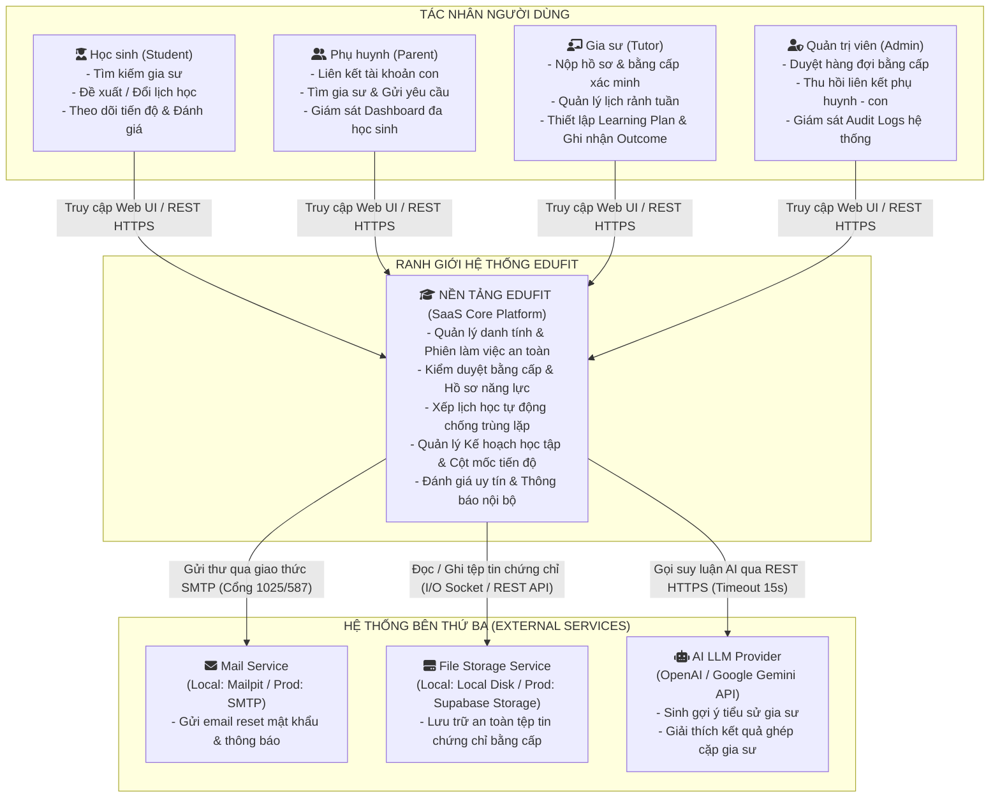

---

### 3.2. Sơ đồ Thùng chứa Hệ thống (Container Diagram - C4 Level 2)

Sơ đồ mô tả chi tiết các khối công nghệ triển khai độc lập (Containers) trong hệ sinh thái EduFit:

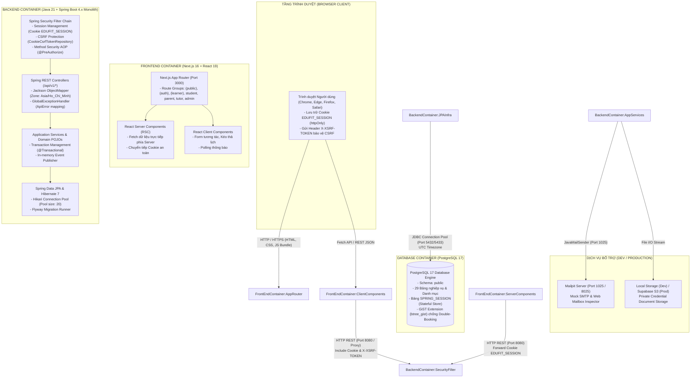

---

### 3.3. Lựa chọn Mô hình Kiến trúc & Phân tích Đánh đổi (Architectural Styles & Trade-offs)

Hệ thống EduFit áp dụng mô hình **Modular Monolith** kết hợp **Domain-Driven Design (DDD) thực dụng**. Dưới đây là phân tích chi tiết các quyết định kiến trúc cốt lõi:

```
+-------------------------------------------------------------------------------------------------------------------------------+
|                                    BẢNG PHÂN TÍCH QUYẾT ĐỊNH KIẾN TRÚC & ĐÁNH ĐỔI (TRADE-OFFS)                                |
+-------------------------------+------------------------------+--------------------------------+-------------------------------+
| Khía cạnh Kiến trúc           | Phương án Lựa chọn           | Phương án Bị loại bỏ           | Lý do & Đánh đổi Chấp nhận   |
+-------------------------------+------------------------------+--------------------------------+-------------------------------+
| 1. Cấu trúc Triển khai        | Modular Monolith             | Microservices                  | Đội ngũ 4 người trong 7 tuần; |
|    (Deployment Topology)      | - 1 Tiến trình JVM duy nhất  | - Tách 9 dịch vụ phân tán      | Microservices sinh ra chi phí |
|                               | - 1 Cơ sở dữ liệu duy nhất   | - Network calls chéo           | vận hành mạng, latency, và mất|
|                               | - Ranh giới biên dịch Maven  | - Distributed Transaction (2PC)| tính nhất quán ACID (NFR-11). |
+-------------------------------+------------------------------+--------------------------------+-------------------------------+
| 2. Giao tiếp Nội bộ Module    | Hybrid: Đồng bộ Facade +     | Message Broker Phân tán        | Trong 1 JVM không có bài toán |
|    (Inter-Module Comm)        | Domain Events trong-process  | (Apache Kafka, RabbitMQ)       | ghi 2 DB độc lập (Dual-Write);|
|                               | - Đọc: Gọi thẳng xxx.api     |                                | Broker cõng thêm hạ tầng nặng |
|                               | - Báo trạng thái: Spring Evt |                                | nề mà không mang lại giá trị. |
+-------------------------------+------------------------------+--------------------------------+-------------------------------+
| 3. Độ thuần khiết Domain      | Phân hóa 2 tầng:             | Hexagonal Architecture         | 6 module CRUD không có logic  |
|    (Domain Layer Purity)      | - 3 Module phức tạp: POJO    | thuần túy cho tất cả 9 modules | phức tạp, việc ép viết Mapper |
|                               | - 6 Module CRUD: Pragmatic   |                                | và Domain thuần gây tốn công  |
|                               |   Layered (JPA tại Service)  |                                | vô ích và giảm tiến độ dự án. |
+-------------------------------+------------------------------+--------------------------------+-------------------------------+
| 4. Quản lý Phiên & Auth       | Stateful Session Cookie      | Stateless Pure JWT Token       | NFR-04 yêu cầu hủy phiên tức  |
|    (Authentication Strategy)  | (EDUFIT_SESSION, httpOnly)   | (Access + Refresh Token)       | thì trong 60 phút và khi đổi  |
|                               | lưu tại PostgreSQL JDBC      |                                | mật khẩu (FR-04); JWT thuần   |
|                               |                              |                                | không thể thu hồi tức thì.    |
+-------------------------------+------------------------------+--------------------------------+-------------------------------+
| 5. Cấu trúc Frontend          | Package-by-Feature           | Layer-first                    | Chia theo Feature giúp 4 thành|
|                               | kết hợp Next.js App Router   | (components/, pages/, hooks/)  | viên code song song mà không  |
|                               | Ưu tiên Server Components    |                                | xung đột git merge liên tục.  |
+-------------------------------+------------------------------+--------------------------------+-------------------------------+
```

---

# 4. THIẾT KẾ CHI TIẾT (COMPONENT & DETAILED DESIGN)

---

### 4.1. Thiết kế Tầng Dữ liệu (Data Design & ERD)

Toàn bộ hệ thống EduFit được chuẩn hóa trên mô hình quan hệ gồm **29 bảng** (đã loại bỏ bảng Payment, bổ sung đầy đủ các bảng audit, ai log, availability slots và quan hệ liên kết).

#### A. Sơ đồ Thực thể Quan hệ Tổng thể (Entity-Relationship Diagram - ERD)

```mermaid
erDiagram
    %% MODULE: IAM
    ACCOUNT {
        uuid user_id PK
        varchar email UK
        varchar password_hash
        varchar full_name
        varchar role
        varchar status
        int failed_attempts
        timestamptz locked_until
        timestamptz last_login_at
        timestamptz created_at
        timestamptz updated_at
    }

    EMAIL_TOKEN {
        uuid token_id PK
        uuid user_id FK
        varchar type
        varchar token_hash UK
        timestamptz expires_at
        timestamptz used_at
        timestamptz created_at
    }

    %% MODULE: PROFILE & CATALOG
    EDUCATION_LEVEL {
        int level_id PK
        varchar name UK
        int sort_order
        boolean is_active
    }

    SUBJECT {
        int subject_id PK
        varchar name UK
        boolean is_active
    }

    STUDENT_PROFILE {
        uuid student_id PK
        uuid user_id FK "UK"
        int education_level_id FK
        varchar area
        boolean profile_complete
        timestamptz created_at
        timestamptz updated_at
    }

    TUTOR_PROFILE {
        uuid tutor_id PK
        uuid user_id FK "UK"
        varchar display_name
        varchar headline
        text bio
        varchar teaching_mode
        varchar area
        bigint price_per_session
        smallint experience_years
        text teaching_method
        varchar status
        timestamptz verified_at
        decimal rating_avg
        int review_count
        int version
        timestamptz created_at
        timestamptz updated_at
    }

    TUTOR_SUBJECT {
        uuid tutor_subject_id PK
        uuid tutor_id FK
        int subject_id FK
        int education_level_id FK
    }

    TUTOR_AVAILABILITY_SLOT {
        uuid slot_id PK
        uuid tutor_id FK
        smallint day_of_week
        time start_time
        time end_time
    }

    LEARNING_GOAL {
        uuid goal_id PK
        uuid student_id FK
        int subject_id FK
        smallint current_level
        smallint desired_level
        varchar goal_type
        date deadline
        varchar mode
        varchar area
        bigint budget_min
        bigint budget_max
        varchar status
        timestamptz created_at
        timestamptz updated_at
    }

    GOAL_AVAILABILITY_SLOT {
        uuid slot_id PK
        uuid goal_id FK
        smallint day_of_week
        time start_time
        time end_time
    }

    %% MODULE: VERIFICATION
    VERIFICATION_REQUEST {
        uuid request_id PK
        uuid tutor_id FK
        varchar status
        text rejection_reason
        timestamptz submitted_at
        uuid reviewed_by FK
        timestamptz reviewed_at
    }

    CREDENTIAL {
        uuid credential_id PK
        uuid request_id FK
        varchar type
        varchar institution
        smallint year
        varchar note
    }

    CREDENTIAL_FILE {
        uuid file_id PK
        uuid credential_id FK
        varchar file_name
        varchar storage_key
        varchar content_type
        bigint size_bytes
        timestamptz uploaded_at
    }

    %% MODULE: CONNECTION
    LINK_INVITATION {
        uuid invitation_id PK
        uuid inviter_user_id FK
        uuid invited_user_id FK
        varchar status
        timestamptz created_at
        timestamptz expires_at
        timestamptz responded_at
        timestamptz reinvite_after
    }

    PARENT_STUDENT_LINK {
        uuid link_id PK
        uuid parent_user_id FK
        uuid student_id FK
        varchar status
        timestamptz confirmed_at
        timestamptz revoked_at
        uuid revoked_by FK
        text revoke_reason
    }

    CONNECTION_REQUEST {
        uuid request_id PK
        uuid student_id FK
        uuid tutor_id FK
        uuid goal_id FK
        uuid sent_by_user_id FK
        jsonb desired_slots
        varchar message
        varchar status
        varchar reject_reason
        timestamptz created_at
        timestamptz expires_at
        timestamptz responded_at
    }

    CLASS_ENGAGEMENT {
        uuid class_id PK
        uuid connection_request_id FK "UK"
        uuid student_id FK
        uuid tutor_id FK
        uuid goal_id FK
        varchar status
        timestamptz started_at
        timestamptz ended_at
        varchar end_reason
    }

    %% MODULE: SCHEDULING
    TUTORING_SESSION {
        uuid session_id PK
        uuid class_id FK
        uuid tutor_id FK
        uuid student_id FK
        timestamptz start_at
        timestamptz end_at
        varchar mode
        varchar place_or_link
        varchar repeat_note
        varchar message
        varchar status
        uuid proposed_by FK
        uuid responded_by FK
        timestamptz responded_at
        varchar response_reason
        timestamptz expires_at
        uuid cancelled_by FK
        timestamptz cancelled_at
        varchar cancel_reason
        varchar cancel_comment
        boolean is_late_cancel
        uuid outcome_recorded_by FK
        timestamptz outcome_recorded_at
        int version
        timestamptz created_at
    }

    SESSION_RESCHEDULE_PROPOSAL {
        uuid proposal_id PK
        uuid session_id FK
        uuid proposed_by FK
        timestamptz new_start_at
        timestamptz new_end_at
        varchar reason
        varchar status
        timestamptz expires_at
        uuid responded_by FK
        timestamptz responded_at
        varchar response_reason
        timestamptz created_at
    }

    SESSION_HISTORY {
        uuid history_id PK
        uuid session_id FK
        uuid reschedule_proposal_id FK
        varchar action
        uuid actor_user_id FK
        varchar reason
        timestamptz created_at
    }

    %% MODULE: PROGRESS
    SESSION_NOTE {
        uuid note_id PK
        uuid session_id FK "UK"
        uuid tutor_id FK
        text note_text
        timestamptz created_at
    }

    LEARNING_PLAN {
        uuid plan_id PK
        uuid class_id FK "UK"
        varchar summary
        int version
        timestamptz created_at
        timestamptz updated_at
    }

    MILESTONE {
        uuid milestone_id PK
        uuid plan_id FK
        varchar title
        text description
        date target_date
        smallint weight
        varchar status
        date achieved_date
        boolean is_archived
        int sort_order
        timestamptz created_at
    }

    PLAN_HISTORY {
        uuid history_id PK
        uuid plan_id FK
        uuid milestone_id FK
        varchar action
        uuid actor_user_id FK
        varchar old_value
        varchar new_value
        timestamptz created_at
    }

    %% MODULE: REVIEW & NOTIFICATION
    REVIEW {
        uuid review_id PK
        uuid tutor_id FK
        uuid student_id FK
        uuid reviewer_user_id FK
        varchar reviewer_type
        smallint rating
        text comment
        boolean is_edited
        int completed_sessions_at_review
        timestamptz created_at
        timestamptz updated_at
    }

    NOTIFICATION {
        uuid notification_id PK
        uuid user_id FK
        uuid about_student_id FK
        varchar type
        varchar title
        varchar short_text
        varchar target_type
        uuid target_id
        boolean is_read
        timestamptz created_at
    }

    %% MODULE: PLATFORM (AUDIT & AI)
    AUDIT_LOG {
        uuid audit_id PK
        uuid actor_user_id FK
        varchar action
        varchar target_type
        uuid target_id
        text reason
        timestamptz created_at
    }

    AI_REQUEST_LOG {
        uuid log_id PK
        uuid user_id FK
        varchar feature
        varchar status
        int latency_ms
        timestamptz created_at
    }

    MATCHING_RUN_LOG {
        uuid run_id PK
        uuid user_id FK
        uuid student_id FK
        uuid goal_id FK
        int result_count
        timestamptz created_at
    }

    %% RELATIONS
    ACCOUNT ||--o{ EMAIL_TOKEN : "issues"
    ACCOUNT ||--o| STUDENT_PROFILE : "has"
    ACCOUNT ||--o| TUTOR_PROFILE : "has"
    STUDENT_PROFILE ||--o{ LEARNING_GOAL : "sets"
    STUDENT_PROFILE ||--o{ PARENT_STUDENT_LINK : "linked_with"
    ACCOUNT ||--o{ PARENT_STUDENT_LINK : "acts_as_parent"
    ACCOUNT ||--o{ LINK_INVITATION : "sends_or_receives"
    
    TUTOR_PROFILE ||--o{ TUTOR_SUBJECT : "teaches"
    TUTOR_PROFILE ||--o{ TUTOR_AVAILABILITY_SLOT : "opens"
    TUTOR_PROFILE ||--o{ VERIFICATION_REQUEST : "submits"
    VERIFICATION_REQUEST ||--o{ CREDENTIAL : "contains"
    CREDENTIAL ||--o{ CREDENTIAL_FILE : "attaches"

    STUDENT_PROFILE ||--o{ CONNECTION_REQUEST : "initiates"
    TUTOR_PROFILE ||--o{ CONNECTION_REQUEST : "receives"
    LEARNING_GOAL ||--o{ CONNECTION_REQUEST : "applies_to"
    CONNECTION_REQUEST ||--o| CLASS_ENGAGEMENT : "produces_when_accepted"

    CLASS_ENGAGEMENT ||--o{ TUTORING_SESSION : "schedules"
    CLASS_ENGAGEMENT ||--o| LEARNING_PLAN : "structures"
    LEARNING_PLAN ||--o{ MILESTONE : "defines"
    LEARNING_PLAN ||--o{ PLAN_HISTORY : "tracks"

    TUTORING_SESSION ||--o{ SESSION_RESCHEDULE_PROPOSAL : "requests"
    TUTORING_SESSION ||--o{ SESSION_HISTORY : "logs"
    TUTORING_SESSION ||--o| SESSION_NOTE : "records_outcome"

    TUTOR_PROFILE ||--o{ REVIEW : "receives"
    STUDENT_PROFILE ||--o{ REVIEW : "evaluates"
    ACCOUNT ||--o{ REVIEW : "writes"

    ACCOUNT ||--o{ NOTIFICATION : "receives"
    ACCOUNT ||--o{ AUDIT_LOG : "triggers"
    ACCOUNT ||--o{ AI_REQUEST_LOG : "executes"
    ACCOUNT ||--o{ MATCHING_RUN_LOG : "runs"
```

---

#### B. Các Ràng buộc & Chỉ mục Đặc biệt Cấp Cơ sở Dữ liệu

Để thỏa mãn các yêu cầu phi chức năng nghiêm ngặt về tính toàn vẹn (NFR-11, NFR-15, NFR-17, NFR-24), hệ thống bắt buộc kích hoạt extension `btree_gist` và áp dụng các ràng buộc sau trong migration của Flyway:

1. **Ràng buộc Chống Trùng lịch Học (Double-Booking Protection - NFR-17, BR-42):**
   ```sql
   CREATE EXTENSION IF NOT EXISTS btree_gist;

   -- Ngăn chặn một Gia sư bị trùng lịch khi ở trạng thái SCHEDULED
   ALTER TABLE tutoring_session ADD CONSTRAINT no_tutor_overlap
     EXCLUDE USING gist (
       tutor_id WITH =,
       tstzrange(start_at, end_at, '[)') WITH &&
     )
     WHERE (status = 'SCHEDULED');

   -- Ngăn chặn một Học sinh bị trùng lịch khi ở trạng thái SCHEDULED
   ALTER TABLE tutoring_session ADD CONSTRAINT no_student_overlap
     EXCLUDE USING gist (
       student_id WITH =,
       tstzrange(start_at, end_at, '[)') WITH &&
     )
     WHERE (status = 'SCHEDULED');

   -- Ràng buộc thời lượng buổi học hợp lệ: từ 30 phút đến 240 phút (BR-41)
   ALTER TABLE tutoring_session ADD CONSTRAINT chk_session_time
     CHECK (end_at > start_at AND end_at - start_at BETWEEN interval '30 minutes' AND interval '240 minutes');
   ```

2. **Các Chỉ mục Độc nhất Có điều kiện (Partial Unique Indexes):**
   ```sql
   -- BR-28: Tối đa 1 lời mời liên kết Phụ huynh - Học sinh PENDING giữa hai tài khoản
   CREATE UNIQUE INDEX uq_invitation_pending ON link_invitation
     (LEAST(inviter_user_id, invited_user_id), GREATEST(inviter_user_id, invited_user_id))
     WHERE status = 'PENDING';

   -- BR-34: Tối đa 1 yêu cầu kết nối PENDING giữa 1 học sinh và 1 gia sư
   CREATE UNIQUE INDEX uq_request_pending ON connection_request (student_id, tutor_id)
     WHERE status = 'PENDING';

   -- BR-38: Tối đa 1 mối quan hệ dạy-học (class) ACTIVE cho mỗi cặp học sinh - gia sư
   CREATE UNIQUE INDEX uq_class_active ON class (student_id, tutor_id)
     WHERE status = 'ACTIVE';

   -- BR-14: Tối đa 1 yêu cầu xác minh bằng cấp PENDING cho mỗi gia sư
   CREATE UNIQUE INDEX uq_verification_pending ON verification_request (tutor_id)
     WHERE status = 'PENDING';

   -- BR-44: Tối đa 1 đề xuất đổi lịch PENDING cho mỗi buổi học
   CREATE UNIQUE INDEX uq_reschedule_pending ON session_reschedule_proposal (session_id)
     WHERE status = 'PENDING';

   -- NFR-24: Độc nhất 1 đánh giá cho mỗi cặp (Gia sư, Học sinh)
   CREATE UNIQUE INDEX uq_review_unique ON review (tutor_id, student_id);
   ```

---

### 4.2. Thiết kế Thành phần (Component Design & Boundaries)

#### A. Ma trận Module & Phân định Ranh giới Trách nhiệm

```
+-----------------------------------------------------------------------------------------------------------------------------+
|                                    MA TRẬN PHÂN ĐỊNH RANH GIỚI TRÁCH NHIỆM GIỮA CÁC MODULE                                  |
+-------------------+----------------------------+-----------------------+-----------------------------+----------------------+
| Module            | Bảng CSDL Sở hữu           | Bề mặt Công khai      | Sự kiện Phát ra             | Sự kiện Lắng nghe    |
|                   |                            | (xxx.api.*)           | (Domain Events)             |                      |
+-------------------+----------------------------+-----------------------+-----------------------------+----------------------+
| 1. iam            | account, email_token,      | IamFacade             | AccountRegisteredEvent      | Không                |
|                   | spring_session             | (query user, status)  | PasswordChangedEvent        |                      |
+-------------------+----------------------------+-----------------------+-----------------------------+----------------------+
| 2. profile        | student_profile,           | ProfileFacade         | ProfileCompletedEvent       | TutorVerifiedEvent   |
|                   | tutor_profile, subject,    | (query tutor/student  | AvailabilityChangedEvent    |                      |
|                   | education_level, slots     |  summary, slots)      |                             |                      |
+-------------------+----------------------------+-----------------------+-----------------------------+----------------------+
| 3. verification   | verification_request,      | VerificationFacade    | TutorVerifiedEvent          | Không                |
|                   | credential, file           | (check verified badge)| TutorRejectedEvent          |                      |
+-------------------+----------------------------+-----------------------+-----------------------------+----------------------+
| 4. discovery      | matching_run_log           | DiscoveryFacade       | MatchingExecutedEvent       | Không                |
|                   | (Không có bảng nghiệp vụ)  | (search, match engine)|                             |                      |
+-------------------+----------------------------+-----------------------+-----------------------------+----------------------+
| 5. connection     | link_invitation,           | ConnectionFacade      | LinkConfirmedEvent          | Không                |
|                   | parent_student_link,       | (check link,          | RequestAcceptedEvent        |                      |
|                   | connection_request, class  |  active class)        | ClassStartedEvent           |                      |
+-------------------+----------------------------+-----------------------+-----------------------------+----------------------+
| 6. scheduling     | tutoring_session,          | SessionFacade         | SessionProposedEvent        | Không                |
|                   | reschedule_proposal,       | (check conflict,      | SessionScheduledEvent       |                      |
|                   | session_history            |  session stats query) | SessionCancelledEvent       |                      |
+-------------------+----------------------------+-----------------------+-----------------------------+----------------------+
| 7. progress       | session_note,              | ProgressFacade        | MilestoneAchievedEvent      | SessionOutcome-      |
|                   | learning_plan, milestone,  | (calculate progress,  | PlanUpdatedEvent            | RecordedEvent        |
|                   | plan_history               |  get student metrics) |                             |                      |
+-------------------+----------------------------+-----------------------+-----------------------------+----------------------+
| 8. review         | review                     | ReviewFacade          | ReviewSubmittedEvent        | Không                |
|                   |                            | (rating average query)|                             |                      |
+-------------------+----------------------------+-----------------------+-----------------------------+----------------------+
| 9. notification   | notification               | KHÔNG CÓ BỀ MẶT       | Không                       | Lắng nghe TẤT CẢ các |
|                   |                            | (Chỉ tiếp nhận event) |                             | sự kiện để lưu thông |
|                   |                            |                       |                             | báo cho người dùng   |
+-------------------+----------------------------+-----------------------+-----------------------------+----------------------+
| Platform Modules: | platform/shared            | Base Value Objects    | Money, TimeInterval, ErrorCode, BaseException      |
|                   | platform/storage           | Storage Interface     | CredentialStorageService (Local Disk / Supabase)    |
|                   | platform/ai                | AI Gateway Client     | AiClientFacade (LLM Prompting, 15s timeout)         |
|                   | platform/audit             | Audit Logger          | AuditLogService (Insert-only administrative logs)   |
+-------------------+----------------------------+-----------------------+-----------------------------+----------------------+
```

#### B. Sơ đồ Đồ thị Phụ thuộc (Dependency Graph) & Quy tắc ArchUnit

Kiến trúc cưỡng chế đồ thị phụ thuộc một chiều không chu trình (Directed Acyclic Graph):

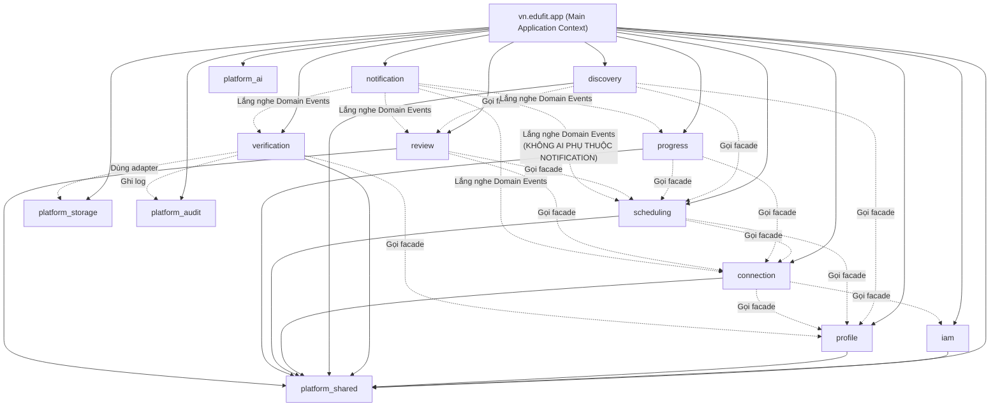

**Quy tắc ArchUnit bắt buộc thực thi trong CI:**
1. Không một class nào bên ngoài module được phép import bất kỳ class nào nằm trong `vn.edufit.modules.<module>.(application|domain|infra)..`. Module bên ngoài **chỉ được phép** import từ `vn.edufit.modules.<module>.api..`.
2. Tuyệt đối không module nghiệp vụ nào được phép phụ thuộc hoặc import class từ `vn.edufit.modules.notification..` (Notification chỉ là Consumer thụ động).
3. Tuyệt đối không dùng quan hệ `@ManyToOne` hay `@OneToMany` của JPA vượt ranh giới module. Giữa các module chỉ lưu trữ ID (`UUID`) và truy vấn thông qua Facade.

---

### 4.3. Đặc tả Chi tiết API Contracts (API Contracts Specification)

Tất cả các API REST trong hệ thống đều tuân thủ chặt chẽ Response Envelope và Error Model được đóng gói tại `platform/shared`:

#### Cấu trúc Phản hồi Chuẩn (Envelope Models)
* **Thành công (Success - 2xx):**
  ```json
  {
    "success": true,
    "message": "Mô tả kết quả thành công",
    "data": { ... },
    "timestamp": "2026-10-06T07:00:00.000Z"
  }
  ```
* **Lỗi (Error - 4xx, 5xx):**
  ```json
  {
    "success": false,
    "code": "RESOURCE_CONFLICT",
    "message": "Khung giờ học đã bị trùng lặp với một buổi học khác.",
    "details": [
      {
        "field": "startAt",
        "message": "Thời gian bắt đầu bị chồng lấn"
      }
    ],
    "timestamp": "2026-10-06T07:00:00.000Z"
  }
  ```

---

#### Danh mục API Chi tiết theo Từng Module

##### 1. Module IAM (`/api/v1/auth`)

| Endpoint | Method | Phân quyền | Mô tả chức năng | Request Body (Schema tóm tắt) | Response Data | Mã lỗi thường gặp |
|---|---|---|---|---|---|---|
| `/api/v1/auth/csrf` | `GET` | Public | Lấy CSRF token thiết lập cookie | *None* | `{ token, headerName }` | *None* |
| `/api/v1/auth/register` | `POST` | Guest | Đăng ký tài khoản (kích hoạt ngay) | `{ email, password, fullName, role }` | `{ accountId, email, role, status }` | `400 VALIDATION_FAILED`<br>`409 USER_ALREADY_EXISTS` |
| `/api/v1/auth/login` | `POST` | Guest | Xác thực & cấp session cookie | `{ email, password }` | `{ id, email, fullName, role, redirectUrl }` | `401 INVALID_CREDENTIALS`<br>`423 ACCOUNT_LOCKED` |
| `/api/v1/auth/me` | `GET` | Authenticated | Đọc phiên làm việc hiện tại | *None* | `{ id, email, fullName, role, permissions }` | `401 UNAUTHORIZED` |
| `/api/v1/auth/logout` | `POST` | Authenticated | Hủy phiên làm việc hiện tại | *None* | `null` | `401 UNAUTHORIZED` |
| `/api/v1/auth/change-password` | `POST` | Authenticated | Đổi mật khẩu & thu hồi phiên khác | `{ oldPassword, newPassword }` | `null` | `400 INVALID_OLD_PASSWORD`<br>`400 WEAK_PASSWORD` |
| `/api/v1/auth/forgot-password` | `POST` | Guest | Yêu cầu gửi email đặt lại mật khẩu | `{ email }` | `null` | `404 USER_NOT_FOUND` |
| `/api/v1/auth/reset-password` | `POST` | Guest | Đặt lại mật khẩu qua token email | `{ token, newPassword }` | `null` | `400 INVALID_OR_EXPIRED_TOKEN` |

##### 2. Module Profile & Catalog (`/api/v1/profiles`, `/api/v1/catalogs`)

| Endpoint | Method | Phân quyền | Mô tả chức năng | Request Body (Schema tóm tắt) | Response Data | Mã lỗi |
|---|---|---|---|---|---|---|
| `/api/v1/catalogs/subjects` | `GET` | Public | Lấy danh mục môn học kích hoạt | *None* | `[ { subjectId, name } ]` | *None* |
| `/api/v1/catalogs/education-levels` | `GET` | Public | Lấy danh mục cấp học kích hoạt | *None* | `[ { levelId, name, sortOrder } ]` | *None* |
| `/api/v1/profiles/tutors/me` | `GET` | Role TUTOR | Xem hồ sơ năng lực gia sư của tôi | *None* | `{ tutorId, displayName, headline, bio, teachingMode, area, pricePerSession, ratingAvg, status }` | `404 PROFILE_NOT_FOUND` |
| `/api/v1/profiles/tutors/me` | `PUT` | Role TUTOR | Cập nhật hồ sơ năng lực gia sư | `{ displayName, headline, bio, teachingMode, area, pricePerSession, experienceYears, teachingMethod }` | `{ tutorId, updatedAt }` | `400 VALIDATION_FAILED` |
| `/api/v1/profiles/tutors/me/subjects` | `PUT` | Role TUTOR | Cập nhật môn học & cấp lớp dạy | `{ subjects: [ { subjectId, educationLevelId } ] }` | `{ count }` | `400 INVALID_SUBJECT` |
| `/api/v1/profiles/tutors/me/availability` | `PUT` | Role TUTOR | Cập nhật khung giờ rảnh hàng tuần | `{ slots: [ { dayOfWeek, startTime, endTime } ] }` | `{ count }` | `400 INVALID_TIME_INTERVAL` |
| `/api/v1/profiles/students/me` | `GET` | Role STUDENT | Xem hồ sơ học sinh của tôi | *None* | `{ studentId, educationLevelId, area, profileComplete }` | `404 PROFILE_NOT_FOUND` |
| `/api/v1/profiles/students/me` | `PUT` | Role STUDENT | Cập nhật hồ sơ học sinh | `{ educationLevelId, area }` | `{ studentId, profileComplete }` | `400 VALIDATION_FAILED` |
| `/api/v1/profiles/students/me/goals` | `POST` | Role STUDENT | Tạo mục tiêu học tập mới | `{ subjectId, currentLevel, desiredLevel, goalType, deadline, mode, area, budgetMax }` | `{ goalId, status }` | `400 INVALID_GOAL_LEVELS` |
| `/api/v1/profiles/students/me/goals` | `GET` | Role STUDENT | Lấy danh sách mục tiêu học tập | *None* | `[ { goalId, subjectName, desiredLevel, deadline, status } ]` | *None* |

##### 3. Module Verification (`/api/v1/verifications`)

| Endpoint | Method | Phân quyền | Mô tả chức năng | Request Body | Response Data | Mã lỗi |
|---|---|---|---|---|---|---|
| `/api/v1/verifications/requests` | `POST` | Role TUTOR | Nộp hồ sơ bằng cấp để xác minh | `{ credentials: [ { type, institution, year, fileStorageKey, fileName } ] }` | `{ requestId, status, submittedAt }` | `409 VERIFICATION_ALREADY_PENDING` |
| `/api/v1/verifications/requests/my` | `GET` | Role TUTOR | Xem tiến độ hồ sơ xác minh | *None* | `{ requestId, status, submittedAt, rejectionReason }` | `404 NOT_FOUND` |
| `/api/v1/verifications/admin/queue` | `GET` | Role ADMIN | Lấy danh sách hồ sơ chờ duyệt | Query: `page, size` | `Page<{ requestId, tutorId, tutorName, submittedAt, credentialCount }>` | `403 FORBIDDEN` |
| `/api/v1/verifications/admin/{id}/approve` | `POST` | Role ADMIN | Phê duyệt hồ sơ gia sư | *None* | `{ requestId, status: "APPROVED", reviewedAt }` | `400 INVALID_STATE` |
| `/api/v1/verifications/admin/{id}/reject` | `POST` | Role ADMIN | Từ chối hồ sơ kèm lý do | `{ reason: "Ảnh mờ không rõ số hiệu" }` | `{ requestId, status: "REJECTED", reviewedAt }` | `400 MISSING_REASON` |
| `/api/v1/verifications/credentials/files/{fileId}` | `GET` | Role ADMIN/TUTOR | Tải xem file tài liệu bằng cấp | *None* | Byte Stream (File Content-Disposition) | `404 FILE_NOT_FOUND` |

##### 4. Module Discovery (`/api/v1/discovery`)

| Endpoint | Method | Phân quyền | Mô tả chức năng | Query / Request Body | Response Data | Mã lỗi |
|---|---|---|---|---|---|---|
| `/api/v1/discovery/tutors` | `GET` | Public / Learner | Tìm kiếm & lọc hồ sơ gia sư | Query: `subjectId, levelId, area, mode, minPrice, maxPrice, minRating, page, size` | `Page<{ tutorId, displayName, headline, area, pricePerSession, ratingAvg, reviewCount, verified }>` | `400 INVALID_FILTER` |
| `/api/v1/discovery/tutors/{tutorId}` | `GET` | Public / Learner | Xem chi tiết hồ sơ & lịch rảnh | *None* | `{ tutorId, displayName, headline, bio, teachingMethod, ratingAvg, slots: [...], subjects: [...] }` | `404 TUTOR_NOT_FOUND` |
| `/api/v1/discovery/match` | `POST` | Role STUDENT/PARENT | Chạy thuật toán gợi ý gia sư tối ưu | `{ goalId, topN: 5 }` | `[ { tutorId, matchScore, explanation, tutorInfo } ]` | `404 GOAL_NOT_FOUND` |

##### 5. Module Connection (`/api/v1/connections`)

| Endpoint | Method | Phân quyền | Mô tả chức năng | Request Body | Response Data | Mã lỗi |
|---|---|---|---|---|---|---|
| `/api/v1/connections/parent-student/invite` | `POST` | Role PARENT | Phụ huynh gửi lời mời liên kết con | `{ studentEmail: "con@gmail.com" }` | `{ invitationId, status: "PENDING", expiresAt }` | `409 INVITATION_ALREADY_PENDING` |
| `/api/v1/connections/parent-student/respond` | `POST` | Role STUDENT | Học sinh phản hồi lời mời liên kết | `{ invitationId, accept: true }` | `{ linkId, status: "CONFIRMED" }` | `400 INVITATION_EXPIRED` |
| `/api/v1/connections/parent-student/links` | `GET` | Role PARENT/STUDENT | Xem danh sách liên kết hiện hữu | *None* | `[ { linkId, studentId, studentName, parentName, confirmedAt } ]` | *None* |
| `/api/v1/connections/parent-student/links/{id}` | `DELETE` | Role STUDENT/ADMIN | Thu hồi liên kết phụ huynh - con | `{ reason: "..." }` | `null` | `403 CANNOT_REVOKE` |
| `/api/v1/connections/requests` | `POST` | Role STUDENT/PARENT | Gửi yêu cầu ghép cặp tới Gia sư | `{ tutorId, goalId, desiredSlots: [...], message }` | `{ requestId, status: "PENDING", expiresAt }` | `409 ACTIVE_REQUEST_EXISTS`<br>`409 ACTIVE_CLASS_EXISTS` |
| `/api/v1/connections/requests/{id}/respond` | `POST` | Role TUTOR | Gia sư chấp nhận hoặc từ chối ghép | `{ accept: true, rejectReason: null }` | `{ requestId, status: "ACCEPTED", classId }` | `400 REQUEST_EXPIRED` |

##### 6. Module Scheduling (`/api/v1/scheduling`)

| Endpoint | Method | Phân quyền | Mô tả chức năng | Request Body | Response Data | Mã lỗi |
|---|---|---|---|---|---|---|
| `/api/v1/scheduling/sessions/propose` | `POST` | Role TUTOR/STUDENT | Đề xuất buổi học trong lớp (class) | `{ classId, startAt, endAt, mode, placeOrLink, message }` | `{ sessionId, status: "PROPOSED", expiresAt }` | `409 DOUBLE_BOOKING_CONFLICT`<br>`400 INVALID_DURATION` |
| `/api/v1/scheduling/sessions/{id}/respond` | `POST` | Role TUTOR/STUDENT | Xác nhận hoặc từ chối đề xuất | `{ accept: true, reason: null }` | `{ sessionId, status: "SCHEDULED" }` | `409 SCHEDULE_OVERLAP_DETECTED`<br>`400 PROPOSAL_EXPIRED` |
| `/api/v1/scheduling/sessions/{id}/reschedule`| `POST` | Role TUTOR/STUDENT | Đề xuất đổi thời gian buổi học | `{ newStartAt, newEndAt, reason }` | `{ proposalId, status: "PENDING" }` | `400 SESSION_NOT_SCHEDULED` |
| `/api/v1/scheduling/sessions/{id}/cancel` | `POST` | Role TUTOR/STUDENT | Hủy lịch học kèm phân loại trễ | `{ reason: "SCHEDULE_CONFLICT", comment: "Bận đột xuất" }` | `{ sessionId, status: "CANCELLED", isLateCancel }` | `400 CANNOT_CANCEL_COMPLETED` |
| `/api/v1/scheduling/sessions/{id}/outcome` | `POST` | Role TUTOR | Ghi nhận hoàn thành/vắng mặt & note| `{ outcome: "COMPLETED", noteText: "Hoàn thành tốt bài tập" }` | `{ sessionId, status: "COMPLETED", recordedAt }` | `403 ONLY_TUTOR_CAN_RECORD`<br>`400 TIME_NOT_PASSED` |
| `/api/v1/scheduling/calendar` | `GET` | Authenticated | Lấy danh sách lịch học theo thời gian | Query: `from, to` | `[ { sessionId, classId, partnerName, startAt, endAt, mode, status } ]` | `400 INVALID_DATE_RANGE` |

##### 7. Module Progress (`/api/v1/progress`)

| Endpoint | Method | Phân quyền | Mô tả chức năng | Request Body | Response Data | Mã lỗi |
|---|---|---|---|---|---|---|
| `/api/v1/progress/plans` | `POST` | Role TUTOR | Gia sư tạo kế hoạch học tập cho lớp | `{ classId, summary, milestones: [ { title, description, targetDate, weight } ] }` | `{ planId, version }` | `409 PLAN_ALREADY_EXISTS` |
| `/api/v1/progress/plans/{classId}` | `GET` | Role Learner/Tutor | Xem kế hoạch học tập & Milestones | *None* | `{ planId, summary, progressPercentage, milestones: [ ... ] }` | `404 PLAN_NOT_FOUND` |
| `/api/v1/progress/milestones/{id}/status`| `PATCH` | Role TUTOR | Cập nhật trạng thái cột mốc | `{ status: "ACHIEVED", achievedDate: "2026-10-15" }` | `{ milestoneId, status, newProgressPercentage }` | `400 FUTURE_ACHIEVED_DATE` |
| `/api/v1/progress/dashboard/student/{id}` | `GET` | Role Student/Parent | Xem tiến độ học tập tổng thể học sinh | *None* | `{ studentId, totalClasses, completedSessions, overallProgressPercent, goals: [...] }` | `403 UNAUTHORIZED_STUDENT_ACCESS` |
| `/api/v1/progress/dashboard/parent` | `GET` | Role PARENT | Dashboard tiến độ nhiều con | *None* | `[ { studentId, studentName, classCount, averageProgressPercent } ]` | `403 FORBIDDEN` |

##### 8. Module Review (`/api/v1/reviews`)

| Endpoint | Method | Phân quyền | Mô tả chức năng | Request Body | Response Data | Mã lỗi |
|---|---|---|---|---|---|---|
| `/api/v1/reviews` | `POST` | Role Student/Parent | Đánh giá gia sư sau số buổi quy định | `{ tutorId, studentId, rating: 5, comment: "Gia sư nhiệt tình..." }` | `{ reviewId, rating, createdAt }` | `409 REVIEW_ALREADY_EXISTS`<br>`400 NOT_ENOUGH_SESSIONS` |
| `/api/v1/reviews/{id}` | `PUT` | Role Student/Parent | Chỉnh sửa đánh giá của chính mình | `{ rating: 4, comment: "Cập nhật đánh giá..." }` | `{ reviewId, isEdited: true, updatedAt }` | `403 ONLY_AUTHOR_CAN_EDIT` |
| `/api/v1/reviews/tutors/{tutorId}` | `GET` | Public | Lấy danh sách đánh giá của gia sư | Query: `page, size` | `Page<{ reviewId, reviewerName, reviewerType, rating, comment, isEdited, createdAt }>` | `404 TUTOR_NOT_FOUND` |

##### 9. Module Notification (`/api/v1/notifications`)

| Endpoint | Method | Phân quyền | Mô tả chức năng | Query / Request Body | Response Data | Mã lỗi |
|---|---|---|---|---|---|---|
| `/api/v1/notifications` | `GET` | Authenticated | Lấy danh sách thông báo người dùng | Query: `unreadOnly, page, size` | `Page<{ notificationId, type, title, shortText, targetType, targetId, isRead, createdAt }>` | `401 UNAUTHORIZED` |
| `/api/v1/notifications/{id}/read` | `PATCH` | Authenticated | Đánh dấu một thông báo đã đọc | *None* | `{ notificationId, isRead: true }` | `404 NOT_FOUND` |
| `/api/v1/notifications/read-all` | `PATCH` | Authenticated | Đánh dấu tất cả thông báo đã đọc | *None* | `{ count }` | `401 UNAUTHORIZED` |

---

### 4.4. Các Luồng Xử lý Nghiệp vụ Trọng yếu (Sequence Diagrams)

Dưới đây là 5 Sequence Diagrams chi tiết biểu diễn sự tương tác giữa các tầng ứng dụng cho các chức năng quan trọng và rủi ro nhất của hệ thống:

---

#### Luồng 1: Xác thực, Quản lý Phiên làm việc & Chống Brute-force / CSRF (`iam`)

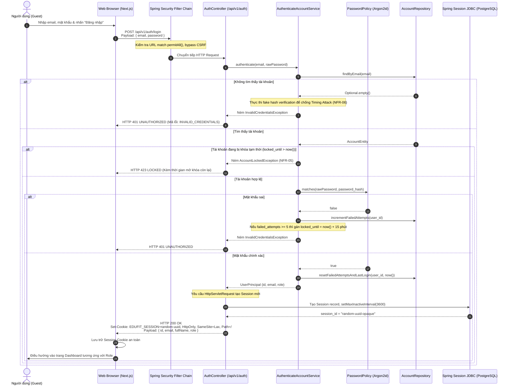

---

#### Luồng 2: Nộp Bằng cấp, Xác thực Tệp tin Magic Bytes & Admin Duyệt Hồ sơ (`verification`)

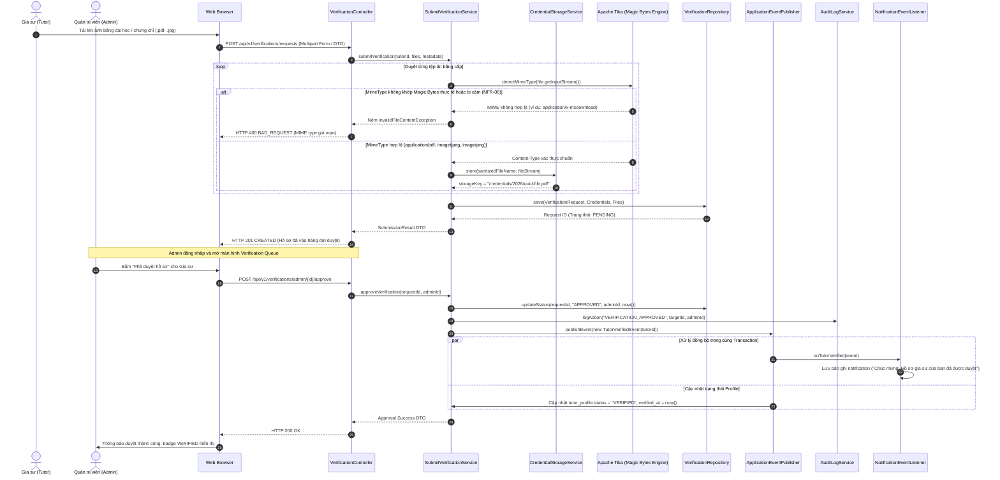

---

#### Luồng 3: Đề xuất & Xác nhận Lịch học Chống Trùng lặp Đồng thời (Double-Booking Protection) (`scheduling`)

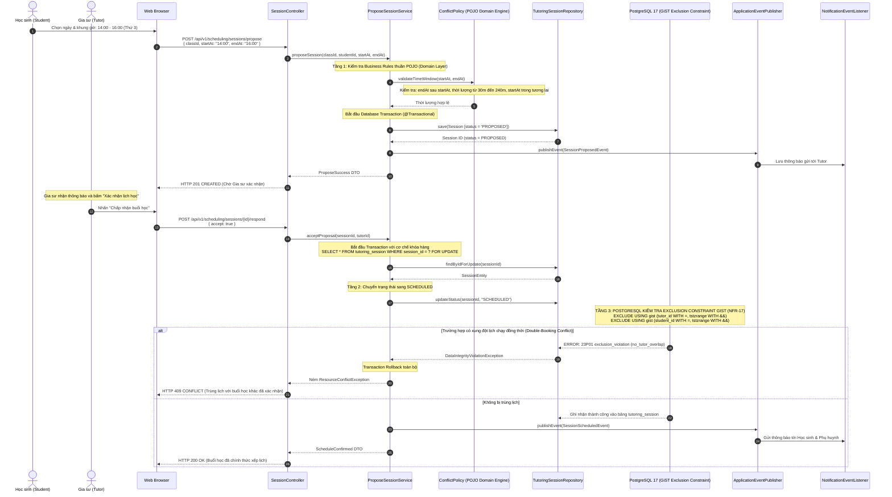

---

#### Luồng 4: Thiết lập Kế hoạch Học tập, Ghi nhận Outcome Buổi học & Cập nhật Tiến độ (`progress` + `scheduling`)

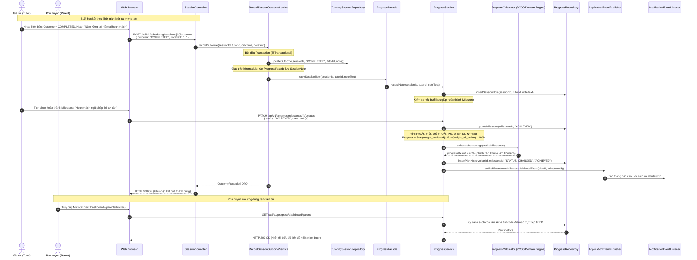

---

#### Luồng 5: Liên kết Phụ huynh - Học sinh & Gửi Yêu cầu Ghép cặp Gia sư (`connection`)

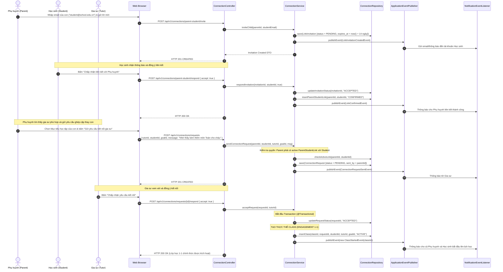

---

# 5. HẠ TẦNG VÀ TRIỂN KHAI (DEPLOYMENT & INFRASTRUCTURE)

### 5.1. Sơ đồ Triển khai Môi trường Phát triển Cục bộ (Local-First Development)

Toàn bộ ngăn xếp công nghệ được đóng gói nhất quán thông qua `compose.yaml`, đảm bảo 4 thành viên đội ngũ có môi trường chạy giống hệt nhau:

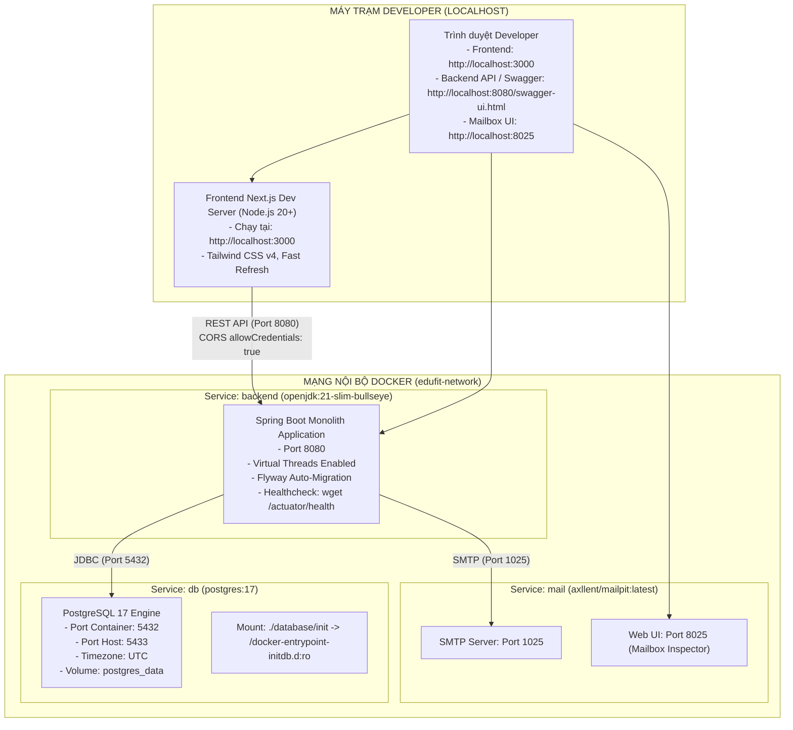

---

### 5.2. Sơ đồ Triển khai Môi trường Đám mây Mục tiêu (Target Cloud Architecture)

Mô hình triển khai sản phẩm ứng dụng các nền tảng PaaS hiện đại có tích hợp Git tự động:

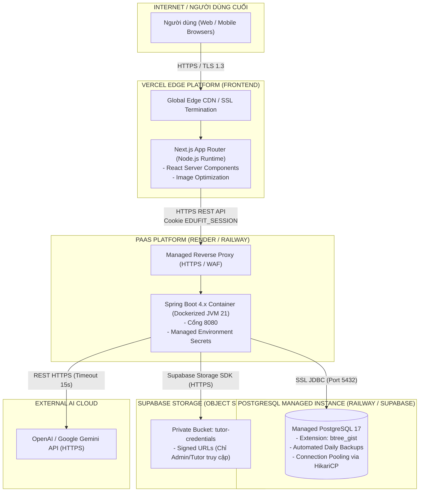

---

### 5.3. Chiến lược Tự động hóa CI/CD Pipeline (GitHub Actions)

Quy trình tích hợp và phân phối liên tục (CI/CD) được tách bạch hoàn toàn để bảo đảm chất lượng mã nguồn trước khi triển khai:

```mermaid
flowchart LR
    Push["Developer Push Code / Tạo PR"] --> GHA["GitHub Actions Runner"]
    
    subgraph STAGE_1 ["GIAI ĐOẠN 1: CODE LINT & FORMAT"]
        Checkstyle["Checkstyle"]
        Spotless["Spotless (Java Format)"]
        ESLint["ESLint & Prettier"]
    end

    subgraph STAGE_2 ["GIAI ĐOẠN 2: KIỂM THỬ TỰ ĐỘNG"]
        ArchUnit["ArchUnit Rules Test<br/>(Bảo vệ ranh giới Package)"]
        JUnit["Unit Tests (JUnit 5 + JaCoCo >80%)"]
        IntegrationTest["Integration Tests<br/>(Testcontainers Clean Postgres)"]
    end

    subgraph STAGE_3 ["GIAI ĐOẠN 3: ĐÓNG GÓI & ARTIFACT"]
        BuildBackend["Maven Package (JAR) & Docker Build"]
        BuildFrontend["Next.js Production Bundle Build"]
    end

    subgraph STAGE_4 ["GIAI ĐOẠN 4: DEPLOYMENT (CD)"]
        DeployRender["Render Web Service (Backend)"]
        DeployVercel["Vercel Production (Frontend)"]
    end

    GHA --> STAGE_1
    STAGE_1 --> STAGE_2
    STAGE_2 --> STAGE_3
    STAGE_3 -- "Chỉ chạy khi Merge vào nhánh main" --> STAGE_4
```

---

# 6. QUẢN LÝ RỦI RO & PHƯƠNG ÁN DỰ PHÒNG (RISKS & ALTERNATIVES)

### 6.1. Tổng hợp Các Quyết định Kiến trúc & Phương án Bị loại bỏ (ADR Synthesis)

Dưới đây là bản tóm lược lý do lựa chọn và các giải pháp đã bị loại bỏ dựa theo [ADR-001](file:///c:/University/Semester%205/SWP391/Edufit/EduFit/docs/ADR-001-tech-stack.md) và [ADR-002](file:///c:/University/Semester%205/SWP391/Edufit/EduFit/docs/ADR-002-multi-module-architecture.md):

1. **Kiến trúc Modular Monolith thay vì Microservices:**
   * *Đã cân nhắc:* Microservices (tách riêng IAM Service, Scheduling Service, v.v.).
   * *Lý do loại bỏ:* Chi phí vận hành mạng (Network Overhead), sự phức tạp khi triển khai Service Discovery, API Gateway, và đặc biệt là rủi ro mất tính nhất quán phân tán khi cần thực hiện các giao dịch nguyên tử (Atomic Transactions) trong đặt lịch và ghép cặp. Đội 4 người không thể gánh vác chi phí này trong 7 tuần.
2. **Spring Boot (Java 21) thay vì Node.js / NestJS hoặc Django:**
   * *Đã cân nhắc:* NestJS (TypeScript đồng nhất cả 2 đầu), Django (Python).
   * *Lý do loại bỏ:* Miền nghiệp vụ EduFit có nhiều máy trạng thái phức tạp (`Session`, `Class`, `LinkInvitation`), đòi hỏi xử lý giao dịch sâu (`@Transactional`) và bảo mật theo hướng khía cạnh (AOP Security). Spring Boot cung cấp nền tảng doanh nghiệp vững chắc và đúng định hướng đào tạo môn học SWP391.
3. **PostgreSQL 17 thay vì MongoDB / NoSQL:**
   * *Đã cân nhắc:* MongoDB (Document DB).
   * *Lý do loại bỏ:* Dữ liệu của EduFit có tính quan hệ chéo cao và phụ thuộc toàn vẹn tham chiếu. Đặc biệt, yêu cầu chống trùng lịch kép (NFR-17) bắt buộc phải giải quyết bằng khóa cấp CSDL (`btree_gist` Exclusion Constraint hoặc `SELECT ... FOR UPDATE`), điều mà Document DB không thể đảm bảo một cách tự nhiên nếu không tự lập trình lại ở tầng ứng dụng.
4. **Stateful Session Cookie thay vì Pure Stateless JWT:**
   * *Đã cân nhắc:* Pure JWT Access Token + Refresh Token.
   * *Lý do chọn Session:* NFR-04 và FR-04 yêu cầu phiên làm việc phải hết hạn sau 60 phút bất hoạt (sliding window) và **bắt buộc thu hồi tức thì (instant revocation)** khi người dùng đổi mật khẩu hoặc đăng xuất. Pure JWT không thể thu hồi tức thì nếu không lưu trữ blacklist ở Redis (biến JWT thành stateful). Stateful Session với Spring Session JDBC đáp ứng chính xác 100% yêu cầu mà không cần Redis.
5. **Event-Driven Nội bộ (Spring ApplicationEventPublisher) thay vì Message Broker (Kafka/RabbitMQ):**
   * *Đã cân nhắc:* Apache Kafka hoặc RabbitMQ.
   * *Lý do loại bỏ:* Toàn bộ hệ thống chạy trên một JVM và một PostgreSQL duy nhất. Việc gửi thông báo sau khi đặt lịch cần nằm chung trong Transaction gốc để nếu lỗi thì cùng rollback (NFR-11). Dùng Broker ngoài sẽ gây bài toán Dual-Write phức tạp (cần Outbox Pattern) vượt quá quy mô đề tài.

---

### 6.2. Phân tích Rủi ro Kỹ thuật & Phương án Xử lý Nợ Kỹ thuật (Risks & Technical Debts)

```
+-------------------------------------------------------------------------------------------------------------------------------+
|                                    MA TRẬN QUẢN TRỊ RỦI RO KỸ THUẬT & NỢ KỸ THUẬT (RISKS & DEBTS)                             |
+-------------------+----------------------------+-----------------------+------------------------------------------------------+
| Rủi ro Kỹ thuật   | Mức độ & Tác động          | Kịch bản Phát sinh    | Giải pháp Phòng ngừa & Khắc phục Kiến trúc           |
+-------------------+----------------------------+-----------------------+------------------------------------------------------+
| 1. Race Condition | Mức độ: CAO                | 2 học sinh cùng bấm   | • Áp dụng ràng buộc PostgreSQL EXCLUDE GIST cấp DB.  |
|    khi đặt lịch   | Tác động: Gây Double-      | xác nhận lịch học với | • Sử dụng SELECT ... FOR UPDATE khóa bi quan hàng    |
|    đồng thời      | booking, vi phạm NFR-17    | 1 gia sư trong cùng 1 |   khi đổi trạng thái sang SCHEDULED.                 |
|                   |                            | khoảng thời gian      | • Bổ sung @Version khóa lạc quan chống lost update.  |
+-------------------+----------------------------+-----------------------+------------------------------------------------------+
| 2. N+1 Query trong| Mức độ: TRUNG BÌNH         | Tìm kiếm gia sư kèm   | • Không dùng quan hệ JPA @OneToMany xuyên module.    |
|    Spring Data JPA| Tác động: Nghẽn CPU DB,    | danh sách môn học và  | • Tại module Profile, dùng JOIN FETCH hoặc           |
|                   | làm chậm API > 500ms       | khung giờ rảnh tuần   |   EntityGraph cho các câu truy vấn đa tầng.          |
+-------------------+----------------------------+-----------------------+------------------------------------------------------+
| 3. Trễ hoặc Lỗi   | Mức độ: TRUNG BÌNH         | Dịch vụ OpenAI/Gemini | • Cấu hình cứng HTTP Timeout 15 giây (NFR-10).       |
|    kết nối AI     | Tác động: Đơ giao diện,    | quá tải hoặc đứt cáp  | • Thiết kế Rule-based Fallback: Nếu AI lỗi, trả về   |
|    (AI Gateway)   | người dùng chờ quá lâu     | mạng quốc tế          |   điểm tương thích tính theo quy tắc truyền thống.   |
+-------------------+----------------------------+-----------------------+------------------------------------------------------+
| 4. Bảng Session   | Mức độ: THẤP               | Sau nhiều tuần test,  | • Kích hoạt cơ chế dọn dẹp định kỳ của Spring        |
|    JDBC phình to  | Tác động: Chiếm dung lượng | bảng SPRING_SESSION   |   Session JDBC (@EnableScheduling) tự động xóa       |
|    (Garbage Data) | lưu trữ trong PostgreSQL   | tích tụ hàng chục ngàn|   các phiên đã hết hạn.                              |
|                   |                            | bản ghi cũ            |                                                      |
+-------------------+----------------------------+-----------------------+------------------------------------------------------+
| 5. Mất đồng bộ    | Mức độ: TRUNG BÌNH         | Backend đổi DTO nhưng | • Sử dụng springdoc sinh OpenAPI spec tự động.       |
|    Type giữa Java | Tác động: Gãy giao diện    | Frontend chưa cập nhật| • Tích hợp công cụ sinh code TypeScript trong CI;    |
|    và TypeScript  | phía Next.js ở Runtime     | type interface tương ứng|   CI sẽ fail ngay nếu Type của hai bên không khớp.   |
+-------------------+----------------------------+-----------------------+------------------------------------------------------+
```

---

# 7. PHỤ LỤC & TÀI LIỆU LIÊN KẾT (APPENDIX & REFERENCES)

1. **Tài liệu Yêu cầu Phần mềm:** [SRS Edufit.docx](file:///c:/University/Semester%205/SWP391/Edufit/EduFit/docs/SRS%20Edufit.docx)
2. **Hồ sơ Quyết định Kiến trúc:** [ADR-001 (Tech Stack)](file:///c:/University/Semester%205/SWP391/Edufit/EduFit/docs/ADR-001-tech-stack.md), [ADR-002 (Multi-Module Architecture)](file:///c:/University/Semester%205/SWP391/Edufit/EduFit/docs/ADR-002-multi-module-architecture.md)
3. **Thiết kế Cơ sở Dữ liệu & Rà soát:** [edufit-schema.dbml](file:///c:/University/Semester%205/SWP391/Edufit/EduFit/docs/edufit-schema.dbml), [edufit-schema-review-changes.md](file:///c:/University/Semester%205/SWP391/Edufit/EduFit/docs/edufit-schema-review-changes.md)
4. **Hợp đồng Xác thực & Phân quyền:** [authentication-contract.md](file:///c:/University/Semester%205/SWP391/Edufit/EduFit/docs/authentication-contract.md)
5. **Quy chuẩn Thư mục & Mã nguồn Module:** [backend-module-structure-guide.md](file:///c:/University/Semester%205/SWP391/Edufit/EduFit/docs/backend-module-structure-guide.md)
6. **Kế hoạch Kiểm thử Tổng thể:** [edufit_master_test_plan.md](file:///c:/University/Semester%205/SWP391/Edufit/EduFit/docs/edufit_master_test_plan.md)
7. **Đặc tả Ca kiểm thử IAM:** [iam-test-cases-specification.md](file:///c:/University/Semester%205/SWP391/Edufit/EduFit/docs/iam-test-cases-specification.md)
8. **Quy tắc Kiểm thử Kiến trúc Tự động:** [ArchitectureTest.java](file:///c:/University/Semester%205/SWP391/Edufit/EduFit/backend/app/src/test/java/vn/edufit/ArchitectureTest.java)
